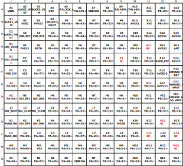

# SF32LB55x - Hardware Design Guide


## Introduction

The primary purpose of this document is to assist hardware engineers in completing the schematic and PCB design for the SF32LB55x series of chips.

The SF32LB55x is a series of highly integrated, high-performance system-on-chip (SoC) MCUs designed for ultra-low-power artificial intelligence of things (AIoT) applications. The processor in the chip achieves a good balance between high computational performance during human-machine interaction and ultra-low active and sleep power consumption during long standby periods. It can be widely used in various applications, such as wearable electronic devices, smart mobile terminals, and smart home devices.

The chip integrates a world-class Bluetooth 5.2 transceiver with high receive sensitivity, high transmit power, and low power consumption.

The chip provides rich internal and external storage resources. The fully packaged chip has multiple QSPI storage interfaces, an independent OPI-PSRAM interface, and an SD/eMMC interface. Depending on the model, the chip's internal SIP has different capacities of NorFlash and PSRAM combinations.

To better support display applications, the chip provides a comprehensive range of display interfaces, including 8080, SPI/Dual-SPI/Quad-SPI, and MIPI-DSI.

## Packaging

### Packaging Overview

The packaging information for the SF32LB55x is shown in Table 2-1.

<div align="center"> Table 2-1 Packaging Information List </div>

```{table}
:align: center
| Package Name | Size        | Pin Pitch | Ball Diameter |
| ------------ | ----------- | --------- | ------------- |
| QFN68L       | 7x7x0.75 mm | 0.35 mm   | -             |
| BGA125       | 7x7x0.94 mm | 0.5 mm    | 0.25 mm       |
| BGA145       | 7x7x0.94 mm | 0.5 mm    | 0.25 mm       |
| BGA169       | 7x7x0.94 mm | 0.5 mm    | 0.25 mm       |
```

### QFN68L Package


<div align="center"> Figure 2-1 QFN68L Pin Distribution </div>  <br> <br> <br>

### BGA125 Package


<div align="center"> Figure 2-2 BGA125 Pin Distribution </div>  <br> <br> <br>

### BGA145 Package


<div align="center"> Figure 2-3 BGA145 Pin Distribution </div>  <br> <br> <br>

### BGA169 Package

The BGA169 package has two Ballmaps, corresponding to the SF32LB557V8N6 (EOL) and SF32LB557VD3A6.

Compared to the SF32LB557V8N6, the SF32LB557VD3A6 has 6 Balls marked as NC.


<div align="center"> Figure 2-4 SF32LB557V8N6 BGA169 Pin Distribution </div>  <br> <br> <br>



<div align="center"> Figure 2-5 SF32LB557VD3A6 BGA169 Pin Distribution </div>  <br> <br> <br>

## Schematic Design Guidelines

### Power Supply

The SF32LB55x series of chips have an integrated PMU power unit that supports two BUCK outputs, which require external inductors and capacitors to be connected back to the internal power input of the chip. Additionally, there are 4 internal LDO power supplies that require external capacitors.

#### Power Supply Requirements

The power supply requirements for the SF32LB55x series of chips are shown in Tables 3-1, 3-2, 3-3, 3-4, and 3-5.

<div align="center"> Table 3-1 PMU Power Supply Specifications </div>

```{table}
:align: center
| PMU Power Pin | Minimum Voltage (V) | Typical Voltage (V) | Maximum Voltage (V) | Maximum Current (mA) | Detailed Description                                                    |
| ------------- | ------------------- | ------------------- | ------------------- | -------------------- | ----------------------------------------------------------------------- |
| VDD1          | 1.71                | 1.8                 | 3.6                 | 50                   | VDD1 power input                                                        |
| VDD2          | 1.71                | 1.8                 | 3.6                 | 50                   | VDD2 power input                                                        |
| BUCK1_VSW  BUCK1_VOUT              | -                   | 1.25                | -                    | 50                   | BUCK1 VSW output, connected to the internal power input 1 of the inductor, the other end of the inductor, and an external capacitor |
| BUCK2_VSW  BUCK2_VOUT  LDOVCC2_VOUT| -                   | 0.9                 | -                    | 50                   | BUCK2 VSW output, connected to the internal power input 2 of the inductor, the other end of the inductor, and an external capacitor |
| LDO_VOUT1     | -                   | 1.1                 | -                    | 50                   | LDO output 1, with an external capacitor                                           |
| LDO_VOUT2     | -                   | 0.9                 | -                    | 20                   | LDO output 2, with an external capacitor                                           |
| VDD_RET       | -                   | 0.9                 | -                    | 1                    | RET LDO output, with an external capacitor                                       |
| VDD_RTC       | -                   | 1.1                 | -                    | 1                    | RTC LDO output, with an external capacitor                                       |
```
:::{note}
The QFN68L packaged SF32LB551 does not have the VDD2, BUCK2_VSW, BUCK2_VOUT, and LDOVCC2_VOUT power pins.
:::

The power specifications for other external power supplies required by the SF32LB55x series chips are shown in Table 3-2.

<div align="center"> Table 3-2. RF Power Supply Specifications </div>

```{table}
:align: center
| Other Power Pins | Minimum Voltage (V) | Typical Voltage (V) | Maximum Voltage (V) | Maximum Current (mA) | Detailed Description                     |
| ---------------- | ------------------- | ------------------- | ------------------- | -------------------- | ---------------------------------------- |
| AVDD_BRF        | 1.71                | 1.8                 | 3.63                | 30                   | RF power input                           |
| AVDD_DSI        | 1.71                | 1.8                 | 2.75                | 20                   | MIPI DSI power input, must be powered    |
| VDD_SIP         | 1.71                | 1.8                 | 1.98                | 30                   | SiP storage chip power input             |
| AVDD33          | 3.15                | 3.3                 | 3.63                | 50                   | Power input                             |
| VDDIOA          | 1.71                | 1.8                 | 3.63                | -                    | PA I/O power input                       |
| VDDIOB          | 1.71                | 1.8                 | 3.63                | -                    | PB I/O power input                       |
```
:::{note}
The QFN68L packaged SF32LB551 and the BGA125 packaged SF32LB553 do not have the AVDD_DSI power pin.
:::

The recommended values for external capacitors connected to the power pins of the SF32LB55x series chips are shown in Table 3-3.

<div align="center"> Table 3-3. Capacitor Recommended Values </div>

```{table}
:align: center
| Power Supply Pin      | Capacitor     | Detailed Description                                                                 |
| --------------------- | ------------- | ------------------------------------------------------------------------------------ |
| VDD1 VDD2             | 0.1uF + 10uF  | Short VDD1 and VDD2, place at least 10uF and 0.1uF capacitors close to the pins     |
| BUCK1_VSW  BUCK1_VOUT | 0.1uF + 4.7uF | Place at least 4.7uF and 0.1uF capacitors close to the pins                         |
| BUCK2_VSW  BUCK2_VOUT | 0.1uF + 4.7uF | Place at least 4.7uF and 0.1uF capacitors close to the pins                         |
| LDOVCC2_VOUT          | 0.1uF + 4.7uF | When BUCK2 is set to BUCK mode, this pin is left floating; when BUCK2 is set to LDO mode, BUCK2_VSW is left floating, and LDOVCC2_VOUT and BUCK2_VOUT are shorted together. Place at least 4.7uF and 0.1uF capacitors close to the pins |
| LDO_VOUT1             | 4.7uF         | Place at least one 4.7uF capacitor close to the pin                                 |
| LDO_VOUT2             | 4.7uF         | Place at least one 4.7uF capacitor close to the pin                                 |
| VDD_RET               | 0.47uF        | Place at least one 0.47uF capacitor close to the pin                                |
| VDD_RTC               | 1uF           | Place at least one 1uF capacitor close to the pin                                   |
| VDD_SIP               | 1uF           | Place at least one 1uF capacitor close to the pin                                   |
| SDMADC_VREF           | 4.7uF         | Place at least one 4.7uF capacitor close to the pin                                 |
| AVDD_DSI              | 0.1uF + 10uF  | Place at least 10uF and 0.1uF capacitors close to the pin                           |
| AVDD33                | 4.7uF         | Place at least one 4.7uF capacitor close to the pin                                 |
| AVDD_BRF              | 1uF           | Place at least one 1uF capacitor close to the pin                                   |
| VDDIOA VDDIOB         | 2 × 0.1uF + 2 × 1uF  | Place at least 1uF and 0.1uF capacitors close to each pin |
```
:::{note}
The QFN68L package of SF32LB551 does not have the VDD2, BUCK2_VSW, BUCK2_VOUT, LDOVCC2_VOUT, and AVDD_DSI power supply pins.
The BGA125 package of SF32LB553 does not have the AVDD_DSI power supply pin.
:::

#### Power-Up Sequence and Reset

The SF32LB55x series of chips integrate a power-on reset function, requiring VDD1 and VDD2 (SF32LB551 does not have VDD2) to be powered up simultaneously, as shown in Figure 3-1.


<div align="center"> Figure 3-1 Power-Up/Down Sequence Diagram </div>  <br> <br> <br>

The RSTN reset signal needs to be pulled up to the VDD1 input voltage domain and connected to a 0.1uF capacitor to ground to create an RC delay reset, as shown in Figure 3-2. Figure 3-3 is the measured power-up sequence diagram.


<div align="center"> Figure 3-2 Reset Circuit Diagram </div>  <br> <br> <br>


<div align="center"> Figure 3-3 Measured Power-Up Sequence Diagram </div>  <br> <br> <br>

#### Typical Power Supply Circuit

The SF32LB55x series of chips with BGA packaging have 2 BUCK outputs built-in. BUCK2 supports BUCK mode or LDO mode, and BUCK mode is recommended, as shown in Figure 3-4.


<div align="center"> Figure 3-4 BGA Package PMU Circuit Diagram </div>  <br> <br> <br>

The SF32LB55x series of chips with QFN packaging have 1 BUCK output built-in, as shown in Figure 3-5.


<div align="center"> Figure 3-5 QFN Package PMU Circuit Diagram </div>  <br> <br> <br>

#### BUCK Inductor Selection Requirements

:::{important}

**Power Inductor Key Parameters**

L (Inductance) = 4.7uH, DCR (DC Resistance) ≦ 0.4 ohm, Isat (Saturation Current) ≧ 450mA

:::


### Boot Mode

The SF32LB55x series of chips provide a Mode pin to configure the boot mode, as shown in Table 3-4.

<div align="center"> Table 3-4 Mode Description </div>

```{table}
:align: center
| Mode Configuration | Detailed Description                             |
| ------------------ | ------------------------------------------------ |
| High               | After power-on, the chip enters download mode    |
| Low                | After power-on, the chip jumps to the user program area to start |
```

:::{note}
**Notes:**

1. The voltage domain of Mode is the same as VDDIOA;
2. Connect a 10K resistor to the power supply or GND to keep the level stable, and avoid floating or toggle interference;
3. The Mode pin must have a test point on the mass production board, which is used for program download or crystal calibration, and a jumper is not required;
4. It is recommended to reserve a jumper for the Mode pin on the test board, which is convenient for starting the download mode when the program crashes.
:::

### Clock

The SF32LB55x series of chips require two external clock sources: a 48MHz main crystal and a 32.768KHz RTC crystal. The specific requirements are shown in Table 3-5.

<div align="center"> Table 3-5 Crystal Specification Requirements </div>

```{table}
:align: center
| Crystal | Crystal Specification Requirements | Detailed Description  |
|:-------|:----------------------------------|:----------------------|
| 48MHz  | 7pF≦CL≦12pF (recommended value 8.8pF) △F/F0≦±10ppm ESR≦30 ohms (recommended value 22ohms) | The power consumption of the crystal is related to CL and ESR. The smaller the CL and ESR, the lower the power consumption. For optimal power performance, it is recommended to use materials with relatively smaller CL and ESR values within the required range. Reserve parallel matching capacitors next to the crystal. When CL<12pF, no capacitors need to be soldered. |
| 32.768KHz | CL≦12.5pF (recommended value 7pF) △F/F0≦±20ppm ESR≦80k ohms (recommended value 38Kohms) | The power consumption of the crystal is related to CL and ESR. The smaller the CL and ESR, the lower the power consumption. For optimal power performance, it is recommended to use materials with relatively smaller CL and ESR values within the required range. Reserve parallel matching capacitors next to the crystal. When CL<12.5pF, no capacitors need to be soldered. |
```

 **Crystal Recommendations**

For detailed material certification information, please refer to:
[SIFLI-MCU-AVL-Certification Table](index)

### Radio Frequency

The RF section of the SF32LB55x series of chips uses on-chip integrated broadband matching filter technology. It is only necessary to ensure that the RF PCB trace has a characteristic impedance of 50ohms. If the antenna is well matched, no additional components are required for the RF section. It is recommended to reserve a π-type matching network for stray filtering and antenna matching. Please refer to the circuit in Figure 3-6.

 

<div align="center"> Figure 3-6 RF Circuit Diagram </div>  <br> <br> <br>

:::{note}
**Note:**

The component values of the matching network must be determined through testing based on the actual antenna and PCB layout.
:::

### External Memory Interface

#### OPI PSRAM Interface

The SF32LB55x series of chips in the BGA145 package support a 1-channel OPI interface PSRAM chip. The PSRAM circuit is shown in Figure 3-7, and the signal connections are shown in Table 3-6.


<div align="center"> Figure 3-7 BGA145 Package PSRAM Circuit </div>  <br> <br> <br>

<div align="center"> Table 3-6 BGA145 Package PSRAM Signal Connections </div>

```{table}
:align: center
| PSRAM Signal | I/O             | Detailed Description                                    |
| ------------ | --------------- | ------------------------------------------------------- |
| CS#          | PA37            | Chip select output                                      |
| CLK          | PA20            | Clock output                                            |
| DQS          | PA35            | DQ strobe clock output for DQ[7:0]                      |
| DQ0          | PA28            | Data Inout 0                                            |
| DQ1          | PA29            | Data Inout 1                                            |
| DQ2          | PA30            | Data Inout 2                                            |
| DQ3          | PA31            | Data Inout 3                                            |
| DQ4          | PA34            | Data Inout 4                                            |
| DQ5          | PA36            | Data Inout 5                                            |
| DQ6          | PA38            | Data Inout 6                                            |
| DQ7          | PA42            | Data Inout 7                                            |
```

The SF32LB55x series of chips in the BGA169 package support a 2-channel OPI interface PSRAM chip. The PSRAM circuits are shown in Figures 3-8 and 3-9, and the signal connections are shown in Tables 3-7 and 3-8.


<div align="center"> Figure 3-8 BGA169 Package PSRAM Chip 1 Circuit </div>  <br> <br> <br>


<div align="center"> Figure 3-9 BGA169 Package PSRAM Chip 2 Circuit </div>  <br> <br> <br>

<div align="center"> Table 3-7 BGA169 Package PSRAM Chip 1 Signal Connections </div>

```{table}
:align: center
| PSRAM Signal | I/O             | Detailed Description                        |
| ------------ | --------------- | ------------------------------------------- |
| CS#          | PA07            | Chip select input                           |
| CLK          | PA08            | Clock input                                 |
| DQS          | PA15            | DQ strobe clock input for DQ[7:0]           |
| DQ0          | PA02            | Data Inout 0                                |
| DQ1          | PA04            | Data Inout 1                                |
| DQ2          | PA05            | Data Inout 2                                |
| DQ3          | PA06            | Data Inout 3                                |
| DQ4          | PA09            | Data Inout 4                                |
| DQ5          | PA11            | Data Inout 5                                |
| DQ6          | PA12            | Data Inout 6                                |
| DQ7          | PA13            | Data Inout 7                                |
```

<div align="center"> Table 3-8 BGA169 Package PSRAM Chip 2 Signal Connections </div>

```{table}
:align: center
| PSRAM Signal | I/O             | Detailed Description                        |
| ------------ | --------------- | ------------------------------------------- |
| CS#          | PA07            | Chip select input                           |
| CLK          | PA08            | Clock input                                 |
| DQS          | PA26            | DQ strobe clock input for DQ[7:0]           |
| DQ0          | PA18            | Data Inout 0                                |
| DQ1          | PA22            | Data Inout 1                                |
| DQ2          | PA24            | Data Inout 2                                |
| DQ3          | PA32            | Data Inout 3                                |
| DQ4          | PA33            | Data Inout 4                                |
| DQ5          | PA59            | Data Inout 5                                |
| DQ6          | PA62            | Data Inout 6                                |
| DQ7          | PA64            | Data Inout 7                                |
```
:::{note}
For the external OPI PSRAM power supply, if using HCPU's GPIO for control, a high level turns it on, and a low level turns it off. The HCPU's PU pin must be selected.
:::

#### QSPI Nor/Nand Flash and PSRAM Interface

The SF32LB55x series of chips support three QSPI interfaces to connect Nor, Nand Flash, and PSRAM devices.
It is recommended to use the QSPI2 interface for QSPI PSRAM devices, with signal connections as shown in Table 3-9, Table 3-10, and Table 3-11.

<div align="center"> Table 3-9 QSPI2 Signal Connections </div>

```{table}
:align: center
| Flash Signal | QFN68  |BGA125/145/169 | Detailed Description                                    |
| ------------ | ------ | ------------- | ------------------------------------------------------- |
| CS#          | GPIO9  | PA61          | Chip select, active low                                |
| SO           | GPIO7  | PA65          | Data Input (Data Input Output 1)                       |
| WP#          | GPIO6  | PA66          | Write Protect Output (Data Input Output 2)             |
| SI           | GPIO8  | PA63          | Data Output (Data Input Output 0)                      |
| SCLK         | GPIO10 | PA60          | Serial Clock Output                                    |
| Hold#        | GPIO5  | PA68          | Data Output (Data Input Output 3)                     |
```

<div align="center"> Table 3-10 QSPI3 Signal Connections </div>

```{table}
:align: center
| Flash Signal | QFN68  |BGA125/145/169 | Detailed Description                                    |
| ------------ | ------ | ------------- | ------------------------------------------------------- |
| CS#          | GPIO16 | PA45          | Chip select, active low                                |
| SO           | GPIO14 | PA49          | Data Input (Data Input Output 1)                       |
| WP#          | GPIO13 | PA51          | Write Protect Output (Data Input Output 2)             |
| SI           | GPIO15 | PA47          | Data Output (Data Input Output 0)                      |
| SCLK         | GPIO17 | PA44          | Serial Clock Output                                    |
| Hold#        | GPIO12 | PA55          | Data Output (Data Input Output 3)                     |
```

<div align="center"> Table 3-11 QSPI4 Signal Connections </div>

```{table}
:align: center
| Flash Signal | QFN68/BGA125 |BGA145/169 | Detailed Description                                    |
| ------------ | ------------ | --------- | ------------------------------------------------------- |
| CS#          | -            | PB33      | Chip select, active low                                |
| SO           | -            | PB36      | Data Input (Data Input Output 1)                       |
| WP#          | -            | PB37      | Write Protect Output (Data Input Output 2)             |
| SI           | -            | PB35      | Data Output (Data Input Output 0)                      |
| SCLK         | -            | PB32      | Serial Clock Output                                    |
| Hold#        | -            | PB07      | Data Output (Data Input Output 3)                     |
```

:::{note}
1. VDD_SIP power supply is for the internal Flash. If a power switch control is required, PA58 must be used as the control signal, with the power switch turning on when PA58 is set high and turning off when set low.
2. Contact the FAE colleagues to evaluate the FLASH space required for the G-sensor and HR algorithms connected to the LCPU, to determine whether to add an external QSPI4 Nor FLASH.
3. For the external QSPI PSRAM power supply, if using HCPU GPIO for control, the power must be turned on with a high level and off with a low level, and the HCPU PU pin must be selected.
:::

#### SDIO eMMC/Micro SD Interface

The SF32LB55x series of chips supports two SDIO interfaces to connect eMMC or Micro SD devices. The signal connections are shown in Table 3-12, Table 3-13, and Table 3-14.

<div align="center"> Table 3-12 SDIO1 4-bit Signal Connections </div>

```{table}
:align: center
| Flash Signal | QFN68 | BGA125 | BGA145/169 | Detailed Description                                    |
| ------------ | ----- | ------ | ---------- | ------------------------------------------------------- |
| CLK          | -     | PA60   | PA34       | Clock input                                             |
| CMD          | -     | PA61   | PA36       | Command input                                           |
| DATA0        | -     | PA63   | PA28       | Data 0                                                  |
| DATA1        | -     | PA65   | PA29       | Data 1                                                  |
| DATA2        | -     | PA66   | PA30       | Data 2                                                  |
| DATA3        | -     | PA68   | PA31       | Data 3                                                  |
```

<div align="center"> Table 3-13 SDIO1 8-bit Signal Connections </div>

```{table}
:align: center
| Flash Signal | QFN68 | BGA125 | BGA145/169 | Detailed Description                                    |
| ------------ | ----- | ------ | ---------- | ------------------------------------------------------- |
| CLK          | -     | -      | PA34       | Clock input                                             |
| CMD          | -     | -      | PA36       | Command input                                           |
| DATA0        | -     | -      | PA28       | Data 0                                                  |
| DATA1        | -     | -      | PA29       | Data 1                                                  |
| DATA2        | -     | -      | PA30       | Data 2                                                  |
| DATA3        | -     | -      | PA31       | Data 3                                                  |
| DATA4        | -     | -      | PA47       | Data 4                                                  |
| DATA5        | -     | -      | PA49       | Data 5                                                  |
| DATA6        | -     | -      | PA51       | Data 6                                                  |
| DATA7        | -     | -      | PA55       | Data 7                                                  |
```

<div align="center"> Table 3-14 SDIO2 4-bit Signal Connections </div>

```{table}
:align: center
| Flash Signal | QFN68  | BGA125/145/169 | Detailed Description                                    |
| ------------ | ------ | -------------- | ------------------------------------------------------- |
| CLK          | GPIO17 | PA44           | Clock input                                             |
| CMD          | GPIO17 | PA45           | Command input                                           |
| DATA0        | GPIO17 | PA47           | Data 0                                                  |
| DATA1        | GPIO17 | PA49           | Data 1                                                  |
| DATA2        | GPIO17 | PA51           | Data 2                                                  |
| DATA3        | GPIO17 | PA55           | Data 3                                                  |
```

For detailed material certification information, please refer to:
[SIFLI-MCU-AVL-Certification Table](index)

### Display

#### MIPI DSI Display Interface

The SF32LB55x series chips in BGA145/169 packages support a 2-lane MIPI DSI display interface, with signal connections as shown in Table 3-15.

<div align="center"> Table 3-15 MIPI-DSI Signal Connections </div>

```{table}
:align: center 
| MIPI DSI signal | BGA145/169 I/O | Description                        |
| --------------- | -------------- | ---------------------------------- |
| CLKP            | DSI_CLKP       | MIPI clock signal+                 |
| CLKN            | DSI_CLKN       | MIPI clock signal-                 |
| D0P             | DSI_D0P        | MIPI data channel 0+               |
| D0N             | DSI_D0N        | MIPI data channel 0-               |
| D1P             | DSI_D1P        | MIPI data channel 1+               |
| D1N             | DSI_D1N        | MIPI data channel 1-               |
| -               | AVDD18_DSI     | MIPI power input                   |
| -               | DSI_REXT       | External 10K resistor to ground    |
| -               | AVSS_DSI       | Ground                             |
| TE              | PA77           | Tearing effect to MCU frame signal|
| RESET           | PB17           | Reset display signal               |
```

:::{note}
1. TE can use other GPIOs of PA;
2. If the screen supports the DSI protocol TE, an additional TE pin may not be required;
3. RESET can use other GPIOs of PB.
:::

#### SPI/QSPI Display Interface

The SF32LB55x series of chips support 3/4-wire SPI and Quad-SPI interfaces to connect to LCD displays, as shown in Table 3-16.

<div align="center"> Table 3-16 SPI/QSPI Signal Connections </div>

```{table}
:align: center 
| SPI signal | QFN68  | BGA125 | BGA145/169 | Detailed description                                                  |
| ---------- | ------ | ------ | ---------- | --------------------------------------------------------------------- |
| CSX        | GPIO22 | PA31   | PB33       | Enable signal                                                         |
| WRX_SCL    | GPIO23 | PA20   | PB32       | Clock signal                                                          |
| DCX        | GPIO30 | PA36   | PB36       | Data/command signal in 4-wire SPI mode, Data1 in Quad-SPI mode        |
| SDI_RDX    | GPIO21 | PA34   | PB35       | Data input signal in 3/4-wire SPI mode, Data0 in Quad-SPI mode        |
| SDO        | GPIO21 | PA34   | PB35       | Data output signal in 3/4-wire SPI mode, connect to SDI_RDX           |
| D[0]       | GPIO19 | PA38   | PB37       | Data2 in Quad-SPI mode                                                |
| D[1]       | GPIO18 | PA42   | PB07       | Data3 in Quad-SPI mode                                                |
| REST       | GPIO2  | PA78   | PB17       | Reset display signal                                                  |
| TE         | GPIO3  | PA77   | PB77       | Tearing effect to MCU frame signal                                    |
```

:::{note}
1. TE can use PA77 or other GPIOs of PA;
2. REST can use any GPIO, and it is recommended to use PB pins if AOD functionality is required.
:::

#### MCU8080 Display Interface

The SF32LB55x series of chips support the MCU8080 interface to connect to LCD displays, as shown in Table 3-17.

<div align="center"> Table 3-17 MCU8080 Display Signal Connections </div>

```{table}
:align: center 
| MCU8080 Signal | QFN68  | BGA125 | BGA145/169 | Detailed Description                            |
| -------------- | ------ | ------ | ---------- | ----------------------------------------------- |
| CSX            | GPIO22 | PA31   | -          | Chip select                                     |
| WRX            | GPIO23 | PA20   | -          | Writes strobe signal to write data              |
| DCX            | GPIO20 | PA36   | -          | Display data / command selection                |
| RDX            | GPIO21 | PA34   | -          | Reads strobe signal to write data               |
| D[0]           | GPIO19 | PA38   | -          | Data 0                                          |
| D[1]           | GPIO18 | PA42   | -          | Data 1                                          |
| D[2]           | GPIO17 | PA44   | -          | Data 2                                          |
| D[3]           | GPIO16 | PA45   | -          | Data 3                                          |
| D[4]           | GPIO15 | PA47   | -          | Data 4                                          |
| D[5]           | GPIO14 | PA49   | -          | Data 5                                          |
| D[6]           | GPIO13 | PA51   | -          | Data 6                                          |
| D[7]           | GPIO12 | PA55   | -          | Data 7                                          |
| REST           | GPIO2  | PA78   | -          | Reset                                           |
| TE             | GPIO3  | PA77   | -          | Tearing effect to MCU frame signal             |
```

:::{note}
1. TE can use PA77 or any other GPIO of PA for simulation;
2. REST can use any GPIO; if AOD function is required, it is recommended to use PB pins.
:::

#### JDI Display Interface

The SF32LB55x series of chips support both parallel and serial JDI interfaces to connect to LCD displays, supporting the reuse of signals from PA's LCDC1 or PB's LCDC2. It is recommended to use PB's LCDC2 interface, as shown in Table 3-18 and Table 3-19.

<div align="center"> Table 3-18 Parallel JDI Screen Signal Connection Method </div>

```{table}
:align: center
| JDI Signal    | I/O (LCDC1) | Detailed Description                                                     |
| ------------- | ----------- | ------------------------------------------------------------------------ |
| JDI_VCK       | PA20        | Shift clock for the vertical driver                                      |
| JDI_VST       | PA31        | Start signal for the vertical driver                                     |
| JDI_XRST      | PA34        | Reset signal for the horizontal and vertical driver                      |
| JDI_HCK       | PA36        | Shift clock for the horizontal driver                                    |
| JDI_HST       | PA38        | Start signal for the horizontal driver                                   |
| JDI_ENB       | PA42        | Write enable signal for the pixel memory                                 |
| JDI_R1        | PA49        | Red image data (odd pixels)                                              |
| JDI_R2        | PA51        | Red image data (even pixels)                                             |
| JDI_G1        | PA55        | Green image data (odd pixels)                                            |
| JDI_G2        | PA77        | Green image data (even pixels)                                           |
| JDI_B1        | PA78        | Blue image data (odd pixels)                                             |
| JDI_B2        | PA79        | Blue image data (even pixels)                                            |
| JDI_XFRP      | PA45        | Liquid crystal driving signal ("On" pixel)                               |
| JDI_VCOM/FRP  | PA47        | Common electrode driving signal / Liquid crystal driving signal ("Off" pixel) |
```

<div align="center"> Table 3-19 Serial JDI Display Signal Connections </div>

```{table}
:align: center
| JDI Signal    | I/O (LCDC1) | Detailed Description                         |
| ------------- | ----------- | -------------------------------------------- |
| JDI_SCS       | PA31        | Chip Select Signal                           |
| JDI_SCLK      | PA20        | Serial Clock Signal                          |
| JDI_SO        | PA34        | Serial Data Output Signal                    |
| JDI_DISP      | PA36        | Display ON/OFF Switching Signal              |
| JDI_EXTCOMIN  | PA38        | COM Inversion Polarity Input                 |
```

#### Touch and Backlight Interface

The SF32LB55x series of chips supports an I2C format touch screen control interface and touch status interrupt input, as well as a single PWM signal to control the backlight power chip's enable and brightness. The signal connections are shown in Table 3-20.

<div align="center"> Table 3-20 Touch and Backlight Control Connections </div>

```{table}
:align: center
| Touch Screen and Backlight Signal | QFN68 | BGA125 | BGA145 | BGA169 | Detailed Description                   |
| --------------------------------- | ----- | ------ | ------ | ------ | --------------------------------------- |
| Interrupt                         | GPIO1 | PA79   | PA79   | PA79   | Touch status interrupt signal (wakeup)  |
| I2C1_SCL                          | GPIO25| PA10   | PA10   | PA10   | Touch screen I2C clock signal           |
| I2C1_SDA                          | GPIO24| PA14   | PA14   | PA14   | Touch screen I2C data signal            |
| BL_PWM                            | GPIO0 | PA80   | -      | -      | Backlight PWM control signal            |
| Reset                             | GPIO16| PA00   | PA00   | PA00   | Touch reset signal                      |
| Power Enable                      | GPIO26| PA06   | PA06   | PA03   | Touch screen power enable signal        |
```

:::{note}
BL_PWM must use a GPIO with GPTIM1_CHX functionality. The PU or PD of the selected GPIO should be used to prevent the backlight from turning on abnormally during a cold start.
:::

### Other Peripheral Interfaces

#### Wakeup Button
```

The SF32LB55x series of chips supports 10 wakeup interrupt input pins: BGA125/145/169 package (PA77~PA80, PB43~PB48), QFN68 package (GPIO0~GPIO3, GPIO43~GPIO48) can be used for button wakeup functions. It is recommended to use button input pins, as shown in Figure 3-10.


<div align="center"> Figure 3-10 Button Circuit Diagram </div>  <br> <br> <br>

#### Vibration Motor Interface

The SF32LB55x series of chips supports multiple PWM outputs, which can be used as drive signals for vibration motors. The recommended circuit is shown in Figure 3-11.


<div align="center"> Figure 3-11 Vibration Motor Circuit Diagram </div>  <br> <br> <br>

:::{note}
The PWM control signal for the motor must use a GPIO with the GPTIM1_CHx function. The GPIO's PU or PD should be selected, and the motor should not be abnormally started during cold boot.
:::

### Wakeup Interrupt Sources

The SF32LB55x series of chips supports 10 non-maskable wakeup interrupt sources, as shown in Table 3-21. The HCPU has 4 interrupt sources, and the LCPU has 6 interrupt sources. Each interrupt source can only wake up the corresponding CPU.

<div align="center"> Table 3-21 Interrupt Source Connection Methods </div>

```{table}
:align: center
| Interrupt Source | QFN68  | BGA125/145/169  | Detailed Description      |
| ---------------- | ------ | --------------- | ------------------------- |
| WKUP_A0         | GPIO3  | PA77            | HCPU Interrupt Signal 0   |
| WKUP_A1         | GPIO2  | PA78            | HCPU Interrupt Signal 1   |
| WKUP_A2         | GPIO1  | PA79            | HCPU Interrupt Signal 2   |
| WKUP_A3         | GPIO0  | PA80            | HCPU Interrupt Signal 3   |
| WKUP_B0         | GPIO43 | PB43            | LCPU Interrupt Signal 0   |
| WKUP_B1         | GPIO44 | PB44            | LCPU Interrupt Signal 1   |
| WKUP_B2         | GPIO45 | PB45            | LCPU Interrupt Signal 2   |
| WKUP_B3         | GPIO46 | PB46            | LCPU Interrupt Signal 3   |
| WKUP_B4         | GPIO47 | PB47            | LCPU Interrupt Signal 4   |
| WKUP_B5         | GPIO48 | PB48            | LCPU Interrupt Signal 5   |
```

:::{note}
1. The 10 signals WKUP_A0~WKUP_A3 and WKUP_B0~WKUP_B5 must not be left floating. Depending on the actual function, add external pull-up or pull-down resistors; otherwise, there may be leakage current issues during chip sleep.
2. In Hibernate mode, only the 6 interrupt sources of the LCPU support wake-up.
:::

### GPADC Design Requirements

The SF32LB55x chip supports a 5-channel 10-bit GPADC with an input range of 0~0.9V. As shown in Figure 3-12, if the test voltage VIN is less than 0.9V, the test voltage VIN can be directly input to the GPADC pin; if the test voltage VIN is greater than 0.9V, the test voltage VIN needs to be divided by a resistor before being input to the GPADC pin.


<div align="center"> Figure 3-12 GPADC Reference Circuit Diagram </div>  <br> <br> <br>

When testing the lithium battery voltage VBAT, a resistor divider input mode must be used, and the input voltage to VADC must be less than 0.9V. The ratio of R1 to R2 is approximately 5:1. To reduce the static current Iq, use M-level resistors, but the larger the resistors, the longer the GPADC input voltage establishment time will be. The recommended resistors for comprehensive testing are shown in Table 3-22:

<div align="center"> Table 3-22 Resistor Combinations </div>

```{table}
:align: center
| Resistor Combination | R1(Kohm) ±%1  | R2(Kohm) ±%1  | Voltage Establishment Time(ms) | Iq(uA) (VIN = 4.2V) |
| -------------------- | ------------- | ------------- | ----------------------------- | -------------------- |
| 1                    | 1000          | 220           | 138                           | 3.44                |
| 2                    | 2000          | 430           | 250                           | 1.73                |
| 3                    | 3000          | 680           | 302                           | 1.14                |
| 4                    | 4300          | 910           | -                             | 0.81                |
| 5                    | 5100          | 1100          | 420                           | 0.68                |
```

### Sensors

The SF32LB55x chip supports heart rate and accelerometer sensors. In the design, note that the I2C, SPI, control interfaces, and interrupt wakeup interfaces for the heart rate and accelerometer sensors must use the LCPU interfaces. The power supply for the heart rate and accelerometer sensors should be selected from DCDC, LDO, or Loadswitch with a low Iq, which can enable the power supply to be turned on and off as needed.

### External Bluetooth Audio

The SF32LB55x chip supports external audio Bluetooth, and the communication interface uses HCPU's UART1. Note that the interface voltage levels must match; if they do not match, add a level-shifting chip between the UARTs. If the external audio Bluetooth is powered off during use, the power supply of the level-shifting chip for the UART interface must also be turned off simultaneously to avoid leakage current.

If, during use, the SF32LB55x chip enters Standby mode, the external audio Bluetooth does not lose power. In this case, the power enable control signal for the external audio Bluetooth, if it is low-level to enable power, must use the default PD GPIO from the LCPU of the SF32LB55x chip.

### Debug and Download Interface

The SF32LB55x series of chips support the Arm® standard SWD debug interface, which can be connected to EDA tools for step-by-step debugging. As shown in Figure 3-13, when connecting to the SEEGER® J-Link® tool, the power supply of the debug tool must be modified to use the external interface input, and the SF32LB55x circuit board should power the J-Link tool.

The SF32LB55x has 5 UART interfaces available for debugging information output, as detailed in Table 3-23.

<div align="center"> Table 3-23 Debug Port Connection Methods </div>

```{table}
:align: center
| UART Signal | QFN68  | BGA125/145/169 | Detailed Description                       |
| ----------- | ------ | -------------- | ------------------------------------------ |
| TXD1        | GPIO13 | PA19           | UART1 RXD signal                           |
| RXD1        | GPIO14 | PA17           | UART1 TXD signal                           |
| TXD2        | -      | PA07           | UART2 RXD signal                           |
| RXD2        | -      | PA05           | UART2 TXD signal                           |
| TXD3        | GPIO46 | PB46           | UART3 RXD signal, system default print port |
| RXD3        | GPIO45 | PB45           | UART3 TXD signal, system default print port |
| TXD4        | -      | PB14           | UART4 RXD signal                           |
| RXD4        | -      | PB12           | UART4 TXD signal                           |
| TXD5        | -      | PB11           | UART5 RXD signal                           |
| RXD5        | -      | PB06           | UART5 TXD signal                           |
| SWCLK       | GPIO41 | PB31           | SWD clock signal                           |
| SWDIO       | GPIO42 | PB34           | SWD data signal                            |
```

:::{note}
The RXD signal of UARTx must not be left floating; it should be set to internal pull-up during software initialization.
:::

 

<div align="center"> Figure 3-13 SWD Debug Interface Schematic </div>  <br> <br> <br> 

### Production Programming and Crystal Calibration

Sifli provides an offline downloader to complete the production programming and crystal calibration.

:::{note}
When designing the hardware, please ensure that at least the following test points are reserved: VBAT, GND, VDDIOA, VDDIOB, RSTN, Mode, SWDIO, SWCLK, RXD1, TXD1, RXD3, and TXD3.
For production testing, the following test points are required: VBAT, GND, boot_mode, VDDIOB, RXD3, and TXD3.
:::

## PCB Design Guidelines

### PCB Package Design

#### Package Dimensions

The SF32LB55x series of chips have 4 package options, each corresponding to different product models and functionalities, as follows:

- 1. BGA125 package, package dimensions: 7mm × 7mm × 0.94mm, Pitch: 0.5mm, detailed package information is shown in Figure 4-1:

  

<div align="center"> Figure 4-1 BGA125 Package Dimensions </div>  <br> <br> <br> 

- 2. BGA145 package, package dimensions: 7mm × 7mm × 0.94mm, Pitch: 0.5mm, detailed package information is shown in Figure 4-2:

  

<div align="center"> Figure 4-2 BGA145 Package Dimensions </div>  <br> <br> <br> 

- 3. BGA169 package, package dimensions: 7mm × 7mm × 0.94mm, Pitch: 0.5mm, detailed package information is shown in Figure 4-3:

  

<div align="center"> Figure 4-3 BGA169 Package Dimensions </div>  <br> <br> <br> 

- 4. QFN68L package, package dimensions: 7mm × 7mm × 0.75mm, Pitch: 0.35mm, detailed package information is shown in Figure 4-4:

  

<div align="center"> Figure 4-4 QFN68L Package Dimensions </div>  <br> <br> <br> 

#### Package Shape

- 1. BGA package form is shown in Figure 4-5.

  

<div align="center"> Figure 4-5 BGA Package Form </div>  <br> <br> <br> 

- 2. BGA package PCB pad design information is shown in Figure 4-6.

  

<div align="center"> Figure 4-6 BGA Package PCB Pad Design </div>  <br> <br> <br> 

- 3. QFN68L Package PCB Pad Design Information is Shown in Figure 4-7.

  

<div align="center"> Figure 4-7 QFN68L Package PCB Pad Design </div>  <br> <br> <br> 

### PCB Stackup Design

The SF32LB55x series chips support single and double-sided placement. QFN68L, BGA125, and BGA145 support PTH through-hole boards, and it is recommended to use a 4-layer PTH through-hole board; BGA169 is recommended to use a 1-stage HDI blind/buried via board. The recommended stackup structures are shown in Figures 4-8 and 4-9:

 
  

<div align="center"> Figure 4-8 4-layer Through-Hole Board Reference Stackup Structure </div>  <br> <br> <br>

  

<div align="center"> Figure 4-9 6-layer Blind/Buried Via Board Reference Stackup Structure </div>  <br> <br> <br>

### General PCB Design Rules

General design rules for PTH through-hole board PCB are shown in Figure 4-10.

  

<div align="center"> Figure 4-10 PTH Through-Hole Board PCB General Design Rules </div>  <br> <br> <br> 

General design rules for HDI-1 stage PCB are shown in Figure 4-11.

  

<div align="center"> Figure 4-11 HDI-1 Stage Blind/Buried Via Board PCB General Design Rules </div>  <br> <br> <br> 


### Chip Routing and Fanout

The SF32LB55x series chips have multiple package forms, and different routing and fanout methods should be used based on the package form, as shown in Figure 4-12 for BGA package routing and fanout, and Figure 4-13 for QFN package routing and fanout:


  

<div align="center"> Figure 4-12 BGA Package Routing and Fanout Reference </div>  <br> <br> <br> 


  

<div align="center"> Figure 4-13 QFN Package Routing and Fanout Reference </div>  <br> <br> <br> 


### Clock Interface Routing

The crystal should be placed inside the shield, with a distance greater than 1mm from the PCB edge. It should be placed as far as possible from high-heat components such as PA, Charge, and PMU circuits, with a distance of more than 5mm to avoid affecting the crystal frequency deviation. The crystal circuit should have a no-layout zone with a spacing greater than 0.25mm to avoid other metals and components, as shown in Figure 4-14.

  

<div align="center"> Figure 4-14 Crystal Layout Diagram </div>  <br> <br> <br> 

For the 48MHz crystal, the surface layer trace length should be controlled within the 3-10mm range, with a line width of 0.1mm. It must be surrounded by a ground plane, and the trace should be kept away from VBAT, DC/DC, and high-speed signal lines. The surface layer and adjacent layer below the 48MHz crystal area should be kept clear of other traces, as shown in Figures 4-15, 4-16, and 4-17.

  

<div align="center"> Figure 4-15 48MHz Crystal Schematic </div>  <br> <br> <br> 

  

<div align="center"> Figure 4-16 48MHz Crystal Routing Model </div>  <br> <br> <br> 

  

<div align="center"> Figure 4-17 48MHz Crystal Routing Reference </div>  <br> <br> <br> 

For the 32.768KHz crystal, it is recommended to route on the surface layer, with a trace length controlled to ≤10mm, and a line width of 0.1mm. The parallel routing distance between 32K_XI and 32K_XO should be ≥0.15mm. It must be surrounded by a ground plane, and the surface layer and adjacent layer below the 32.768KHz crystal area should be kept clear of other traces, as shown in Figures 4-18, 4-19, and 4-20.

  

<div align="center"> Figure 4-18 32.768KHz Crystal Schematic </div>  <br> <br> <br>

  

<div align="center"> Figure 4-19 32.768KHz Crystal Layout Model </div>  <br> <br> <br> 

  

<div align="center"> Figure 4-20 32.768KHz Crystal Layout Reference </div>  <br> <br> <br> 

### RF Interface Layout

The RF matching circuit should be placed as close as possible to the chip, not near the antenna. The filter capacitors for the AVDD_BRF RF power supply should be placed as close as possible to the chip pins, and the capacitor ground pins should be connected directly to the main ground through vias. The schematic and PCB layout of the π network and power circuit are shown in Figure 4-21 and Figure 4-22, respectively.

  

<div align="center"> Figure 4-21 Schematic of π Network and Power Circuit </div>  <br> <br> <br> 

  

<div align="center"> Figure 4-22 PCB Layout of π Network and Power Circuit </div>  <br> <br> <br> 

It is recommended to route RF lines on the surface layer to avoid vias that can affect RF performance. The line width should be greater than 10mil, and the lines should be surrounded by a ground plane to avoid sharp and right angles. Multiple ground vias should be placed along the sides of the RF lines, and the lines should be impedance-controlled to 50 ohms, as shown in Figure 4-23 and Figure 4-24.

  

<div align="center"> Figure 4-23 Schematic of RF Signal Circuit </div>  <br> <br> <br> 

  

<div align="center"> Figure 4-24 PCB Layout of 50 Ohm RF Signal </div>  <br> <br> <br> 

RF circuit traces must not be routed through areas where DC-DC, VBAT, and high-speed digital signals (such as oscillators, high-frequency clocks, and digital interface signals like I2C, SPI, SDIO, I2S, UART, etc.) are present.

For BGA packages, the AVSS_TRF, AVSS_RRF, AVSS_BB, and AVSS_VCO pins are the RF ground pins and must be well-grounded. The ground pads must have sufficient vias to connect to the main ground plane.


<div align="center"> Figure 4-25 PCB Layout of RF Ground Signals </div>  <br> <br> <br>

### High-Speed Digital Signal Traces

The MIPI_DSI, OPI PSRAM, LCDC_SPI, and QSPI interfaces of the SF32LB55x series chips should be routed according to high-speed digital signal rules.

For MIPI_DSI, differential 100 ohm characteristic impedance control is required, and the data and clock lines should be length-matched.

For the OPI interface of the external PSRAM chip, the traces should be length-matched.

For LCDC_SPI and QSPI interfaces, the traces should be kept as equal in length as possible.

Clock and I2C traces should be surrounded by a ground plane to avoid long parallel runs with other traces.

### DC-DC Circuit Traces

The power inductors and filter capacitors of the DC-DC circuit must be placed as close as possible to the chip pins. The BUCK_VSW trace should be as short and wide as possible to minimize the inductance of the entire DC-DC circuit loop. All DC-DC output filter capacitors should have multiple vias connecting their ground pins to the main ground plane. The BUCK_VOUT pin feedback trace should not be too thin and must be greater than 0.25mm. The surface layer above the power inductor area should not have copper pours, and the adjacent layer must be a complete reference ground plane to avoid other traces running through the inductor area, as shown in Figure 4-26 and Figure 4-27.


<div align="center"> Figure 4-26 Schematic of Key DC-DC Components </div>  <br> <br> <br>


<div align="center"> Figure 4-27 PCB Layout of Key DC-DC Components </div>  <br> <br> <br>

### Power Supply Traces

PVDD_PMU1 (PIN67) is the power input pin for the built-in PMU module of the chip. The corresponding capacitors must be placed as close as possible to the pin, and the traces should be as wide as possible, not less than 0.3mm, as shown in Figure 4-28 and Figure 4-29.


<div align="center"> Figure 4-28 Power Supply Circuit </div>  <br> <br> <br>


<div align="center"> Figure 4-29 PCB Layout of Power Supply Circuit </div>  <br> <br> <br>

### LDO and IO Power Input Traces

All LDO outputs and IO power input pins should have filter capacitors placed as close as possible to the corresponding pins. The trace width must meet the input current requirements and should be as short and wide as possible to reduce power ripple and improve system stability, as shown in Figure 4-30 and Figure 4-31.


<div align="center"> Figure 4-30 Internal Power Filter Circuit for LDO </div>  <br> <br> <br>


<div align="center"> Figure 4-31 LDO and IO input power routing diagram </div>  <br> <br> <br>

### Other Interface Routing

When the pin configuration is set to GPADC pin signals, it must be shielded with a ground plane and kept away from other interference signals, such as battery voltage circuits and temperature check circuits.

#### Chip Ground Routing

For the QFN68 package, the pad in the center of the package is the ground pin for the entire chip. The center pad must be directly connected to the main ground plane, especially near the RF interface pins and PMU interface pins. Drill as many holes as possible to ensure good grounding.


<div align="center"> Figure 4-32 QFN68 package ground routing </div>  <br> <br> <br>

For the BGA package, the RF interface ground and PMU interface ground are separate. They are connected to the ground through BGA balls. Ensure that the RF interface ground corresponds to BGA balls C13, E13, D12, and E13, and that these balls are well connected to the main ground to avoid floating or not being connected to the main ground. The PMU interface DC-DC corresponds to BGA balls D2 and B3. Ensure that these pins are directly connected to the main ground plane, and avoid connecting them to other ground planes on the surface layer.


<div align="center"> Figure 4-33 BGA package ground routing </div>  <br> <br> <br>

#### EMI&ESD Routing

Avoid long-distance routing on the surface layer outside the shield, especially for clock and power signals, which should be routed on the inner layer and not on the surface layer. ESD protection devices must be placed close to the corresponding connector pins. Signal traces should pass through the ESD protection device pins first to avoid branching before passing through the ESD protection pins. The ground pins of the ESD device must be connected to the main ground via vias, ensuring that the ground pad routing is short and wide to reduce impedance and improve ESD device performance.

#### Other

The USB charging test points must be placed before the TVS diode. The TVS diode for the battery connector must be placed at the front of the platform, and its routing must ensure that it passes through the TVS diode before reaching the chip.


<div align="center"> Figure 4-34 Power TVS layout reference </div>  <br> <br> <br>

The ground pin of the TVS diode should avoid long-distance routing before connecting to the ground.


<div align="center"> Figure 4-35 TVS routing reference </div>  <br> <br> <br>

## Q&A

- Question 1: Why are the default states of some GPIOs different from the SPEC description when Mode = 1 is started?
  Answer: When Mode = 1 is started, it enters download mode, which changes the states of the GPIOs related to QSPI2 and QSPI3 of the external Flash.

- Question 2: Why does the surface mount motor vibrate abnormally during program download?
  Answer: This is caused by the abnormal activation of the motor's power control signal or PWM control signal. If it starts oscillating at a high level, using a PU GPIO causes the motor to start oscillating. Therefore, it is recommended to use PD GPIO17 or GPIO39 to output the PWM signal.

- Question 3: Why might the MCU hang when soldering the battery? How can this be avoided?
  Answer: Poor grounding of the soldering iron may cause a surge that leads to a hang. Adding surge and ESD protection at the battery interface and ensuring good grounding of the soldering iron can prevent these issues.

- Question 4: Why can't the MCU be awakened from Hibernate mode when the wake-up button is connected to the chip's wake-up pin?
  Answer: In Hibernate mode, the MCU can only be awakened by the wake-up button if it is connected to one of the 6 GPIOs (GPIO43-GPIO48) of the LCPU. It cannot be connected to the GPIO0-GPIO3 of the HCPU.

- Question 5: During low-power debugging, the power consumption of the G-Sensor or heart rate sensor is high or the function is abnormal. How can this be avoided?
  Answer: Since the G-sensor or heart rate sensor program runs on the LCPU, all data signals (I2C, SPI), control signals, and interrupt signals must use the LCPU's interface. If any signal uses the HCPU's interface, it can cause high power consumption or functional abnormalities.

- Question 6: During low-power debugging, the power consumption of the G-Sensor or heart rate sensor is high, and all signals are connected to the LCPU's interface. How can this be avoided?
  Answer: When using the I2C interface for the G-Sensor or heart rate sensor, if the I2C pull-up power is not turned off during low-power debugging, it can cause leakage in the G-Sensor or heart rate I2C interface. Ensure that the I2C interface, interrupt interface, and other signal pull-up power are turned off when the G-Sensor or heart rate power is turned off.

- Question 7: During low-power debugging, using GPIO26 and GPIO27 for output control results in high power consumption. How can this be avoided?
  Answer: When entering sleep mode, set the levels of GPIO26 and GPIO27 to be the same, or at least set one of them to a high-impedance state (no pull-up or pull-down).

- Question 8: During low-power debugging, the power consumption of SS6600 in Hibernate mode is high. How can this be avoided?
  Answer: When entering Hibernate mode, if the signal levels of the 4 wake-up pins (GPIO0-GPIO3) of the HCPU and the 6 wake-up pins (GPIO43-GPIO48) of the LCPU are not stable high or low levels, it can cause leakage. Pay special attention to using a constant 3.3V power supply for the pull-up when the 10 wake-up pins are kept pulled up.

- Question 9: During low-power debugging, the power consumption is high. How can this be avoided?
  Answer: Selecting BUCK, LDO, and Loadswitch with high Iq current can increase power consumption. It is recommended to use devices with Iq below 1uA.

- Question 10: During ESD testing, the screen shows a distorted display. How can this be avoided?
  Answer: The VDD, SCL, SDA, RESET, INT, and power and RESET signals of the TP and LCD must have ESD devices added.

- Question 11: The always-on display function is abnormal. How can this be avoided?
  Answer: The always-on display function is mainly used for AMOLED screens, which have lower power consumption than TFT screens. The control interfaces such as LCD_EN and LCD_RST are recommended to use GPIOs from the PB interface. If a high level is used for enabling, use GPIOs from the PA interface, and they must be PU GPIOs. Using PD GPIOs from the PA interface can cause abnormal screen off for about 10ms after wake-up.

- Question 12: Using PA GPIOs to control the external audio Bluetooth switch, when SF32LB55X is in sleep mode, the external audio Bluetooth needs to maintain power supply, and after SF32LB55X wakes up, the external audio Bluetooth switch is abnormal. How can this be avoided?
  Answer: To maintain the power supply of the external audio Bluetooth when SF32LB55X enters sleep mode, use GPIOs from the LCPU for switch control. If a low level is used to turn on, select GPIOs with default PD.

- Question 13: After the battery is over-discharged, charging is abnormal and the battery cannot be charged normally. How to avoid this?
  Answer: When the battery voltage is too low, the charging circuit needs to use path management to ensure that the system power supply is provided by the charger when the charger is inserted. If the charging circuit does not have path management, the trickle charge current of the selected Charger IC should be at least 40mA.

- Question 14: After the charger is inserted, the battery cannot be charged. How to avoid this?
  Answer: The charger insertion detection signal must be connected to any of the GPIO43-GPIO48 GPIO interfaces on the LCPU side that support wake-up. If it is connected to other GPIO interfaces, the charging process cannot start normally.

- Question 15: When MODE is pulled high, entering download mode results in high current. How to avoid this?
  Answer: Pay attention to peripherals that draw high current, such as the audio PA. If the high level is enabled, a PD GPIO should be used to control the switch, and a PU GPIO should never be used. If a PU GPIO is used, it can abnormally turn on during download mode, causing increased current and affecting program download.

- Question 16: When MODE is pulled high, program download is abnormal. How to avoid this?
  Answer: If the interrupt signal of sensors like G_SENSOR is connected to GPIO46, when the Mode pin is pulled high, GPIO46 defaults to UART3_RX, which can cause abnormal MCU program download. The solution is to connect the interrupt signal of sensors like G_SENSOR to any of the wake-up GPIOs (GPIO43, GPIO44, GPIO47, GPIO48). If the wake-up GPIOs of LCPU are insufficient, the key signal (key must not be on the main board) can be connected to GPIO45 or GPIO46 through a 0-ohm resistor.

- Question 17: G-Ssensor and HR algorithm consume a lot of resources, and the current memory resources are insufficient. How to avoid this?
  Answer: Evaluate whether the storage space allocated by LCPU is sufficient. If not, an external Nor Flash should be added on QSPI4.

## Revision History

| Version | Date       | Release Notes                         |
| ------- | ---------- | ------------------------------------- |
| 0.7     | 06/26/2024 | Modified capacitor recommendation     |
| 0.6     | 04/15/2024 | Modified format                       |
| 0.5     | 12/01/2023 | Updated PCB design guidance           |
| 0.4     | 08/29/2022 | Updated some descriptions, added Q&A  |
| 0.3     | 10/19/2021 | Added disclaimer and copyright notice |
| 0.2     | 10/18/2021 | Added document status description     |
| 0.1     | 03/24/2021 | Initial draft                         |