# SF32LB56xU - Hardware Design Guide

## Introduction

The primary purpose of this document is to assist developers in completing the development of watch solutions based on the SF32LB56xU series of chips. This document focuses on hardware design considerations during the development process, aiming to minimize the workload of developers and shorten the product's time to market.

The SF32LB56xU chip is a highly integrated, high-performance system-on-chip (SoC) MCU designed for ultra-low-power artificial intelligence of things (AIoT) applications. The chip innovatively adopts a big.LITTLE architecture based on the ARM Core-M33 STAR processor, and integrates the industry's highest-performance 2.5D graphics engine, an artificial intelligence neural network accelerator, and Bluetooth Low Energy 5.3. It can be widely used in various applications, including wearable electronic devices, smart mobile terminals, and smart home devices.

The SF32LB56xU chip's processor peripheral resources are as follows:

- 44 GPIOs

- 6x UART

- 7x I2C

- 5x GPTIM

- 1x SPI

- 1x I2S audio interface

- 1x SDIO storage interface

- 1x differential analog audio output

- 1x differential analog audio input

- Supports single, dual, and quad data line SPI display interfaces, and serial JDI mode display interfaces

- Supports both GRAM and non-GRAM displays

- Supports SWD and UART for downloading and software debugging

## Packaging

### Packaging Introduction

The packaging information for the SF32LB56xU is shown in Table 2-1.

<div align="center"> Table 2-1  Packaging Information </div>

```{table}
:align: center
| Package Name | Size             | Pin Pitch |
| ------------ | ---------------- | --------- |
| QFN68L       | 7x7x0.75 mm      | 0.35 mm   |
```

### SF32LB56xU QFN68L Package

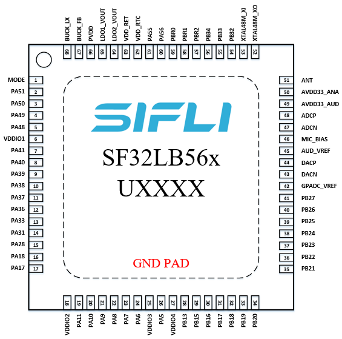 

<div align="center"> Figure 2-1 SF32LB56xU QFN68L Pin Distribution </div>  <br>  <br>  <br>

## Typical Application Schemes

Figure 3-1 is a block diagram of a typical sports watch, which includes display, storage, sensors, vibration motor, and audio input and output.

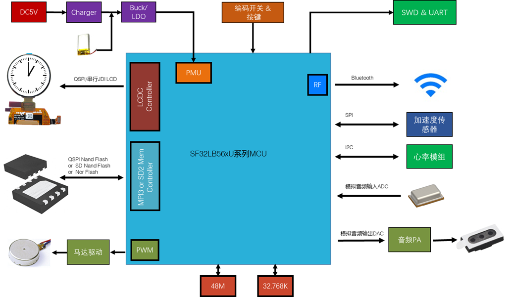 

<div align="center"> Figure 3-1 Sports Watch Block Diagram </div>  <br>  <br>  <br>

:::{Note} 

- Big.LITTLE dual-CPU architecture, balancing high performance and low power consumption design requirements

- External charging management chip

- Supports GPADC for battery voltage detection

- Power supply uses Buck, LDO, and Load Switch solutions

- Supports QSPI interface TFT or AMOLED displays, with a maximum resolution of 1024x1024

- Supports PWM backlight control

- Supports external QSPI interface Nor Flash storage chip

- Supports external QSPI interface NAND Flash storage chip

- Supports external SDIO interface NAND Flash storage chip

- Supports Bluetooth 5.3 communication

- Supports analog audio input

- Supports analog audio output

- Supports PWM vibration motor control

- Supports SPI/I2C interface acceleration/magnetic/gyroscope sensors

- Supports I2C interface heart rate/blood oxygen/ECG sensors

- Supports SEGGER J-Link SWD debugging and programming tools

- Supports UART debugging print interface

- Supports Bluetooth HCI debugging interface

- Supports one-to-many programming in production lines

- Supports crystal calibration in production lines

- Supports OTA online upgrade functionality
:::

## Schematic Design Guidelines

### Power Supply

The series of chips includes a PMU unit, and PVDD can support a power input range of 1.7~3.6V. The PMU supports one Buck and multiple LDOs to power the internal circuits of the chip. Refer to Table 4-1 for the detailed connections of the power pins.

#### Processor Power Supply Requirements

SF32LB56xU power supply specifications:

<div align="center"> Table 4-1  PMU Power Supply Specifications </div>

```{table}
:align: center
| PMU Power Pins       | Minimum Voltage(V) | Typical Voltage(V) | Maximum Voltage(V) | Maximum Current(mA) | Detailed Description                                                   |
| :------------------ | :----------------: | :----------------: | :----------------: | :-----------------: | :-------------------------------------------------------------------- |
| PVDD                 |         1.7       |         1.8        |         3.6        |         100         | PVDD power input                                                       |
| BUCK_LX  BUCK_FB     |         -         |        1.25        |         -          |         100         | BUCK_LX output, connected to the internal power input of the inductor, and the other end of the inductor, with an external capacitor |
| LDO1_VOUT            |         -         |         1.1        |         -          |          50         | LDO1 output, with an external capacitor                               |
| LDO2_VOUT            |         -         |         0.9        |         -          |          20         | LDO2 output, with an external capacitor                               |
| VDD_RET              |         -         |         0.9        |         -          |           1         | RET LDO output, with an external capacitor                            |
| VDD_RTC              |         -         |         1.1        |         -          |           1         | RTC LDO output, with an external capacitor                            |
| MIC_BIAS             |        1.4        |         -          |        2.8         |          -          | MIC power output                                                       |
| AVDD33_ANA           |        3.15       |        3.3         |        3.45        |          50         | Analog power + RF PA power input                                      |
| AVDD33_AUD           |        3.15       |        3.3         |        3.45        |          50         | Analog audio power                                                     |
| VDDIO1               |        1.71       |        1.8         |        1.98        |          -          | Power input for the internal large core and integrated memory          |
| VDDIO2               |        1.71       |        1.8         |        3.45        |          -          | Power input for PA GPIO (excluding PA5~11)                            |
| VDDIO3               |        1.71       |        1.8         |        3.45        |          -          | Power input for PA5~11                                                |
| VDDIO4               |        1.71       |        1.8         |        3.45        |          -          | Power input for PB GPIO and the internal small core integrated Flash   |
```

The recommended values for external capacitors connected to the power pins of the SF32LB56xU series chips are shown in Table 4-2.

<div align="center"> Table 4-2 Capacitor Recommended Values </div>

```{table}
:align: center
| Power Pin        | Capacitor      | Detailed Description                                    |
| ---------------- | ------------- | ------------------------------------------------------- |
| PVDD             | 0.1uF + 10uF  | Place at least 2 capacitors, 10uF and 0.1uF, close to the pin.  |
| BUCK_LX  BUCK_FB | 0.1uF + 4.7uF | Place at least 2 capacitors, 4.7uF and 0.1uF, close to the pin. |
| LDO1_VOUT        | 4.7uF         | Place at least 1 capacitor, 4.7uF, close to the pin.            |
| LDO2_VOUT        | 4.7uF         | Place at least 1 capacitor, 4.7uF, close to the pin.            |
| VDD_RET          | 0.47uF        | Place at least 1 capacitor, 0.47uF, close to the pin.           |
| VDD_RTC          | 1uF           | Place at least 1 capacitor, 1uF, close to the pin.              |
| AVDD33_ANA       | 4.7uF         | Place at least 1 capacitor, 4.7uF, close to the pin.            |
| AVDD33_AUD       | 4.7uF         | Place at least 1 capacitor, 4.7uF, close to the pin.            |
| MIC_BIAS         | 1uF           | Place at least 1 capacitor, 1uF, close to the pin.              |
| VDDIO1           | 1uF           | Place at least 1 capacitor, 1uF, close to the pin.              |
| VDDIO2           | 1uF           | Place at least 1 capacitor, 1uF, close to the pin.              |
| VDDIO3           | 1uF           | Place at least 1 capacitor, 1uF, close to the pin.              |
| VDDIO4           | 1uF           | Place at least 1 capacitor, 1uF, close to the pin.              |
```
#### Sich PMIC Chip Power Distribution

SF30147C is a highly integrated, high-efficiency, and cost-effective power management chip designed for ultra-low-power wearable products. SF30147C integrates one high-efficiency and low-static current BUCK, which outputs 1.8V and can provide up to 500mA of drive current. SF30147C also integrates four low-dropout and low-static current LDOs, which output 2.8~3.3V and can provide up to 100mA of drive current.

SF30147C integrates seven low-static current, low-on-resistance load switches. Among them, 2 high-voltage load switches are suitable for peripherals driven directly by battery voltage, such as audio amplifiers; 5 low-voltage switches are suitable for peripherals powered by 1.8V.

SF32LB56xU can communicate with SF30147C via the TWI interface. For the usage of each power output of SF30147C, please refer to Table 4-3. For detailed information about the chip, please refer to the document "DS0002-SF30147C-Technical Specification".

<div align="center"> Table 4-3 SF30147C Power Distribution Table </div>

```{table}
:align: center
| SF30147C  Power Pin | Minimum Voltage(V) | Maximum Voltage(V) | Maximum Current(mA) | Detailed Description                                                     |
| ------------------ | ----------- | ----------- | ------------ | ------------------------------------------------------------ |
| VBUCK              | 1.8         | 1.8         | 500          | 1.8V power input for PVDD, VDDIOA, VDDIOA2, VDDIOB, VDDIOSA, VDDIOSB, VDDIOSC, AVDD_BRF of SF32LB56xU |
| LVSW1              | 1.8         | 1.8         | 100          | 1.8V power output                                                |
| LVSW2              | 1.8         | 1.8         | 100          | 1.8V power input for G-SENSOR                                        |
| LVSW3              | 1.8         | 1.8         | 150          | 1.8V power input for Heart Rate                                            |
| LVSW4              | 1.8         | 1.8         | 150          | 1.8V power input for LCD                                             |
| LVSW5              | 1.8         | 1.8         | 150          | 1.8V power output                                            |
| LDO1               | 2.8         | 3.3         | 100          | 3.3V power input for AVDD33_ANA, AVDD33_AUD, VDDIOA2 of SF32LB56xU    |
| LDO2               | 2.8         | 3.3         | 100          | 3.3V power input for Motor                                        |
| LDO3               | 2.8         | 3.3         | 100          | 3.3V power input for LCD                                             |
| LDO4               | 2.8         | 3.3         | 100          | 3.3V power input for Heart Rate                                             |
| HVSW1              | 2.8         | 5           | 150          | 3.3V to 5V power input for Analog Class-K PA                                       |
| HVSW2              | 2.8         | 5           | 150          | 3.3V to 5V power input for GPS                                                  |
```

#### Power-Up Sequence and Reset

The SF32LB56xU chip PMU integrates POR (Power on reset) and BOR (Brownout reset) functions, as shown in Figure 4-1.

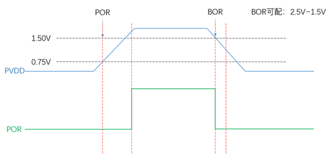 

<div align="center"> Figure 4-1 Power-Up/Down Sequence Diagram </div>  <br>  <br>  <br>

When the system powers up, PVDD rises to 1.5V, and the system completes the POR. When PVDD drops to the BOR trigger voltage (configurable between 2.5V and 1.5V), the PMU outputs a reset signal, and the system resets.

#### Typical Power Circuit

It is recommended to use the SF30147C to power the SF32LB56xU and various peripherals. The circuit diagram is shown in Figure 4-2, and specific details are provided in Table 4-3.

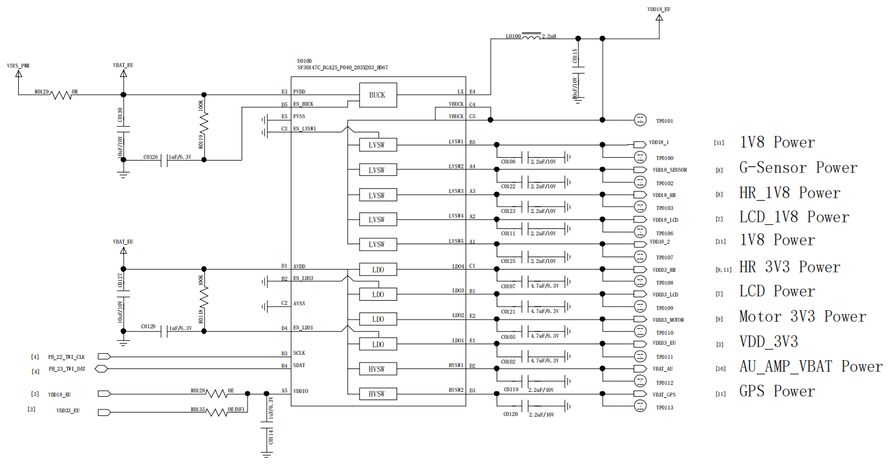 

<div align="center"> Figure 4-2 SF30147C Power Supply Diagram </div>  <br>  <br>  <br>

The SF32LB56xU series of chips includes one BUCK output, as shown in Figure 4-3.

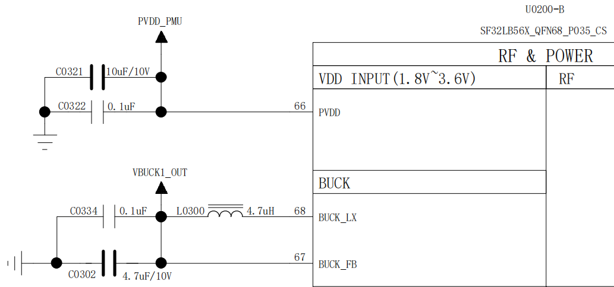 

<div align="center"> Figure 4-3 Built-in BUCK Circuit Diagram </div>  <br>  <br>  <br>

The SF32LB56xU series of chips includes four LDOs, as shown in Figure 4-4.

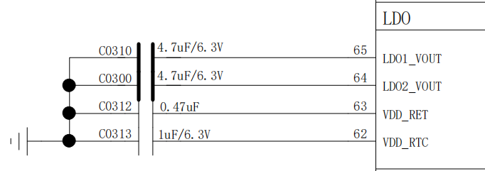 

<div align="center"> Figure 4-4 Built-in LDO Circuit Diagram </div>  <br>  <br>  <br>

#### Processor BUCK Inductor Selection Requirements

:::{important}
**Key Parameters for Power Inductor**

L (Inductance) = 4.7uH ± 20%, DCR (DC Resistance) ≦ 0.4 ohm, Isat (Saturation Current) ≧ 450mA.
:::

#### Battery and Charging Control

A typical smartwatch usually contains a built-in polymer lithium battery pack. The entire power system requires a charging circuit to complete the battery charging.

A typical charging circuit consists of protection circuits (EOS, ESD, and OVP protection), a charging management chip, and the battery. The charging management chip in the circuit of Figure 4-1 does not have path management functionality. The system power and battery are connected together, and due to the high leakage power consumption of the modules powered by VBAT, it does not meet the power consumption requirements for Shipping Mode, hence it does not support Shipping Mode.

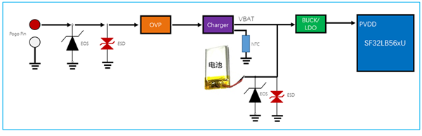 

<div align="center"> Figure 4-5 Typical Charging Circuit One </div>  <br>  <br>  <br>

As shown in Figure 4-6, the trickle charge current of the charging management chip must be greater than i1+i2 to charge an over-discharged battery. If the trickle charge current is less than i1+i2, it will result in the inability to charge the over-discharged battery.

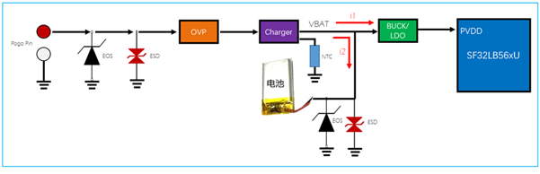 

<div align="center"> Figure 4-6 Schematic Diagram of Over-discharged Battery Charging Circuit </div>  <br>  <br>  <br>

As shown in Figure 4-7, if the VBAT backend system is powered on and operating normally, the constant current charge current of the charging management chip must be greater than i1+i2. If it is less than i1+i2, both the charging management chip and the battery will supply power to the backend system, resulting in the inability to fully charge the battery.

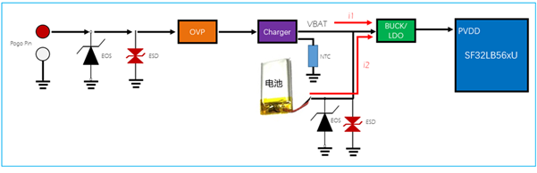 

<div align="center"> Figure 4-7 Schematic Diagram of Insufficient Charging Current of Charging Management Chip </div>  <br>  <br>  <br>

In the circuit of Figure 4-8, the charging management chip is a complex chip with path management and supports Shipping Mode. Since VSYS supplies power to the system and charges VBAT separately, even if the battery is over-discharged, it does not affect the power supply to the backend system.

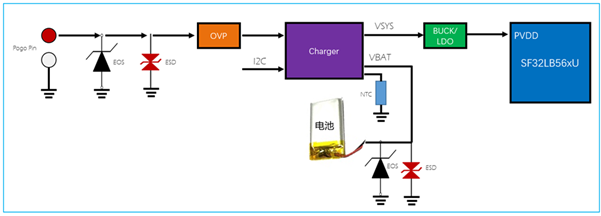 

<div align="center"> Figure 4-8 Typical Charging Circuit Two </div>  <br>  <br>  <br>

#### How to Reduce Standby Power Consumption

To meet the long battery life requirements of watch products, it is recommended to use load switches for dynamic power management of various functional modules in hardware design; if the modules or paths are always on, choose appropriate devices to reduce the static current.
The entire SF32LB56xU system requires 3.3V and 1.8V power supplies, where:

* Some pins of the main chip SF32LB56xU are always supplied with 3.3V and 1.8V power;
* The interface voltage level of peripheral devices is recommended to be 1.8V;
* Power switches for other modules are managed through load switches and are off by default.

As shown in Figures 4-5, 4-6, and 4-7, depending on the selection of peripheral devices, SF32LB56xU has three power supply topologies with low, medium, and high system power consumption. As shown in Figure 4-9, PVDD and VDDIO1-4 of SF32LB56xU are supplied with 1.8V, and peripheral devices with an interface voltage level of 1.8V are selected. Compared to the other two power supply topologies, the overall system power consumption is the lowest. As shown in Figure 4-10, the MCU is supplied with 1.8V, and peripheral devices with an interface voltage level of 3.3V are selected, resulting in higher overall system power consumption compared to the topology in Figure 4-9. As shown in Figure 4-11, except for the VDDIO1 pin supplying 1.8V to the internal PSRAM, both the peripheral devices and the MCU are supplied with 3.3V, resulting in the highest overall system power consumption compared to the other two topologies. Users can choose the appropriate power supply topology based on the device selection and system power consumption requirements.

When designing, the default hardware level of the GPIO pins controlling the load switches should be consistent with the enable level of the load switches to ensure that the load switches are off by default. It is recommended to add a pull-up or pull-down resistor to the enable pin of the load switch, with a recommended resistance value of 1M ohms.

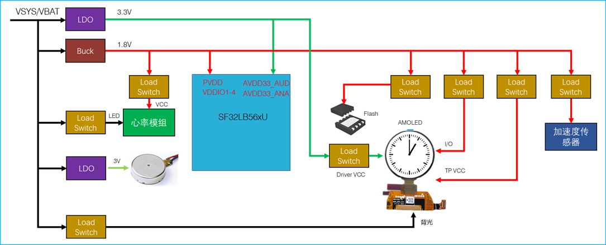 

<div align="center"> Figure 4-9 SF32LB56xU 1.8V Peripheral Power Supply Topology </div>  <br>  <br>  <br>

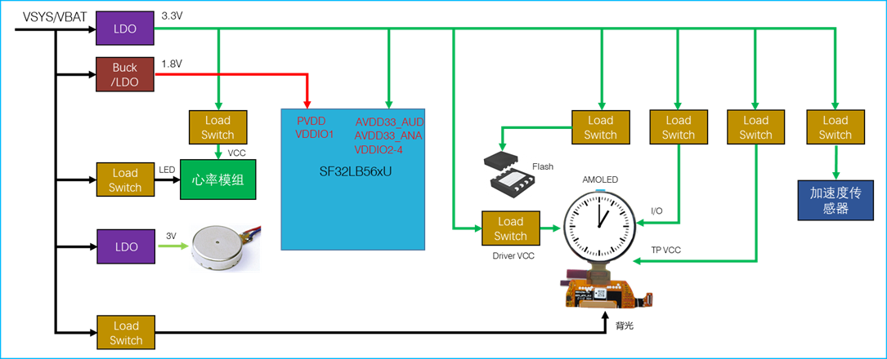 

<div align="center"> Figure 4-10 SF32LB56xU 3.3V Peripheral Power Supply Topology One </div>  <br>  <br>  <br>

 

<div align="center"> Figure 4-11 SF32LB56xU 3.3V Peripheral Power Supply Topology Two </div>  <br>  <br>  <br>

### Reset Issues

The SF32LB56xU chip PMU integrates POR (Power on reset) and BOR (Brownout reset) functions, as shown in Figure 4-12.

 

<div align="center"> Figure 4-12 Power-On/Power-Down Timing Diagram </div>  <br>  <br>  <br>

When the system is powered on, PVDD rises to 1.5V, and the system completes the POR. When PVDD drops to the BOR trigger voltage (configurable between 2.5V and 1.5V), the PMU outputs a reset signal, and the system resets.

### Boot Mode

The SF32LB56xU series chips provide a Mode pin to configure the boot mode, which is internally pulled down and can be left floating if not used. The reference circuit diagram is shown in Figure 4-13:

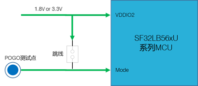 

<div align="center"> Figure 4-13 Recommended Circuit Diagram for Mode Pin </div>  <br>  <br>  <br>

:::{attention}
**Mode Pin Definition:**

=1, the system enters download mode at startup and does not enter the user program;

=0, the system checks for the presence of a user program at startup. If a user program exists, it enters the user program; otherwise, it enters download mode.

**Precautions:**

1. The voltage domain of the Mode pin is the same as that of VDDIO2;
2. The Mode pin must have a test point on the production board for program download or crystal calibration, and a jumper is not required;
3. It is recommended to reserve a jumper for the Mode pin on the test board to facilitate program download in download mode when the program crashes.
:::

### Processor Operating Modes and Wake-up Sources

The SF32LB56xU series chips support multiple operating modes for both HCPU and LCPU, as listed in Table 4-4.

<div align="center"> Table 4-4 CPU Operating Mode List </div>

```{table}
:align: center

| Work Mode  | CPU   | Peripherals | SRAM                                | IO       | LPTIM | Wake-up Source                                    | Wake-up Time       |
| ---------- | ----- | ----------- | ----------------------------------- | -------- | ----- | ------------------------------------------------- | ------------------ |
| Active     | Run   | Run         | Accessible                         | Flippable| Run   |                                                   |                    |
| WFI/WFE    | Stop  | Run         | Accessible                         | Flippable| Run   | Any interrupt                                     | < 0.5us            |
| DEEPWFI    | Stop  | Run         | Accessible                         | Flippable| Run   | Any interrupt                                     | < 5us              |
| Light sleep| Stop  | Stop        | Not accessible, fully retained     | Level hold| Run   | RTC, GPIO, LPTIM, cross-system, Bluetooth, comparator | < 100us            |
| Deep sleep | Stop  | Stop        | Not accessible, fully retained     | Level hold| Run   | < 300us                                          |                    |
| Standby    | Reset | Reset       | Not accessible, LP fully retained, HP retains 160KB | Level hold| Run   | RTC, button, LPTIM, cross-system, Bluetooth       | 1.5ms + recovery   |
| Hibernate rtc | Reset | Reset | Data not retained                  | High impedance | Reset | RTC, button                                       | > 2ms              |
| Hibernate pin | Reset | Reset | Data not retained                  | High impedance | Reset | Button                                            | > 2ms              |
```

As shown in Table 4-5, the entire series of chips supports 8 wake-up interrupt sources, which can wake up the big core or small core CPU.

<div align="center"> Table 4-5 Wake-up Interrupt Source List </div>

```{table}
:align: center

| Interrupt Source | Pin  | Detailed Description |
| ---------------- | ---- | -------------------- |
| WKUP_PIN0        | PB32 | Interrupt signal 0  |
| WKUP_PIN1        | PB33 | Interrupt signal 1  |
| WKUP_PIN2        | PB34 | Interrupt signal 2  |
| WKUP_PIN5        | PA50 | Interrupt signal 5  |
| WKUP_PIN6        | PA51 | Interrupt signal 6  |
| WKUP_PIN10       | PBR0 | Interrupt signal 10 |
| WKUP_PIN11       | PBR1 | Interrupt signal 11 |
| WKUP_PIN12       | PBR2 | Interrupt signal 12 |
```

### Clocks

The SF32LB56xU series of chips require 2 external clock sources: a 48MHz main crystal and a 32.768KHz RTC crystal. The specific specifications and selection criteria for the crystals are shown in Table 4-6 and Table 4-7.

:::{important}
**Crystal Key Parameters**

<div align="center"> Table 4-6 Crystal Specification Requirements </div>

```{table}
:align: center
| Crystal | Specification Requirements | Detailed Description |
| ------- | -------------------------- | -------------------- |
| 48MHz   | 7pF ≤ CL ≤ 12pF (recommended value 8.8pF) ΔF/F0 ≤ ±10ppm ESR ≤ 30 ohms (recommended value 22ohms) | The power consumption of the crystal is related to CL and ESR. The smaller the CL and ESR, the lower the power consumption. For optimal power performance, it is recommended to use materials with relatively smaller CL and ESR values within the required range. Parallel matching capacitors are reserved next to the crystal. When CL < 12pF, no capacitors need to be soldered. |
| 32.768KHz | CL ≤ 12.5pF (recommended value 7pF) ΔF/F0 ≤ ±20ppm ESR ≤ 80k ohms (recommended value 38Kohms) | The power consumption of the crystal is related to CL and ESR. The smaller the CL and ESR, the lower the power consumption. For optimal power performance, it is recommended to use materials with relatively smaller CL and ESR values within the required range. Parallel matching capacitors are reserved next to the crystal. When CL < 12.5pF, no capacitors need to be soldered. |
```

**Crystal Recommendations**

<div align="center"> Table 4-7 Recommended Crystal List </div>

```{table}
:align: center

| Model                | Manufacturer | Parameters                                                         |
| -------------------- | ------------ | ------------------------------------------------------------------ |
| E1SB48E001G00E       | Hosonic      | F0 = 48.000000MHz，△F/F0 = -6 ~ 8 ppm，  CL = 8.8 pF，ESR =  22 ohms Max  TOPR  = -30 ~ 85℃，Package =（2016 metric） |
| ETST00327000LE       | Hosonic      | F0 = 32.768KHz，△F/F0  = -20 ~ 20 ppm，  CL = 7 pF，ESR =  70K ohms Max  TOPR  = -40 ~ 85℃，Package =（3215 metric） |
| SX20Y048000B31T-8.8  | TKD          | F0 = 48.000000MHz，△F/F0 = -10 ~ 10 ppm，  CL = 8.8 pF，ESR =  40 ohms Max  TOPR  = -20 ~ 75℃，Package =（2016 metric） |
| SF32K32768D71T01     | TKD          | F0 = 32.768KHz，△F/F0  = -20 ~ 20 ppm，  CL = 7 pF，ESR =  70K ohms Max  TOPR  = -40 ~ 85℃，Package =（3215 metric） |
```

Note: The ESR of SX20Y048000B31T-8.8 is slightly larger, which will also result in slightly higher static power consumption.

When routing the PCB, at least the second layer GND copper should be removed under the crystal to reduce the parasitic load capacitance on the clock signal.
:::

For detailed material certification information, please refer to:
[SIFLI-MCU-AVL-Certification Table](index)

### RF

The RF PCB routing requirements for the SF32LB56xU series chips are 50ohms characteristic impedance. If the antenna is well-matched, no additional components are required on the RF path. It is recommended to reserve a π-type matching network for stray filtering. Please refer to the circuit shown in Figure 4-14.

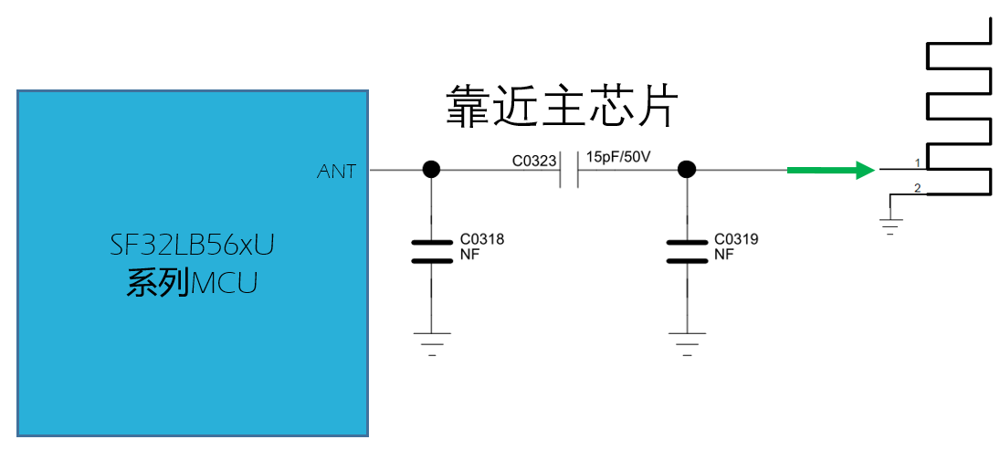 

<div align="center"> Figure 4-14 RF Circuit Diagram </div>  <br>  <br>  <br>

### How to Connect Peripherals to the Big and Little Cores

The SF32LB56xU series chips have two processor systems internally. The GPIOs of PAx are connected to the HCPU system, and the GPIOs of PBx are connected to the LCPU system. The HCPU can access all the peripheral resources of the LCPU, while it is not recommended for the LCPU to access the resources of the HCPU. The HCPU can run at a maximum frequency of 240MHz, providing high-performance computing, graphics processing, and high-resolution/frame-rate display. External memory, display interfaces, and other high-power devices should be connected to the HCPU.

The LCPU typically runs at 48MHz at 0.9V and can run up to 96MHz at 1.1V. It is used to handle the BLE protocol stack and control heart rate and acceleration sensors in low-power modes, as well as manage charging, PMIC, voltage monitoring, and power-on/off.

### Display

The SF32LB56xU series chips support 3-Line SPI, 4-Line SPI, Dual data SPI, Quad data SPI, and serial JDI interfaces. They support 16.7M-colors (RGB888), 262K-colors (RGB666), 65K-colors (RGB565), and 8-color (RGB111) color depth modes. The maximum supported resolution is 1024RGBx1024. The supported LCD driver list is shown in Table 4-8.

<div align="center"> Table 4-8 Supported LCD Driver List </div>

```{table}
:align: center

| Model     | Manufacturer | Resolution | Type   | Interface                                                         |
| --------- | ------------ | ---------- | ------ | ----------------------------------------------------------------- |
| RM69090   | Raydium      | 368*448    | Amoled | 3-Line SPI，4-Line  SPI，Dual data SPI，  Quad data SPI，MIPI-DSI |
| RM69330   | Raydium      | 454*454    | Amoled | 3-Line SPI，4-Line  SPI，Dual data SPI，  Quad data SPI，8-bits  8080-Series MCU ，MIPI-DSI |
| ILI8688E  | ILITEK       | 368*448    | Amoled | Quad data SPI，MIPI-DSI                                          |
| SH8601A   | Shenghe Tech | 454*454    | Amoled | 3-Line SPI，4-Line  SPI，Dual data SPI，  Quad data SPI，8-bits  8080-Series MCU ，MIPI-DSI |
| SPD2012   | Solomon      | 356*400    | TFT    | Quad data SPI                                                    |
| GC9C01    | Galaxycore   | 360*360    | TFT    | Quad data SPI                                                    |
| ST77903   | Sitronix     | 400*400    | TFT    | Quad data SPI                                                    |
```

#### SPI/QSPI Display Interface

The SF32LB56xU series chips support 3/4-wire SPI and Quad-SPI interfaces to connect LCD displays. The signal descriptions are shown in Table 4-9.

<div align="center"> Table 4-9 SPI/QSPI Screen Signal Connection Methods </div>

```{table}
:align: center

| SPI Signal | SF32LB56XU Pin | SS6700A Pin | Detailed Description                                                  |
| ---------- | -------------- | ----------- | --------------------------------------------------------------------- |
| CSX        | PA36           | PA36        | Enable signal                                                         |
| WRX_SCL    | PA37           | PA37        | Clock signal                                                          |
| DCX        | PA39           | PA39        | Data/command signal in 4-wire SPI mode, Data1 in Quad-SPI mode        |
| SDI_RDX    | PA38           | PA38        | Data input signal in 3/4-wire SPI mode, Data0 in Quad-SPI mode       |
| SDO        | PA38           | PA38        | Data output signal in 3/4-wire SPI mode, Connect to SDI_RDX together  |
| D0         | PA40           | PA40        | Data2 in Quad-SPI mode                                                |
| D1         | PA41           | PA41        | Data3 in Quad-SPI mode                                                |
| REST       | PA05           | PB04        | Reset display signal                                                  |
| TE         | PA33           | PA33        | Tearing effect to MCU frame signal                                    |
```

#### JDI Display Interface

The SF32LB56xU series of chips support the serial JDI interface to connect to LCD displays, as shown in Table 4-10.

<div align="center"> Table 4-10 Serial JDI Display Signal Connections </div>

```{table}
:align: center

| JDI Signal      | Pin  | Detailed Description                         |
| --------------- | ---- | -------------------------------------------- |
| JDI_SCS         | PA39 | Chip Select Signal                           |
| JDI_SCLK        | PA41 | Serial Clock Signal                          |
| JDI_SO          | PA40 | Serial Data Output Signal                    |
| JDI_DISP        | PA36 | Display ON/OFF Switching Signal              |
| JDI_EXTCOMIN    | PA38 | COM Inversion Polarity Input                 |
```

#### Touch and Backlight Interface

The SF32LB56xU series of chips support an I2C format touch screen control interface and touch status interrupt input, as well as a single PWM signal to control the enablement and brightness of the backlight power, as shown in Table 4-11.

<div align="center"> Table 4-11 Touch and Backlight Control Connections </div>

```{table}
:align: center

| Touch Screen and Backlight Signal | Pin  | Detailed Description                   |
| --------------------------------- | ---- | --------------------------------------- |
| Interrupt                         | PA50 | Touch status interrupt signal (wakeup)  |
| I2C1_SCL                          | PA48 | Touch screen I2C clock signal          |
| I2C1_SDA                          | PA49 | Touch screen I2C data signal           |
| BL_PWM                            | PA31 | Backlight PWM control signal            |
| Reset                             | PB18 | Touch reset signal                      |
```

### Storage

#### External Memory for SF32LB56xU

The SF32LB56xU supports SPI Nor/Nand and SD Nand Flash peripherals. The SPI Nor/NAND Flash uses the MPI interface, and the SD NAND Flash uses the SD interface. These types of Flash chips are physically pin-compatible. The interface definitions are shown in Tables 4-12 and 4-13. The GPIO power supply pins PA06~PA11 in the table are VDDIO3, which is independent of the voltage domain of other GPIOs. VDDIO3 can be set according to the interface voltage level of the external Flash.

The MPI signal definitions are shown in Table 4-13, and the SD signal definitions are shown in Table 4-14.

<div align="center"> Table 4-12 SPI Nor/Nand Flash Signal Connections </div>

```{table}
:align: center

| Flash Signal | I/O Signal | Detailed Description                                    |
| ------------ | ---------- | -------------------------------------------------------- |
| CS#          | PA06       | Chip select, active low.                                  |
| SO           | PA07       | Data Input (Data Input Output 1)                         |
| WP#          | PA08       | Write Protect Output (Data Input Output 2)               |
| SI           | PA09       | Data Output (Data Input Output 0)                       |
| SCLK         | PA10       | Serial Clock Output                                      |
| Hold#        | PA11       | Data Output (Data Input Output 3)                       |
```

:::{note}
The Hold# pin of the SPI NAND Flash must be pulled up to the power supply of the SPI NAND Flash through a 10K resistor.
:::

<div align="center"> Table 4-13 SD Nand Flash Signal Connections </div>

```{table}
:align: center

| Flash Signal | I/O Signal | Detailed Description |
| ------------ | ---------- | -------------------- |
| SD2_CMD      | PA09       | Command signal       |
| SD2_D1       | PA11       | Data 1              |
| SD2_D0       | PA10       | Data 0              |
| SD2_CLK      | PA08       | Clock signal         |
| SD2_D2       | PA06       | Data 2              |
| SD2_D3       | PA07       | Data 3              |
```

### Power Button

The power on/off signal for the SF32LB56xU series chips uses PB32, which allows the short press power on/off function and the long press reset function to be combined into a single button. As shown in Figure 4-15, the design uses a high-level effective method, and the long press reset function requires the button to be held for more than 10 seconds for the chip to automatically reset.

The SF32LB56xU series chips support function key inputs and rotary encoder signal inputs, which require pull-up resistors. The usage of buttons is shown in Figure 4-16. It also supports optical tracking sensors, and it is recommended to use the I2C4 interface, with signal connections as shown in Table 4-14.

<div align="center"> Table 4-14 Optical Tracking Sensor Signal Connections </div>

```{table}
:align: center

| I2C Signal | I/O  | Detailed Description                 |
| ---------- | ---- | ------------------------------------ |
| SDA        | PA18 | Optical tracking sensor I2C data signal |
| SCL        | PA17 | Optical tracking sensor I2C clock signal |
```

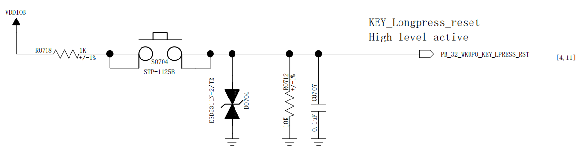 

<div align="center"> Figure 4-15 Power Button Circuit Diagram </div>  <br>  <br>  <br>

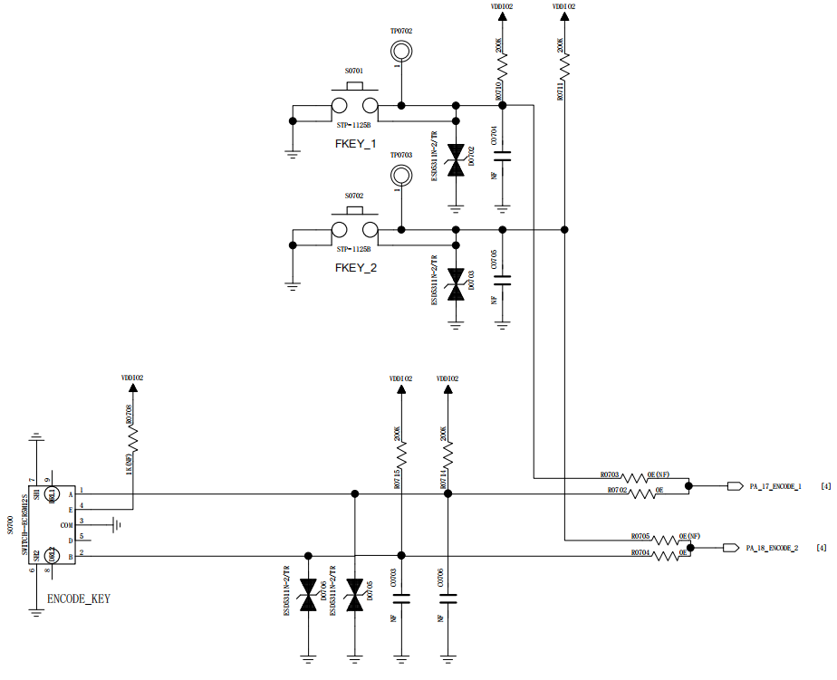 

<div align="center"> Figure 4-16 Function Key or Rotary Encoder Circuit Diagram </div>  <br>  <br>  <br>

:::{note}
For general mechanical rotary encoder switches, the switch does not return to the off state after rotation, so the power supply for the pull-up resistor should be able to be turned off during standby to prevent leakage.
:::

### Vibration Motor

The SF32LB56xU series chips support multiple PWM outputs, which can be used as drive signals for vibration motors. The recommended circuit is shown in Figure 4-17. If the current during motor vibration does not cause system instability, VBAT can also be used directly for power.

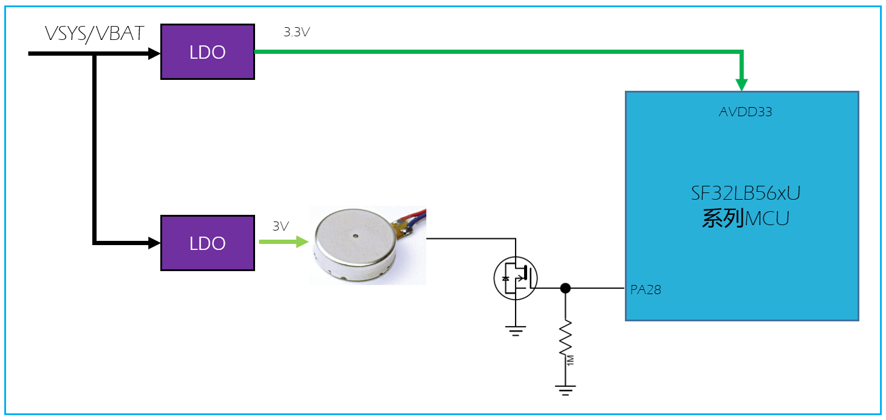 

<div align="center"> Figure 4-17 Vibration Motor Circuit Diagram </div>  <br>  <br>  <br>

:::{important}
If the software enables the `#define BSP PM FREQ SCALING 1` macro to reduce the HCPU clock frequency, the HCPU clock frequency will decrease when the HCPU enters the idle thread, and the PWM frequency of the HCPU's PA port will also change. Therefore, it is recommended to use the PB interface to output the PWM signal.
:::

### Audio Interface

The audio-related interfaces of the SF32LB56xU series chips are shown in Table 4-15. The audio interface signals have the following characteristics:

1. Supports one differential ADC input, connected to an external analog MIC, with a coupling capacitor of at least 2.2uF between the MIC and the chip, and the MIC power is connected to the chip's MIC_BIAS power output pin.
2. Supports one differential DAC output, connected to an external analog audio PA. The DAC output traces should be routed as differential lines with proper ground shielding, and the following should be noted: Trace Capacitance < 10pF, Length < 2cm.

<div align="center"> Table 4-15 Audio Signal Connections </div>

```{table}
:align: center

| Audio Signal | I/O  | Detailed Description               |
| ------------ | ---- | ---------------------------------- |
| AU_ADC1P     | ADCP | Differential P or single-ended analog MIC input |
| AU_ADC1N     | ADCN | Differential analog MIC input N or GND |
| AU_DAC1P     | DACP | Differential analog output P       |
| AU_DAC1N     | DACN | Differential analog output N       |
```

The recommended circuit for the analog MEMS MIC for the SF32LB56xU series chips is shown in Figure 4-18. The recommended circuit for the single-ended analog ECM MIC is shown in Figure 4-19. The recommended circuit for the differential analog ECM MIC is shown in Figure 4-20. AU_ADC1P and AU_ADC1N are connected to the ADC input pins of the SF32LB56XU.

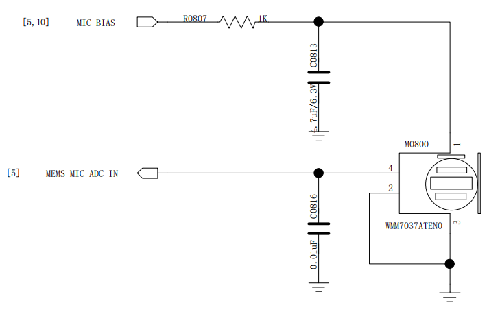 

<div align="center"> Figure 4-18 Analog MEMS MIC Input Circuit Diagram </div>  <br>  <br>  <br>

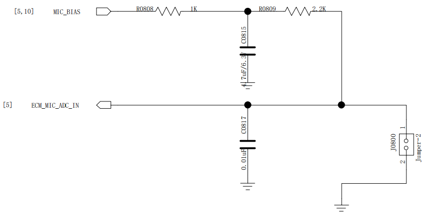 

<div align="center"> Figure 4-19 Single-Ended Input Circuit Diagram of Analog ECM </div>  <br>  <br>  <br>

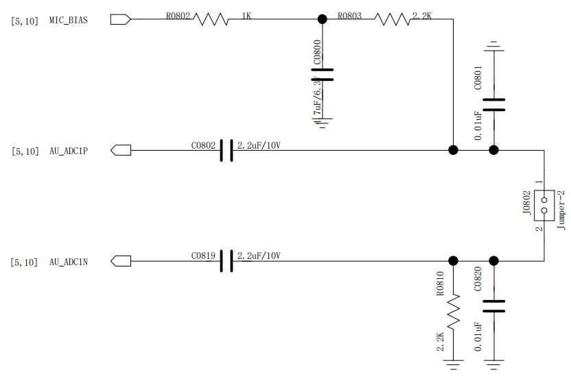 

<div align="center"> Figure 4-20 Differential Input Circuit Diagram of Analog ECM </div>  <br>  <br>  <br>

The recommended circuit for the analog audio output of the SF32LB56xU series chips is shown in Figure 4-21. Note that the differential low-pass filter within the dashed line should be placed close to the chip.

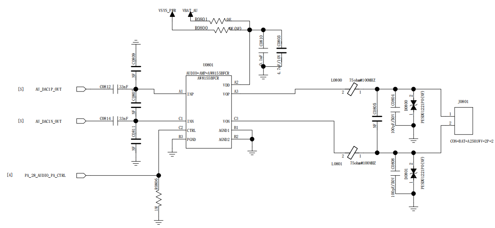 

<div align="center"> Figure 4-21 Analog Audio PA Circuit Diagram </div>  <br>  <br>  <br>

### PBR Interface Description

The SF32LB56xU series chips provide 3 PBR interfaces, with the following main features:

1. PBR0 changes from 0 to 1 during the power-on stage, used for certain external LSW control, while PBR1-PBR2 are default outputs of 0;
2. PBR0-PBR2 can be used as outputs in both standby and hibernate modes;
3. PBR0-PBR2 can output LPTIM signals;
4. PBR1-PBR2 can output 32K clock signals;
5. PBR0-PBR2 can be configured as inputs for wake-up signal input, and the MCU will not receive interrupts when it wakes up.

### Sensors

The SF32LB56xU series chips support heart rate and accelerometer sensors, among others. In the design, attention should be paid to the I2C, SPI, control interfaces, and interrupt wake-up interfaces of the heart rate and accelerometer sensors. It is recommended to use the PB interface of the LCPU. The power supply for the heart rate and accelerometer sensors can be provided by the LVSWx or LDO output of the SF30147C, which can be turned on or off as needed.

### UART and I2C Pin Configuration

The SF32LB56xU series chips support the mapping of UART and I2C functions to any pin. All PA interfaces can be mapped to UART or I2C function pins. All IOs of the PB port, except PB32/33/34 and PBR0/1/2, can be mapped to UART or I2C function pins.

### GPTIM Pin Configuration

The SF32LB56xU series chips support the mapping of GPTIM functions to any pin. All PA interfaces can be mapped to GPTIM function pins. All IOs of the PB port, except PB32/33/34 and PBR0/1/2, can be mapped to GPTIM function pins.

### Debug and Download Interface

The SF32LB56xU series chips support the standard Arm® SWD debug interface, which can be connected to EDA tools for step-by-step debugging. As shown in Figure 4-22, when connecting to the SEEGER® J-Link® tool, the power supply of the debug tool should be modified to external interface input, and the J-Link tool should be powered by the SF32LB56xU circuit board.

The SF32LB56xU series has one SWD for debug information output, as detailed in Table 4-16.

<div align="center"> Table 4-16 Debug Port Connection Method </div>

```{table}
:align: center
| SWD Signal | Pin | Detailed Description      |
| ---------- | ---- | ------------------------- |
| SWCLK      | PB15 | JLINK clock signal        |
| SWDIO      | PB13 | JLINK data signal         |
```

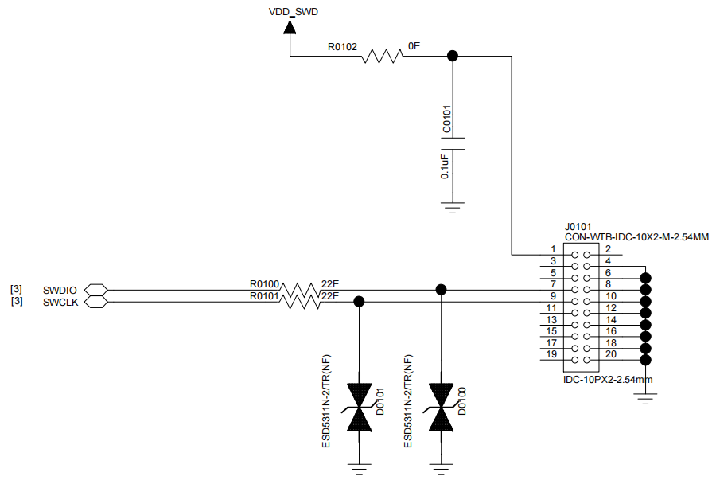 

<div align="center"> Figure 4-22 Debug Interface Circuit Diagram </div>  <br>  <br>  <br>

### Production Programming and Crystal Calibration

Siches Technology provides an offline programmer to complete the production programming and crystal calibration.

When designing the hardware, please ensure that at least the following test points are reserved: VBAT, GND, VDDIO2, Mode, SWDIO, SWCLK, RXD4, TXD4, PB20 or PB21 or PB25.

For detailed programming and crystal calibration, refer to the “**_Offline Programmer User Guide.pdf” document, which is included in the development package.

### Schematic and PCB Layout Checklists

Refer to the “_Schematic checklist_.xlsx” and “_PCB checklist_.xlsx” documents, which are included in the development package.

## PCB Design Guidelines

### PCB Package Design

**Package Dimensions**

The SF32LB56xU chip uses a QFN68L package with dimensions: 7mm x 7mm x 0.75mm, 68 pins, and a pin pitch of 0.35mm. The detailed dimensions are shown in Figure 5-1.

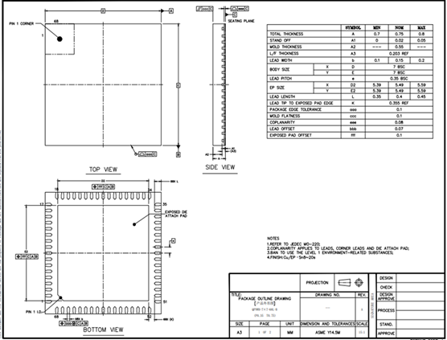  

<div align="center"> Figure 5-1 QFN68L Package Dimensions </div>  <br> <br> <br>

**Package Shape**

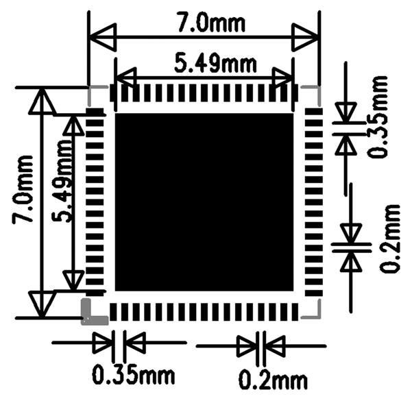  

<div align="center"> Figure 5-2 QFN68L Package Shape </div>  <br> <br> <br>

**Pad Design**

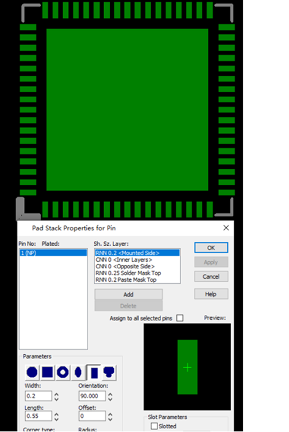  

<div align="center"> Figure 5-3 QFN68L Package PCB Pad Design Reference </div>  <br> <br> <br>

**Pinout/Ballmap**

The pinout information for the QFN68L package of the SF32LB56xU is shown in Figure 5-4.

  

<div align="center"> Figure 5-4 SF32LB56xU Package Pinout Information </div>  <br> <br> <br>

### PCB Layer Design

The SF32LB56xU series chips support single and double-sided layouts, and the QFN package PCB supports PTH. It is recommended to use a 4-layer PTH, and the recommended stack-up structure is shown in Figure 5-5.

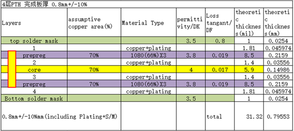  

<div align="center"> Figure 5-5 Recommended Stack-up Structure </div>  <br> <br> <br>

### General PCB Design Rules

The general PCB design rules for PTH boards are shown in Figure 5-6, with units in mm.

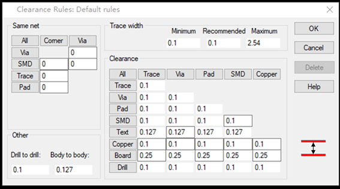  

<div align="center"> Figure 5-6 General Design Rules </div>  <br> <br> <br>

### Chip Routing Fanout

All pins of the QFN package should be fanned out through the surface layer, as shown in Figure 5-7.

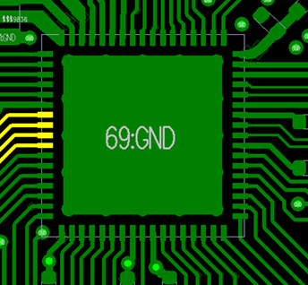  

<div align="center"> Figure 5-7 Surface Layer Fanout Reference </div>  <br> <br> <br>

### Clock Interface Routing

The crystal should be placed inside the shield, with a distance greater than 1mm from the PCB edge. It should be placed as far as possible from high-heat-generating components such as PA, Charge, and PMU circuits, with a preferred distance of more than 5mm to avoid affecting the crystal frequency. The crystal circuit should have a clearance of more than 0.25mm to avoid other metals and components, as shown in Figure 5-8.

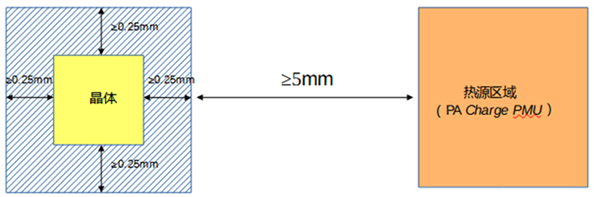  

<div align="center"> Figure 5-8 Crystal Layout Diagram </div>  <br> <br> <br>

For the 48MHz crystal, the routing on the surface layer should be controlled to a length of 3-10mm, with a line width of 0.075mm. The routing must be surrounded by a ground plane, and it should be kept away from VBAT, DC/DC, and high-speed signal lines. The surface layer and adjacent layer below the 48MHz crystal area should be kept clear of other routing, as shown in Figures 5-9, 5-10, and 5-11.

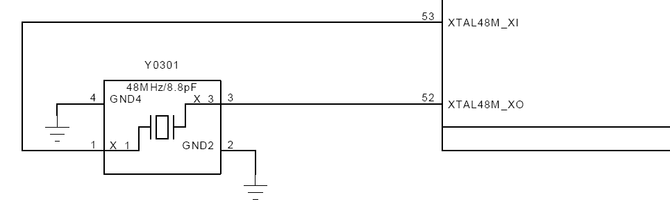  

<div align="center"> Figure 5-9 48MHz Crystal Schematic </div>  <br> <br> <br>

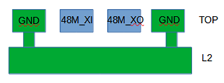  

<div align="center"> Figure 5-10 48MHz Crystal Routing Model </div>  <br> <br> <br>

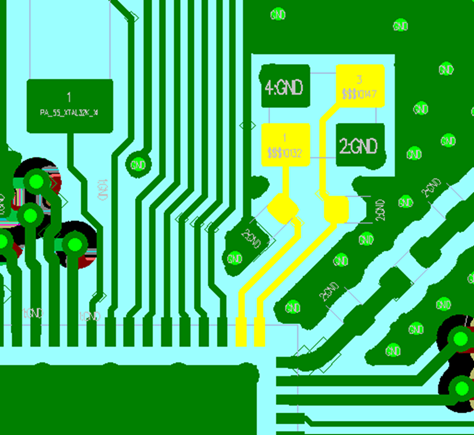  

<div align="center"> Figure 5-11 48MHz Crystal Routing Reference </div>  <br> <br> <br>

For the 32.768KHz crystal, the routing on the surface layer should be controlled to a length of ≤10mm, with a line width of 0.075mm. The parallel routing distance between 32K_XI and 32K_XO should be ≥0.15mm. The routing must be surrounded by a ground plane, and the surface layer and adjacent layer below the crystal area should be kept clear of other routing, as shown in Figures 5-12, 5-13, and 5-14.

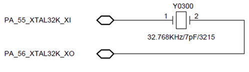  

<div align="center"> Figure 5-12 32.768KHz Crystal Schematic </div>  <br> <br> <br>

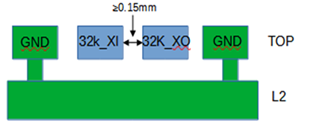  

<div align="center"> Figure 5-13 32.768KHz Crystal Routing Model </div>  <br> <br> <br>

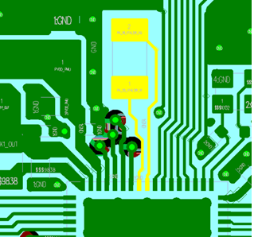  

<div align="center"> Figure 5-14 32.768KHz Crystal Routing Reference </div>  <br> <br> <br>

### RF Interface Routing

The RF matching circuit should be placed as close as possible to the chip end, not near the antenna end. The filter capacitors for the AVDD_BRF RF power supply should be placed as close as possible to the chip pins, with the capacitor ground pins connected directly to the main ground. The schematic and PCB layout of the π-type network are shown in Figures 5-15 and 5-16.

  

<div align="center"> Figure 5-15 π-Type Network Circuit Schematic </div>  <br> <br> <br>

  

<div align="center"> Figure 5-16 π-Type Network PCB Layout </div>  <br> <br> <br>

The RF line should be routed on the surface layer to avoid vias that can affect RF performance. The line width should be greater than 10mil, and it should be surrounded by a ground plane. Avoid sharp and right angles, and add multiple ground vias on both sides of the RF line. The RF line should be impedance-controlled to 50 ohms, as shown in Figures 5-17 and 5-18.

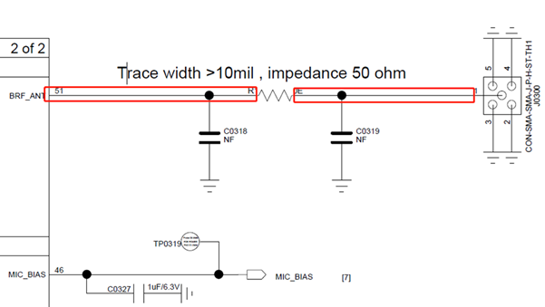  

<div align="center"> Figure 5-17 RF Signal Circuit Schematic </div>  <br> <br> <br>

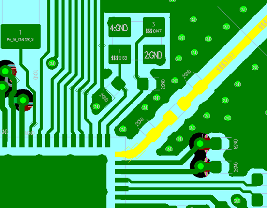  

<div align="center"> Figure 5-18 RF Signal PCB Routing </div>  <br> <br> <br>

### Audio Interface Routing

The AVDD33_AUD pin supplies power to the audio interface. The filter capacitors should be placed close to the corresponding pins, with the capacitor ground pins well-connected to the main ground. The power lines for AVDD33_ANA and AVDD33_AUD should be surrounded by a ground plane and kept away from high-current and strong interference signals. The power lines should be routed in a star configuration to avoid TDD noise in the audio, as shown in Figure 5-19.

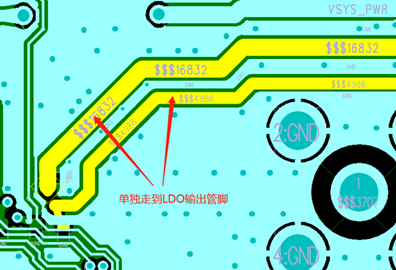  

<div align="center"> Figure 5-19 Audio Circuit Power Reference Routing </div>  <br> <br> <br>

The MIC_BIAS circuit supplies power to the audio interface microphone. The filter capacitors should be placed close to the corresponding pins, with the capacitor ground pins well-connected to the main ground. The AUD_VREF filter capacitor should also be placed close to the pin, as shown in Figure 5-20.

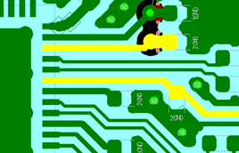

<div align="center"> Figure 5-20  PCB Design of Audio Circuit Power Filtering </div>  <br> <br> <br>

ADCP/ADCN are analog signal inputs. Corresponding circuit components should be placed as close as possible to the corresponding pins. Each P/N pair should be routed as differential lines, with the trace length as short as possible. Differential pairs should be routed with a ground shield, and other interfaces with strong interference signals should be kept away from these traces, as shown in Figure 5-21.

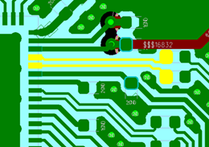  

<div align="center"> Figure 5-21  Reference Routing for Analog Audio Input </div>  <br> <br> <br>

DACP/DACN are analog signal outputs. Corresponding circuit components should be placed as close as possible to the corresponding pins. Each P/N pair should be routed as differential lines, with the trace length as short as possible. The parasitic capacitance of the traces should be less than 10pf, and differential pairs should be routed with a ground shield. Other interfaces with strong interference signals should be kept away from these traces, as shown in Figure 5-22.

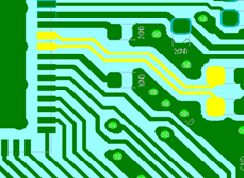  

<div align="center"> Figure 5-22  Reference Routing for Analog Audio Output </div>  <br> <br> <br>

### USB Trace Routing

USB traces must first pass through the ESD device pins and then to the chip. Ensure that the ESD device ground pin is well connected to the main ground. PA17(USB DP)/PA18(USB_DN) should be routed as differential lines, with a 90 ohm differential impedance control, and should be routed with a ground shield, as shown in Figure 5-23. Figure 5-24 shows the component placement reference and PCB trace model for USB signals.

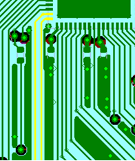  

<div align="center"> Figure 5-23  USB Signal PCB Design </div>  <br> <br> <br>

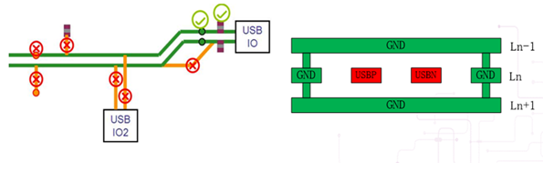  

<div align="center"> Figure 5-24  Component Placement Reference and USB PCB Trace Model </div>  <br> <br> <br>

### SDIO Trace Routing

The SF32LB56xU provides one SDIO interface. All SDIO signals should be routed together, avoiding separate routing. The total trace length should be ≤50mm, and the length difference within the group should be ≤6mm. The SDIO clock signal should be routed with a ground shield, and the DATA and CM signals should also be routed with a ground shield, as shown in Figures 5-25 and 5-26.

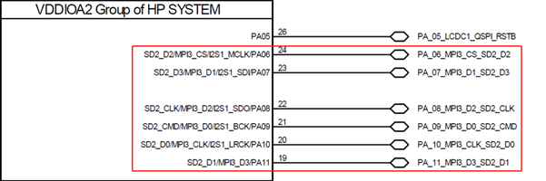  

<div align="center"> Figure 5-25  SDIO Interface Circuit Diagram </div>  <br> <br> <br>

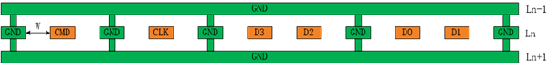  

<div align="center"> Figure 5-26  SDIO PCB Trace Model </div>  <br> <br> <br>

### DC-DC Circuit Trace Routing

The power inductor and filter capacitors for the DC-DC circuit must be placed as close as possible to the chip's pins. The BUCK_LX trace should be as short and wide as possible to ensure a low inductance in the entire DC-DC circuit loop. All DC-DC output filter capacitors should have multiple vias connecting their ground pins to the main ground plane. The BUCK_FB feedback trace should not be too thin and must be greater than 0.25mm. The power inductor area should not have copper pour on the surface layer, and the adjacent layer must be a complete reference ground to avoid other traces passing through the inductor area, as shown in Figure 5-27.

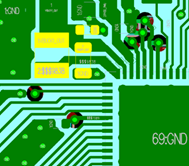  

<div align="center"> Figure 5-27  Key Component PCB Layout for DC-DC Circuit </div>  <br> <br> <br>

### Power Supply Trace Routing

PVDD is the power input pin for the built-in PMU module. The corresponding capacitors must be placed as close as possible to the pin, and the trace width should be as wide as possible, not less than 0.5mm. PVSS is the ground pin for the PMU module and must be connected to the main ground via vias to avoid floating, which can affect the entire PMU performance, as shown in Figure 5-28.

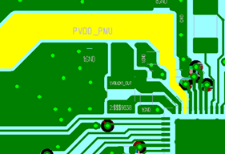  

<div align="center"> Figure 5-28  PVDD Input Trace Routing </div>  <br> <br> <br>

### LDO and IO Power Input Trace Routing

All LDO outputs and IO power input pins should have their filter capacitors placed as close as possible to the corresponding pins. The trace width must meet the input current requirements, and the traces should be as short and wide as possible to reduce power ripple and improve system stability, as shown in Figure 5-29.

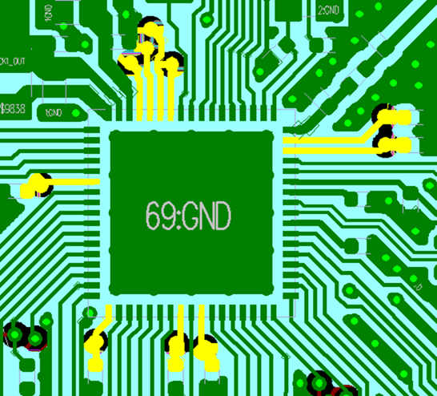  

<div align="center"> Figure 5-29  LDO and IO Input Power Trace Routing </div>  <br> <br> <br>

### Other Interface Trace Routing

Pins configured as GPADC signals must be routed with a ground shield and kept away from other interference signals, such as battery voltage circuits and temperature check circuits, as shown in Figure 5-30.

PBR0-2 pins can be configured as clock output signal networks and must be routed with a ground shield and kept away from other interference signals, such as 32K outputs, as shown in Figure 5-31.

### EMI&ESD Trace Routing

Avoid long-distance routing on the surface layer outside the shield, especially for clock and power signals, which should be routed on inner layers. ESD protection devices must be placed as close as possible to the corresponding connector pins. Signal traces should first pass through the ESD protection device pins to avoid signal branching. The ground pin of the ESD device must be connected to the main ground via vias, ensuring that the ground trace is short and wide to reduce impedance and improve ESD device performance.

### Other

The USB charging line test points must be placed before the TVS diode. The TVS diode for the battery connector should be placed at the front of the platform, and the trace must first pass through the TVS diode before reaching the chip, as shown in Figure 5-30.

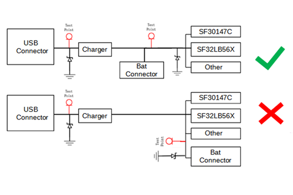  

<div align="center"> Figure 5-30  Power TVS Layout Reference </div>  <br> <br> <br>

The ground pin of the TVS diode should avoid long traces and should be connected directly to the ground, as shown in Figure 5-31.

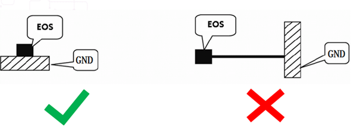  

<div align="center"> Figure 5-31  TVS Trace Reference </div>  <br> <br> <br>

## Q&A

Question 1: Why are the default states of some GPIOs different from the SPEC description when Mode = 1 is started?

Answer: When Mode = 1 is started, it enters download mode, which changes the states of the GPIOs related to the external Flash MPI3.

Question 2: Why might a dead system occur when soldering a battery, and how can it be avoided?

Answer: Poor grounding of the soldering iron can cause surge impacts leading to a system crash. Adding surge and ESD protection to the battery interface and ensuring good grounding of the soldering iron can prevent these issues.

## Revision History

| Version | Date   | Release Notes |
| ------- | ------ | ------------- |
| 0.0.1   | 3/2025 | Draft version |
|         |        |               |
|         |        |               |