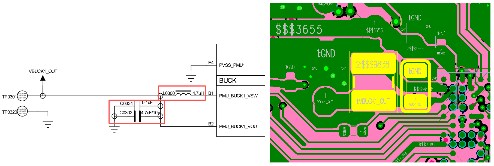

# SF32LB56xV - Hardware Design Guide

## Introduction

The primary purpose of this document is to assist developers in the development of watch solutions based on the SF32LB56xV series of chips. This document focuses on hardware design considerations during the development process, aiming to minimize the workload of developers and shorten the product's time to market.

The SF32LB56xV chip is a highly integrated, high-performance system-on-chip (SoC) MCU designed for ultra-low-power artificial intelligence of things (AIoT) applications. The chip innovatively adopts a big.LITTLE architecture based on the ARM Core-M33 STAR processor, and integrates the industry's highest-performance 2.5D graphics engine, an artificial intelligence neural network accelerator, and Bluetooth Low Energy 5.3. It can be widely used in various applications, including wearable electronic devices, smart mobile terminals, and smart home devices.

The SF32LB56xV chip's processor peripheral resources are as follows:

- 120 GPIOs

- 6x UART

- 7x I2C

- 5x GPTIM

- 4x SPI

- 1x I2S audio interface

- 2x SDIO storage interface

- 1x differential analog audio output

- 1x differential analog audio input

- Supports single/dual/quad data line SPI display interface, DBI 8080, DPI, and serial/parallel JDI display interfaces

- Supports displays with and without GRAM

- Supports SWD and UART for downloading and software debugging

## Packaging

### Packaging Introduction

The packaging information for the SF32LB56xV is shown in Table 2-1.

<div align="center"> Table 2-1  Packaging Information List </div>

```{table}
:align: center
| Package Name | Size            | Pin Pitch | Ball Diameter |
| ------------ | --------------- | --------- | ------------- |
| WBBGA175     | 6.5x6.1x0.94 mm | 0.4 mm    | 0.25 mm       |
```

### WBBGA175 Package

 

<div align="center"> Figure 2-1 SF32LB56xV WBBGA175 Pin Distribution </div>  <br>  <br>  <br>

## Typical Application Schemes

Figure 3-1 is a typical block diagram of a sports watch, which includes display, storage, sensors, vibration motor, and audio input and output.

 

<div align="center"> Figure 3-1 Sports Watch Block Diagram </div>  <br>  <br>  <br>

:::{Note} 
- Big.LITTLE dual CPU architecture, balancing high performance and low power consumption design requirements

- External charging management chip

- Supports GPADC for battery voltage detection

- Power supply uses Buck, LDO, and Load Switch solutions

- Supports 3/4-wire SPI, Dual/Quad data SPI, DBI 8080, DPI, and serial/parallel JDI displays, with a maximum resolution of 1024*1024

- Supports PWM backlight control

- Supports external QSPI interface for Nor Flash storage chips

- Supports external QSPI interface for NAND Flash storage chips

- Supports external SDIO interface for NAND Flash storage chips

- Supports Bluetooth 5.3 communication

- Supports analog audio input

- Supports analog audio output

- Supports I2S audio interface

- Supports PWM vibration motor control

- Supports SPI/I2C interface for accelerometer/magnetometer/gyro sensors

- Supports I2C interface for heart rate/blood oxygen/ECG sensors

- Supports SEGGER J-Link SWD debugging and programming tools

- Supports UART debugging print interface

- Supports Bluetooth HCI debugging interface

- Supports production line multi-device programming

- Supports production line crystal calibration function

- Supports OTA online upgrade function
:::

## Schematic Design Guidelines

### Power Supply

The series of chips includes a PMU unit, and PVDD can support a power input range of 1.71~3.6V. The PMU supports one Buck and multiple LDOs to power the internal circuits of the chip. Refer to Table 4-1 for the detailed connections of the power pins.

#### Processor Power Supply Requirements

SF32LB56xV power specifications:

<div align="center"> Table 4-1  PMU Power Specifications </div>

```{table}
:align: center
| PMU Power Pins  | Minimum Voltage (V) | Typical Voltage (V) | Maximum Voltage (V) | Maximum Current (mA) | Detailed Description                                                  |
| :-------------- | :-----------------: | :-----------------: | :-----------------: | :-----------------: | :-------------------------------------------------------------------- |
| PVDD            |         1.71        |         1.8         |         3.6         |         100         | PVDD power input                                                      |
| BUCK_LX  BUCK_FB|          -          |         1.25        |          -          |         100         | BUCK_LX output, connected to the internal power input of the inductor, and the other end of the inductor, with an external capacitor |
| LDO1_VOUT       |          -          |         1.1         |          -          |          50         | LDO1 output, with an external capacitor                               |
| LDO2_VOUT       |          -          |         0.9         |          -          |          20         | LDO2 output, with an external capacitor                               |
| VDD_RET         |          -          |         0.9         |          -          |           1         | RET LDO output, with an external capacitor                           |
| VDD_RTC         |          -          |         1.1         |          -          |           1         | RTC LDO output, with an external capacitor                           |
| MIC_BIAS        |         1.4         |          -          |         2.8         |          -          | MIC power output                                                      |
| AVDD_BRF        |         1.71        |         1.8         |         3.3         |           1         | RF power input                                                        |
| AVDD33_ANA      |         3.15        |         3.3         |        3.45         |          50         | Analog power + RF PA power input                                      |
| AVDD33_AUD      |         3.15        |         3.3         |        3.45         |          50         | Analog audio power                                                    |
| VDDIOA          |         1.71        |         1.8         |        3.45         |          -          | PA12-PA78 I/O power input                                            |
| VDDIOA2         |         1.71        |         1.8         |        3.45         |          -          | PA0-PA11 I/O power input                                             |
| VDDIOB          |         1.71        |         1.8         |        3.45         |          -          | PB I/O power input                                                    |
| VDDIOSA         |         1.71        |         1.8         |        1.98         |          -          | SIPA power input                                                      |
| VDDIOSB         |         1.71        |         1.8         |        1.98         |          -          | SIPB power input                                                      |
| VDDIOSC         |         1.71        |         1.8         |        1.98         |          -          | SIPC power input                                                      |
```

The recommended values for external capacitors connected to the power pins of the SF32LB56xV series chips are shown in Table 4-2.

<div align="center"> Table 4-2 Capacitor Recommended Values </div>

```{table}
:align: center
| Power Pin       | Capacitor      | Detailed Description                                      |
| --------------- | -------------- | --------------------------------------------------------- |
| PVDD            | 0.1uF + 10uF   | Place at least 2 capacitors, 10uF and 0.1uF, close to the pin. |
| BUCK_LX  BUCK_FB| 0.1uF + 4.7uF  | Place at least 2 capacitors, 4.7uF and 0.1uF, close to the pin. |
| LDO1_VOUT       | 4.7uF          | Place at least 1 capacitor, 4.7uF, close to the pin.     |
| LDO2_VOUT       | 4.7uF          | Place at least 1 capacitor, 4.7uF, close to the pin.     |
| VDD_RET         | 0.47uF         | Place at least 1 capacitor, 0.47uF, close to the pin.     |
| VDD_RTC         | 1uF            | Place at least 1 capacitor, 1uF, close to the pin.       |
| AVDD_BRF        | 4.7uF          | Place at least 1 capacitor, 4.7uF, close to the pin.     |
| AVDD33_ANA      | 4.7uF          | Place at least 1 capacitor, 4.7uF, close to the pin.     |
| AVDD33_AUD      | 4.7uF          | Place at least 1 capacitor, 4.7uF, close to the pin.     |
| MIC_BIAS        | 1uF            | Place at least 1 capacitor, 1uF, close to the pin.       |
| VDDIOA          | 1uF            | Place at least 1 capacitor, 1uF, close to the pin.       |
| VDDIOA2         | 1uF            | Place at least 1 capacitor, 1uF, close to the pin.       |
| VDDIOB          | 1uF            | Place at least 1 capacitor, 1uF, close to the pin.       |
| VDDIOSA         | 0.1uF          | Place at least 1 capacitor, 0.1uF, close to the pin.     |
| VDDIOSB         | 0.1uF          | Place at least 1 capacitor, 0.1uF, close to the pin.     |
| VDDIOSC         | 0.1uF          | Place at least 1 capacitor, 0.1uF, close to the pin.     |
```

#### SiCh PMIC Chip Power Distribution

SF30147C is a highly integrated, efficient, and cost-effective power management chip designed for ultra-low-power wearable products. SF30147C integrates one high-efficiency and low-static-current BUCK, which outputs 1.8V and can provide up to 500mA of drive current. SF30147C also integrates four low-dropout and low-static-current LDOs, which output 2.8~3.3V and can provide up to 100mA of drive current.

SF30147C integrates seven low-static-current, low-on-resistance load switches. Among them, 2 high-voltage load switches are suitable for peripherals directly driven by battery voltage, such as audio amplifiers; 5 low-voltage switches are suitable for peripherals powered by 1.8V.

SF32LB56XV can communicate with SF30147C via the TWI interface. The usage of each power output of SF30147C is shown in Table 4-3. For detailed information about the chip, please refer to the document "DS0002-SF30147C-Chip Technical Specification".

<div align="center"> Table 4-3 SF30147C Power Distribution Table </div>

```{table}
:align: center
| SF30147C  Power Pin | Minimum Voltage(V) | Maximum Voltage(V) | Maximum Current(mA) | Detailed Description                                                     |
| ------------------ | ----------- | ----------- | ------------ | ------------------------------------------------------------ |
| VBUCK              | 1.8         | 1.8         | 500          | 1.8V power input for PVDD, VDDIOA, VDDIOA2, VDDIOB, VDDIOSA, VDDIOSB, VDDIOSC, AVDD_BRF of SF32LB56xV |
| LVSW1              | 1.8         | 1.8         | 100          | 1.8V power input for I2S Class-K PA logic power supply       |
| LVSW2              | 1.8         | 1.8         | 100          | 1.8V power input for G-SENSOR                                  |
| LVSW3              | 1.8         | 1.8         | 150          | 1.8V power input for heart rate                                |
| LVSW4              | 1.8         | 1.8         | 150          | 1.8V power input for LCD                                      |
| LVSW5              | 1.8         | 1.8         | 150          | 1.8V power input for EMMC CORE                                |
| LDO1               | 2.8         | 3.3         | 100          | 3.3V power input for AVDD33_ANA, AVDD33_AUD, VDDIOA2 of SF32LB56xV |
| LDO2               | 2.8         | 3.3         | 100          | 3.3V power input for EMMC or SD NAND                          |
| LDO3               | 2.8         | 3.3         | 100          | 3.3V power input for LCD                                      |
| LDO4               | 2.8         | 3.3         | 100          | 3.3V power input for heart rate                               |
| HVSW1              | 2.8         | 5           | 150          | 3.3V to 5V power input for analog Class-K PA                  |
| HVSW2              | 2.8         | 5           | 150          | 3.3V to 5V power input for GPS                                |
```

#### Power-Up Sequence and Reset

The SF32LB56xV chip PMU integrates POR (Power on reset) and BOR (Brownout reset) functions, as shown in Figure 4-1.

 

<div align="center"> Figure 4-1 Power-Up/Power-Down Sequence Diagram </div>  <br>  <br>  <br>

When the system is powered up, PVDD rises to 1.5V, and the system completes the POR. When PVDD drops to the BOR trigger voltage (configurable between 2.5V and 1.5V), the PMU outputs a reset signal, and the system resets.

#### Typical Power Circuit

It is recommended to use the SF30147C to power the SF32LB56xV and various peripherals. The circuit diagram is shown in Figure 4-2, and specific details are provided in Table 4-1.

 

<div align="center"> Figure 4-2 SF30147C Power Supply Diagram </div>  <br>  <br>  <br>

The SF32LB56xV series of chips includes one BUCK output, as shown in Figure 4-3.

 

<div align="center"> Figure 4-3 Built-in BUCK Circuit Diagram </div>  <br>  <br>  <br>

The SF32LB56xV series of chips includes four LDOs, as shown in Figure 4-4.

 

<div align="center"> Figure 4-4 Built-in LDO Circuit Diagram </div>  <br>  <br>  <br>

#### Processor BUCK Inductor Selection Requirements

:::{important}
**Key Parameters for Power Inductor**

L (Inductance) = 4.7uH ± 20%, DCR (DC Resistance) ≦ 0.4 ohm, Isat (Saturation Current) ≧ 450mA.
:::

#### Battery and Charging Control

A typical smartwatch usually contains a built-in polymer lithium battery pack. The entire power system requires a charging circuit to charge the battery.

A typical charging circuit consists of a protection circuit (EOS, ESD, and OVP protection), a charging management chip, and the battery. In the circuit shown in Figure 4-5, the charging management chip does not have path management functionality, and the system power is directly connected to the battery VBAT. This solution is cost-effective, but the downside is that downstream modules cannot be completely disconnected from VBAT, leading to higher leakage power consumption and potential over-discharge of the battery over long periods of storage.
```

 

<div align="center"> Figure 4-5 Typical Charging Circuit One </div>  <br>  <br>  <br>

As shown in Figure 4-6, the trickle charge current of the charging management chip must be greater than i1+i2 to charge an over-discharged battery. If the trickle charge current is less than i1+i2, it will result in the inability to charge the over-discharged battery.

 

<div align="center"> Figure 4-6 Schematic Diagram of Over-discharged Battery Charging Circuit </div>  <br>  <br>  <br>

In the circuit of Figure 4-7, the charging management chip has a path management function. Since VSYS powers the system and VBAT charges the battery separately, even if the battery is over-discharged, it does not affect the power supply to the downstream system.

 

<div align="center"> Figure 4-7 Typical Charging Circuit Two </div>  <br>  <br>  <br>

### Boot Mode

The SF32LB56xV series chips provide a Mode pin to configure the boot mode. When not in use, it can be left floating. The reference circuit diagram is shown in Figure 4-8:

 

<div align="center"> Figure 4-8 Recommended Circuit Diagram for Mode Pin </div>  <br>  <br>  <br>

:::{attention}
**Mode Pin Definition:**

=1, the system enters download mode at startup and does not enter the user program;
=0, the system checks for the existence of a user program at startup. If it exists, it enters the user program; otherwise, it enters download mode.

**Precautions:**

1. The voltage domain of Mode is the same as VDDIOA;
2. Connect a 10K resistor to the power supply or GND to keep the level stable. It should not be left floating or have toggle interference;
3. A test point for the Mode pin must be left on the production board for program download or crystal calibration. Jumper can be omitted;
4. It is recommended to reserve a jumper for the Mode pin on the test board to facilitate program download in download mode after a program crash.
:::

### Processor Operating Modes and Wake-up Sources

The SF32LB56xV series chips support multiple operating modes for both HCPU and LCPU as listed in Table 4-4.

<div align="center"> Table 4-4 CPU Operating Mode List </div>

```{table}
:align: center
| Operating Mode | CPU   | Peripherals | SRAM                              | IO       | LPTIM | Wake-up Source                                    | Wake-up Time         |
| ------------- | ----- | ----------- | --------------------------------- | -------- | ----- | ------------------------------------------------- | --------------------- |
| Active        | Run   | Run         | Accessible                        | Flippable | Run   | -                                                | -                     |
| WFI/WFE       | Stop  | Run         | Accessible                        | Flippable | Run   | Any interrupt                                     | < 0.5us              |
| DEEPWFI       | Stop  | Run         | Accessible                        | Flippable | Run   | Any interrupt                                     | < 5us                |
| Light sleep   | Stop  | Stop        | Not accessible, fully retained    | Level held | Run   | RTC/GPIO/LPTIM/LPCOMP/cross-system interrupt/Bluetooth | < 100us              |
| Deep sleep    | Stop  | Stop        | Not accessible, fully retained    | Level held | Run   | RTC/GPIO/LPTIM/LPCOMP/cross-system interrupt/Bluetooth | < 300us              |
| Standby       | Reset | Reset       | Not accessible, LP fully retained, HP retains 160KB | Level held | Run   | RTC/Key/LPTIM/cross-system interrupt/Bluetooth   | 1.5ms + recovery     |
| Hibernate rtc | Reset | Reset       | Data not retained                  | High impedance | Reset | RTC/Key                                          | > 2ms                |
| Hibernate pin | Reset | Reset       | Data not retained                  | High impedance | Reset | Key                                              | > 2ms                |
```

As shown in Table 4-5, the entire series of chips supports 14 wake-up interrupt sources, which can wake up the large core or small core CPU.

<div align="center"> Table 4-5 Wake-up Interrupt Source List </div>

```{table}
:align: center
| Interrupt Source | Pin | Detailed Description |
| ---------------- | ---- | -------------------- |
| WKUP_PIN0        | PB32 | Interrupt Signal 0   |
| WKUP_PIN1        | PB33 | Interrupt Signal 1   |
| WKUP_PIN2        | PB34 | Interrupt Signal 2   |
| WKUP_PIN3        | PB35 | Interrupt Signal 3   |
| WKUP_PIN4        | PB36 | Interrupt Signal 4   |
| WKUP_PIN5        | PA50 | Interrupt Signal 5   |
| WKUP_PIN6        | PA51 | Interrupt Signal 6   |
| WKUP_PIN7        | PA52 | Interrupt Signal 7   |
| WKUP_PIN8        | PA53 | Interrupt Signal 8   |
| WKUP_PIN9        | PA54 | Interrupt Signal 9   |
| WKUP_PIN10       | PBR0 | Interrupt Signal 10  |
| WKUP_PIN11       | PBR1 | Interrupt Signal 11  |
| WKUP_PIN12       | PBR2 | Interrupt Signal 12  |
| WKUP_PIN13       | PBR3 | Interrupt Signal 13  |
```

### Clock

The SF32LB56xV series of chips require two external clock sources: a 48MHz main crystal and a 32.768KHz RTC crystal. The specific specifications and selection criteria for the crystals are shown in Table 4-6 and Table 4-7.

:::{important}
**Crystal Key Parameters**

<div align="center"> Table 4-6 Crystal Specification Requirements </div>

```{table}
:align: center
| Crystal | Specification Requirements | Detailed Description |
| ------- | -------------------------- | -------------------- |
| 48MHz   | 7pF≦CL≦12pF (recommended value 8.8pF) △F/F0≦±10ppm ESR≦30 ohms (recommended value 22ohms) | The power consumption of the crystal is related to CL and ESR. The smaller the CL and ESR, the lower the power consumption. For optimal power performance, it is recommended to use materials with relatively smaller CL and ESR values within the required range. Reserve parallel matching capacitors next to the crystal. When CL<12pF, no capacitors need to be soldered. |
| 32.768KHz | CL≦12.5pF (recommended value 7pF) △F/F0≦±20ppm ESR≦80k ohms (recommended value 38Kohms) | The power consumption of the crystal is related to CL and ESR. The smaller the CL and ESR, the lower the power consumption. For optimal power performance, it is recommended to use materials with relatively smaller CL and ESR values within the required range. Reserve parallel matching capacitors next to the crystal. When CL<12.5pF, no capacitors need to be soldered. |
```

**Crystal Recommendations**

<div align="center"> Table 4-7 Recommended Crystal List </div>

```{table}
:align: center
| Model                | Manufacturer | Parameters                                                         |
| -------------------- | ------------ | ------------------------------------------------------------------ |
| E1SB48E001G00E       | Hosonic      | F0 = 48.000000MHz, △F/F0 = -6 ~ 8 ppm, CL = 8.8 pF, ESR = 22 ohms Max, TOPR = -30 ~ 85℃, Package = (2016 metric) |
| ETST00327000LE       | Hosonic      | F0 = 32.768KHz, △F/F0 = -20 ~ 20 ppm, CL = 7 pF, ESR = 70K ohms Max, TOPR = -40 ~ 85℃, Package = (3215 metric) |
| SX20Y048000B31T-8.8  | TKD          | F0 = 48.000000MHz, △F/F0 = -10 ~ 10 ppm, CL = 8.8 pF, ESR = 40 ohms Max, TOPR = -20 ~ 75℃, Package = (2016 metric) |
| SF32K32768D71T01     | TKD          | F0 = 32.768KHz, △F/F0 = -20 ~ 20 ppm, CL = 7 pF, ESR = 70K ohms Max, TOPR = -40 ~ 85℃, Package = (3215 metric) |
```
Note: The ESR of SX20Y048000B31T-8.8 is slightly larger, which will also result in slightly higher static power consumption.
When routing the PCB, at least the second layer GND copper should be removed under the crystal to reduce the parasitic load capacitance on the clock signal.
:::

For detailed material certification information, please refer to:
[SIFLI-MCU-AVL-Certification Table](index)

### RF

The RF PCB routing requirements for the SF32LB56xV series of chips are 50ohms characteristic impedance. If the antenna is properly matched, no additional components are required on the RF path. It is recommended to reserve a π-type matching network for stray filtering. Please refer to the circuit shown in Figure 4-9.

 

<div align="center"> Figure 4-9 RF Circuit Diagram </div>  <br>  <br>  <br>

### How to Connect Peripherals to the Big and Little Core Processors

The SF32LB56xV series of chips have two processor systems internally. The GPIOs of PAx are connected to the HCPU system, and the GPIOs of PBx are connected to the LCPU system. The HCPU can access all peripheral resources of the LCPU, but it is not recommended for the LCPU to access the resources of the HCPU. The HCPU can run at a maximum frequency of 240MHz, providing high-performance computing, graphics processing, and high-resolution/frame-rate display. External memory, display interfaces, and other high-power devices should be connected to the HCPU.

The LCPU typically runs at 48MHz at 0.9V and can run up to 96MHz at 1.1V. It is used to handle the BLE protocol stack and control heart rate and acceleration sensors in low-power modes, as well as manage charging, PMIC, voltage monitoring, and power-on/off.

### Display

The SF32LB56xV series of chips support 3-Line SPI, 4-Line SPI, Dual Data SPI, Quad Data SPI, DBI 8080, DPI, and serial/parallel JDI interfaces. They support 16.7M-colors (RGB888), 262K-colors (RGB666), 65K-colors (RGB565), and 8-color (RGB111) color depth modes. The maximum supported resolution is 1024RGBx1024. The supported LCD driver list is shown in Table 4-8.

<div align="center"> Table 4-8 Supported LCD Driver List </div>

```{table}
:align: center
| Model     | Manufacturer | Resolution | Type   | Interface                                                         |
| -------- | ---------- | ------- | ------ | ------------------------------------------------------------ |
| RM69090  | Raydium    | 368*448 | Amoled | 3-Line SPI, 4-Line  SPI, Dual data SPI,  Quad data SPI, MIPI-DSI |
| RM69330  | Raydium    | 454*454 | Amoled | 3-Line SPI, 4-Line  SPI, Dual data SPI,  Quad data SPI, 8-bits  8080-Series MCU, MIPI-DSI |
| ILI8688E | ILITEK     | 368*448 | Amoled | Quad data SPI, MIPI-DSI                                      |
| SH8601A  | 晟合技术   | 454*454 | Amoled | 3-Line SPI, 4-Line  SPI, Dual data SPI,  Quad data SPI, 8-bits  8080-Series MCU, MIPI-DSI |
| SPD2012  | Solomon    | 356*400 | TFT    | Quad data SPI                                                |
| GC9C01   | Galaxycore | 360*360 | TFT    | Quad data SPI                                                |
| ST77903  | Sitronix   | 400*400 | TFT    | Quad data SPI                                                |
```

#### SPI/QSPI Display Interface

The SF32LB56xV series chips support 3/4-wire SPI and Quad-SPI interfaces to connect to LCD displays, as described in Table 4-9.

<div align="center"> Table 4-9 SPI/QSPI Screen Signal Connection Methods </div>

```{table}
:align: center
| SPI Signal | I/O  | Detailed Description                                                  |
| ------- | ---- | --------------------------------------------------------- |
| CSX     | PA36 | Enable signal                                                  |
| WRX_SCL | PA37 | Clock signal                                                  |
| DCX     | PA39 | Data/command signal in 4-wire SPI mode, Data1 in Quad-SPI mode  |
| SDI_RDX | PA38 | Data input signal in 3/4-wire SPI mode, Data0 in Quad-SPI mode |
| SDO     | PA38 | Data output signal in 3/4-wire SPI mode, connect to SDI_RDX together  |
| D[0]    | PA40 | Data2 in Quad-SPI mode                                    |
| D[1]    | PA41 | Data3 in Quad-SPI mode                                    |
| REST    | PA43 | Reset display signal                                            |
| TE      | PA33 | Tearing effect to MCU frame signal                        |
```

#### MCU8080 Display Interface

The SF32LB56xV series chips support the MCU8080 interface to connect to LCD displays, as shown in Table 4-10.

<div align="center"> Table 4-10 MCU8080 Screen Signal Connection Methods </div>

```{table}
:align: center
| MCU8080 Signal | I/O  | Detailed Description                            |
| :------ | :--- | :---------------------------------- |
| CSX     | PA36 | Chip select                        |
| WRX     | PA37 | Writes strobe signal to write data |
| DCX     | PA39 | Display data / command selection   |
| RDX     | PA38 | Reads strobe signal to write data  |
| D[0]    | PA40 | Data 0                              |
| D[1]    | PA1  | Data 1                              |
| D[2]    | PA28 | Data 2                              |
| D[3]    | PA29 | Data 3                              |
| D[4]    | PA30 | Data 4                              |
| D[5]    | PA31 | Data 5                              |
| D[6]    | PA32 | Data 6                              |
| D[7]    | PA34 | Data 7                              |
| REST    | PA43 | Reset                               |
| TE      | PA33 | Tearing effect to MCU frame signal  |
```

#### DPI Display Interface

The SF32LB56xV series of chips supports the DPI interface to connect to LCD displays, as shown in Table 4-11.

<div align="center"> Table 4-11 DPI Screen Signal Connection Method </div>

```{table}
:align: center
| DPI Signal | I/O  | Detailed Description                               |
| ------- | ---- | -------------------------------------- |
| CLK     | PA45 | Clock signal                               |
| DE      | PA47 | Data enable signal                           |
| HSYNC   | PA44 | Horizontal synchronization signal                             |
| VSYNC   | PA42 | Vertical synchronization signal                             |
| SD      | PA50 | Control to turn off Display                        |
| CM      | PA51 | Switch between Normal Color and Reduce Color Mode |
| R0      | PA14 | Pixel signal                               |
| R1      | PA13 | Pixel signal                               |
| R2      | PA16 | Pixel signal                               |
| R3      | PA15 | Pixel signal                               |
| R4      | PA19 | Pixel signal                               |
| R5      | PA21 | Pixel signal                               |
| R6      | PA23 | Pixel signal                               |
| R7      | PA25 | Pixel signal                               |
| G0      | PA28 | Pixel signal                               |
| G1      | PA30 | Pixel signal                               |
| G2      | PA32 | Pixel signal                               |
| G3      | PA33 | Pixel signal                               |
| G4      | PA34 | Pixel signal                               |
| G5      | PA29 | Pixel signal                               |
| G6      | PA31 | Pixel signal                               |
| G7      | PA35 | Pixel signal                               |
| B0      | PA36 | Pixel signal                               |
| B1      | PA37 | Pixel signal                               |
| B2      | PA38 | Pixel signal                               |
| B3      | PA43 | Pixel signal                               |
| B4      | PA41 | Pixel signal                               |
| B5      | PA39 | Pixel signal                               |
| B6      | PA40 | Pixel signal                               |
| B7      | PA46 | Pixel signal                               |
```

#### JDI Display Interface

The SF32LB56xV series of chips supports both parallel and serial JDI interfaces to connect to LCD displays. The parallel JDI is shown in Table 4-12, and the serial JDI is shown in Table 4-13.

<div align="center"> Table 4-12 Parallel JDI Screen Signal Connection Method </div>

```{table}
:align: center
| JDI Signal      | I/O  | Detailed Description                                                     |
| ------------ | ---- | ------------------------------------------------------------ |
| JDI_VCK      | PA41 | Shift clock for the vertical driver                          |
| JDI_VST      | PA40 | Start signal for the vertical driver                         |
| JDI_XRST     | PA39 | Reset signal for the horizontal and  vertical driver         |
| JDI_HCK      | PA36 | Shift  clock for the horizontal driver                       |
| JDI_HST      | PA38 | Start signal for the horizontal driver                       |
| JDI_ENB      | PA43 | Write enable signal for the pixel memory                     |
| JDI_R1       | PA29 | Red image data (odd pixels)                                  |
| JDI_R2       | PA31 | Red image data (even pixels)                                 |
| JDI_G1       | PA34 | Green image data (odd pixels)                                |
| JDI_G2       | PA32 | Green image data (even pixels)                               |
| JDI_B1       | PA30 | Blue image data (odd pixels)                                 |
| JDI_B2       | PA28 | Blue image data (even pixels)                                |
| JDI_XFRP     | PBR1 | Liquid crystal driving signal  ("On" pixel)                  |
| JDI_VCOM/FRP | PBR2 | Common electrode driving signal/   Liquid crystal driving signal  ("Off" pixel) |
```

<div align="center"> Table 4-13 Serial JDI Display Signal Connections </div>

```{table}
:align: center
| JDI Signal      | Pin | Detailed Description                         |
| ------------ | ---- | -------------------------------- |
| JDI_SCS      | PA39 | Chip Select Signal               |
| JDI_SCLK     | PA41 | Serial Clock Signal              |
| JDI_SO       | PA40 | Serial  Data Output Signal       |
| JDI_DISP     | PA36 | Display  ON/OFF Switching Signal |
| JDI_EXTCOMIN | PA38 | COM Inversion Polarity Input     |
```

#### Touch and Backlight Interface

The SF32LB56xV series of chips support an I2C format touch screen control interface and touch status interrupt input, as well as a single PWM signal to control the enablement and brightness of the backlight power supply, as shown in Table 4-14.

<div align="center"> Table 4-14 Touch and Backlight Control Connections </div>

```{table}
:align: center
| Touch Screen and Backlight Signal | Pin | Detailed Description                   |
| ---------------- | ---- | -------------------------- |
| Interrupt        | PA50 | Touch status interrupt signal (wakeup capable) |
| I2C1_SCL         | PA48 | Touch screen I2C clock signal        |
| I2C1_SDA         | PA49 | Touch screen I2C data signal        |
| BL_PWM           | PA35 | Backlight PWM control signal            |
| Reset            | PA44 | Touch reset signal               |
```

### Storage

#### External Memory for SF32LB56xV

The SF32LB56xV supports SPI Nor/Nand, SD Nand Flash, and eMMC peripherals. The SPI Nor/NAND Flash uses the MPI interface, and the SD NAND Flash uses the SD interface. These types of flash chips are physically pin-compatible. The interface definitions are shown in Tables 4-15 and 4-16. The GPIO power supply pins PA06~PA11 in the table are VDDIOA2, which is independent of the voltage domain of other GPIOs.

The MPI signal definitions are shown in Table 4-15, the SD signal definitions in Table 4-16, and the eMMC signal definitions in Table 4-17.

<div align="center"> Table 4-15 SPI Nor/Nand Flash Signal Connections </div>

```{table}
:align: center
| Flash Signal | I/O Signal | Detailed Description                                    |
| ------------ | ---------- | ------------------------------------------------------- |
| CS#          | PA06       | Chip select, active low.                                |
| SO           | PA07       | Data Input (Data Input Output 1)                        |
| WP#          | PA08       | Write Protect Output (Data Input Output 2)              |
| SI           | PA09       | Data Output (Data Input Output 0)                       |
| SCLK         | PA10       | Serial Clock Output                                     |
| Hold#        | PA11       | Data Output (Data Input Output 3)                       |
```
:::{note}
The Hold# pin of the SPI NAND Flash needs to be pulled up to the power supply of the SPI NAND Flash through a 10K resistor.
:::

<div align="center"> Table 4-16 SD Nand Flash Signal Connections </div>

```{table}
:align: center
| Flash Signal | I/O Signal | Detailed Description |
| ------------ | ---------- | -------------------- |
| SD2_CMD      | PA09       | Command signal       |
| SD2_D1       | PA11       | Data 1              |
| SD2_D0       | PA10       | Data 0              |
| SD2_CLK      | PA08       | Clock signal         |
| SD2_D2       | PA06       | Data 2              |
| SD2_D3       | PA07       | Data 3              |
```

<div align="center"> Table 4-17 eMMC Signal Connections </div>

```{table}
:align: center
| eMMC Signal | I/O Signal | Detailed Description |
| ----------- | ---------- | -------------------- |
| SD1_CMD     | PA27       | Command signal       |
| SD1_CLK     | PA26       | Clock signal         |
| SD1_D0      | PA22       | Data 0              |
| SD1_D1      | PA15       | Data 1              |
| SD1_D2      | PA12       | Data 6              |
| SD1_D3      | PA20       | Data 3              |
| SD1_D4      | PA21       | Data 4              |
| SD1_D5      | PA19       | Data 5              |
| SD1_D6      | PA13       | Data 6              |
| SD1_D7      | PA14       | Data 7              |
```

### Buttons

The PB32 pin of the SF32LB56xV series chips supports the long-press reset function. It is recommended to design PB32 as a button, which supports both short-press power on/off function and long-press reset function. As shown in Figure 4-10, the design uses a high-level effective method, and the long-press reset function requires holding for more than 10 seconds to automatically reset the chip.

The SF32LB56xV series chips support function button input and rotary encoder signal input. The button or rotary encoder signal needs to be pulled up. The button usage is shown in Figure 4-11. It also supports optical tracking sensors, and it is recommended to use the I2C4 interface. The signal connections are shown in Table 4-18.

<div align="center"> Table 4-18 Optical Tracking Sensor Signal Connections </div>

```{table}
:align: center
| I2C Signal | I/O  | Detailed Description                 |
| ---------- | ---- | ----------------------------------- |
| SDA        | PA18 | Optical tracking sensor I2C data signal |
| SCL        | PA17 | Optical tracking sensor I2C clock signal |
```

 

<div align="center"> Figure 4-10 Power On/Off Button Circuit Diagram </div>  <br>  <br>  <br>

 

<div align="center"> Figure 4-11 Function Button or Rotary Encoder Circuit Diagram </div>  <br>  <br>  <br>

:::{note}
For general mechanical rotary encoder switches, the switch does not return to the off state after rotation, so the pull-up resistor should be connected to a power source that can be turned off during standby to prevent leakage.
:::

### Vibration Motor

The SF32LB56xV series chips support multiple PWM outputs, which can be used as drive signals for vibration motors. The recommended circuit is shown in Figure 4-12. If the current drawn by the motor during vibration does not cause system instability, VBAT can also be used directly to power the motor.

 

<div align="center"> Figure 4-12 Vibration Motor Circuit Diagram </div>  <br>  <br>  <br>

:::{important}
If the software enables the `#define BSP PM FREQ SCALING 1` macro to reduce the HCPU clock frequency, the HCPU clock frequency will decrease when the HCPU enters the idle thread, and the PWM frequency of the HCPU's PA port will also change. Therefore, it is recommended to use the PB interface to output the PWM signal.
:::

### Audio Interface

The audio-related interfaces of the SF32LB56xV series chips are shown in Table 4-19. The audio interface signals have the following characteristics:

- Supports one differential ADC input, connected to an external analog MIC, with a coupling capacitor of at least 2.2uF added in between, and the power supply for the analog MIC is connected to the MIC_BIAS power output pin of the chip;
- Supports one differential DAC output, connected to an external analog audio PA. The DAC output traces should be routed as differential lines with proper ground shielding, and the following should be noted: Trace Capacitance < 10pF, Length < 2cm.

<div align="center"> Table 4-19 Audio Signal Connection Methods </div>

```{table}
:align: center
| Audio Signal | I/O  | Detailed Description               |
| ------------ | ---- | ---------------------------------- |
| AU_ADC1P     | ADCP | Differential P or single-ended analog MIC input |
| AU_ADC1N     | ADCN | Differential analog MIC input N or GND |
| AU_DAC1P     | DACP | Differential analog output P        |
| AU_DAC1N     | DACN | Differential analog output N        |
| I2S1_LRCK    | PA71 | I2S2 frame clock                   |
| I2S1_SDI     | PA69 | I2S2 data input                    |
| I2S1_SDO     | PA64 | I2S2 data output                   |
| I2S1_BCK     | PA73 | I2S2 bit clock                     |
```

The recommended circuit for the analog MEMS MIC of the SF32LB56xV series chips is shown in Figure 4-13, the recommended circuit for the single-ended analog ECM MIC is shown in Figure 4-14, and the recommended circuit for the differential analog ECM MIC is shown in Figure 4-15, where AU_ADC1P and AU_ADC1N are connected to the ADC input pins of the SF32LB56xV.

 

<div align="center"> Figure 4-13 Analog MEMS MIC Input Circuit </div>  <br>  <br>  <br>

 

<div align="center"> Figure 4-14 Single-Ended Analog ECM MIC Input Circuit </div>  <br>  <br>  <br>

 

<div align="center"> Figure 4-15 Differential Analog ECM MIC Input Circuit </div>  <br>  <br>  <br>

The recommended circuit for the analog audio output of the SF32LB56xV series chips is shown in Figure 4-16, note that the differential low-pass filter within the dashed line should be placed close to the chip.

 

<div align="center"> Figure 4-16 Analog Audio PA Circuit </div>  <br>  <br>  <br>

The I2S audio PA connection circuit is shown in Figure 4-17, and I2C3 is used to configure the I2S audio PA registers.

 

<div align="center"> Figure 4-17 I2S Audio PA Circuit </div>  <br>  <br>  <br>

### PBR Interface Description

The SF32LB56xV series chips provide 4 PBR interfaces, with the following main features:

- PBR0 changes from 0 to 1 during the power-on stage, used for certain external LSW control, PBR1-PBR3 are all default to output 0;
- PBR0-PBR3 can be used as outputs in both standby and hibernate modes;
- PBR0-PBR3 can output LPTIM signals;
- PBR1-PBR3 can output 32K clock signals;
- PBR0-PBR3 can be configured as inputs for wake-up signal input, and the MCU will not receive interrupts when it wakes up.

### Sensors

The SF32LB56xV series chips support heart rate and accelerometer sensors, etc. In the design, attention should be paid to the I2C, SPI, control interfaces, and interrupt wake-up interfaces of the heart rate and accelerometer sensors. It is recommended to use the LCPU's PB interface. The power supply for the heart rate and accelerometer sensors can be provided by the LVSWx or LDO output of the SF30147C, which can be turned on or off as needed.

### UART and I2C Pin Configuration

The SF32LB56xV series chips support the mapping of UART and I2C functions to any pin. All PA interfaces can be mapped to UART or I2C function pins. All IOs on the PB port, except PB32~36 and PBR0~3, can be mapped to UART or I2C function pins.

### GPTIM Pin Configuration

The SF32LB56xV series chips support the mapping of GPTIM functions to any pin. All PA interfaces can be mapped to GPTIM function pins. All IOs on the PB port, except PB32~36 and PBR0~3, can be mapped to GPTIM function pins.

### Debug and Download Interface

The SF32LB56xV series chips support the Arm® standard SWD debug interface, which can be connected to EDA tools for step-by-step debugging. As shown in Figure 4-18, when connecting to the SEEGER® J-Link® tool, the power supply of the debug tool should be modified to external interface input, and the J-Link tool should be powered by the SF32LB56xV circuit board.

The SF32LB56xV series has one SWD for debug information output, please refer to Table 4-20 for details.

<div align="center"> Table 4-20 Debug Port Connection Method </div>

```{table}
:align: center
| SWD Signal | Pin | Detailed Description      |
| ---------- | ---- | ------------------------- |
| SWCLK      | PB15 | JLINK clock signal        |
| SWDIO      | PB13 | JLINK data signal         |
```

 

<div align="center"> Figure 4-18 Debug Interface Circuit </div>  <br>  <br>  <br>

### Production Programming and Crystal Calibration

Siches Technology provides an offline programmer to complete the production program burning and crystal calibration.

When designing the hardware, please ensure that at least the following test points are reserved: VBAT, GND, VDDIOB, Mode, SWDIO, SWCLK, RXD4, TXD4, PB20 or PB21 or PB25.

For detailed programming and crystal calibration, refer to the "Offline Programmer User Guide.pdf" document, which is included in the development package.

### Schematic and PCB Drawing Checklists

Refer to the "_Schematic checklist_.xlsx" and "_PCB checklist_.xlsx" documents, which are included in the development package.

## PCB Design Guidelines

### PCB Package Design

**Package Dimensions**

The SF32LB56xV chip uses a WBBGA package, with dimensions: 6.5mm x 6.1mm x 0.94mm, and 175 pins; the ball pitch is 0.4mm. The detailed dimensions are shown in Figure 5-1.


<div align="center"> Figure 5-1 WBBGA Package Dimensions </div>  <br> <br> <br>

**Package Shape**

  

<div align="center"> Figure 5-2 WBBGA Package Shape </div>  <br> <br> <br>

**Pad Design**

  

<div align="center"> Figure 5-3 WBBGA Package PCB Pad Design Reference </div>  <br> <br> <br>

**Package PINOUT/BALLMAP**

The WBBGA package PINOUT information for the SF32LB56xV is shown in Figure 5-4.

  

<div align="center"> Figure 5-4 SF32LB56xV Package PINOUT Information </div>  <br> <br> <br>

**Package Substrate**

  

<div align="center"> Figure 5-5 Package Substrate BALL Information </div>  <br> <br> <br>

### PCB Stackup Design

The SF32LB56xV series chip layout supports single and double-sided PCBs. The PCB does not support PTH boards and only supports HDI boards. The recommended stackup is shown in Figure 5-6.

  

<div align="center"> Figure 5-6 Reference Stackup Structure </div>  <br> <br> <br>

### General PCB Design Rules

The general design rules for HDI PCBs are shown in Figure 5-7, with units in mm.

  

<div align="center"> Figure 5-7 General Design Rules </div>  <br> <br> <br>

#### Blind Via Design

The blind via design for the PCB is shown in Figure 5-8, with units in mm.

  

<div align="center"> Figure 5-8 Blind Via Design </div>  <br> <br> <br>

#### Buried Via Design

The buried via design for the PCB is shown in Figure 5-9, with units in mm.

  

<div align="center"> Figure 5-9 Buried Via Design </div>  <br> <br> <br>

### Chip Routing Fanout

The first two rows of balls in the WBBGA package are routed through the surface layer as shown in Figure 5-10, while the other balls are routed through the inner layers as shown in Figure 5-11.

  

<div align="center"> Figure 5-10 Surface Layer Fanout Reference </div>  <br> <br> <br>

  

<div align="center"> Figure 5-11 Inner Layer Fanout Reference </div>  <br> <br> <br>

### Clock Interface Routing

The crystal should be placed inside the shield, with a distance greater than 1mm from the PCB edge. It should be placed as far as possible from high-heat-generating components such as PA, Charge, and PMU circuits, with a distance of more than 5mm to avoid affecting the crystal frequency. The no-layout area around the crystal circuit should be greater than 0.25mm to avoid other metals and components, as shown in Figure 5-12.

  

<div align="center"> Figure 5-12 Crystal Layout Diagram </div>  <br> <br> <br>

The 48MHz crystal trace should be routed on the surface layer with a length controlled between 3-10mm, a line width of 0.075mm, and must be surrounded by a ground plane. The trace should be kept away from VBAT, DC/DC, and high-speed signal lines. The surface layer and adjacent layers below the 48MHz crystal area should be kept clear of other traces, as shown in Figures 5-13, 5-14, and 5-15.

  

<div align="center"> Figure 5-13 48MHz Crystal Schematic </div>  <br> <br> <br>

  

<div align="center"> Figure 5-14 48MHz Crystal Trace Model </div>  <br> <br> <br>

  

<div align="center"> Figure 5-15 48MHz Crystal Trace Reference </div>  <br> <br> <br>

The 32.768KHz crystal trace should be routed on the surface layer with a length controlled to ≤10mm, a line width of 0.075mm, and a parallel trace spacing of ≥0.15mm for 32K_XI/32_XO. The trace must be surrounded by a ground plane. The surface layer and adjacent layers below the 32.768KHz crystal area should be kept clear of other traces, as shown in Figures 5-16, 5-17, and 5-18.

  

<div align="center"> Figure 5-16 32.768KHz Crystal Schematic </div>  <br> <br> <br>


<div align="center"> Figure 5-17 32.768KHz Crystal Trace Model </div>  <br> <br> <br>

  

<div align="center"> Figure 5-18 32.768KHz Crystal Trace Reference </div>  <br> <br> <br>

### RF Interface Trace

The RF matching circuit should be placed as close as possible to the chip end, not close to the antenna end. The filter capacitors for the AVDD_BRF RF power supply should be placed as close as possible to the chip pins, and the capacitor ground pins should be connected directly to the main ground through vias. The schematic and PCB layout of the π network and power circuit are shown in Figures 5-19 and 5-20, respectively.

  

<div align="center"> Figure 5-19 Schematic of π Network and Power Circuit </div>  <br> <br> <br>

  

<div align="center"> Figure 5-20 PCB Layout of π Network and Power Circuit </div>  <br> <br> <br>

It is recommended to route the RF traces on the surface layer to avoid vias that can affect RF performance. The trace width should be greater than 10 mils, and the traces should be surrounded by ground planes to avoid sharp and right angles. Multiple ground vias should be placed along the RF traces, and the RF traces should be impedance-controlled to 50 ohms, as shown in Figures 5-21 and 5-22.

  

<div align="center"> Figure 5-21 Schematic of RF Signal Circuit </div>  <br> <br> <br>

  

<div align="center"> Figure 5-22 PCB Trace of RF Signal </div>  <br> <br> <br>

RF traces must not be routed through areas with DC-DC, VBAT, and high-speed digital signals, such as oscillators, high-frequency clocks, and digital interface signals (I2C, SPI, SDIO, I2S, UART, etc.).

AVSS_RRF, AVSS_TRF, AVSS_TRF2, and AVSS_BB are the ground pins for the RF circuit and must be well-grounded. It is recommended to place blind vias directly on their pads and connect them to the main ground, as shown in Figure 5-23.

  

<div align="center"> Figure 5-23 RF Circuit Ground Trace Reference </div>  <br> <br> <br>

### Audio Interface Trace

AVDD33_AUD is the power supply pin for the audio interface. The filter capacitors should be placed close to the corresponding pins, and their ground pins should be well-connected to the main ground. MIC_BIAS is the power supply circuit for the audio interface microphone, and the corresponding filter capacitors should be placed close to the corresponding pins, with their ground pins well-connected to the main ground. The filter capacitor for AUD_VREF should be placed close to the pin, as shown in Figure 5-24.

  

<div align="center"> Figure 5-24 Audio Circuit Power Trace Reference </div>  <br> <br> <br>

ADCP/ADCN are the analog signal inputs. The corresponding circuit components should be placed as close as possible to the corresponding pins, and each P/N pair should be routed as differential lines. The trace length should be as short as possible, and the differential pairs should be surrounded by ground planes. Other strong interference signals should be kept away from these traces, as shown in Figure 5-25.

  

<div align="center"> Figure 5-25 Reference Trace for Analog Audio Input </div>  <br> <br> <br>

DACP/DACN are the analog signal outputs. The corresponding circuit components should be placed as close as possible to the corresponding pins, and each P/N pair should be routed as differential lines. The trace length should be as short as possible, and the parasitic capacitance should be less than 10pf. The differential pairs should be surrounded by ground planes, and other strong interference signals should be kept away from these traces, as shown in Figure 5-26.

  

<div align="center"> Figure 5-26 Reference Trace for Analog Audio Output </div>  <br> <br> <br>

### USB Interface Trace

USB traces must first pass through the ESD device pins and then to the chip end. The ground pin of the ESD device must be well-connected to the main ground. PA17(USB DP)/PA18(USB_DN) should be routed as differential lines, controlled to 90 ohms differential impedance, and surrounded by ground planes, as shown in Figure 5-27. Figure 5-28 shows the component placement reference and PCB trace model for USB signals.

  

<div align="center"> Figure 5-27 USB Signal PCB Design </div>  <br> <br> <br>

  

<div align="center"> Figure 5-28 Component Placement Reference and USB PCB Trace Model </div>  <br> <br> <br>

### SDIO Interface Trace

The SF32LB56xV supports two SDIO interfaces, SDIO1 and SDIO2. All SDIO signals should be routed together, avoiding separate routing. The total trace length should be ≤50mm, and the length difference within the group should be ≤6mm. The SDIO clock signal should be surrounded by ground planes, and the DATA and CM signals should also be surrounded by ground planes, as shown in Figures 5-29a and 5-29b.

  

<div align="center"> Figure 5-29a SDIO Interface Circuit Diagram </div>  <br> <br> <br>

  

<div align="center"> Figure 5-29b SDIO PCB Trace Model </div>  <br> <br> <br>

### DC-DC Circuit Traces

The power inductor and filter capacitors of the DC-DC circuit must be placed close to the chip's pins. The BUCK_LX trace should be as short and thick as possible to ensure a low inductance loop for the entire DC-DC circuit. All DC-DC output filter capacitors should have multiple vias connecting their ground pins to the main ground plane. The BUCK_FB pin feedback trace must not be too thin and must be greater than 0.25mm. The surface layer of the power inductor area must not be copper-clad, and the adjacent layer must be a complete reference ground to avoid other traces running through the inductor area, as shown in Figure 5-30.

  

<div align="center"> Figure 5-30 DC-DC Key Components PCB Layout </div>  <br> <br> <br>

### Power Supply Traces

PVDD is the power input pin for the built-in PMU module of the chip. The corresponding capacitors must be placed close to the pin, and the traces should be as thick as possible, not less than 0.5mm. PVSS is the ground pin for the PMU module and must be connected to the main ground through vias to avoid floating and affecting the entire PMU performance, as shown in Figure 5-31.

  

<div align="center"> Figure 5-31 PVDD Input Trace </div>  <br> <br> <br>

### LDO and IO Power Input Traces

All LDO outputs and IO power input pins must have their filter capacitors placed close to the corresponding pins. The trace width must meet the input current requirements and should be as short and thick as possible to reduce power ripple and improve system stability, as shown in Figure 5-32.

  

<div align="center"> Figure 5-32 LDO and IO Power Input Traces </div>  <br> <br> <br>

### Other Interface Traces

Pins configured as GPADC signal pins must be surrounded by a ground plane to isolate them from other interference signals, such as battery level circuits and temperature check circuits.

PBR0~3 pins can be configured as clock output signal networks and must be surrounded by a ground plane to isolate them from other interference signals, such as 32K outputs.

### SF32LB56xV Chip Ground Traces

The ground network in the center area of the SF32LB56xV chip must be connected by traces to ensure a sufficient ground plane and connected to the main ground plane through blind vias, as shown in Figures 5-33a and 5-33b.

  

<div align="center"> Figure 5-33a Chip Layers 1-2 Ground Signal </div>  <br> <br> <br>

  

<div align="center"> Figure 5-33b Chip Layers 3-4 Ground Signal </div>  <br> <br> <br>

### EMI&ESD Traces

Avoid long traces on the surface layer outside the shield, especially for clock and power signals, which should be routed on inner layers and not on the surface layer. ESD protection devices must be placed close to the corresponding connector pins. Signal traces should pass through the ESD protection device pins first to avoid signal branching and ensure that the ESD device ground pins are connected to the main ground through vias, with short and thick ground traces to reduce impedance and improve ESD device performance.

### Other

The USB charging line test points must be placed before the TVS diode. The TVS diode for the battery connector must be placed at the front of the platform, and the traces must ensure that they pass through the TVS diode before reaching the chip, as shown in Figure 5-34.

  

<div align="center"> Figure 5-34 Power TVS Layout Reference </div>  <br> <br> <br>

The TVS diode ground pin should avoid long traces and should be connected directly to the ground, as shown in Figure 5-35.

  

<div align="center"> Figure 5-35 TVS Trace Reference </div>  <br> <br> <br>

## Q&A

**Question 1:** Why are the default states of some GPIOs different from the SPEC description when Mode = 1 is started?

**Answer:** When Mode = 1 is started, it enters download mode, which changes the states of the MPI3-related GPIOs connected to the external Flash.

**Question 2:** Why might a soldering iron cause a system hang when soldering a battery, and how can this be avoided?

**Answer:** Poor grounding of the soldering iron can cause a surge that leads to a system hang. Adding surge and ESD protection at the battery interface and ensuring good grounding of the soldering iron can prevent these issues.

## Revision History

| Version | Date   | Release Notes  |
| ------- | ------ | -------------- |
| 0.0.1   | 9/2022 | Draft Version  |
|         |        |                |
|         |        |                |