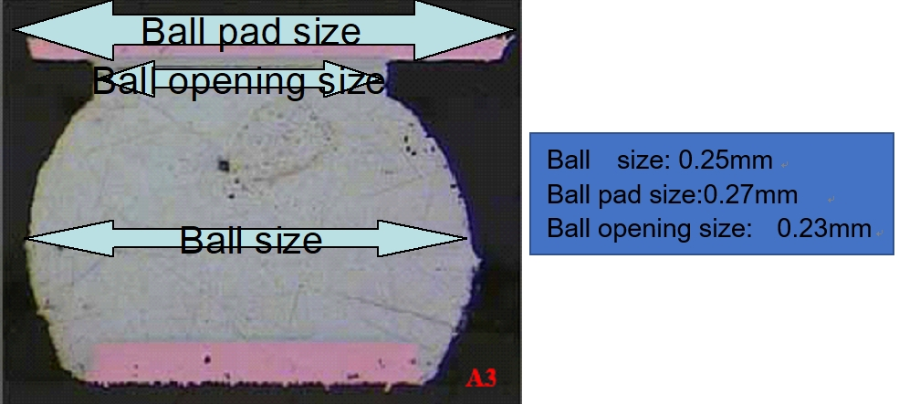

# SF32LB58x - Hardware Design Guide

## Introduction

The primary purpose of this document is to assist hardware engineers in completing the schematic and PCB design for the SF32LB58x series of chips.

The SF32LB58x is a series of highly integrated, high-performance system-on-chip (SoC) MCUs designed for ultra-low-power artificial intelligence of things (AIoT) applications. The processor in the chip achieves a good balance between high computational performance during human-machine interaction and ultra-low active and sleep power consumption during long standby periods. It can be widely used in various applications, including wearable electronic devices such as wristbands, smart mobile terminals, and smart home devices.

The chip integrates a world-class Bluetooth 5.3 transceiver with high receive sensitivity, high transmit power, and low power consumption.

The chip provides a rich set of internal and external storage resources. The fully packaged chip includes multiple QSPI memory interfaces and SD/eMMC interfaces. Depending on the model, the chip's internal SIP has different capacities of NorFlash and PSRAM combinations.

To better support display applications, the chip provides a comprehensive set of display interfaces, including MIPI-DSI, 3/4-wire SPI, Dual/Quad data SPI, DBI 8080, DPI, and parallel/serial JDI.

## Schematic Design Guidelines

### Power Supply

The SF32LB58x series of chips integrate a PMU power unit that supports two BUCK outputs. External inductors and capacitors are required to connect back to the internal power input of the chip. Additionally, three internal LDO power supplies require external capacitors. For the watch design using the SF32LB58x, the SiCheng Technology PMIC chip SF30147C can be used externally. This not only provides power to the SF32LB58x but also to related peripherals.

#### SiCheng PMIC Chip Power Distribution

The SF30147C is a highly integrated, high-efficiency, and cost-effective power management chip designed for ultra-low-power wearable products. The SF30147C integrates four LDOs, each with a wide input and output voltage range and capable of providing up to 100mA of load current. The SF30147C also integrates seven low-leakage, low-on-resistance load switches: two high-voltage load switches suitable for peripherals directly driven by battery voltage, such as audio amplifiers; and five low-voltage switches suitable for peripherals powered by 1.8V. The SF32LB58x uses two GPIO interfaces to simulate TWI signals to control the SF30147C. The usage of each power output of the SF30147C is shown in Table 2.1. For detailed information about the chip, please refer to the document "DS0002-SF30147C - Chip Technical Specification."

<div align="center"> Table 2.1 SF30147C Power Distribution Table </div>

```{table}
:align: center
| SF30147C Power Pin | Minimum Voltage (V) | Maximum Voltage (V) | Maximum Current (mA) | Detailed Description                                                     |
| ------------------ | ------------------- | ------------------- | ------------------- | ------------------------------------------------------------ |
| VBUCK              | 1.8                 | 1.8                 | 500                 | 1.8V power for SF32LB58x's PVDD1, PVDD2, VDDIOA, VDDIOA2, VDDIOB, AVDD_BRF, AVDD18_DSI, etc. |
| LVSW1              | 1.8                 | 1.8                 | 100                 | I2S Class-K PA logic power supply                                   |
| LVSW2              | 1.8                 | 1.8                 | 100                 | 1.8V power for G-SENSOR                                            |
| LVSW3              | 1.8                 | 1.8                 | 150                 | 1.8V power for heart rate                                          |
| LVSW4              | 1.8                 | 1.8                 | 150                 | 1.8V power for LCD                                                  |
| LVSW5              | 1.8                 | 1.8                 | 150                 | 1.8V power for EMMC CORE                                            |
| LDO1               | 2.8                 | 3.3                 | 100                 | 3.3V power for SF32LB58x's AVDD33_USB, AVDD33_ANA, AVDD33_AUD, AVDDIOA2, etc. |
| LDO2               | 2.8                 | 3.3                 | 100                 | 3.3V power for EMMC or SD NAND                                      |
| LDO3               | 2.8                 | 3.3                 | 100                 | 3.3V power for LCD                                                  |
| LDO4               | 2.8                 | 3.3                 | 100                 | 3.3V power for heart rate                                           |
| HVSW1              | 2.8                 | 5                   | 150                 | Analog Class-K PA power supply                                      |
| HVSW2              | 2.8                 | 5                   | 150                 | GPS power supply                                                    |
```

#### SF32LB58x Power Supply Requirements

The internal PMU power specifications for the SF32LB58x series of chips are shown in Table 2.2.

<div align="center"> Table 2.2 PMU Power Specifications </div>

```{table}
:align: center
| PMU Power Pin | Minimum Voltage (V) | Typical Voltage (V) | Maximum Voltage (V) | Maximum Current (mA) | Detailed Description                                                    |
| ------------- | ------------------- | ------------------- | ------------------- | -------------------- | ----------------------------------------------------------------------- |
| PVDD1         | 1.71                | 1.8                 | 3.6                 | 100                  | PVDD1 power input                                                       |
| PVDD2         | 1.71                | 1.8                 | 3.6                 | 50                   | PVDD2 power input                                                       |
| BUCK1_LX BUCK1_FB | -                | 1.25                | -                   | 100                  | BUCK1_LX output, connected to the internal power input 1 of the inductor, the other end of the inductor, and an external capacitor |
| BUCK2_LX BUCK2_FB | -                | 0.9                 | -                   | 50                   | BUCK2_LX output, connected to the internal power input 2 of the inductor, the other end of the inductor, and an external capacitor |
| LDO_VOUT1     | -                  | 1.1                 | -                   | 100                  | LDO output, with an external capacitor                                  |
| VDD_RET       | -                  | 0.9                 | -                   | 1                    | RET LDO output, with an external capacitor                              |
| VDD_RTC       | -                  | 1.1                 | -                   | 1                    | RTC LDO output, with an external capacitor                              |
| MIC_BIAS      | 1.4                | -                   | 2.8                 | -                    | MIC power output                                                        |
```

The power supply specifications for other external power sources of the SF32LB58x series chips are shown in Table 2.3.

<div align="center"> Table 2.3 Other Power Supply Specifications </div>

```{table}
:align: center
| Other Power Pins | Minimum Voltage (V) | Typical Voltage (V) | Maximum Voltage (V) | Maximum Current (mA) | Detailed Description                     |
| ---------------- | ------------------- | ------------------- | ------------------- | -------------------- | ---------------------------------------- |
| AVDD_BRF        | 1.71                | 1.8                 | 3.3                 | 1                    | RF power input                           |
| AVDD18_DSI      | 1.71                | 1.8                 | 2.5                 | 20                   | MIPI DSI power input, leave floating if not used |
| AVDD33_ANA      | 3.15                | 3.3                 | 3.45                | 50                   | Analog power + RF PA power input         |
| AVDD33_AUD      | 3.15                | 3.3                 | 3.45                | 50                   | Analog audio power input                 |
| AVDD33_USB      | 3.15                | 3.3                 | 3.45                | 50                   | USB power input                          |
| VDDIOA          | 1.71                | 1.8                 | 3.45                | -                    | PA12-PA93 I/O power input                |
| VDDIOA2         | 1.71                | 1.8                 | 3.45                | -                    | PA0-PA11 I/O power input                 |
| VDDIOB          | 1.71                | 1.8                 | 3.45                | -                    | PB I/O power input                       |
| VDDIOSA         | 1.71                | 1.8                 | 1.98                | -                    | SIPA power input                         |
| VDDIOSB         | 1.71                | 1.8                 | 1.98                | -                    | SIPB power input                         |
| VDDIOSC         | 1.71                | 1.8                 | 1.98                | -                    | SIPC power input                         |
```

The recommended values for external capacitors connected to the power pins of the SF32LB58x series chips are shown in Table 2.4.

<div align="center"> Table 2.4 Capacitor Recommended Values </div>

```{table}
:align: center
| Power Supply Pin | Capacitor     | Detailed Description                                       |
| ---------------- | ------------- | ---------------------------------------------------------- |
| PVDD1            | 0.1uF + 10uF  | Place at least 2 capacitors, 10uF and 0.1uF, close to the pin. |
| PVDD2            | 0.1uF + 10uF  | Place at least 2 capacitors, 10uF and 0.1uF, close to the pin. |
| BUCK1_LX  BUCK1_FB | 0.1uF + 4.7uF | Place at least 2 capacitors, 4.7uF and 0.1uF, close to the pin. |
| BUCK2_LX  BUCK2_FB | 0.1uF + 4.7uF | Place at least 2 capacitors, 4.7uF and 0.1uF, close to the pin. |
| LDO_VOUT1        | 4.7uF         | Place at least 1 capacitor, 4.7uF, close to the pin.      |
| VDD_RET          | 0.47uF        | Place at least 1 capacitor, 0.47uF, close to the pin.    |
| VDD_RTC          | 0.1uF         | Place at least 1 capacitor, 0.1uF, close to the pin.     |
| AVDD_BRF         | 1uF           | Place at least 1 capacitor, 1uF, close to the pin.        |
| AVDD18_DSI       | 4.7uF         | Place at least 1 capacitor, 4.7uF, close to the pin.     |
| AVDD33_ANA       | 1uF           | Place at least 1 capacitor, 1uF, close to the pin.        |
| AVDD33_AUD       | 4.7uF         | Place at least 1 capacitor, 4.7uF, close to the pin.     |
| AVDD33_USB       | 1uF           | Place at least 1 capacitor, 1uF, close to the pin.       |
| MIC_BIAS         | 1uF           | Place at least 1 capacitor, 1uF, close to the pin.        |
| VDDIOA           | 1uF           | Place at least 1 capacitor, 1uF, close to the pin.       |
| VDDIOA2          | 1uF           | Place at least 1 capacitor, 1uF, close to the pin.       |
| VDDIOB           | 1uF           | Place at least 1 capacitor, 1uF, close to the pin.       |
| VDDIOSA          | 1uF           | Place at least 1 capacitor, 1uF, close to the pin.       |
| VDDIOSB          | 1uF           | Place at least 1 capacitor, 1uF, close to the pin.       |
| VDDIOSC          | 1uF           | Place at least 1 capacitor, 1uF, close to the pin.       |
```

#### Power-Up Sequence and Reset

The SF32LB58x series of chips have internal POR (Power on reset) and BOR (Brownout reset) functions, and also support an external hardware reset signal RSTN, as shown in Figure 2.1.


<div align="center"> Figure 2.1 Power-Up/Down Sequence Diagram </div>  <br> <br> <br>

The RSTN reset signal of the SF32LB58x series of chips needs to be pulled up to the input voltage domain of PVDD1, and a 0.1uF capacitor should be connected to ground to create an RC delay reset, as shown in Figure 2.2.


<div align="center"> Figure 2.2 Reset Circuit Diagram </div>  <br> <br> <br>

#### Typical Power Supply Circuit

The SF32LB58x series of chips can use the PMIC SF30147C from SiChes Technology to supply various power outputs, as shown in Figure 2.3. For specific usage, please refer to Table 2.1.


<div align="center"> Figure 2.3 SF30147C Power Supply Diagram </div>  <br> <br> <br>

The SF32LB58x series of chips have 2 built-in BUCK outputs, as shown in Figure 2.4.


<div align="center"> Figure 2.4 Built-in DCDC Circuit Diagram </div>  <br> <br> <br>

#### BUCK Inductor Selection Requirements

:::{important}

**Key Parameters for Power Inductor**

L (Inductance) = 4.7uH, DCR (DC Resistance) ≦ 0.4 ohm, Isat (Saturation Current) ≧ 500mA

:::

The SF32LB58x series of chips have 3 built-in LDO outputs, as shown in Figure 2.5.

 

<div align="center"> Figure 2.5 Built-in LDO Circuit Diagram </div>  <br> <br> <br>

### Boot Mode

The SF32LB58x series of chips provide a Mode pin to configure the boot mode, as shown in Table 2.5.

<div align="center"> Table 2.5 Mode Pin Description </div>

```{table}
:align: center
| Mode Configuration | Detailed Description                             |
| ------------------ | ------------------------------------------------ |
| High               | After power-on, the chip enters download mode   |
| Low                | After power-on, the chip jumps to the user program area to start |
```

:::{note}
**Notes:**

1. The voltage domain of Mode is the same as VDDIOA;
2. Connect a 10K resistor to the power supply or GND to keep the level stable, and avoid floating or toggle interference;
3. The Mode pin must have a test point on the mass production board for program download or crystal calibration, and no jumper is required;
4. It is recommended to reserve a jumper for the Mode pin on the test board, which is convenient for downloading the program in download mode when the program crashes.
:::

### Clock

The SF32LB58x series of chips require two external clock sources: a 48MHz main crystal and a 32.768KHz RTC crystal. The specific requirements are shown in Table 2.6.

<div align="center"> Table 2.6 Crystal Specification Requirements </div>

```{table}
:align: center
| Crystal | Crystal Specification Requirements | Detailed Description  |
|:-------|:----------------------------------|:---------------------|
| 48MHz  | 7pF≦CL≦12pF (recommended value 8.8pF) △F/F0≦±10ppm ESR≦30 ohms (recommended value 22ohms) | The crystal power consumption is related to CL and ESR. The smaller the CL and ESR, the lower the power consumption. For optimal power performance, it is recommended to use materials with relatively smaller CL and ESR values within the required range. Reserve parallel matching capacitors next to the crystal. When CL<12pF, no capacitors need to be soldered. |
| 32.768KHz | CL≦12.5pF (recommended value 7pF) △F/F0≦±20ppm ESR≦80k ohms (recommended value 38Kohms) | The crystal power consumption is related to CL and ESR. The smaller the CL and ESR, the lower the power consumption. For optimal power performance, it is recommended to use materials with relatively smaller CL and ESR values within the required range. Reserve parallel matching capacitors next to the crystal. When CL<12.5pF, no capacitors need to be soldered. |
```

 **Crystal Recommendations**

<div align="center"> Table 2.7 Certified Crystal Models </div>

```{table}
:align: center
| Model                | Manufacturer | Parameters                                                         |
| -------------------- | ------------ | ------------------------------------------------------------------ |
| E1SB48E001G00E       | Hosonic      | F0 = 48.000000MHz, △F/F0 = -6 ~ 8 ppm, CL = 8.8 pF, ESR = 22 ohms Max, TOPR = -30 ~ 85℃, Package = (2016 metric) |
| ETST00327000LE       | Hosonic      | F0 = 32.768KHz, △F/F0 = -20 ~ 20 ppm, CL = 7 pF, ESR = 70K ohms Max, TOPR = -40 ~ 85℃, Package = (3215 metric) |
| SX20Y048000B31T-8.8  | TKD          | F0 = 48.000000MHz, △F/F0 = -10 ~ 10 ppm, CL = 8.8 pF, ESR = 40 ohms Max, TOPR = -20 ~ 75℃, Package = (2016 metric) |
| SF32K32768D71T01     | TKD          | F0 = 32.768KHz, △F/F0 = -20 ~ 20 ppm, CL = 7 pF, ESR = 70K ohms Max, TOPR = -40 ~ 85℃, Package = (3215 metric) |
```

:::{note}
The ESR of SX20Y048000B31T-8.8 is slightly larger, which will also result in slightly higher static power consumption.

When routing the PCB, at least the second layer GND copper should be removed under the crystal to reduce the parasitic load capacitance on the clock signal.
:::

For detailed material certification information, please refer to:
[SIFLI-MCU-AVL-Certification Table](index)

### RF

The RF of the SF32LB58x series of chips uses on-chip integrated broadband matching filter technology, and only needs to ensure that the RF PCB trace is 50ohms characteristic impedance. It is recommended to reserve a π-type matching network for stray filtering and antenna matching during design. Please refer to the circuit in Figure 2.6.

 

<div align="center"> Figure 2.6 RF Circuit Diagram </div>  <br> <br> <br>

:::{note}
**Note:**

The component values of the matching network need to be determined through testing based on the actual antenna and PCB layout.
:::

### External Memory Interface

The SF32LB58x series of chips support the MPI3 or MPI4 interface for connecting Nor FLASH and SPI Nand FLASH; the SD1 interface for connecting SD NAND and EMMC.

#### QSPI Nand Flash Interface

The default configuration on the SF32LB58x series EVB is to use 'MPI4' to connect the SPI NAND Flash device. The signals used are listed in Table 2.8, and the specific circuit is shown in Figure 2.7.


<div align="center"> Figure 2.7 SPI Nand Flash Connection Reference Circuit </div>  <br> <br> <br>

<div align="center"> Table 2.8 MPI4 Signal Connections </div>

```{table}
:align: center
| Flash Signal | I/O Signal (MPI4) | Detailed Description                                    |
| ------------ | ----------------- | -------------------------------------------------------- |
| CS#          | PA10              | Chip select, active low.                                 |
| SO           | PA04              | Data Input (Data Input Output 1)                         |
| WP#          | PA01              | Write Protect Output (Data Input Output 2)               |
| SI           | PA05              | Data Output (Data Input Output 0)                       |
| SCLK         | PA09              | Serial Clock Output                                      |
| Hold#        | PA06              | Data Output (Data Input Output 3)                       |
```

:::{note}
**Note:**

1. If the production line needs to download the program to the external FLASH, the external FLASH power control pin PA43 must be set high in the download tool software to turn on the power of the external FLASH.

2. The Hold# pin of the SPI NAND Flash must be pulled up to the power supply of the SPI NAND Flash through a 10K resistor.
:::

#### SDIO eMMC/Micro SD Interface

The SF32LB58x series of chips support 2 SDIO interfaces. The EVB board defaults to connecting SD1 to eMMC or SD NAND, and SD2 to an SD card or Wi-Fi chip. Please refer to Figures 2.8, 2.9, and 2.10 for the circuits.

The SD1 interface uses a total of 12 GPIOs (PA00-PA11), with a power domain of VDDIOA2, supporting both 1.8V and 3.3V power supplies. The input voltage can be set according to the interface voltage level of the external device. It is recommended to use a 1.8V interface voltage for SPI NAND FLASH and eMMC. Since the SD NAND FLASH only supports a 3.3V interface voltage, VDDIOA2 should be connected to a 3.3V voltage.

  

<div align="center"> Figure 2.8 EMMC Connection Reference Circuit </div>  <br> <br> <br>

 

<div align="center"> Figure 2.9 SD NAND Connection Reference Circuit </div>  <br> <br> <br>

  

<div align="center"> Figure 2.10 SD Card Connection Reference Circuit </div>  <br> <br> <br>

The SD1 and SD2 signal connections for the SF32LB58x series of chips are shown in Tables 2.9 and 2.10.

<div align="center"> Table 2.9 SD1 Signal Connections </div>

```{table}
:align: center
| SD1 Signal | I/O Signal | Detailed Description |
| ---------- | ---------- | -------------------- |
| SD1_D7     | PA00       | Data 7               |
| SD1_D2     | PA01       | Data 6               |
| SD1_D5     | PA03       | Data 5               |
| SD1_D1     | PA04       | Data 1               |
| SD1_D0     | PA05       | Data 0               |
| SD1_D3     | PA06       | Data 3               |
| SD1_D4     | PA07       | Data 4               |
| SD1_D6     | PA08       | Data 6               |
| SD1_CLK    | PA09       | Clock Signal         |
| SD1_CMD    | PA10       | Command Signal       |
```

<div align="center"> Table 2.10 SD2 Signal Connections </div>

```{table}
:align: center 
| SD2 Signal | I/O Signal | Detailed Description |
| ---------- | ---------- | -------------------- |
| SD2_CMD    | PA70       | Command Signal       |
| SD2_D1     | PA75       | Data 1               |
| SD2_D0     | PA76       | Data 0               |
| SD2_CLK    | PA77       | Clock Signal         |
| SD2_D2     | PA79       | Data 2               |
| SD2_D3     | PA81       | Data 3               |
```

### Display

#### MIPI DSI Display Interface

The SF32LB58x series of chips support a 2-lane MIPI DSI display interface, as shown in Table 2.11.

<div align="center"> Table 2.11 MIPI-DSI Signal Connections </div>

```{table}
:align: center 
| MIPI DSI signal | I/O        | Description                        |
| --------------- | ---------- | ---------------------------------- |
| CLKP            | DSI_CLKP   | MIPI clock signal+                 |
| CLKN            | DSI_CLKN   | MIPI clock signal-                 |
| D0P             | DSI_D0P    | MIPI data channel 0+               |
| D0N             | DSI_D0N    | MIPI data channel 0-               |
| D1P             | DSI_D1P    | MIPI data channel 1+               |
| D1N             | DSI_D1N    | MIPI data channel 1-               |
| -               | AVDD18_DSI | MIPI power input                   |
| -               | DSI_REXT   | External 10K resistor to ground    |
| -               | AVSS_DSI   | Ground                             |
| TE              | PB2        | Tearing effect to MCU frame signal |
| RESET           | PB5        | Reset display signal               |
```

#### SPI/QSPI Display Interface

The SF32LB58x series of chips support 3/4-wire SPI and Quad-SPI interfaces to connect to LCD displays. The large core uses LCDC1 on PA, and the small core uses LCDC2 on PB, as shown in Table 2.12.

<div align="center"> Table 2.12 SPI/QSPI Signal Connections </div>

```{table}
:align: center 
| SPI signal | I/O (LCDC1) | I/O (LCDC2) | Detailed Description                                                  |
| ---------- | ----------- | ----------- | --------------------------------------------------------------------- |
| CSX        | PA44        | PB08        | Enable signal                                                         |
| WRX_SCL    | PA46        | PB10        | Clock signal                                                          |
| DCX        | PA48        | PB03        | Data/command signal in 4-wire SPI mode, Data1 in Quad-SPI mode         |
| SDI_RDX    | PA50        | PB09        | Data input signal in 3/4-wire SPI mode, Data0 in Quad-SPI mode        |
| SDO        | PA50        | PB09        | Data output signal in 3/4-wire SPI mode, please connect to SDI_RDX    |
| D[0]       | PA47        | PB04        | Data2 in Quad-SPI mode                                               |
| D[1]       | PA45        | PB06        | Data3 in Quad-SPI mode                                               |
| REST       | PA74        | PB05        | Reset display signal                                                 |
| TE         | PA43        | PB02        | Tearing effect to MCU frame signal                                   |
```

#### MCU8080 Display Interface

The SF32LB58x series of chips support the MCU8080 interface to connect to LCD displays, as shown in Table 2.13.

<div align="center"> Table 2.13 MCU8080 Screen Signal Connections </div>

```{table}
:align: center 
| MCU8080 Signal | I/O  | Detailed Description                            |
| -------------- | ---- | ----------------------------------------------- |
| CSX            | PA44 | Chip select                                    |
| WRX            | PA46 | Writes strobe signal to write data             |
| DCX            | PA48 | Display data / command selection               |
| RDX            | PA50 | Reads strobe signal to write data              |
| D[0]           | PA47 | Data 0                                         |
| D[1]           | PA45 | Data 1                                         |
| D[2]           | PA26 | Data 2                                         |
| D[3]           | PA27 | Data 3                                         |
| D[4]           | PA42 | Data 4                                         |
| D[5]           | PA51 | Data 5                                         |
| D[6]           | PA52 | Data 6                                         |
| D[7]           | PA58 | Data 7                                         |
| REST           | PA24 | Reset                                          |
| TE             | PA43 | Tearing effect to MCU frame signal            |
```

#### DPI Display Interface

The SF32LB58x series of chips support the DPI interface to connect to LCD displays, as shown in Table 2.14.

<div align="center"> Table 2.14 DPI Screen Signal Connections </div>

```{table}
:align: center
| DPI Signal | I/O  | Detailed Description                               |
| ---------- | ---- | -------------------------------------------------- |
| CLK        | PA12 | Clock signal                                       |
| DE         | PA13 | Data enable signal                                 |
| HSYNC      | PA14 | Horizontal synchronization signal                 |
| VSYNC      | PA15 | Vertical synchronization signal                   |
| SD         | PA18 | Control to turn off Display                        |
| CM         | PA19 | Switch between Normal Color and Reduce Color Mode  |
| R0         | PA22 | Pixel signal                                       |
| R1         | PA23 | Pixel signal                                       |
| R2         | PA24 | Pixel signal                                       |
| R3         | PA25 | Pixel signal                                       |
| R4         | PA26 | Pixel signal                                       |
| R5         | PA27 | Pixel signal                                       |
| R6         | PA43 | Pixel signal                                       |
| R7         | PA44 | Pixel signal                                       |
| G0         | PA45 | Pixel signal                                       |
| G1         | PA46 | Pixel signal                                       |
| G2         | PA47 | Pixel signal                                       |
| G3         | PA48 | Pixel signal                                       |
| G4         | PA50 | Pixel signal                                       |
| G5         | PA53 | Pixel signal                                       |
| G6         | PA54 | Pixel signal                                       |
| G7         | PA55 | Pixel signal                                       |
| B0         | PA56 | Pixel signal                                       |
| B1         | PA57 | Pixel signal                                       |
| B2         | PA58 | Pixel signal                                       |
| B3         | PA61 | Pixel signal                                       |
| B4         | PA62 | Pixel signal                                       |
| B5         | PA63 | Pixel signal                                       |
| B6         | PA65 | Pixel signal                                       |
| B7         | PA67 | Pixel signal                                       |
```

#### JDI Display Interface

The SF32LB58x series of chips supports both parallel and serial JDI interfaces to connect to LCD displays, supporting the reuse of signals corresponding to LCDC1 on PA or LCDC2 on PB. It is recommended to use the LCDC2 on PB, as shown in Table 2.15 and Table 2.16.

<div align="center"> Table 2.15 Parallel JDI Screen Signal Connection Method </div>

```{table}
:align: center
| JDI Signal | I/O (LCDC1) | I/O (LCDC2) | Detailed Description                                                     |
| ------------ | ------------ | ------------ | ------------------------------------------------------------ |
| JDI_VCK      | PA19         | PB15         | Shift clock for the vertical driver                          |
| JDI_VST      | PA22         | PB19         | Start signal for the vertical driver                         |
| JDI_XRST     | PA25         | PB16         | Reset signal for the horizontal and  vertical driver         |
| JDI_HCK      | PA43         | PB05         | Shift clock for the  horizontal driver                       |
| JDI_HST      | PA44         | PB10         | Start signal for the horizontal driver                       |
| JDI_ENB      | PA45         | PB12         | Write enable signal for the pixel memory                     |
| JDI_R1       | PA46         | PB09         | Red image data (odd pixels)                                  |
| JDI_R2       | PA47         | PB06         | Red image data (even pixels)                                 |
| JDI_G1       | PA48         | PB08         | Green image data (odd pixels)                                |
| JDI_G2       | PA50         | PB04         | Green image data (even pixels)                               |
| JDI_B1       | PA65         | PB02         | Blue image data (odd pixels)                                 |
| JDI_B2       | PA67         | PB03         | Blue image data (even pixels)                                |
| JDI_XFRP     | PBR1         | PBR1         | Liquid crystal driving signal  ("On" pixel)                  |
| JDI_VCOM/FRP | PBR2         | PBR2         | Common electrode driving signal/   Liquid crystal driving signal  ("Off" pixel) |
```

<div align="center"> Table 2.16 Serial JDI Screen Signal Connection Method </div>

```{table}
:align: center
| JDI Signal | I/O (LCDC1) | I/O  (LCDC2) | Detailed Description                         |
| ------------ | ------------ | -------------- | -------------------------------- |
| JDI_SCS      | PA82         | PB03           | Chip Select Signal               |
| JDI_SCLK     | PA84         | PB02           | Serial Clock Signal              |
| JDI_SO       | PA86         | PB06           | Serial Data Output Signal        |
| JDI_DISP     | PA90         | PB04           | Display ON/OFF Switching  Signal |
| JDI_EXTCOMIN | PA91         | PB05           | COM Inversion Polarity Input     |
```

### Touch and Backlight Interfaces

The SF32LB58x series of chips supports an I2C format touch screen control interface and touch status interrupt input, and also supports one PWM signal to control the enable and brightness of the backlight power chip, as shown in Table 2.17.

<div align="center"> Table 2.17 Touch and Backlight Control Connection Method </div>

```{table}
:align: center
| Touchscreen and Backlight Signals | I/O  | Detailed Description                   |
| --------------------------------- | ---- | --------------------------------------- |
| Interrupt                         | PA69 | Touch status interrupt signal (wake-up) |
| I2C1_SCL                          | PA17 | Touchscreen I2C clock signal            |
| I2C1_SDA                          | PA16 | Touchscreen I2C data signal             |
| BL_PWM                            | PB44 | Backlight PWM control signal            |
| Reset                             | PA15 | Touch reset signal                      |
| Power Enable                      | PA12 | Touchscreen power enable signal         |
```

### Debug and Download Interface

The SF32LB58x series of chips support the Arm® standard SWD debug interface, which can be connected to EDA tools for step-by-step debugging. As shown in Figure 2.11, when connecting to the SEEGER® J-Link® tool, the power supply of the debug tool needs to be modified to external interface input, and the J-Link tool is powered by the SF32LB58x circuit board.

The SF32LB58x has one SWD and six UART interfaces available for debugging information output. For more details, refer to Table 2.18.


<div align="center"> Table 2.18 Debug Port Connection Methods </div>

```{table}
:align: center
| UART Signal | I/O  | Detailed Description                       |
| ----------- | ---- | ------------------------------------------ |
| TXD1        | PA31 | UART1 RXD signal, HCPU default print port  |
| RXD1        | PA32 | UART1 TXD signal, HCPU default print port  |
| TXD2        | PA28 | UART2 RXD signal                           |
| RXD2        | PA29 | UART2 TXD signal                           |
| TXD3        | PA21 | UART3 RXD signal                           |
| RXD3        | PA20 | UART3 TXD signal                           |
| TXD4        | PB37 | UART4 RXD signal, LCPU default print port  |
| RXD4        | PB36 | UART4 TXD signal, LCPU default print port  |
| TXD5        | PB18 | UART5 RXD signal                           |
| RXD5        | PB17 | UART5 TXD signal                           |
| TXD6        | PB14 | UART6 RXD signal                           |
| RXD6        | PB13 | UART6 TXD signal                           |
| SWCLK       | PB07 | JLINK clock signal                         |
| SWDIO       | PB11 | JLINK data signal                          |
```

:::{note}
**Note**

The RXD signal of UARTx cannot be left floating. It should be set to internal pull-up during software initialization.
:::
 
 

<div align="center"> Figure 2.11 SWD Debug Interface Schematic </div>  <br> <br> <br> 


### Key Interface

#### Power On/Off and Long Press Reset Key

For the SF32LB58x series of chips, it is recommended to use PB54 for the power on/off signal. This allows the short press power on/off function and the long press reset function to be combined into a single key. As shown in Figure 2-12, the design uses a high-level effective method. The long press reset function requires a press of more than 10 seconds for the chip to automatically reset.

  

<div align="center"> Figure 2.12 Power On/Off Key Schematic </div>  <br> <br> <br>


#### Function Key or Knob

The SF32LB58x series of chips support function key input and knob signal input. The key or knob signal needs to be pulled up. The key usage is shown in Figure 2.13. It also supports optical tracking sensors, and it is recommended to use the I2C4 interface. The signal connections are shown in Table 2.19.


<div align="center"> Table 2.19 Optical Tracking Sensor Signals </div>

```{table}
:align: center
| I2C Signal | I/O  | Detailed Description                 |
| ---------- | ---- | ------------------------------------ |
| INT        | PA58 | Optical tracking sensor interrupt signal input |
| SDA        | PA59 | Optical tracking sensor I2C data signal |
| SCL        | PA60 | Optical tracking sensor I2C clock signal |
```


  

<div align="center"> Figure 2.13 Function Key or Knob Schematic </div>  <br> <br> <br>


### Vibration Motor Interface

The SF32LB58x series of chips support multiple PWM outputs, which can be used as drive signals for vibration motors. The recommended circuit is shown in Figure 2.14.


  

<div align="center"> Figure 2.14 Vibration Motor Schematic </div>  <br> <br> <br>
 
:::{important}
If the macro definition `#define BSP PM FREQ SCALING 1` for HCPU frequency scaling is enabled in the software, the main frequency of the HCPU will decrease when it enters the idle thread, and the PWM frequency of the HCPU's PA port will also change. Therefore, it is recommended to use the PB port to output the PWM signal.
:::

### PBR Interface Description

The SF32LB58x series of chips provide 6 PBR interfaces, with the following main features:

1. PBR0 changes from 0 to 1 during the power-on phase, which can be used for certain external LSW control. PBR1 to PBR5 are all default to output 0;

2. PBR0 to PBR5 can be used for output whether in standby or hibernate mode;

3. PBR0-PBR5 can output LPTIM signals;

4. PBR0-PBR5 can output 32K clock signals;

5. PBR0-PBR3 can be configured as inputs to serve as wake-up signal inputs. When the MCU wakes up, it does not receive interrupts.

### Wake-up Interrupt Sources

The SF32LB58x series of chips support wake-up functionality for all GPIOs in light/deep sleep mode. In standby and Hibernate mode, 16 wake-up interrupt sources are supported, as shown in Table 2.20, with 6 interrupt sources on PA and 10 interrupt sources on PB.

<div align="center"> Table 2.20 Interrupt Source Connections </div>

```{table}
:align: center
| Interrupt Source | I/O  | Detailed Description |
| ---------------- | ---- | -------------------- |
| WKUP_PIN0        | PB54 | Interrupt Signal 0  |
| WKUP_PIN1        | PB55 | Interrupt Signal 1  |
| WKUP_PIN2        | PB56 | Interrupt Signal 2  |
| WKUP_PIN3        | PB57 | Interrupt Signal 3  |
| WKUP_PIN4        | PB58 | Interrupt Signal 4  |
| WKUP_PIN5        | PB59 | Interrupt Signal 5  |
| WKUP_PIN6        | PA64 | Interrupt Signal 6  |
| WKUP_PIN7        | PA65 | Interrupt Signal 7  |
| WKUP_PIN8        | PA66 | Interrupt Signal 8  |
| WKUP_PIN9        | PA67 | Interrupt Signal 9  |
| WKUP_PIN10       | PA68 | Interrupt Signal 10 |
| WKUP_PIN11       | PA69 | Interrupt Signal 11 |
| WKUP_PIN12       | PBR0 | Interrupt Signal 12 |
| WKUP_PIN13       | PBR1 | Interrupt Signal 13 |
| WKUP_PIN14       | PBR2 | Interrupt Signal 14 |
| WKUP_PIN15       | PBR3 | Interrupt Signal 15 |
```

### Audio Interface

The SF32LB58x series of chips have various audio-related interfaces, as shown in Table 2.21. The audio interface signals have the following characteristics:

1. Support for 3 I2S groups, where I2S1 can only be used as an input, and I2S2 and I2S3 support both input and output. The 3 I2S groups only support Master mode and do not support Slave mode;
2. I2S1 is recommended for I2S MIC input;
3. I2S2 is recommended for audio DAC;
4. I2S3 is recommended for audio Codec;
5. Support for two PDM MIC inputs;
6. Support for two analog MIC inputs, with a coupling capacitor of at least 2.2uF required. The power supply for the analog MIC uses the MIC_BIAS of the SF32LB58x;
7. Support for external analog audio PA. The two DAC output traces should be routed as differential lines with proper ground shielding. Note: Trace Capacitance < 10pF, Length < 2cm.
8. Support for stereo analog headphone input.

<div align="center"> Table 2.21 Audio Signal Connections </div>

```{table}
:align: center
| Audio Signal | I/O  | Detailed Description     |
| ------------ | ---- | ------------------------ |
| I2S1_LRCK    | PA14 | I2S1 Frame Clock         |
| I2S1_SDI     | PA18 | I2S1 Data Input          |
| I2S1_BCK     | PA23 | I2S1 Bit Clock           |
| I2S2_LRCK    | PA84 | I2S2 Frame Clock         |
| I2S2_SDI     | PA86 | I2S2 Data Input          |
| I2S2_SDO     | PA82 | I2S2 Data Output         |
| I2S2_BCK     | PA91 | I2S2 Bit Clock           |
| I2S3_LRCK    | PB31 | I2S3 Frame Clock         |
| I2S3_SDI     | PB27 | I2S3 Data Input          |
| I2S3_SDO     | PB24 | I2S3 Data Output         |
| I2S3_BCK     | PB30 | I2S3 Bit Clock           |
| I2S3_MCLK    | PB34 | I2S3 Master Clock        |
| PDM1_CLK     | PA23 | PDM1 Clock               |
| PDM1_DATA    | PA18 | PDM1 Data                |
| PDM2_CLK     | PA25 | PDM2 Clock               |
| PDM2_DATA    | PA22 | PDM2 Data                |
| AU_ADC1P     | ADC1P | Analog Input 1P          |
| AU_ADC1N     | ADC1N | Analog Input 1N          |
| AU_ADC2P     | ADC2P | Analog Input 2P          |
| AU_ADC2N     | ADC2N | Analog Input 2N          |
| AU_DAC1P     | DAC1P | Analog Output 1P         |
| AU_DAC1N     | DAC1N | Analog Output 1N         |
| AU_DAC2P     | DAC2P | Analog Output 2P         |
| AU_DAC2N     | DAC2N | Analog Output 2N         |
```

The SF32LB58x supports single-ended and differential input for analog MICs, with a 2.2uF coupling capacitor required. The differential input is shown in Figure 2.15, and the single-ended to differential input is shown in Figure 2.16. AU_ADC1P, AU_ADC1N, AU_ADC2P, and AU_ADC2N are connected to the SF32LB58x, while AU_ADC1P_IN and AU_ADC2P_IN are the signals for analog MIC or headphone audio input.

 
  

<div align="center"> Figure 2.15 Differential Analog Audio Input Circuit Diagram </div>  <br> <br> <br>

 
  

<div align="center"> Figure 2.16 Single-Ended Analog Audio Input Circuit Diagram </div>  <br> <br> <br>

The analog audio output circuit diagram for the SF32LB58x is shown in Figure 2.17. AU_DAC1P, AU_DAC1N, AU_DAC2P, and AU_DAC2N are the output signals from the SF32LB58x. HP_DAC1P_OUT, HP_DAC1N_OUT, HP_DAC2P_OUT, and HP_DAC2N_OUT are connected to the stereo headphone PA input pins, and SPK_DAC1P_OUT and SPK_DAC1N_OUT are connected to the input pins of the analog audio PA.

 
  

<div align="center"> Figure 2.17 Analog Audio Output Circuit Diagram </div>  <br> <br> <br>

The circuit diagram for the analog MIC input connection is shown in Figure 2.18.

 
  

<div align="center"> Figure 2.18 Analog MIC Input Connection Circuit Diagram </div>  <br> <br> <br>

  

<div align="center"> Figure 2.18 Analog MIC Circuit Diagram </div>  <br> <br> <br>

 

The stereo headphone connection circuit diagram is shown in Figure 2.19.

 
  

<div align="center"> Figure 2.19 Stereo Headphone Circuit Diagram </div>  <br> <br> <br>

 
The analog audio PA connection circuit diagram is shown in Figure 2.20, which uses I2C3 to configure the registers of the analog audio PA.

 
  

<div align="center"> Figure 2.20 Analog Audio PA Circuit Diagram </div>  <br> <br> <br>


The I2S audio PA connection circuit diagram is shown in Figure 2.21, which uses I2C3 to configure the registers of the I2S audio PA.

 
  

<div align="center"> Figure 2.21 I2S Audio PA Circuit Diagram </div>  <br> <br> <br>
 

### USB Interface

The SF32LB58x series chip supports USB2.0 HS, and supports both HOST and Device modes. TVS diodes need to be connected in parallel to the USB DP and DM lines and grounded, with a junction capacitance requirement of less than 5pF. Additionally, the DP and DM PCB traces should be impedance controlled to 90 ohms differential. The USB interface connection diagram is shown in Figure 2.22.

  

<div align="center"> Figure 2.22 USB Interface Circuit Diagram </div>  <br> <br> <br>


## PCB Design Guidelines

### PCB Package Design

#### Package Dimensions

The SF32LB58x series chip is packaged in BGA256, with dimensions of 8.5mm x 6.5mm x 0.94mm and a pitch of 0.4mm. The detailed dimensions are shown in Figure 3.1.

 
  

<div align="center"> Figure 3.1 BGA256 Package Dimensions </div>  <br> <br> <br> 
 

#### Package Shape

The package shape is shown in Figure 3.2.


  

<div align="center"> Figure 3.2 Package Shape </div>  <br> <br> <br> 


#### Pad Design

The PCB pad design information is shown in Figure 3.3.


   

<div align="center"> Figure 3.3 PCB Pad Design Reference </div>  <br> <br> <br>  


#### Package BALLMAP

 
The package BALLMAP information is shown in Figure 3.4.

  

<div align="center"> Figure 3.4 Package BALLMAP Information </div>  <br> <br> <br> 


#### Package Substrate


The package substrate BALL information is shown in Figure 3.5.
​       
  

<div align="center"> Figure 3.5 Package Substrate BALL Information </div>  <br> <br> <br>


### PCB Layer Stack Design

The SF32LB58x series chip layout supports single and double-sided designs, and the PCB only supports HDI boards, not PTH boards. It is recommended to use 6HDI-2, and the recommended stack-up structure is shown in Figure 3.6.

 
  

<div align="center"> Figure 3.6 Reference Stack-up Structure </div>  <br> <br> <br>


### General PCB Design Rules

The general PCB design rules are shown in Figure 3.7, with units in mm.

  

<div align="center"> Figure 3.7 General Design Rules </div>  <br> <br> <br> 


#### Blind Via Design

The PCB blind via design is shown in Figures 3.8 and 3.9, with units in mm.

 
  

<div align="center"> Figure 3.8 1-2 Blind Via Design </div>  <br> <br> <br> 


  

<div align="center"> Figure 3.9 1-3 Blind Via Design </div>  <br> <br> <br>    


#### Buried Via Design

The PCB buried via design is shown in Figure 3.10, with units in mm.


<div align="center"> Figure 3.10 Buried Via Design </div>  <br> <br> <br> 


### SF32LB58x Chip Trace Fan-out

The first two rows of balls in the BGA array are fanned out using the surface layer method, while the other balls are fanned out using the via inner layer method, as shown in Figures 3.11 and 3.12.


  

<div align="center"> Figure 3.11 Surface Layer Fan-out Reference </div>  <br> <br> <br> 


  

<div align="center"> Figure 3.12 Inner Layer Fan-out Reference </div>  <br> <br> <br> 


### Clock Interface Trace

The crystal should be placed inside the shield, with a distance greater than 1mm from the PCB edge. It should be as far as possible from high-heat-generating components such as PA, Charge, and PMU circuits, with a recommended distance of more than 5mm to avoid affecting the crystal frequency. The crystal circuit should have a no-layout zone with a spacing greater than 0.25mm to avoid other metals and components, as shown in Figure 3.13.


  

<div align="center"> Figure 3.13 Crystal Layout Diagram </div>  <br> <br> <br> 


The 48MHz crystal trace should be routed on the surface layer with a length controlled between 3-10mm, a line width of 0.075mm, and must be surrounded by a ground plane. The trace should be kept away from VBAT, DC/DC, and high-speed signal lines. The surface layer and adjacent layers below the 48MHz crystal area should be kept clear of other traces, as shown in Figures 3.14, 3.15, and 3.16.


  

<div align="center"> Figure 3.14 48MHz Crystal Schematic </div>  <br> <br> <br> 


  

<div align="center"> Figure 3.15 48MHz Crystal Trace Model </div>  <br> <br> <br> 


  

<div align="center"> Figure 3.16 48MHz Crystal Trace Reference </div>  <br> <br> <br> 


The 32.768KHz crystal trace should be routed on the surface layer with a length controlled to ≤10mm, a line width of 0.075mm, and a parallel trace spacing of 32K_XI/32K_XO ≥0.15mm. It must be surrounded by a ground plane. The surface layer and adjacent layers below the 32.768KHz crystal area should be kept clear of other traces, as shown in Figures 3.17, 3.18, and 3.19.


  

<div align="center"> Figure 3.17 32.768KHz Crystal Schematic </div>  <br> <br> <br> 


  

<div align="center"> Figure 3.18 32.768KHz Crystal Trace Model </div>  <br> <br> <br> 


  

<div align="center"> Figure 3.19 32.768KHz Crystal Trace Reference </div>  <br> <br> <br> 


### RF Interface Trace

The RF matching circuit should be placed as close as possible to the chip end, not near the antenna end. The filter capacitors for the AVDD_BRF RF power supply should be placed as close as possible to the chip pins, and the capacitor ground pins should be connected directly to the main ground. The schematic and PCB layout of the π network and power circuit are shown in Figures 3.20 and 3.21.


  

<div align="center"> Figure 3.20 π Network and Power Circuit Schematic </div>  <br> <br> <br> 


  

<div align="center"> Figure 3.21 π Network and Power PCB Layout </div>  <br> <br> <br> 


The RF trace should be routed on the surface layer to avoid vias that can affect RF performance. The line width should be greater than 10mil and must be surrounded by a ground plane. Avoid sharp and right angles, and add multiple ground vias on both sides of the RF trace. The RF trace should be impedance-controlled to 50 ohms, as shown in Figures 3.22 and 3.23.


  

<div align="center"> Figure 3.22 RF Signal Circuit Schematic </div>  <br> <br> <br> 


  

<div align="center"> Figure 3.23 RF Signal PCB Trace </div>  <br> <br> <br> 


The RF circuit trace should not have DC-DC, VBAT, or high-speed digital signals (such as I2C, SPI, SDIO, I2S, UART, etc.) routed in its area, such as near the crystal, high-frequency clock, and digital interface signals. The AVSS_RRF, AVSS_TRF, AVSS_TRF2, AVSS_VCO, and AVSS_BB are the ground pins for the RF circuit and must be well-grounded. It is recommended to use blind vias directly connected to the main ground on their pads, as shown in Figures 3.24a and 3.24b.


<div align="center"> Figure 3.24a RF Ground Signal Schematic </div>  <br> <br> <br>


<div align="center"> Figure 3.24b RF Ground Signal PCB Layout </div>  <br> <br> <br>

### Audio Interface Routing

AVDD33_AUD is the pin for powering the audio interface, and its filtering capacitors should be placed close to the corresponding pin. The ground pin of the filtering capacitor should be well connected to the main ground. MIC_BIAS is the power circuit for the audio interface microphone, and its corresponding filtering capacitors should be placed close to the corresponding pin. The ground pin of the filtering capacitor should be well connected to the main ground. AUD_VREF filtering capacitors should be placed close to the pin, as shown in Figures 3.25a and 3.25b.


<div align="center"> Figure 3.25a Audio Circuit Power Schematic </div>  <br> <br> <br>


<div align="center"> Figure 3.25b Audio Circuit Power Filter PCB Design </div>  <br> <br> <br>

AU_ADC1P/AU_ADC1N, AU_ADC2P/AU_ADC2N are two differential analog signal inputs. The corresponding circuit components should be placed as close as possible to the corresponding pins. Each P/N pair should be routed as differential lines, with the trace length as short as possible. Differential pairs should be routed with a ground plane around them, and other strong interference signals should be kept away from these traces, as shown in Figures 3.26a and 3.26b.


<div align="center"> Figure 3.26a Analog Audio Input Schematic </div>  <br> <br> <br>


<div align="center"> Figure 3.26b Analog Audio Input PCB Design </div>  <br> <br> <br>

AU_DAC1P/AU_DAC1N, AU_DAC2P/AU_DAC2N are two differential analog signal outputs. The corresponding circuit components should be placed as close as possible to the corresponding pins. Each P/N pair should be routed as differential lines, with the trace length as short as possible, preferably less than 2mm. The parasitic capacitance of the traces should be less than 10pf, and the differential trace width should be 0.075mm. Differential pairs should be routed with a ground plane around them, and other strong interference signals should be kept away from these traces, as shown in Figures 3.27a and 3.27b.


<div align="center"> Figure 3.27a Analog Audio Output Schematic </div>  <br> <br> <br>


<div align="center"> Figure 3.27b Analog Audio Output PCB Design </div>  <br> <br> <br>

### USB Interface Routing

AVDD33_USB is the pin for powering the USB interface, and its filtering capacitors should be placed close to the pin. The USB2_REXT calibration resistor should also be placed close to the pin. USB traces must first pass through the ESD device pin before reaching the chip. Ensure that the ESD device ground pin is well connected to the main ground. USB DP/DN should be routed as differential lines, with a differential impedance of 90 ohms, and should be routed with a ground plane around them, as shown in Figures 3.28a and 3.28b. Figure 3.29a is a reference layout for USB signal components, and Figure 3.29b is a PCB trace model.


<div align="center"> Figure 3.28a USB Signal Schematic </div>  <br> <br> <br>


<div align="center"> Figure 3.28b USB Signal PCB Design </div>  <br> <br> <br>


<div align="center"> Figure 3.29a USB Signal Component Layout Reference </div>  <br> <br> <br>


<div align="center"> Figure 3.29b USB Signal Trace Model </div>  <br> <br> <br>

### SDIO Interface Routing

The SF32LB58X provides two SDIO interfaces, SDIO1 and SDIO2. All SDIO signals should be routed together to avoid separation, with the total trace length ≤ 50mm and the length difference within the group ≤ 6mm. The SDIO clock signal should be routed with a ground plane around it, and the DATA and CM signals should also be routed with a ground plane around them, as shown in Figures 3.30a and 3.30b.


<div align="center"> Figure 3.30a SDIO1 Interface Circuit Diagram </div>  <br> <br> <br>


<div align="center"> Figure 3.30b SDIO1 PCB Trace Model </div>  <br> <br> <br>


### DSI Interface Traces

AVDD18_DSI is the power supply pin for the DSI interface. Its filtering capacitors should be placed close to the pin, and the DSI_REXT calibration resistor should also be placed close to the pin. The DSI interface traces should be routed as differential pairs, with differential impedance controlled to 100 ohms. The clock and data lines should be length-matched, with differential pairs within the group controlled to ≤0.5mm, and differential pairs between groups controlled to ≤2mm. Each differential pair should be surrounded by a ground plane, as shown in Figures 3.31a and 3.31b.


<div align="center"> Figure 3.31a DSI Signal Schematic </div>  <br> <br> <br>


<div align="center"> Figure 3.31b DSI Signal PCB Traces </div>  <br> <br> <br>


### DC-DC Circuit Traces

The power inductor and filtering capacitors of the DC-DC circuit must be placed close to the chip's pins. The BUCK_LX trace should be as short and wide as possible to ensure a low inductance loop for the entire DC-DC circuit. All DC-DC output filtering capacitors should have multiple vias connecting their ground pins to the main ground plane. The BUCK_FB feedback trace should not be too thin and must be greater than 0.25mm. The power inductor area should not have copper pour on the surface layer, and the adjacent layer must be a complete reference ground to avoid other traces passing through the inductor area, as shown in Figures 3.32a and 3.32b.


<div align="center"> Figure 3.32a DC-DC Key Components Schematic </div>  <br> <br> <br>


<div align="center"> Figure 3.32b DC-DC Key Components PCB Layout </div>  <br> <br> <br>


### Power Supply Traces

PVDD1 and PVDD2 are the power input pins for the built-in PMU module. The corresponding capacitors must be placed close to the pins, and the traces should be as wide as possible, not less than 0.5mm. PVSS1 and PVSS2 are the ground pins for the PMU module and must be connected to the main ground through vias to avoid floating and affecting the entire PMU performance, as shown in Figures 3.33a and 3.33b.


<div align="center"> Figure 3.33a DC-DC Schematic </div>  <br> <br> <br>


<div align="center"> Figure 3.33b DC-DC PCB Traces </div>  <br> <br> <br>


### LDO and IO Power Input Traces

All LDO outputs and IO power input pins should have their filtering capacitors placed close to the corresponding pins. The trace width must meet the input current requirements, and the traces should be as short and wide as possible to reduce power ripple and improve system stability, as shown in Figure 3.14.


<div align="center"> Figure 3.34 LDO and IO Power Input Traces </div>  <br> <br> <br>


### Other Interface Traces

Pins configured as GPADC signal pins must be surrounded by a ground plane and kept away from other interference signals, such as battery level circuits and temperature check circuits, as shown in Figure 3.35.


<div align="center"> Figure 3.35 GPADC Schematic </div>  <br> <br> <br>


Pins configured as clock input/output signal networks must be surrounded by a ground plane and kept away from other interference signals, such as 32K output, as shown in Figure 3.36.


<div align="center"> Figure 3.36 32K Clock Output Schematic </div>  <br> <br> <br>


#### SF32LB58X Chip Ground Traces

The ground network in the central area of the SF32LB58X chip should be connected by traces to ensure a sufficient ground plane and connected to the main ground plane through blind and buried vias, as shown in Figures 3.37a, 3.37b, 3.37c, and 3.37d.


<div align="center"> Figure 3.37a Chip Bottom Layer Ground Signal </div>  <br> <br> <br>


<div align="center"> Figure 3.37b Chip Second Layer Ground Signal </div>  <br> <br> <br>


<div align="center"> Figure 3.37c Chip Third Layer Ground Signal </div>  <br> <br> <br>


<div align="center"> Figure 3.37d Chip Fourth Layer Ground Signal </div>  <br> <br> <br>

#### EMI&ESD Traces

Avoid long-distance traces on the outer layer outside the shield, especially for clock and power signals, which should be routed on inner layers; ESD protection devices must be placed close to the corresponding connector pins, and signal traces should pass through the ESD protection device pins first to avoid signal branching and ensure that the ESD protection device ground pin is connected to the main ground via a via, with a short and wide ground pad to reduce impedance and improve the performance of the ESD protection device.

#### Others

The test points for the USB charging cable must be placed in front of the TVS diode, and the TVS diode for the battery holder must be placed in front of the platform, with the trace ensuring it passes through the TVS diode first and then to the chip, as shown in Figure 3.38.

 


<div align="center"> Figure 3.38 Power TVS Layout Reference </div>  <br> <br> <br>

The ground pin of the TVS diode should avoid long traces before connecting to the ground, as shown in Figure 3.39.


<div align="center"> Figure 3.39 TVS Trace Reference </div>  <br> <br> <br>

To ensure the solder mask does not cover the pads, affecting the reliability of soldering, the vias on the BGA pads should be placed in the center of the BGA ball. Avoid placing them off-center, as shown in Figure 3.40.


<div align="center"> Figure 3.40 BGA Via Placement Diagram </div>  <br> <br> <br>

To improve the yield of manufacturability, refer to the PCB design optimization shown in Figures 3.41a and 3.41b.


<div align="center"> Figure 3.41a BGA Ball Connection Reference Figure 1 </div>  <br> <br> <br>


<div align="center"> Figure 3.41b BGA Ball Connection Reference Figure 2 </div>  <br> <br> <br>

## Revision History

| Version | Date   | Release Notes |
| ------- | ------ | ------------- |
| 0.0.1   | 1/2025 | Draft Version |