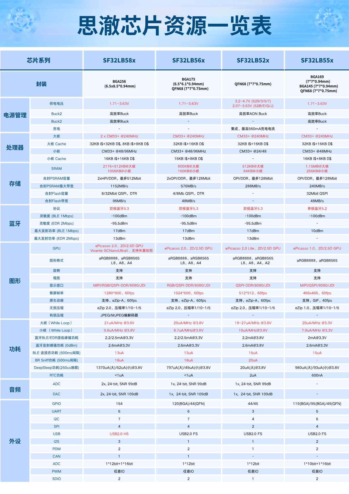

# SiFli Chip Model Guide

## Chip Numbering Rule: SF32LB5xyZxYx6

### Prefix: *SF32LB5xy*

- SF: Chip Series
    - SiFli, company logo
    - Other series such as SSxxxx are not included here
- 32: Chip Series
    - 32: 32-bit MCU series
    - 30: PMU series, all subsequent numbers, e.g., SF30147, do not follow the numbering rule below
- LB: Series Attributes
    - LB: Low-power Bluetooth MCU
    - VB: Bluetooth MCU with RISC-V processor
- 5: Processor Series
    - 5: Based on 32-bit Arm Cortex-M33 Star-MC1 processor or similar RISC-V processor
    - 0: Based on 32-bit Arm Cortex-M0+ processor
- x: High, Medium, or Low Positioning
    - 8: Flagship product of the 5x series
    - 6/5: Mid-range product of the 5x series
    - 2: Cost-effective product of the 5x series
- y: Product Positioning within the Series
    - Generally determined by the internal PSRAM capacity, specific numbers vary by specific chip

### Suffix: *ZxYx6*
- Z: Package
    - U: QFN package
    - V: BGA package
- xYx: Internal NOR Flash or PSRAM capacity code, the number of digits and combination depend on the specific package
    - x as a number: Internal NOR Flash capacity
        - 1: 2Mb
        - 2: 4Mb
        - 3: 8Mb
        - 4: 16Mb
        - 5: 32Mb
        - 6: 64Mb
    - X as a letter: Internal PSRAM capacity
        - A: 16Mb QPI-PSRAM
        - B: 32Mb OPI-PSRAM
        - C: 64Mb OPI-PSRAM
        - D: 128Mb OPI/HPI-PSRAM
        - E: 256Mb HPI-PSRAM
- 6: Temperature Range
    - 5: -20~70°C
    - 6: -40~85°C

```{important}
Note that the official company name is SiFli, with S and F in uppercase and the rest in lowercase, meaning Silicon Fli (Fly); Sifli, sifli, SiFLi are all incorrect spellings.
```
```{note}
**Abbreviations Explanation**
- NOR:  &ensp; QSPI NOR Flash
- QPI-P: &ensp; x4-PSRAM
- OPI-P: &ensp; x8-PSRAM
- HPI-P: &ensp; x16-PSRAM
```

## SF32LB52x/X Series Main Models List
- SF32LB52x/X:
    - x as a number: ***Lithium-ion Battery Powered*** series, such as SF32LB520/3/5/7, mutually pin-to-pin compatible
    - X as some letters: ***Standard 3.3V*** powered series, including SF32LB52B/E/G/J, mutually pin-to-pin compatible
    - X as some letters: ***Special 1.8V*** powered series, including SF32LB52D, for ultra-low power scenarios
    - x as a number and X as a letter are two independent series, ***not*** pin-to-pin compatible; although 3.3V models and 1.8V models can be pin-to-pin aligned, they are not voltage compatible, thus not compatible; the corresponding relationship from the package content is:
        - Lithium-ion &ensp;3.3V &ensp;1.8V
        - 520 -- 52B
        - 523 -- 52E&nbsp;-- 52D
        - 525 -- 52G
        - 527 -- 52J
- The SF32LB52x series supports the following display interfaces
    - SPI/DSPI/QSPI, including e-ink SPI interface
    - 8080-8bit

Part #       | 520U36      | 523UB6      | 525UC6      | 527UD6      | 52BU36      | 52BU56      | 52DUB6      | 52EUB6      | 52GUC6      | 52JUD6 
:-|-:|-:|-:|-:|-:|-:|-:|-:|-:|-:
Package      | QFN68L      | QFN68L      | QFN68L      | QFN68L      | QFN68L      | QFN68L      | QFN68L      | QFN68L      | QFN68L      | QFN68L 
Sizes        | 7x7x0.85 mm | 7x7x0.85 mm | 7x7x0.85 mm | 7x7x0.85 mm | 7x7x0.85 mm | 7x7x0.85 mm | 7x7x0.85 mm | 7x7x0.85 mm | 7x7x0.85 mm | 7x7x0.85 mm 
Pitch        | 0.35mm      | 0.35mm      | 0.35mm      | 0.35mm      | 0.35mm      | 0.35mm      | 0.35mm      | 0.35mm      | 0.35mm      | 0.35mm 
\# of GPIOs  | 44          | 44          | 44          | 44          | 45          | 45          | 45          | 45          |45           |45
MPI1  SiP    | 1MB NOR     | 4MB OPI-P   | 8MB OPI-P   | 16MB OPI-P  | 1MB NOR     | 4MB NOR     | 4MB OPI-P   | 4MB OPI-P   | 8MB OPI-P   |16MB OPI-P
Power Supply | 3.2~4.7V    | 3.2~4.7V    | 3.2~4.7V    | 3.2~4.7V    | **3.3V**    | **3.3V**    | **1.8V**    | **3.3V**    |**3.3V**     |**3.3V**
I/O Voltage  | 3.3V        | 3.3V        | 3.3V        | 3.3V        | 3.3V/1.8V   | 3.3V/1.8V   | 3.3V/1.8V   | 3.3V/1.8V   |3.3V/1.8V    |3.3V/1.8V
Temperature  | -40~85C     | -40~85C     | -40~85C     | -40~85C     | -40~85C     | -40~85C     | -40~85C     | -40~85C     |-40~85C      |-40~85C


## SF32LB56x Series Recommended Models List

- The SF32LB56x series supports the following display interfaces:
    - DPI/RGB888, RGB565 (566VCB36 and 567VND36)
    - SPI/DSPI/QSPI, including e-ink SPI interface
    - 8080-8bit

Part #            | 560UNN26    | 561UBN26    | 563UCN26    | 56WUND26    | 566VCB36          | 567VND36
:-|-:|-:|-:|-:|-:|-:
Package           | QFN68L      | QFN68L      | QFN68L      | QFN68L      | BGA175            | BGA175
Sizes             | 7x7x0.75 mm | 7x7x0.75 mm | 7x7x0.75 mm | 7x7x0.75 mm | 6.1x6.5x0.94 mm   | 6.1x6.5x0.94 mm 
Pitch             | 0.35mm      | 0.35mm      | 0.35mm      | 0.35mm      | 0.4mm             | 0.4mm 
HCPU GPIOs        | 24          | 24          | 24          | 24          | 79                | 79 
LCPU GPIOs        | 20          | 20          | 20          | 20          | 41                | 41 
MPI5 Boot SiP     | 512KB NOR   | 512KB NOR   | 512KB NOR   | 512KB NOR   | 1MB NOR           | 1MB NOR 
MPI1 SiP          | n/a         | 4MB OPI-P   | 8MB OPI-P   | n/a         | 8MB OPI-P         | n/a 
MPI2 SiP          | n/a         | n/a         | n/a         | 16MB OPI-P  | 4MB OPI-P         | 16MB OPI-P 
Display Interface | QSPI/8080   | QSPI/8080   | QSPI/8080   | QSPI/8080   | DPI/QSPI/8080/JDI | DPI/QSPI/8080/JDI 
Power Supply      | 1.71~3.63V  | 1.71~3.63V  | 1.71~3.63V  | 1.71~3.63V  | 1.71~3.63V        | 1.71~3.63V
Temperature       | -40~85C     | -40~85C     | -40~85C     | -40~85C     | -40~85C           | -40~85C 

## SF32LB58x Series Recommended Models List

- The SF32LB58x series supports the following display interfaces
    - MIPI-DSI, CMD mode or Video mode
    - DPI/RGB888, RGB565
    - SPI/DSPI/QSPI, including e-ink screen SPI interface
    - 8080-8bit
    - JDI MIP screen interface
    - Supports MIPI-DSI + SPI/DSPI/QSPI dual-screen display

Part #        | 580VNN36        | 581VCN36        | 583VCC36        | 585V5E56        | 586VDD36        | 587VEE56
:-|-:|-:|-:|-:|-:|-:
Package       | BGA256          | BGA256          | BGA256          | BGA256          | BGA256          | BGA256
Sizes         | 6.5x8.5x0.94 mm | 6.5x8.5x0.94 mm | 6.5x8.5x0.94 mm | 6.5x8.5x0.94 mm | 6.5x8.5x0.94 mm | 6.5x8.5x0.94 mm 
Pitch         | 0.4mm           | 0.4mm           | 0.4mm           | 0.4mm           | 0.4mm           | 0.4mm 
HCPU GPIOs    | 94              | 94              | 94              | 94              | 94              | 94 
LCPU GPIOs    | 66              | 66              | 66              | 66              | 66              | 66 
MPI5 Boot SiP | 1MB NOR         | 1MB NOR         | 1MB NOR         | 4MB NOR         | 1MB NOR         | 4MB NOR 
MPI1 SiP      | n/a             | 8MB OPI-P       | 8MB OPI-P       | 4MB NOR         | 16MB HPI-P      | 32MB HPI-P 
MPI2 SiP      | n/a             | n/a             | 8MB OPI-P       | 32MB HPI-P      | 16MB HPI-P      | 32MB HPI-P 
Power Supply  | 1.71~3.63V      | 1.71~3.63V      | 1.71~3.63V      | 1.71~3.63V      | 1.71~3.63V      | 1.71~3.63V
Temperature   | -40~85C         | -40~85C         | -40~85C         | -40~85C         | -40~85C         | -40~85C 

## SF32LB55x Main Model List

- The SF32LB55x series, defined earlier, does not fully follow the above suffix rules, only 557V3DA6 follows the suffix naming rules
- Identical packages are pin-to-pin compatible
- The SF32LB55x series supports the following display interfaces based on different packages, either in full or in part
    - MIPI-DSI, CMD mode
    - DPI/RGB888, RGB565
    - SPI/DSPI/QSPI, including e-ink screen SPI interface
    - 8080-8bit
    - JDI/Sharp MIP screen interface (557VD3A6)
    - Supports MIPI-DSI + SPI/DSPI dual-screen display (557VD3A6)

Part #            | SS6600A8    | 551U4O5     | 555V4O6        | 555V436        | 557VD3A6
-|-:|-:|-:|-:|-:
Package           | QFN68L      | QFN68L      | BGA145         | BGA145         | BGA169
Sizes             | 7x7x0.75 mm | 7x7x0.75 mm | 7x7x0.94 mm    | 7x7x0.94 mm    | 7x7x0.94 mm 
Pitch             | 0.35mm      | 0.35mm      | 0.5mm          | 0.5mm          | 0.5mm 
HCPU GPIOs        | 28          | 28          | 52             | 52             | 71 
LCPU GPIOs        | 21          | 21          | 40             | 40             | 42 
QSPI1-L Boot SiP  | 4MB NOR     | 4MB NOR     | 4MB NOR        | 4MB NOR        | 1MB NOR 
QSPI1-H SiP       | 4MB NOR     | n/a         | n/a            | n/a            | n/a 
PSRAM SiP         | n/a         | 4MB OPI-P   | 4MB OPI-P      | 8MB OPI-P      | 16MB OPI-P 
QSPI4 SiP         | n/a         | n/a         | n/a            | n/a            | 2MB QPI-P 
Display Interface | QSPI/8080   | QSPI/8080   | MIPI/QSPI/8080 | MIPI/QSPI/8080 | MIPI/QSPI/8080/JDI
Power Supply      | 2.97V~3.63V | 1.71~3.63V  | 1.71~3.63V     | 1.71~3.63V     | 1.71~3.63V
Temperature       | -20~70C     | -20~70C     | -40~85C        | -40~85C        | -40~85C

```{note}
- SS6600A8 contains two 4MB QSPI-NOR chips, which are configured to operate as a single 8MB OSPI-NOR.
```

## Chip Model Comparison Table



## Sample Acquisition

Retail samples and small quantities can be purchased directly from [Taobao](https://sifli.taobao.com/). For bulk orders, please send an email to sales@sifli.com or contact customer service on Taobao to obtain sales contact information.

Participating in open source can allow you to apply for free samples. You can join QQ group 674699679 for communication.