# Flash Chipid and Type Configuration Guide

## 1 Quick Generation of Flash Driver

### 1.1 Video Tutorials

#### 1.1.1 [Quick Start](https://www.bilibili.com/video/BV1i3USY8E3S/)：

https://www.bilibili.com/video/BV1i3USY8E3S/

#### 1.1.2 [Nand Full Practical Process](https://www.bilibili.com/video/BV1v3USYbEYy/)：

https://www.bilibili.com/video/BV1v3USYbEYy/

#### 1.1.3 Video Tutorial Network Disk Address

Network disk shared file: [sifli_flash_driver_generate](https://pan.baidu.com/s/11dVuuK5giQqTr1hQqZ4OVQ?pwd=1234)

Link: https://pan.baidu.com/s/11dVuuK5giQqTr1hQqZ4OVQ?pwd=1234 Extraction Code: 1234

### 1.2 UartburnEx.exe Tool

#### 1.2.1 Driver Bin or Elf Modification

Download the latest [Impeller.exe](https://downloads.sifli.com//tools/Impeller_COMMON.7z) tool, which includes the Flash driver generation tool UartburnEx.exe<br>
- For the correspondence between the Impeller tool and the driver, refer to
[3.4 Flash Download Driver Correspondence](../../faq/peripherals/flash.md/#34Flash下载驱动对应关系)

Fill in the Flash chipid and Flash configuration parameters into UartburnEx.exe as shown in the following interface. If you need to add a new IO port or power the Flash through the SF30147 power chip during download, you can also add it.

<br>

#### 1.2.2 Download with the Newly Generated Driver

<br>

<br>

#### 1.2.3 Add Chipid to Corresponding TYPE in SDK Code

The generated bin or elf only provides the Flash download. To read and write to the Flash in your own code, you need to add the corresponding Chipid to the code, then compile the Bootloader and user code for the code to run.

##### 1.2.3.1 Nor Flash Addition Method

In the `flash_table.c` file, add the corresponding Chipid under the corresponding Type.

<br>

##### 1.2.3.2 Nand Flash Addition Method

In the `nand_table.c` file, add the corresponding Chipid under the corresponding Type.

<br>

## 2 Methods to Find ChipID

### 2.1 Case One: GSS01GSAX1

Using GSS01GSAX1-W8NMI0_Rev_1.1.pdf as an example, open it and search for the generic flash read ID command: 9fh. As shown in the following figure, you can see the timing diagram for reading the ID with 9fh and the order of the output chipid.

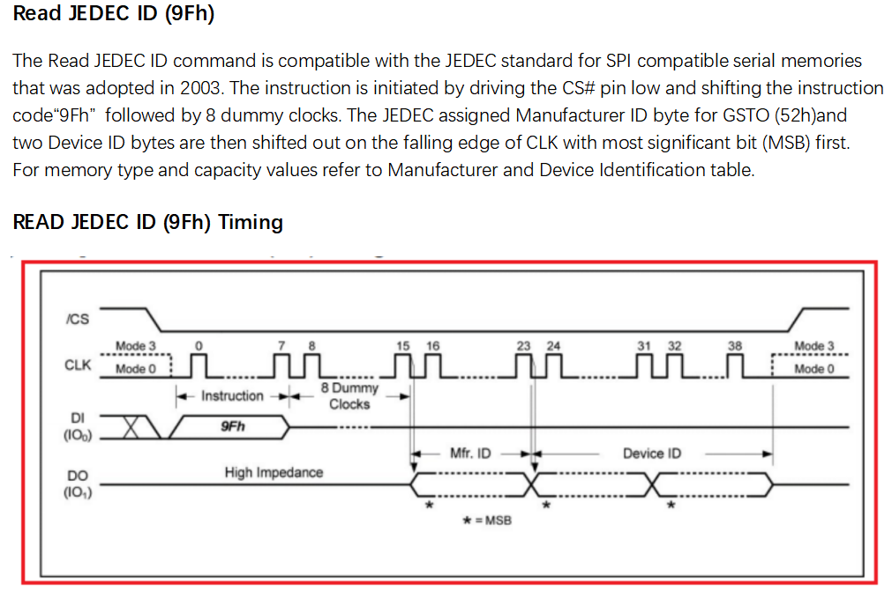<br>

The ID that can be read with the 9fh command is as follows: After sending the 9FH command via SPI, followed by 8 dummy clock cycles, it outputs 0x52, 0xca, 0x13.

Corresponding to the chipid table in the `nand_table.c` file:
{0x52, 0xCA, 0x13, 0x10, 0x8000000}, //GSS01GSAX1_RDID

<br>

### 2.2 Case Two: DS35X2GBXXX

For the 9Fh read chipid of the Dongxin company's chip, after 8 dummy clock cycles, only 2 bytes of chipid are output. The software will still read 3 bytes by default, and the chipid will typically be repeated. If reading 3 bytes, for the 1V8 model, it will receive 0xE5, 0xA2, 0XE5. Similarly, if reading 5 bytes, it will receive 0xE5, 0xA2, 0XE5, 0xE5, 0xA2. The software only takes the first 3 bytes as the chipid, resulting in:
{0xE5, 0xA2, 0XE5, 0x22, 0x10000000}, //DS35M2GBXXX_RDID

<br>

### 2.3 Download and Print Chipid

Use Impeller.exe to download and check the log to view the Chipid (this only demonstrates the method of obtaining chipid via UART download).

As shown in the following figure: Select the corresponding CPU model, uart/jlink, speed, nor/nand category, and the correct download address, then return to the main interface.

<br>

<br>

After clicking to burn, view the log generated in the `Impeller_x.x.x_COMMON\log\channel\20xx_xx_xx\*.txt` directory during the download failure process. The readable Chipid is `{0xc8, 0x82, 0xc8, x, 0xxxxxxxxx},`

<br>

## 3 Explanation of ChipID List

### 3.1 Nor Flash

#### 3.1.1 ID Explanation
```c
typedef struct FLASH_FULL_CHIP_ID
{
    uint8_t manufacture_id; /* Manufacturer ID, the same for all chips from the same manufacturer, 0x52 represents United Memory */
    uint8_t memory_type;  /* Distinguishes different memory chip models from the same manufacturer */
    uint8_t memory_density; /* Distinguishes different memory chip models from the same manufacturer */
    uint8_t ext_flags;    // 8-bit meaning, currently only bit 0 is used for nor flash,
    // bit 0: nor flash, this bit is 1 if the flash supports DTR (QSPI dual-edge data transfer), 0 if it does not support it. Setting this bit to 1 allows the user code to choose whether to use DTR mode.
    // bit 1: -  7  nor flash has no meaning, default is 0
    uint32_t mem_size;  // Flash storage size, unit (Byte)
} FLASH_RDID_TYPE_T;
```
**ID Example Explanation**

`{0x85, 0x20, 0x1a, 1, 0x4000000}, //PY25Q512HB_RDID`

`0x85:` Represents a chip from Puya company

`0x20:` Represents memory type

`0x1a:` Represents memory device ID

`1:` Represents support for DTR dual-edge data transfer

### 3.2 Nand Flash
#### 3.2.1 ID Explanation
```c
typedef struct FLASH_FULL_CHIP_ID

{

uint8_t manufacture_id; /* Manufacturer ID, the same for the same manufacturer, 0x52 represents United Memory \*/

uint8_t memory_type; /* Distinguishes different memory chip models from the same manufacturer \*/

uint8_t memory_density; /* Distinguishes different memory chip models from the same manufacturer \*/

uint8_t ext_flags; // 8-bit meaning, currently only bits 1 – bit7 are used for NAND flash,

// bit 0: NAND flash, this bit is meaningless, this bit must be set to 0,

// bit 1: NAND flash plane flag, 1: two planes; 0: no dual plane (common)

// bit 2: NAND flash page (page) size flag, 0: common default of 2048 bytes per page; 1: 4096 bytes per page

// bit 3: NAND flash block (block) size flag, 0: common 64 pages (pages) per block; 1: 128 pages (pages) per block

// bit 4~7: ECC status mode as NAND_ECC_MODE_T, ECC flag

uint32_t mem_size; // Flash storage size, unit (Byte)

} FLASH_RDID_TYPE_T;
```
**ID Example Explanation**

The 8 bits of `ext_flags`, for example:

`{0xE5, 0x74, 0xE5, 0x22, 0x20000000}, //DS35X4GMXXX_RDID`

`0x22` in binary is `0b0010 0010`

Bit4-7 is `0b0010`, ECC flag is 2,

Bit3 is 0: each block has 64 pages, size is 64x2KB=128KB

Bit2 is 0: each page is 2048 bytes

Bit1 is 1: this Flash has 2 planes

Bit0 is 0: meaningless

#### 3.2.2 Whether to Use Plane

**Concept of Plane in NAND FLASH**

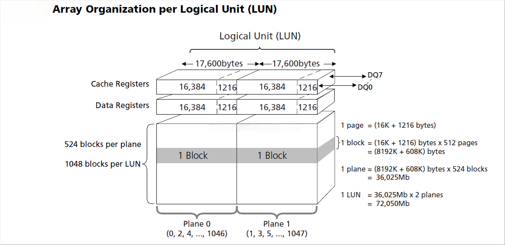<br>

NAND utilizes multi-plane design to enhance performance. As shown in the figure, a NAND chip is divided into 2 planes, and the blocks within the planes are numbered alternately as odd and even. We can operate each plane independently to achieve ping-pong operations, thereby improving performance. Therefore, we introduce the interleave algorithm, which refers to accessing multiple planes under a single channel to enhance NAND performance.

#### 3.2.3 Page Size

Concept of page (page) and block (block) in NAND FLASH

In NAND flash, the page (page) is the smallest unit for read and write operations, while the block (block) is the smallest unit for erase operations. Each NAND address can be precisely addressed to the byte level (addressing), but operations are still performed in page units for read/write (R/W), requiring page alignment.

Page (Page):

A page is the smallest programmable unit in a NAND Flash memory, typically 2KB, 4KB, or 8KB in size.

When writing data, the entire page must be erased to 0xFF first, and then the entire page of data is written;

When reading data, data can be read by page or byte.

A page is the basic unit of operation in a NAND Flash memory, and data must be written in whole-page multiples.

As shown in the figure: a page size is 2048 (2K) + 64 bytes, the additional 64 bytes at the end of each page are typically used for bad block identification and ECC verification.

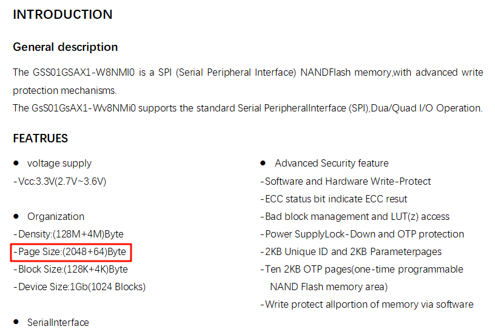<br>

#### 3.2.4 Block Size

Block (Block):

A block is the smallest erase unit in a NAND Flash memory, typically containing multiple pages.

The size of a block is usually 64KB, 128KB, or 256KB, and the block size may vary among different NAND Flash memory models.

Erase operations are performed on a block-by-block basis, erasing the entire block to all 1s.

Once data is stored in a block, individual pages within the block cannot be written or erased directly; the entire block must be erased before new data can be written.

As shown in the figure: a block size is 64 pages (64x2K=128K Byte),
<br>

Reference Article:

NAND Flash memory typically organizes data in pages (Page) and blocks (Block). The following is a brief introduction to the page and block structure of NAND Flash:
[Original Link](https://blog.csdn.net/gqd0757/article/details/140107931): https://blog.csdn.net/gqd0757/article/details/140107931

In practical applications, to reduce the number of erase and write operations on NAND Flash memory and extend its lifespan, embedded file systems (such as UBIFS, JFFS2, FlashDB, etc.) are often used to manage the pages and blocks of NAND Flash memory. Bad block management and these file systems allocate and manage data reasonably, reducing the impact of erase and write operations on NAND Flash memory.

EMMC storage can also be used, which already includes a NAND read/write controller and NAND flash. The NAND controller includes bad block management and wear-leveling operations.

#### 3.2.5 Configuring ECC Parameters

##### 3.2.5.1 NAND and ECC Concepts

NAND is a type of non-volatile memory chip, commonly used in flash memory and SSDs (Solid State Drives). Due to its high density and low cost, NAND memory is widely used in various devices. However, due to its physical characteristics, NAND memory is susceptible to bit flips and data loss issues.

ECC (Error Correction Code) is a coding technique used to detect and correct errors in data transmission. By adding redundant information to the data, ECC can help identify and correct errors in data transmission. Common ECC algorithms include Hamming codes and BCH codes, which can detect and correct multiple bit errors.

##### 3.2.5.2 ECC Principle

In NAND memory, ECC verification is typically implemented in the memory controller hardware. By default, it is enabled. When data is written to the NAND memory, the controller calculates the ECC checksum and stores it along with the data. When data is read, the controller recalculates the ECC checksum and compares it with the stored checksum. If an error is detected, the ECC checksum helps the controller identify the erroneous bits and attempt to correct them.

##### 3.2.5.3 ECC Status Register

As shown in the Nand status register,

B0H register bit4: ECC Enable bit is enabled by default,

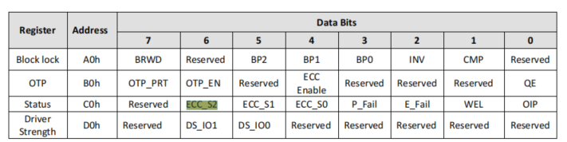<br>

C0H register bit4-6 (some NANDs have 2 bits or 4 bits) is the ECC status register.

The data read from the QSPI interface is already corrected, but whether the read data is valid still needs to be checked by the ECC status register in the C0H register (the ECC status register is updated after each complete read operation). If the ECC status register indicates that the error exceeds the ECC correction range, the data needs to be discarded. However, the bit4-6 of the ECC status register C0H is different for different NANDs, so a selection needs to be made to adapt to different NANDs.
```c
typedef enum __NAND_ECC_STATUS_MODE_

{

BIT2_IN_C0_T1 = 0, // 2 status bits, bit 4-5: 00: No ECC error; 01: 1-bit error but ECC can correct, others: More than 1-bit error and ECC cannot correct

BIT2_IN_C0_T2 = 1, // 2 status bits, bit 4-5: 00: No ECC error; 01 or 11: Error but ECC can correct, 10: Error and ECC cannot correct

BIT3_IN_C0_T1 = 2, // 3 status bits, bit4-6: 000: No error; 001 or 011 or 101: Error but ECC can correct, 010: More than 8-bit error and ECC cannot correct

BIT3_IN_C0_T2 = 3, // 3 status bits, bit4-6: 000: No error; 111: Error and ECC cannot correct, others: Error but ECC can correct

BIT4_IN_C0_T1 = 4, // 4 status bits, bit4-7: 0000: No error; xx10: Error and ECC cannot correct, others: Error but ECC can correct

BIT4_IN_C0_T2 = 5, // 4 status bits, bit4-7: 0000: No error; Greater than 1000: Error and ECC cannot correct, others: Error but ECC can correct

BIT2_IN_C0_T3 = 6 // 2 status bits, bit 4-5: 00: No ECC error; 01: 1-2-bit error but ECC can correct, 10: 1-2-bit error but ECC can correct, 11: Error and ECC cannot correct

} NAND_ECC_MODE_T;
```
##### 3.2.5.4 ECC Configuration Example 1

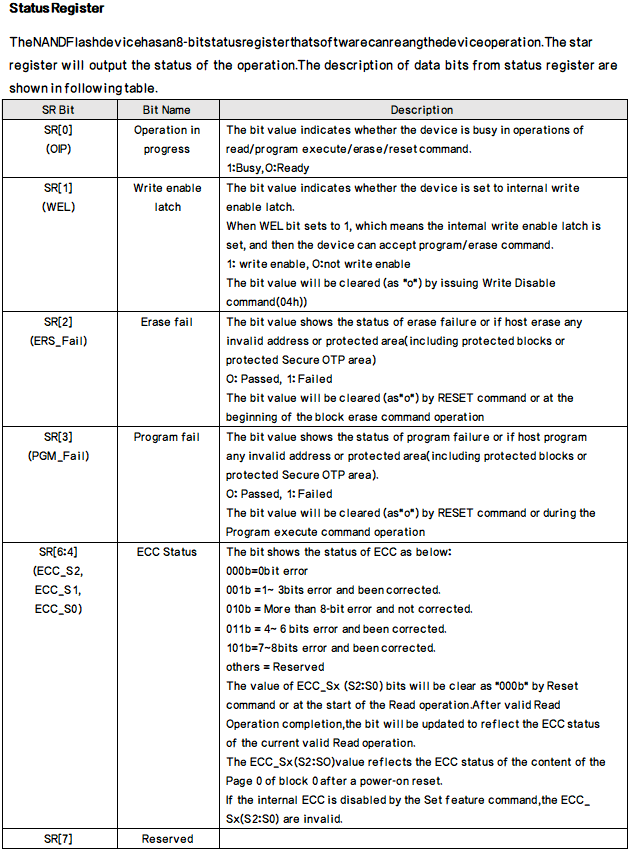<br>

`{0xE5, 0x74, 0xE5, 0x22, 0x20000000}, //DS35X4GMXXX_RDID`

As shown in the figure above, C0H has 3 bit status bits ECC_S0-S2, which matches the description in 2 (010 indicates an error that cannot be corrected). The ECC parameter bits are in ext_flags 0x22, where bit4-7 is 2.

##### 3.2.5.5 ECC Configuration Example 2

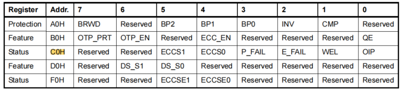<br>

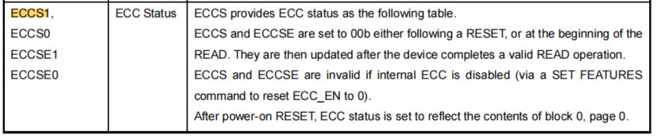<br>

`{0xc8, 0xd9, 0xc8, 0x10, 0x8000000}, //GD5F1GQ4UxxH_RDID`

As shown in the figure above, C0H has 2 bit status bits ECCS0-S1 (ECCSE0-1 in the F0H register, not handled in the code), which matches the description in 1 (10 indicates an error that cannot be corrected). The ECC parameter bits are in ext_flags 0x10, where bit4-7 is 1.

##### 3.2.5.6 ECC Configuration Example 3

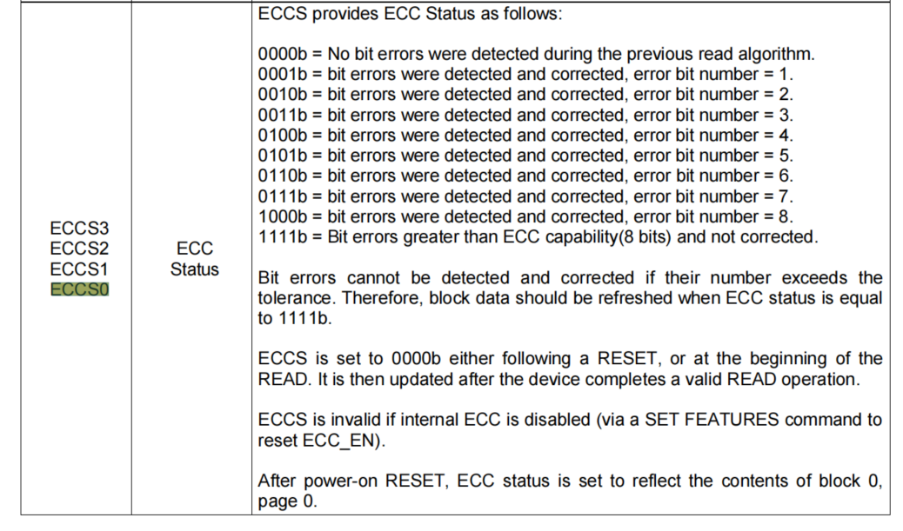<br>

`{0x0B, 0x11, 0X00, 0x50, 0x8000000}, //XT26G01CXXX_RDID`

As shown in the figure above, C0H has 4 bit status bits `ECCS0-S3`, which matches the description in 5 (greater than 1000: Error and ECC cannot correct). The ECC parameter bits are in `ext_flags` 0x50, where bit4-7 is 5.

## 4 Flash Type Selection

### 4.1 Nor Flash

#### 4.1.1 DTR Concept

Flash DTR mode stands for `Dual Transfer Rate`, which means data transfer is triggered on both edges of the clock signal SCK, improving transfer efficiency. DTR mode is similar to `Double Data Rate (DDR)` mode, both of which are edge-triggered, but DDR typically refers to data transfer rate, while DTR focuses more on the transfer rate concept.

**Whether DTR Function is Supported**

**As shown in the figure below, search for EDh. If you can see the DTR 4-line IO read command, it indicates support.**
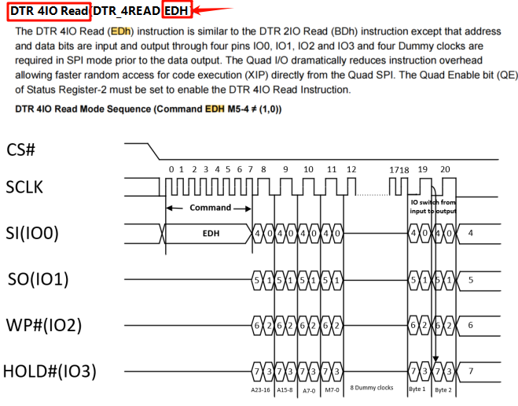<br>

#### 4.1.2 QE Flag Concept

QE bit (Quad Enable bit) is the abbreviation for Quad Enable, an important concept in serial NOR Flash, also known as quad enable in Chinese. In serial NOR Flash, the QE bit is used to control pin function multiplexing. Specifically, the QE bit determines the functions of Pin3 and Pin7: when the QE bit is enabled, these pins are used for data transfer; when the QE bit is disabled, these pins are used for control functions such as WP# (write protect), HOLD# (hold), etc.

#### 4.1.3 WRSR2 Register

WRSR2 register stands for **WR**ite **S**tatus **R**egister 2. There are two ways to read and write the WRSR2 register in different NOR Flash types, as follows:

**Type0** does not have a separate 31h command to write the WRSR2 register (a minority)

It uses the 01H command to write 2 bytes to the WRSR2 register, as shown in the figure below.

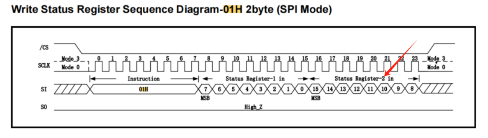<br>

**Type1** has a separate 31H command to write the WRSR2 register (the majority)

**Note**: Some NOR Flash that supports the 31H command also supports the 01H command to write 2 bytes continuously to the WRSR2 register, so it can be placed in either Type0 or Type1;

To find the method in the datasheet, search for the 31H command. If there is no 31H command, it must be placed in Type0.

As shown in the figure below, the only difference between Type0 and Type1 is the 31H command.
<br>

As shown in the figure below, the BY25Q256FS supports the 01H command to write S15-S8 (i.e., WRSR2) continuously, and the 31H command to write S15-8 individually, so it can be placed in either Type0 or Type1;

<br>

#### 4.1.4 Address MODE for Reading OTP

In the TYPE selection, the issue of whether the OTP command is 3 bytes or 4 bytes is mentioned. Here is a brief introduction.

NOR Flash typically provides about 256 bytes of Security Registers (commonly known as OTP (One Time Program) area). This area can be erased and written multiple times, but it can also be configured as OTP to protect it, used for storing security or important information, such as Bluetooth (network) addresses, device names, serial numbers, Alipay encryption, etc.

In NOR Flash larger than 128Mbit, there is a difference in the 3-byte or 4-byte commands for read and write operations (corresponding command in the program: SPI_FLASH_CMD_RDSCUR), as shown in the figure below:

<br>

<br>

#### 4.1.5 4-Byte Address Mode for NOR

**Background**

For NOR flash with a capacity less than 16MB (128Mbit) bytes, a 3-byte address mode is generally used, where the command format is `cmd + addr[2] + addr[1] + addr[0] + ...`.

For NOR flash with a capacity exceeding 16MB, a 4-byte address mode is required, where the command format is `cmd + addr[3] + addr[2] + addr[1] + addr[0] + ...`.

**Reason**

Why is this the case? Because using 3 bytes to represent an address, the range is `0x000000 - 0xffffff = 0 - 16M`, and addresses beyond 16M cannot be represented. Therefore, 4 bytes are needed, which can support from 256Mbit to 32Gbit.

**3-Byte to 4-Byte Mode Switching**

For flash memory exceeding 128Mbit, to maintain compatibility with existing MCU boot ROM code, the chip is set to 3-byte mode by default (allowing access to content within 128Mbit). The B7h command can be sent to enter 4-byte mode, and the E9h command can be sent to exit 4-byte mode.

**4-Byte Mode Command 6Ch**

**Some NOR manufacturers do not have a dedicated 6Ch command for 4-byte addressing. In 3-byte address mode, they use 6Bh, and in 4-byte address mode, they still use 6Bh. This results in command differences, and the TYPE will be different, as shown below:**

<br>

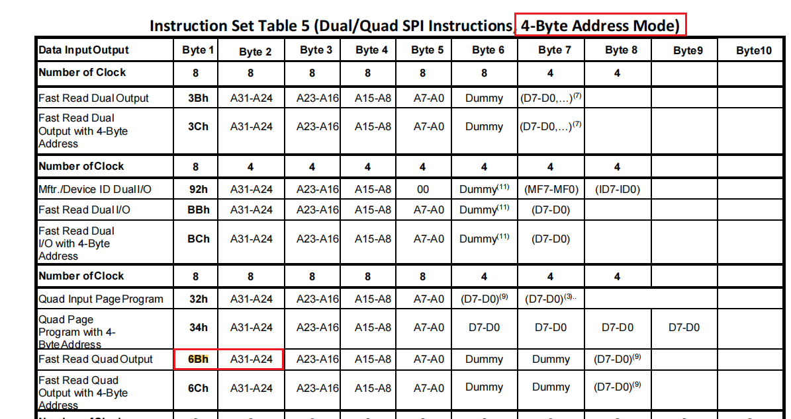<br>

<br>

#### 4.1.6 Description of Each TYPE
```c
typedef enum

{

NOR_TYPE0 = 0, // normal type 0, DTR, NO CMD_WRSR2, Max 128Mb, as default command table

NOR_TYPE1, // type 1, WRSR2 to write status register 2(QE), Max 128Mb

NOR_TYPE2, // type 2, 256Mb, DTR, 4 bytes address command diff with 3 bytes, OTP support 4-B mode

NOR_TYPE3, // type 3, 256Mb , NO DTR , 4 bytes command same to 3 bytes, only timing changed, OTP 3-B only

NOR_TYPE4, // type 4, 256Mb, NO DTR, 4B ADDR command diff with 3B addr , OTP support 4-B mode

NOR_TYPE5, // type 5, 256Mb, NO DTR, MXIC flash have too many diff with others

NOR_CMD_TABLE_CNT

} FLASH_CMD_TABLE_ID_T;
```
| NOR_TYPE0 | 128Mbit and below, supports DTR, no 31h command to write WRSR2 register |
| --- | --- |
| NOR_TYPE1 | 128Mbit and below, supports DTR, has 31h command to write WRSR2 register |
| NOR_TYPE2 | 256Mbit and above, supports DTR, has a dedicated 6Ch command for 4-byte operation, OTP supports 4-byte address access |
| NOR_TYPE3 | 256Mbit and above, does not support DTR, no dedicated 6Ch command for 4-byte operation, 3-byte or 4-byte addresses are both operated by 6Bh command, OTP only supports 3-byte address access |
| NOR_TYPE4 | 256Mbit and above, does not support DTR, has a dedicated 6Ch command for 4-byte operation, OTP supports 4-byte address access |
| NOR_TYPE5 | 256Mbit and above, does not support DTR, MXIC flash has significant differences in this TYPE |

#### 4.1.7 TYPE Selection Flowchart

<br>

### 4.2 NAND Flash

#### 4.2.1 Concept of QE Flag

QE bit (Quad Enable bit) is the abbreviation for Quad Enable, an important concept in serial NOR Flash, which is referred to as quad enable in Chinese. In serial NOR Flash, the QE bit is used to control the multiplexing of pin functions. Specifically, the QE bit determines the functions of Pin3 and Pin7: when the QE bit is enabled, these pins are used for data transfer; when the QE bit is disabled, these pins are used for WP# (write protect), HOLD# (hold), and other control functions.

Many NANDs default to only supporting 4-line mode and do not have a QE flag, so there is no need to switch from single-line to quad-line mode.

**How to Check the QE Flag**

Directly search the datasheet for "QE" or search for the B0h (or Bxh register) characteristic register to check if the QE flag exists. The following figure shows a QE flag, so choose a TYPE with the QE flag. If it cannot be found, it means no QE switching is required.

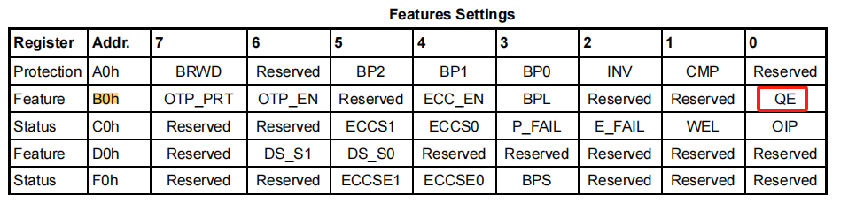<br>

#### 4.2.2 Concept of EBh Command

Both EBh and 6Bh are fast 4-line read commands, but the difference is that the page address sent by the EBh command is also in 4-line mode, which is faster. However, some NANDs do not support this. The following is the 6Bh command. You can directly search the datasheet for the EBh command; if it is not found, it is not supported.

<br>

When determining the TYPE, the number of dummies following the EBh command is checked. Here is how to distinguish them:

4 Dummy mode is shown in the following figure, where 4 dummy clocks follow the 16-bit page address.

<br>

2 Dummy mode is shown in the following figure, where only 2 dummy clocks follow the 16-bit page address.

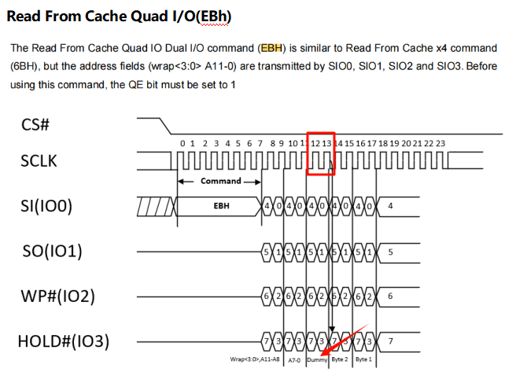<br>

#### 4.2.3 Concept of NAND Continuous Read

The concepts of buffer read and continuous read in NAND are shown in the following figure. This device supports buffer read and continuous read modes.

<br>

**Buffer Read Concept**

When reading data from QSPI NAND, it is divided into two steps:

1. Page Data Read (13h): Data is read from the cell to the data buffer. At this point, the NAND reads the cell data, calculates the ECC, and performs error correction. If a bit flip occurs in the cell, the corrected data is written to the data buffer.
2. Read Data (6Bh or EBh): Data is read from the data buffer.

It can be seen that the data buffer is a necessary path for read and write operations.

**Continuous Read Concept**

Buffer read can only read one page per command. To read the next page, the above two steps need to be repeated.

Some NAND manufacturers have introduced continuous read. When the BUF=0 flag is 0, the device is in continuous read mode, and data is output continuously.

The data will start from the first byte of the data buffer and automatically increment to the next higher address. When the data buffer of a page is read, the first byte of the next page will immediately follow and continue to output the data of the next page until the entire NAND is read. Therefore, it is possible to read the entire NAND using a single read command.

To determine whether continuous read functionality is supported, search for "Continuous Read" or check the 6Bh command to see if it has the following description: BUF=1 (this flag indicates whether the continuous read function is used)

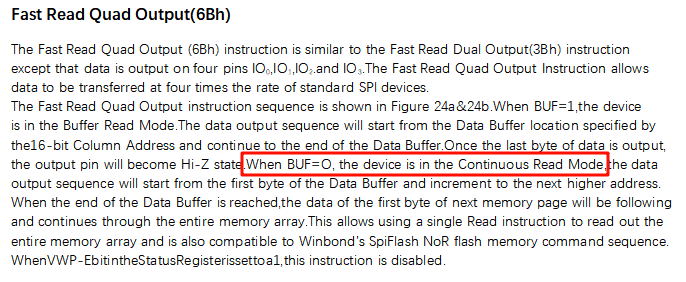<br>

#### 4.2.4 Introduction to Each TYPE
```c
typedef enum

{

NAND_TYPE0 = 0, // normal type, based on winbond w25n01gw, with NON-BUF, NO QE, EB with 4 dummy

NAND_TYPE1, // based on XT26G01D, BUF, QE, EB, EB with 2 dummy

NAND_TYPE2, // based on ds35x1gaxxx, BUF, QE, NO EB

NAND_TYPE3, // based on tc58cyg0s3hraij, BUF, NO QE, NO EB

NAND_TYPE4, // based on FM25LS01, BUF, NO QE, EB with 4 dummy

NAND_TYPE5, // based on GD5F1GM7RE, BUF, QE, EB, EB with 4 dummy

NAND_CMD_TABLE_CNT

} NAND_CMD_TABLE_ID_T;
```
| NAND_TYPE0 | Supports continuous read mode, no QE flag, 4 dummy clocks after the EBh command |
| --- | --- |
| NAND_TYPE1 | With QE flag, 2 dummy clocks after the EBh command |
| NAND_TYPE2 | With QE flag, no EBh command |
| NAND_TYPE3 | No QE flag, no EBh command |
| NAND_TYPE4 | No QE flag, 4 dummy clocks after the EBh command |
| NAND_TYPE5 | With QE flag, 4 dummy clocks after the EBh command |

#### 4.2.5 TYPE Selection Flowchart

<br>

## 5 Common Issues

### 5.1 Flash Download Principles

#### 5.1.1 Uart Download

Through the Uart interface, the corresponding Flash bin, such as ram_patch_52X_NAND.bin, is loaded into the specified address in the RAM of the 52 MCU, then the program jumps to that RAM address and executes the code to program the external Nor or Nand Flash.

#### 5.1.2 Jlink Download

When Jlink connects to the MCU via the SWD interface and the following command is executed in the command line:

Loadbin d:\1.bin 0x62000000, Jlink.exe will select the Devices/SiFli/SF32LB52X_EXT_NAND2.elf file from the JLinkDevices.xml configuration based on the 0x62000000 address, load it into the RAM of the 52 MCU, and call the corresponding programming interface in the elf file to perform the programming.

<br>

### 5.2 Uart Download Process Log Analysis

#### 5.2.1 ChipID Not Readable

As shown in the following figure, using Impeller.exe to download and check the log to view the Chipid (this only demonstrates the method of obtaining the Chipid via Uart download), it is found that the Chipid cannot be read.

<br>

**Common Causes:**

1. Flash power supply is missing or the power supply voltage is incorrect, especially note the difference between 1.8V and 3.3V Flash.
2. Poor soldering or incorrect orientation of the Flash.
3. After a failed programming, if the Flash power supply is not detected, after ruling out hardware issues, the common cause is that the Flash power supply is not turned on in the programming driver. The corresponding Flash power supply method needs to be configured in the generation tool (if the power supply is not the default).

#### 5.2.2 BIN Not Running

See the introduction to Flash programming principles in Chapter 5.1.

See the following printout:
```
16:18:48:151 uart COM19 open success // This indicates that the serial port 19 for downloading has been successfully opened.

16:18:54:499 DownLoadUart() fail // This indicates that the BIN failed to be successfully downloaded to the RAM of the MCU via Uart and did not run.

16:18:54:499 FINAL_FAIL 500bf
```
<br>

**Common Causes:**

1. Abnormal power supply to the MCU, the MCU is not running.
2. The MCU is running in the user program, but the corresponding Uart port or Jlink is not communicating or the MCU is in a deadlock.

Solutions:

Enter the Boot mode of the MCU and confirm on the serial port that the Boot mode entry message is printed.

1) For the 55, 56, 58 series MCUs, there is a dedicated Boot_Mode pin. Pulling it high will enter the Boot mode, as shown in the following printout:

<br>

2) For the 52 series chips, there is no dedicated Boot_Mode pin. Entering the Boot mode can be done by inputting a command within 3 seconds after power-on, as shown in the following printout:

<br>

#### 5.2.3 Log Indicates Verification Failure

See the following log:
```
<br>

15:41:28:413 burn_verify 0x622c0000 0x34ecf8 0xa80ad8a1

15:41:28:939 R: burn_verify 0x622c0000 0x34ecf8 0xa80ad8a1

addr:0x622c0000, size:0x1f000000 sector:0x20000 page:0x800 id:0x13501

V: 0xa80ad8a1 vs 0x63bd755c, TIMR:0xff DCR:0x3c00000

Fail
```
**Common Causes**

1. Poor soldering of D2-D3 pins<br>
Since reading the Flash ID only requires the D0-D1 data lines, being able to read the ID does not necessarily mean all IOs are well connected. Therefore, if the ID can be read but verification fails, it is particularly important to check whether D2-D3 are properly soldered or connected (common in manual soldering or poor Flash socket contact).<br>
2. Interference caused by long QSPI traces or flying wires leading to individual bit errors.<br>

#### 5.2.4 Uart Serial Port Receives Garbled Data

<br>
```
msh >B
```

19:19:36:961 downloadfile: D:\bin\ec_lb567_weilaijing\ER_IROM1.bin addr: 0x64080000 len: 3459652 Byte

19:19:36:961 burn_erase_write 0x64080000 0x34ca44

19:19:41:670 R: ?&?

19:19:41:671 download_image_simple_thread fail

19:19:41:798 DownLoadUart fail

19:19:41:799 DownLoadUart() fail

19:19:41:808 FINAL_FAIL 500bf
```
As shown in the figure above: During the download process, RX received garbled data

**Common Causes**

1) The machine restarted during the download process

### 5.3 QSPI Flash Frequency Issues

The default QSPI CLK frequency for Flash read and write operations is recommended to be around 60MHz. Some Nor/Nand datasheets specify support for frequencies up to 108MHz and higher. Higher frequencies have the advantage of faster data read and write, but they also require higher PCB trace standards and can introduce more EMI interference. This is especially true when the SDK code enables DRT dual-edge CLK sampling, which further increases the trace requirements.

To modify the Flash CLK, you typically need to adjust the `HAL_PreInit` function in the `bsp_init.c` file of the corresponding project. This depends on which MPI interface the Flash is connected to, which clock source is used, and the division factor. For example, to increase the frequency, you can change `mpi2_div` from 5 to 4, resulting in 288MHz/4 = 72MHz. After making the change, you can also use the serial command `sysinfo` to check the CLK frequency changes.
```c
HAL_RCC_HCPU_EnableDLL2(288000000);

mpi2_div = 5;

HAL_RCC_HCPU_ClockSelect(RCC_CLK_MOD_FLASH2, RCC_CLK_FLASH_DLL2);
```
<br>

### 5.4 Nand Page/Block Issues

As mentioned in sections 3.2.2 and 3.2.3, the Page and Block sizes of large-capacity Nand are also increasing. When managing Flash in the APP application, you should also consider the corresponding Page/Block operation methods.