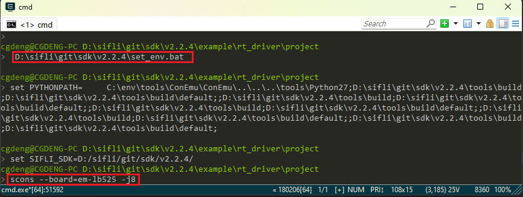
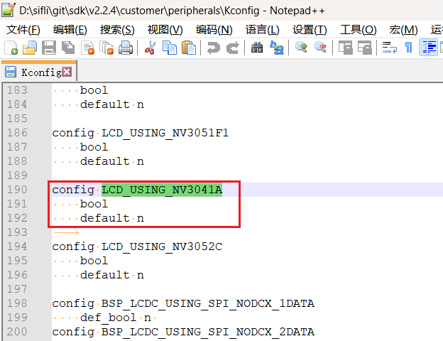
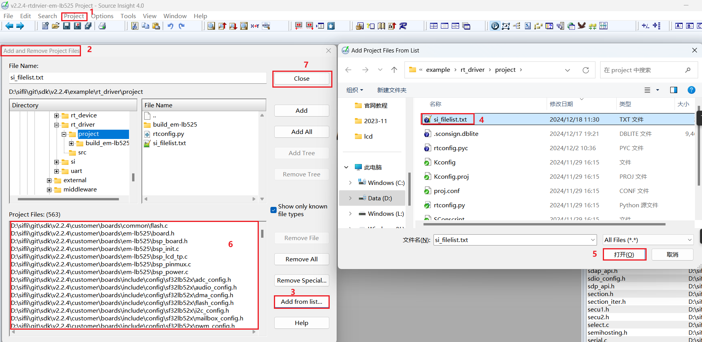
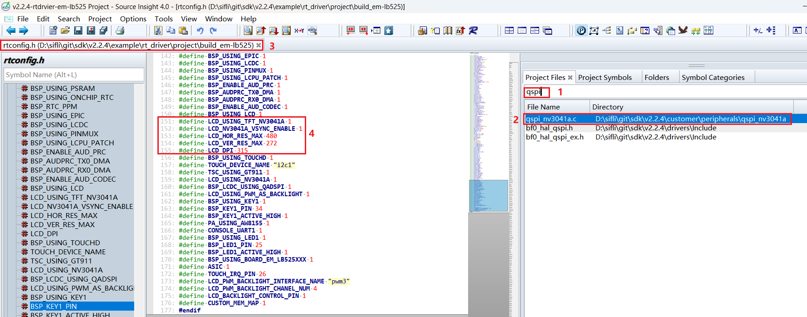
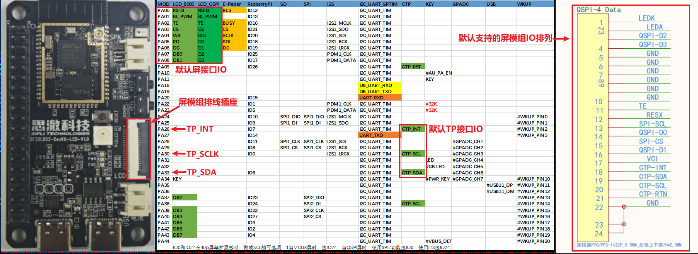
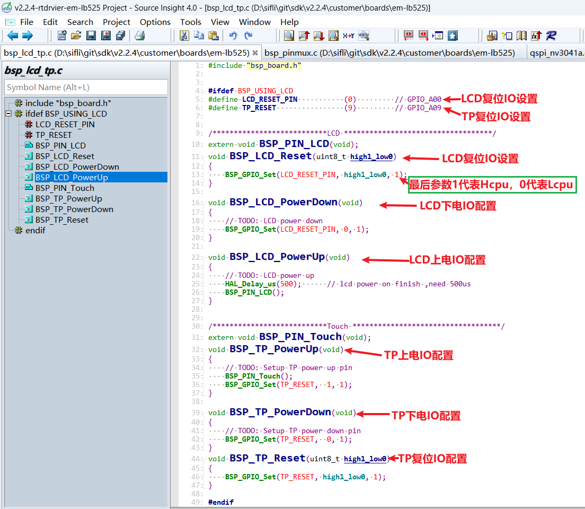
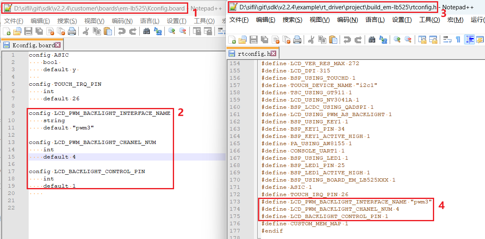
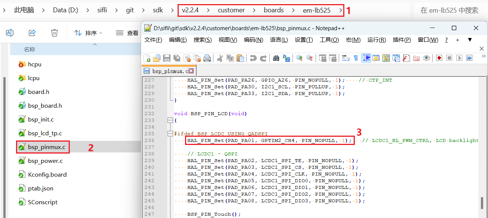
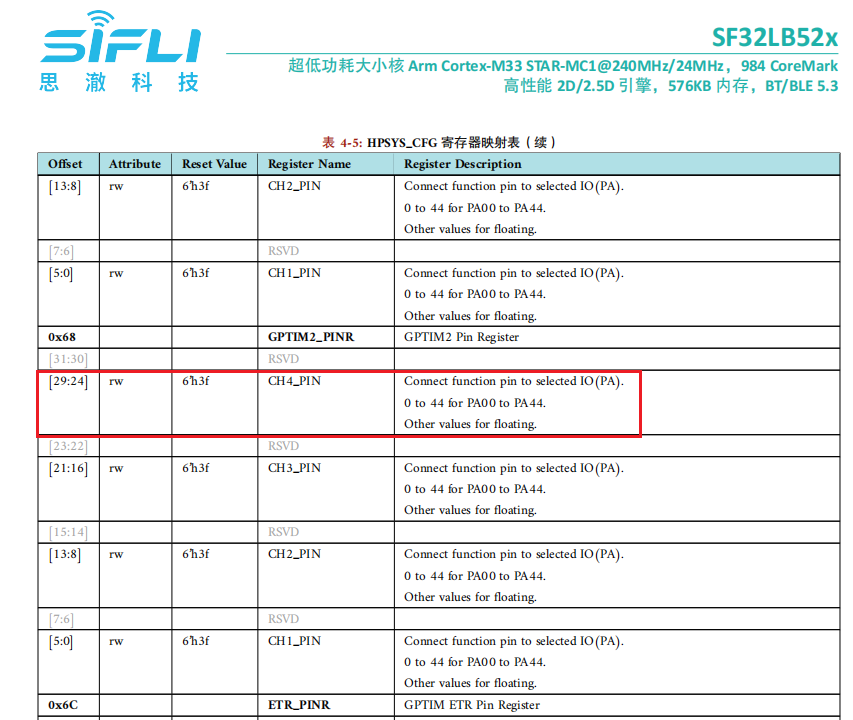

# 525添加QSPI-LCD实例
### 1 确认rt-driver工程正常运行
调屏推荐采用rt-driver工程，调试前确认rt-driver工程能正常运行并有Log打印
#### 1.1 编译
进入`example\rt_driver\project`目录，右键选择`ComEmu_Here`弹出编译命令串口，依次执行<br>
```
> D:\sifli\git\sdk\v2.2.4\set_env.bat   #设置编译环境路径
> scons --board=em-lb525 -j8   #指定em-lb525模块编译rt-driver工程
```
<br>
#### 1.2 进入BOOT模式
确认525`em-lb525`模块板进入`boot`模式便于下载，如下图操作<br>
<br>
#### 1.3 下载
```
> build_em-lb525\uart_download.bat

     Uart Download

please input the serial port num:7 #然后选择em-lb525模块连接的串口号进行下载 
```
#### 1.4 确认正常LOG
如下图，运行用户程序需要去掉勾选进入`BOOT`选项，确认板子跑起来后，就可以继续下一步添加新屏幕模组<br>

### 2 添加屏驱NV3041A
#### 2.1 创建NV3041A驱动
1） 屏驱位置
屏驱动位于`sdk\customer\peripherals`目录<br>
2） 复制驱动
复制一份其他`qspi`接口的驱动更名为`qspi_nv3041a`<br>
#### 2.2 Menuconfig添加NV3041A
1） 修改Kconfig在menuconfig中生成该屏的选项<br>
文本编辑器打开sdk\customer\boards\Kconfig_lcd，添加qspi的该屏的选项和分辨率，如下<br>
<br>
```
# menuconfig 生成菜单呈现的选项
        config LCD_USING_TFT_NV3041A
            bool "4.3 rect QSPI LCD(480x272 TFT-NV3041A)" #menuconfig中显示的字符
            select TSC_USING_GT911 if BSP_USING_TOUCHD #如果有TP可以打开，对应TP的驱动是否编译依赖此宏
            select LCD_USING_NV3041A #spi_nv3041a文件夹内文件是否的编译依赖于此宏
            select BSP_LCDC_USING_QADSPI #选择QSPI接口
            select LCD_USING_PWM_AS_BACKLIGHT #是否打开屏的PWM背光，有背光的屏需要打开
            if LCD_USING_TFT_NV3041A
               config LCD_NV3041A_VSYNC_ENABLE #是否打开屏的TE，打开TE后如果屏无TE信号输出,送屏会出现Timeout死机
                    bool "Enable LCD VSYNC (TE signal)" #menuconfig中显示的字符
                    def_bool y #默认值
            endif 
# LCD_HOR_RES_MAX 为屏的水平分辨率 
        default 480 if LCD_USING_TFT_NV3041A
# LCD_VER_RES_MAX 为屏的垂直分辨率        
        default 272 if LCD_USING_TFT_NV3041A
# LCD_DPI 像素密度，为屏一英寸多少个像素点，不知道就填默认315
        default 315 if LCD_USING_TFT_NV3041A
```
2） LCD_USING_NV3041A添加<br>
文本编辑器打开文件`sdk\customer\peripherals\Kconfig`，添加如下<br>
```
config LCD_USING_NV3041A #添加该配置，Kconfig中才能select上
    bool
    default n
```
<br>
3） SConscript修改<br>
文本编辑器打开文件`customer\peripherals\qspi_nv3041a\SConscript`，修改宏`LCD_USING_NV3041A`,这样该目录下的*.c和*.h文件就能加入编译<br>
<br>
#### 2.3 Menuconfig选中NV3041A
以上步骤完成后，编译窗口输入下面命令，并选中刚添加的nv3041a屏<br>
> `menuconfig --board=em-lb525` （打开menuconfig窗口）
在这个路径下`(Top) → Config LCD on board → Enable LCD on the board → SelecCD`选中刚添加的屏，示例如下，保存退出，即选中了qspi_nv3041a目录下屏驱动参加编译<br>
<br>
### 3 生成SourceInsight工程  
为了便于查看参加编译的代码，可以生成rt-driver整个工程参加编译的文件list，再导入到Source Insight中便于查看，可以跳过此章节
#### 3.1 生成文件List
命令`scons --board=em-lb525 --target=si`生成`si_filelist.txt`<br>
<br>
#### 3.2 文件List导入
打开Source Insight导入`si_filelist.txt`进入工程<br>  
<br>
#### 3.3 查看屏驱是否生效
可以在SI（Source Insight）工程中查看`rtconfig.h`对应宏是否生成和是否已经包含了`qspi_nv3041a.c`加入编译  
<br>
### 4 屏硬件连接
#### 4.1 排线连接
如果购买的是匹配的屏幕模组，直接排线连接到插座即可，如下图<br>
<br>
#### 4.2 飞线连接
如果新的屏幕模组，排线排列不一致，就需要自己设计排线转接板或者从插针飞线调试。  
转接板的设计可以参考[SF32LB52-DevKit-LCD转接板制作指南](../../sf32lb52x/SF32LB52-DevKit-LCD-Adapter.md)  
### 5 屏驱动配置
#### 5.1 默认IO配置
如果采用的默认IO，此处可以跳过
##### 5.1.1 IO模式设置
LCD采用的是LCDC1硬件来输出波形，需配置为对应的FUNC模式，<br>
每个IO有哪些Funtion可以参考硬件文档 [下载SF32LB52X_Pin_config](./assets/EH-SF32LB52X_Pin_config_V1.3.0_20241114.xlsx)<br>
<br>
LCD和TP的RESET脚都是采用GPIO模式，则默认已经配置为GPIO模式
```c
 HAL_PIN_Set(PAD_PA00, GPIO_A0,  PIN_NOPULL, 1);     // #LCD_RESETB
 HAL_PIN_Set(PAD_PA09, GPIO_A9,  PIN_NOPULL, 1);     // CTP_RESET
```
##### 5.1.2 IO上下电操作
下面是上电LCD初始化流程<br>
`rt_hw_lcd_ini->api_lcd_init->lcd_task->lcd_hw_open->BSP_LCD_PowerUp-find_right_driver->LCD_drv.LCD_Init->LCD_drv.LCD_ReadID->lcd_set_brightness->LCD_drv.LCD_DisplayOn`<br>
可以看到上电`BSP_LCD_PowerUp`在屏驱动初始化`LCD_drv.LCD_Init`之前<br>
所以需要在初始化LCD前，确保BSP_LCD_PowerUp中已经打开LCD供电<br>
<br>
##### 5.1.3 背光PWM配置
pwm软件中有一个默认配置，配置在文件`customer\boards\em-lb525\Kconfig.board`中，此`Kconfig.board`的配置会编译后在`rtconfig.h`中生成下面3个宏<br>
```c
//PWM3需要打开GPTIM2，PWM和TIMER对应关系，可以查看FAQ的PWM部分或者文件`pwm_config.h`
#define LCD_PWM_BACKLIGHT_INTERFACE_NAME "pwm3" //pwm设备名
#define LCD_PWM_BACKLIGHT_CHANEL_NUM 4 //Channel 4
#define LCD_BACKLIGHT_CONTROL_PIN 1 //PA01
```
用PWM3需要用到GPTIM2（位于Hcpu）输出，还需确认`rtconfig.h`下面宏是否生效<br>
```c
#define BSP_USING_GPTIM2 1 //如果用PWM3，需要menuconfig --board=em-lb525打开
#define RT_USING_PWM 1
#define BSP_USING_PWM 1
#define BSP_USING_PWM3 1 //如果没有，需要menuconfig --board=em-lb525打开
```
如下文件`pwm_config.h`中`pwm3`和`GPTIM2`的对应关系<br>
```c
#ifdef BSP_USING_PWM3
#define PWM3_CONFIG                             \
    {                                           \
       .tim_handle.Instance     = GPTIM2,         \
       .tim_handle.core         = PWM3_CORE,    \
       .name                    = "pwm3",       \
       .channel                 = 0             \
    }
#endif /* BSP_USING_PWM3 */
```
<br>
软件默认PA01从`GPTIM2`的`"pwm3"`设备输出PWM波形，默认配置在<br>
<br>
```c
HAL_PIN_Set(PAD_PA01, GPTIM2_CH4, PIN_NOPULL, 1);   // LCDC1_BL_PWM_CTRL, LCD backlight PWM
```
**备注：**<br>
通过函数`HAL_PIN_Set`配置后，GPTIM2_CH4跟PA01的对应关系就会建立起来，具体体现在寄存器配置`hwp_hpsys_cfg->GPTIM2_PINR`中，如下图：<br>
<br>
可以看到可以配置为CH1-CH4输出，而且必须是PA00-PA44口<br>
#### 5.2 屏驱复位时序
下面几个延时比较关键，需要参照屏驱IC相关文档的初始化时序，谨慎修改
```c
    BSP_LCD_Reset(1);
    rt_thread_mdelay(1);    //延时1ms
    BSP_LCD_Reset(0);       //Reset LCD
    rt_thread_mdelay(10);   //延时10ms
    BSP_LCD_Reset(1);

    /* Wait for 200ms */
    rt_thread_mdelay(120);  //延时120ms

```
#### 5.3 屏驱寄存器修改
每个屏驱IC的初始化寄存器配置差异较大，需要按照屏厂提供的寄存器参数，按照他们的SPI时序依次通过QSPI写入屏驱IC,特别注意0x11和0x29寄存器后的延时长度要求<br>
```c
    parameter[0] = 0x16;
    LCD_WriteReg(hlcdc, 0x92, parameter, 1);

    parameter[0] = 0x16;
    LCD_WriteReg(hlcdc, 0xB2, parameter, 1);

    parameter[0] = 0x00;
    LCD_WriteReg(hlcdc, 0xff, parameter, 1);

    LCD_WriteReg(hlcdc, 0x11, parameter, 0); // internal reg enable
    rt_thread_mdelay(60);

    LCD_WriteReg(hlcdc, 0x29, parameter, 0); // internal reg enable
    rt_thread_mdelay(120);
```
#### 5.4 屏驱参数配置
- .lcd_itf ： 选择LCDC_INTF_SPI_DCX_4DATA表示QSPI 4线模式<br>
- .freq ：选择36000000，表示QSPI的clk主频为36Mhz，这个时钟要依据屏驱IC支持的最高时钟来选择，越高每帧送数时间越短，帧率会越高<br>
- .color_mode ：选择RGB565 还是RGB888格式<br>
- .syn_mode ：选择是否启用TE防撕裂功能，如果启动TE，屏驱IC无TE信号，不会送屏，会出现Timeout死机，前期调试建议关闭TE<br>
- .vsyn_polarity ：选择TE的极性<br>
- .vsyn_delay_us ：选择TE波形到来后多久LCDC1开始送数给屏驱IC<br>
- .readback_from_Dx ： 选择QSPI读Chipid时，屏驱IC的数据是从D0-D3的哪条信号线输出（参照屏驱IC手册）<br>
```c
static LCDC_InitTypeDef lcdc_int_cfg_qadspi =
{
    .lcd_itf = LCDC_INTF_SPI_DCX_4DATA,
    .freq = 36000000,                          // 实际频率为Hcpu的整数分频后频率，240Mhz(HCLK)/7 = 34.28Mhz
    .color_mode = LCDC_PIXEL_FORMAT_RGB565,    // RGB565 format

    .cfg = {
        .spi = {
            .dummy_clock = 1,
#ifndef DEBUG
            .syn_mode = HAL_LCDC_SYNC_VER,     //Enable TE, Prevent tearing
#else
            .syn_mode = HAL_LCDC_SYNC_DISABLE, //Disable TE, For debugging
#endif /* LCD_LCD_VSYNC_ENABLE */
            .vsyn_polarity = 1,
            .vsyn_delay_us = 0,
            .hsyn_num = 0,
            .readback_from_Dx = 0,             //qspi read from d0, ( 0-3: d0-d3 ) 
        },
    },
};
```
### 6 编译烧录下载结果
#### 6.1 显示结果展示
如下图,如果显示正常会依次6种图像，3秒定时循环显示<br>
<br>