# 525 Add QSPI-LCD Example (Built-in)

### 1 Confirm rt-driver Project is Running Normally
It is recommended to use the rt-driver project for screen debugging. Before debugging, ensure that the rt-driver project runs normally and prints logs.
#### 1.1 Compilation
Navigate to the `example\rt_driver\project` directory, right-click and select `ComEmu_Here` to pop up the compilation command line, and execute the following commands sequentially:
```
> D:\sifli\git\sdk\v2.2.4\set_env.bat   # Set the compilation environment path
> scons --board=em-lb525 -j8   # Compile the rt-driver project for the em-lb525 module
```
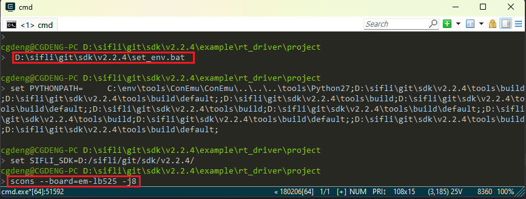<br>
#### 1.2 Enter BOOT Mode
Ensure the `em-lb525` module board is in `boot` mode for easy downloading, as shown in the following figure:
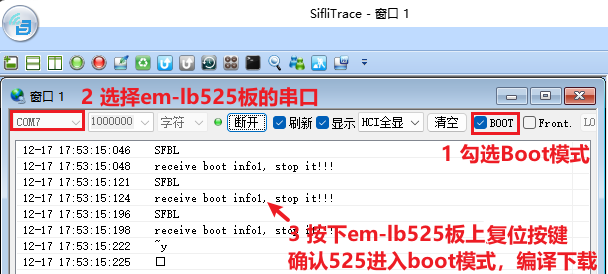<br>
#### 1.3 Download
```
> build_em-lb525\uart_download.bat

     Uart Download
```

please input the serial port num:7 # then select the serial port number connected to the em-lb525 module for downloading
```
#### 1.4 Confirm Normal LOG
As shown in the figure below, to run the user program, uncheck the `BOOT` option. After confirming that the board is running, you can proceed to the next step to add a new screen module<br>
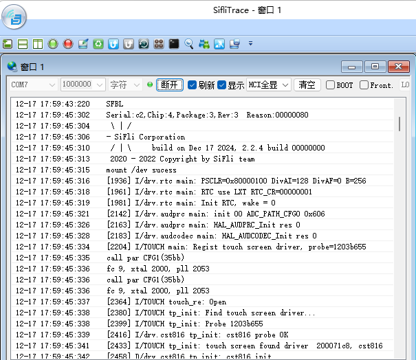
### 2 Add Screen Driver NV3041A
#### 2.1 Create NV3041A Driver
1) Screen Driver Location
The screen driver is located in the `sdk\customer\peripherals` directory<br>
2) Copy the Driver
Copy a driver for another `qspi` interface and rename it to `qspi_nv3041a`<br>
#### 2.2 Add NV3041A in Menuconfig
1) Modify Kconfig to generate the screen option in menuconfig<br>
Open the file `sdk\customer\boards\Kconfig_lcd` with a text editor and add the qspi option for this screen and its resolution, as shown below<br>
<br>
```
# menuconfig generated menu options
        config LCD_USING_TFT_NV3041A
            bool "4.3 rect QSPI LCD(480x272 TFT-NV3041A)" # text displayed in menuconfig
            select TSC_USING_GT911 if BSP_USING_TOUCHD # if TP is available, this macro determines whether the corresponding TP driver is compiled
            select LCD_USING_NV3041A # whether the files in the spi_nv3041a folder are compiled depends on this macro
            select BSP_LCDC_USING_QADSPI # select QSPI interface
            select LCD_USING_PWM_AS_BACKLIGHT # whether to enable the screen's PWM backlight, enable if the screen has a backlight
            if LCD_USING_TFT_NV3041A
               config LCD_NV3041A_VSYNC_ENABLE # whether to enable the screen's TE, if the screen has no TE signal output, the screen will timeout and hang
                    bool "Enable LCD VSYNC (TE signal)" # text displayed in menuconfig
                    def_bool y # default value
            endif 
# LCD_HOR_RES_MAX is the screen's horizontal resolution 
        default 480 if LCD_USING_TFT_NV3041A
# LCD_VER_RES_MAX is the screen's vertical resolution        
        default 272 if LCD_USING_TFT_NV3041A
# LCD_DPI is the pixel density, the number of pixels per inch on the screen, if unknown, use the default value of 315
        default 315 if LCD_USING_TFT_NV3041A
```
2) Add LCD_USING_NV3041A<br>
Open the file `sdk\customer\peripherals\Kconfig` with a text editor and add the following<br>
```
config LCD_USING_NV3041A # add this configuration so it can be selected in Kconfig
    bool
    default n
```
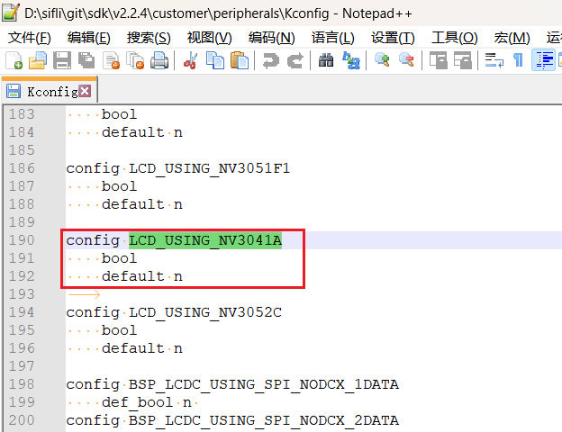<br>
3) Modify SConscript<br>
Open the file `customer\peripherals\qspi_nv3041a\SConscript` with a text editor and modify the macro `LCD_USING_NV3041A`, so that the *.c and *.h files in this directory can be included in the compilation<br>
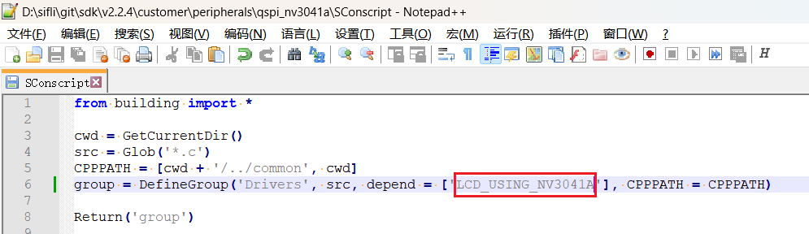<br>
#### 2.3 Select NV3041A in Menuconfig
After completing the above steps, enter the following command in the compilation window and select the newly added nv3041a screen<br>
> `menuconfig --board=em-lb525` (open the menuconfig window)
In this path `(Top) → Config LCD on board → Enable LCD on the board → Select` select the newly added screen, as shown below, save and exit, which will include the screen driver in the `qspi_nv3041a` directory in the compilation<br>
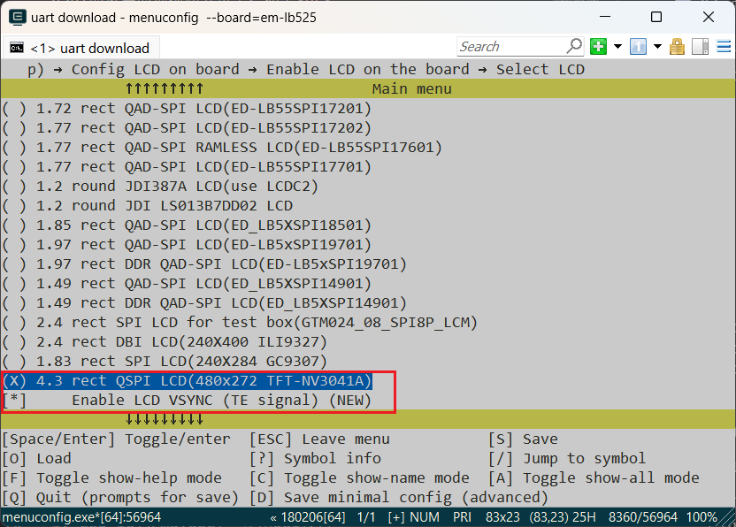<br>
### 3 Generate SourceInsight Project  
To facilitate viewing the code files included in the compilation, you can generate a list of files in the rt-driver project and import them into Source Insight. This section can be skipped.
#### 3.1 Generate File List
Run the command `scons --board=em-lb525 --target=si` to generate `si_filelist.txt`<br>
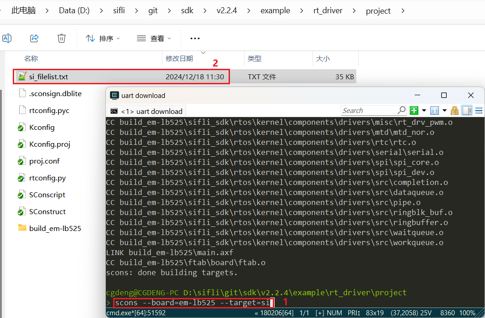<br>
#### 3.2 Import File List
Open Source Insight and import `si_filelist.txt` into the project<br>
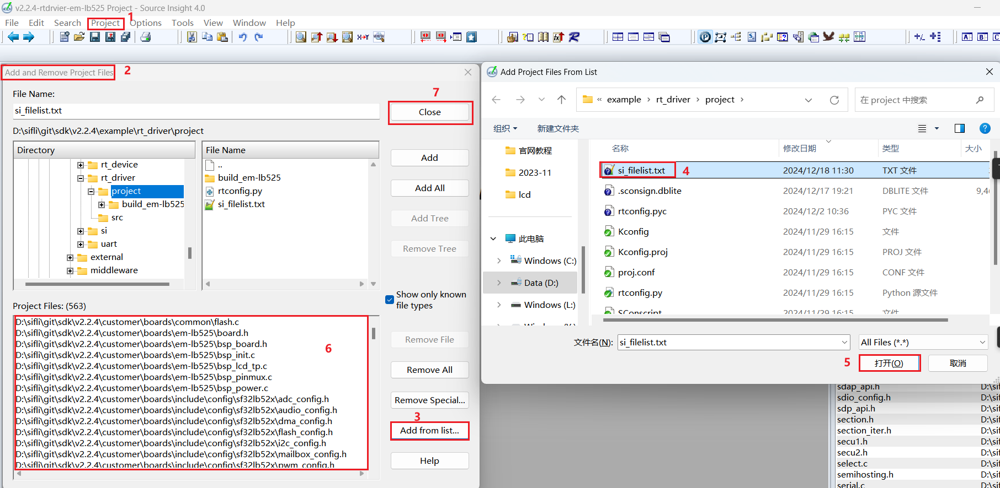<br>
#### 3.3 Check if the Screen Driver is Effective
In the Source Insight (SI) project, check if the corresponding macros in `rtconfig.h` are generated and if `qspi_nv3041a.c` is included in the compilation<br>
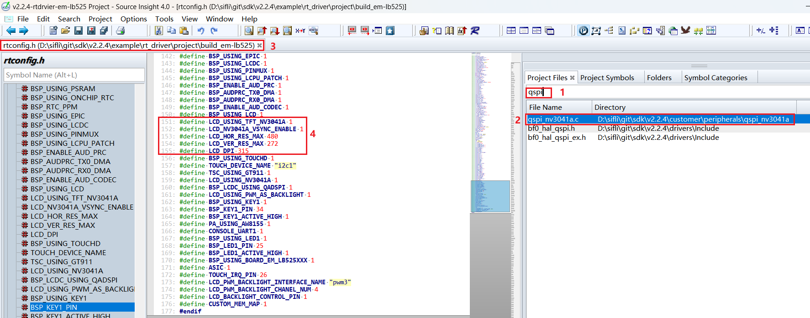<br>
### 4 Screen Hardware Connection
#### 4.1 Ribbon Cable Connection
If you have a matching screen module, simply connect the ribbon cable to the socket, as shown in the figure below<br>
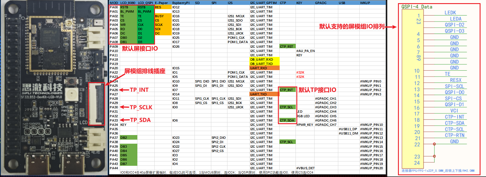<br>
#### 4.2 Flywire Connection
If the new screen module has a different ribbon cable layout, you will need to design a ribbon cable adapter or use flywires for debugging.  
You can refer to the [SF32LB52-DevKit-LCD Adapter Board Guide](../../board/sf32lb52x/SF32LB52-DevKit-LCD-Adapter.md#sf32lb52-devkit-lcd-adapter-board-guide) for designing the adapter board<br>
### 5 Screen Driver Configuration
#### 5.1 Default IO Configuration
If you are using the default IO, you can skip this section
##### 5.1.1 IO Mode Setting
The LCD uses LCDC1 hardware to output waveforms, which need to be configured to the corresponding FUNC mode,<br>
Refer to the hardware documentation [Download SF32LB52X_Pin_config](./assets/EH-SF32LB52X_Pin_config_V1.3.0_20241114.xlsx) for the functions of each IO<br>
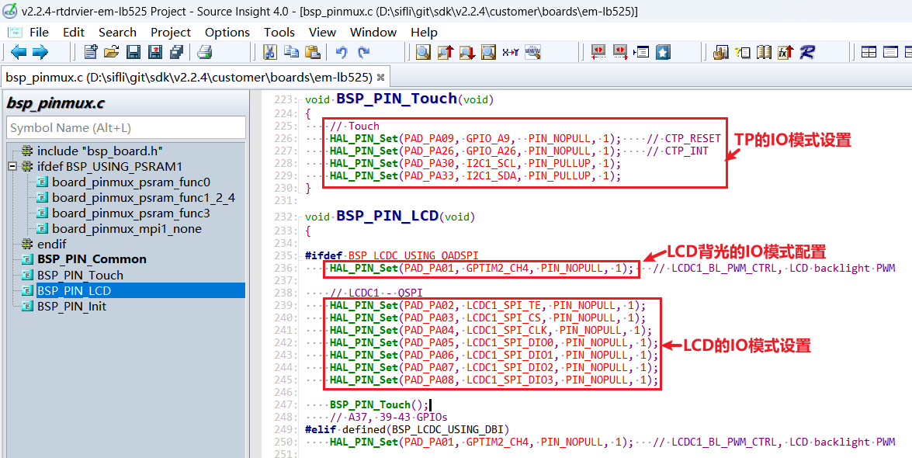<br>
The RESET pins for the LCD and TP are both configured as GPIO mode by default
```c
 HAL_PIN_Set(PAD_PA00, GPIO_A0,  PIN_NOPULL, 1);     // #LCD_RESETB
 HAL_PIN_Set(PAD_PA09, GPIO_A9,  PIN_NOPULL, 1);     // CTP_RESET
```
##### 5.1.2 IO Power-On Operations
The following is the power-on initialization flow for the LCD<br>
`rt_hw_lcd_ini->api_lcd_init->lcd_task->lcd_hw_open->BSP_LCD_PowerUp-find_right_driver->LCD_drv.LCD_Init->LCD_drv.LCD_ReadID->lcd_set_brightness->LCD_drv.LCD_DisplayOn`<br>
You can see that `BSP_LCD_PowerUp` is called before the screen driver initialization `LCD_drv.LCD_Init`<br>
Therefore, ensure that the LCD power is turned on in `BSP_LCD_PowerUp` before initializing the LCD<br>
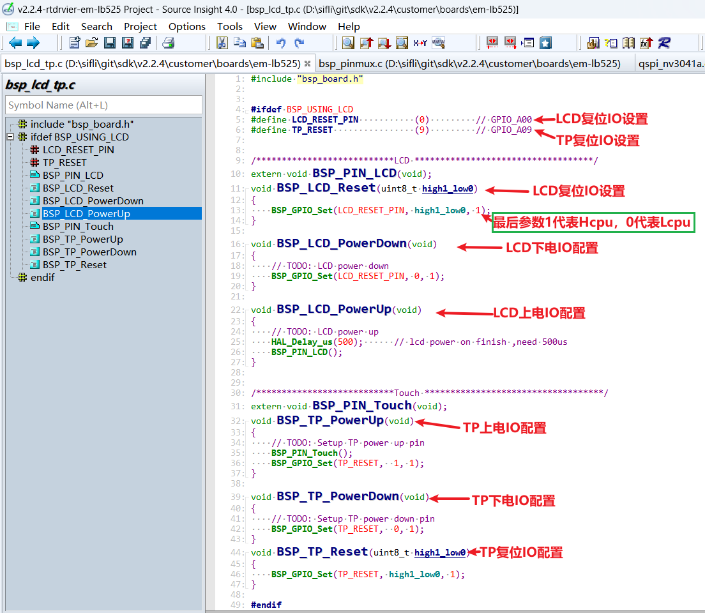<br>
##### 5.1.3 Backlight PWM Configuration
There is a default configuration in the PWM software, which is configured in the file `customer\boards\em-lb525\Kconfig.board`. This `Kconfig.board` configuration will generate the following three macros in `rtconfig.h` after compilation<br>
```c
// PWM3 requires GPTIM2 to be enabled, the relationship between PWM and TIMER can be found in the PWM section of the FAQ or in the file `pwm_config.h`
#define LCD_PWM_BACKLIGHT_INTERFACE_NAME "pwm3" // PWM device name
#define LCD_PWM_BACKLIGHT_CHANEL_NUM 4 // Channel 4
#define LCD_BACKLIGHT_CONTROL_PIN 1 // PA01
```
Using PWM3 requires GPTIM2 (located in Hcpu) to output, and you need to ensure that the following macros in `rtconfig.h` are effective<br>
```c
#define BSP_USING_GPTIM2 1 // If using PWM3, enable in menuconfig --board=em-lb525
#define RT_USING_PWM 1
#define BSP_USING_PWM 1
#define BSP_USING_PWM3 1 // If not, enable in menuconfig --board=em-lb525
```
The correspondence between `pwm3` and `GPTIM2` is defined in the file `pwm_config.h`<br>
```c
#ifdef BSP_USING_PWM3
#define PWM3_CONFIG                             \
    {                                           \
       .tim_handle.Instance     = GPTIM2,         \
       .tim_handle.core         = PWM3_CORE,    \
       .name                    = "pwm3",       \
       .channel                 = 0             \
    }
#endif /* BSP_USING_PWM3 */
```
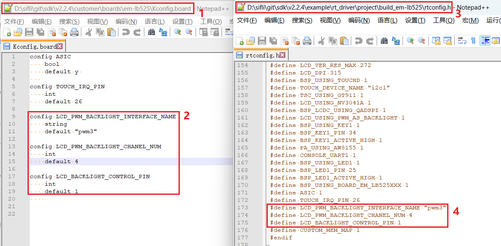<br>
The default configuration for PA01 to output the PWM waveform from `GPTIM2` is as follows<br>
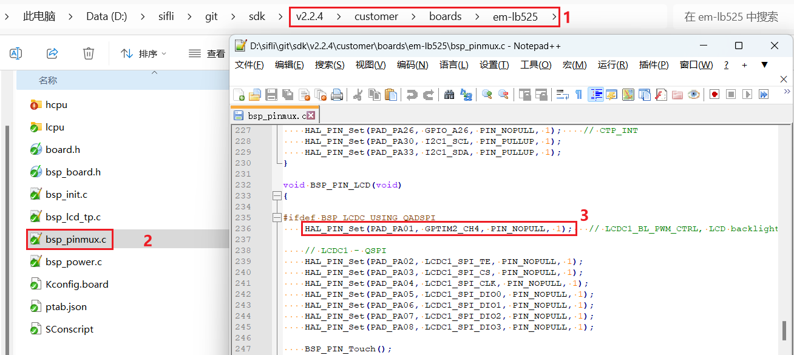<br>
```c
HAL_PIN_Set(PAD_PA01, GPTIM2_CH4, PIN_NOPULL, 1);   // LCDC1_BL_PWM_CTRL, LCD backlight PWM
```
**Note:**<br>
After configuring with the function `HAL_PIN_Set`, the correspondence between GPTIM2_CH4 and PA01 will be established, which is reflected in the register configuration `hwp_hpsys_cfg->GPTIM2_PINR`, as shown in the figure below:<br>
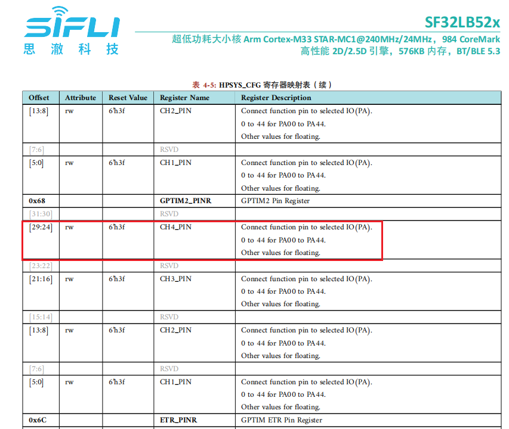<br>
You can configure CH1-CH4 outputs, and they must be on PA00-PA44 pins<br>
#### 5.2 Screen Driver Reset Timing
The following delays are critical and should be carefully modified according to the initialization timing of the screen driver IC
```c
    BSP_LCD_Reset(1);
    rt_thread_mdelay(1);    // delay 1ms
    BSP_LCD_Reset(0);       // Reset LCD
    rt_thread_mdelay(10);   // delay 10ms
    BSP_LCD_Reset(1);
```

```c
/* Wait for 200ms */
    rt_thread_mdelay(120);  // Delay 120ms
```

```
#### 5.3 Screen Driver Register Modification
Each screen driver IC has significantly different initialization register configurations. You need to write the register parameters provided by the screen manufacturer to the screen driver IC in the order of their SPI timing through QSPI, paying special attention to the delay requirements after registers 0x11 and 0x29.<br>
```c
    parameter[0] = 0x16;
    LCD_WriteReg(hlcdc, 0x92, parameter, 1);

    parameter[0] = 0x16;
    LCD_WriteReg(hlcdc, 0xB2, parameter, 1);

    parameter[0] = 0x00;
    LCD_WriteReg(hlcdc, 0xff, parameter, 1);

    LCD_WriteReg(hlcdc, 0x11, parameter, 0); // internal reg enable
    rt_thread_mdelay(60);

    LCD_WriteReg(hlcdc, 0x29, parameter, 0); // internal reg enable
    rt_thread_mdelay(120);
```

#### 5.4 Screen Driver Parameter Configuration
- .lcd_itf ： Choose LCDC_INTF_SPI_DCX_4DATA to indicate QSPI 4-line mode<br>
- .freq ： Choose 36000000, indicating the QSPI clock frequency is 36MHz. This clock should be selected based on the highest supported clock by the screen driver IC. The higher the clock, the shorter the time to send each frame, and the higher the frame rate.<br>
- .color_mode ： Choose between RGB565 and RGB888 formats.<br>
- .syn_mode ： Choose whether to enable the TE (Tear Effect) prevention function. If TE is enabled and the screen driver IC does not have a TE signal, it will not send the screen, leading to a timeout and system hang. It is recommended to disable TE during initial debugging.<br>
- .vsyn_polarity ： Choose the polarity of the TE signal.<br>
- .vsyn_delay_us ： Choose the delay in microseconds after the TE signal arrives before LCDC1 starts sending data to the screen driver IC.<br>
- .readback_from_Dx ： Choose which signal line (D0-D3) the screen driver IC uses to output data when reading the ChipID via QSPI (refer to the screen driver IC manual).<br>
```c
static LCDC_InitTypeDef lcdc_int_cfg_qadspi =
{
    .lcd_itf = LCDC_INTF_SPI_DCX_4DATA,
    .freq = 36000000,                          // Actual frequency is an integer division of Hcpu frequency, 240Mhz(HCLK)/7 = 34.28Mhz
    .color_mode = LCDC_PIXEL_FORMAT_RGB565,    // RGB565 format

    .cfg = {
        .spi = {
            .dummy_clock = 1,
#ifndef DEBUG
            .syn_mode = HAL_LCDC_SYNC_VER,     // Enable TE, Prevent tearing
#else
            .syn_mode = HAL_LCDC_SYNC_DISABLE, // Disable TE, For debugging
#endif /* LCD_LCD_VSYNC_ENABLE */
            .vsyn_polarity = 1,
            .vsyn_delay_us = 0,
            .hsyn_num = 0,
            .readback_from_Dx = 0,             // qspi read from d0, ( 0-3: d0-d3 ) 
        },
    },
};
```

### 6 Compilation and Download Results
#### 6.1 Display Result Demonstration
As shown in the following figure, if the display is normal, it will show six images in sequence, with a 3-second timer loop.<br>
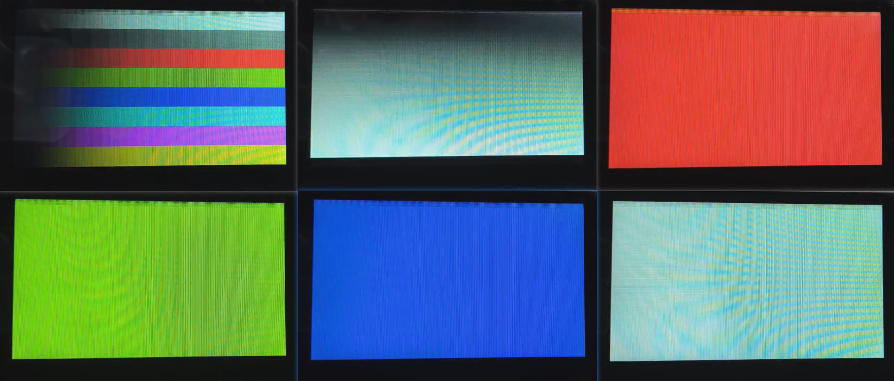<br>
```