# 566 Add DPI-LCD Instance (Built-in)
## 1 Confirm rt-driver Project is Running Normally
It is recommended to use the rt-driver project for screen debugging. Before debugging, ensure that the rt-driver project runs normally and prints logs.
### 1.1 Compilation
Navigate to the `example\rt_driver\project` directory, right-click and select `ComEmu_Here` to pop up the compilation command line, and execute the following commands sequentially:
```
>  D:\sifli\git\sdk\v2.2.6\set_env.bat   # Set the compilation environment path
> scons --board=em-lb566 -j8  # Compile the rt-driver project for the em-lb566 module
```
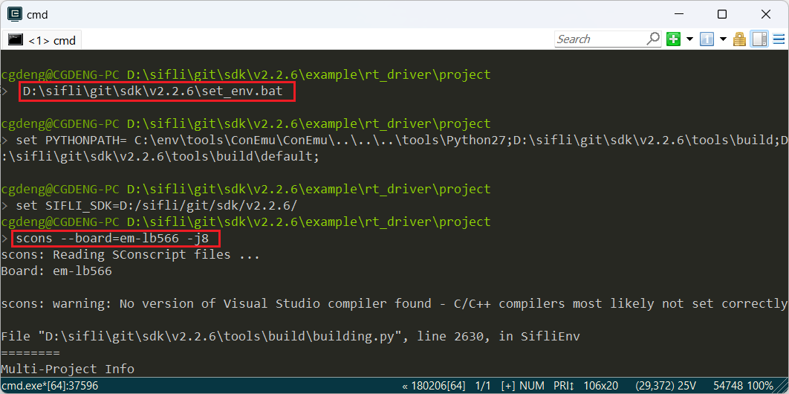<br>
### 1.2 Enter BOOT Mode
Pull the BOOT_MODE pin high to 3.3V to enter the `boot` mode for easy downloading, as shown in the following figure, short the BOOT_MODE to 3.3V:
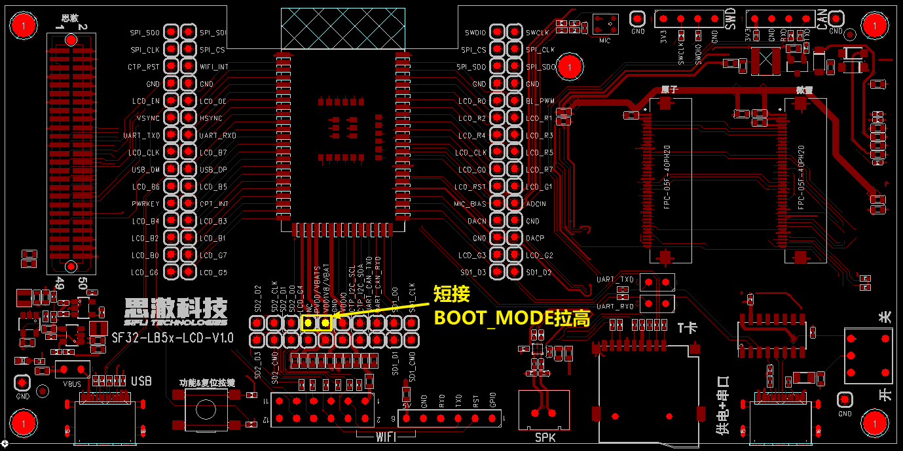<br>
After entering the boot mode, the serial port will output the following log. Input the command `help`, and it will also output a log, indicating that the serial port MCU is running normally and the serial communication is working properly. Click to disconnect the serial port and prepare for downloading.
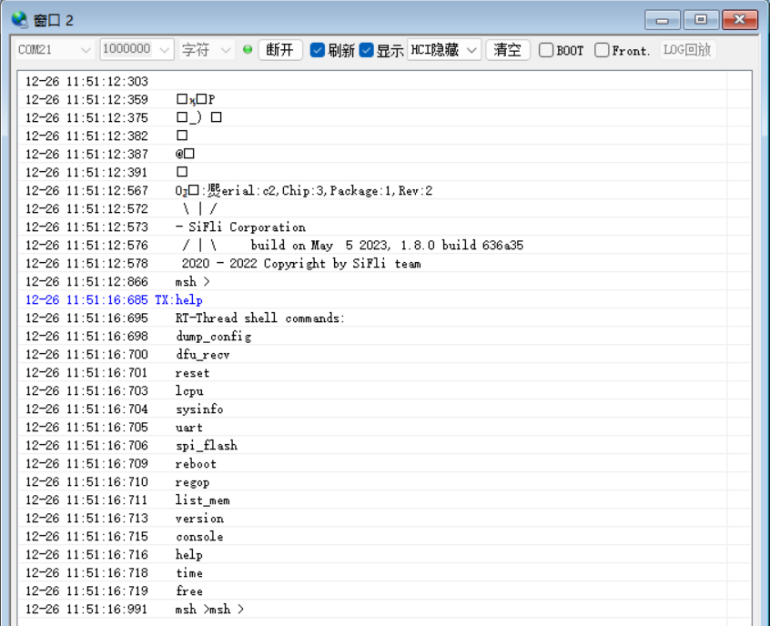<br>
### 1.3 Download
```
> build_em-lb566\uart_download.bat

     Uart Download
```

please input the serial port num:21 # then select the serial port number that can output Log in steps 1.2 for downloading 
```
### 1.4 Confirm Normal LOG
Remove the shorting jumper from step 1.2, power on and reset, let the MCU run the user program. If the following Log is output, it indicates that the development board is running normally, and you can proceed to the next step to add a new screen module<br>
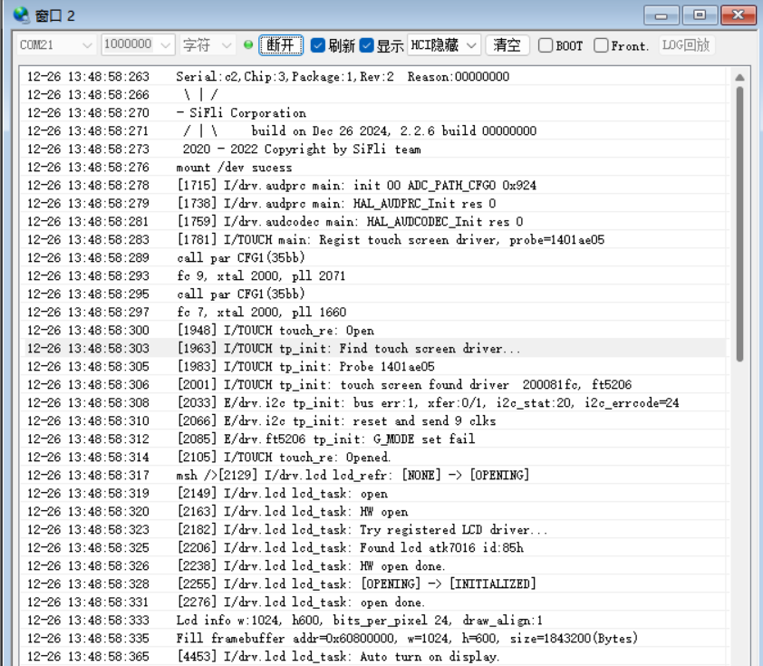
## 2 Add Screen Driver NV3052C
### 2.1 Create NV3052C Driver
1) Screen Driver Location<br>
The screen driver is located in the `sdk\customer\peripherals` directory<br>
2) Copy the Driver<br>
Copy another `dpi` interface driver and rename it to `dpi_nv3052c`<br>
### 2.2 Menuconfig Add NV3052C
1) Modify Kconfig to generate the screen option in menuconfig<br>
Open `sdk\customer\boards\Kconfig_lcd` with a text editor and add a DPI screen option and resolution as follows<br>
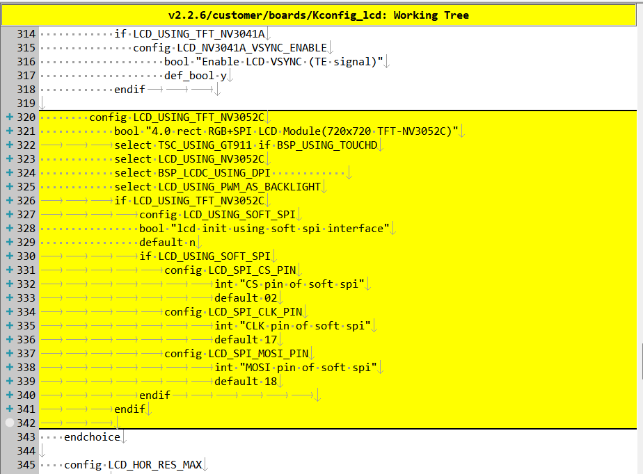<br>
```
# menuconfig generated menu options
        config LCD_USING_TFT_NV3052C
            bool "4.0 rect RGB+SPI LCD Module(720x720 TFT-NV3052C)"     # characters displayed in menuconfig
			select TSC_USING_GT911 if BSP_USING_TOUCHD      # if TP is available, this macro determines whether the corresponding TP driver is compiled
            select LCD_USING_NV3052C        # whether the files in the spi_nv3052c folder are compiled depends on this macro
            select BSP_LCDC_USING_DPI       # select DPI interface      
            select LCD_USING_PWM_AS_BACKLIGHT # whether to enable the screen's PWM backlight, screens with backlight need to enable this
			if LCD_USING_TFT_NV3052C
				config LCD_USING_SOFT_SPI # whether the DPI screen needs SPI for initialization
                bool "lcd init using soft spi interface" # characters displayed in menuconfig
                default n
				if LCD_USING_SOFT_SPI
					config LCD_SPI_CS_PIN # CS pin for software SPI
							int "CS pin of soft spi" # characters displayed in menuconfig
							default 02 # default PA02
					config LCD_SPI_CLK_PIN  # CLK pin for software SPI
							int "CLK pin of soft spi" # characters displayed in menuconfig
							default 17 # default PA17, if PB port +96, for example PB02 here is configured as 98
					config LCD_SPI_MOSI_PIN # MOSI pin for software SPI
							int "MOSI pin of soft spi" # characters displayed in menuconfig
							default 18 # default PA18
				endif						
			endif
# LCD_HOR_RES_MAX set to the screen's horizontal resolution 
        default 720 if LCD_USING_TFT_NV3052C
# LCD_VER_RES_MAX set to the screen's vertical resolution        
        default 720 if LCD_USING_TFT_NV3052C
# LCD_DPI pixel density, the number of pixels per inch on the screen, if unknown, use the default 315
        default 315 if LCD_USING_TFT_NV3052C
```
2) Add LCD_USING_NV3052C<br>
Open the file `sdk\customer\peripherals\Kconfig` with a text editor and add the following<br>
```
config LCD_USING_NV3052C # add this configuration so it can be selected in Kconfig
    bool
    default n
```
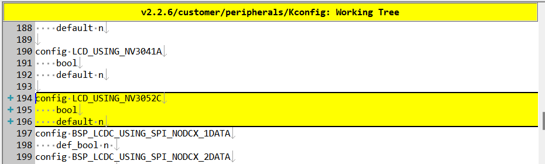<br>
3) Modify SConscript<br>
Open the file `customer\peripherals\dpi_nv3052c\SConscript` with a text editor and modify the macro `LCD_USING_NV3052C`, so that the *.c and *.h files in this directory can be included in the compilation<br>
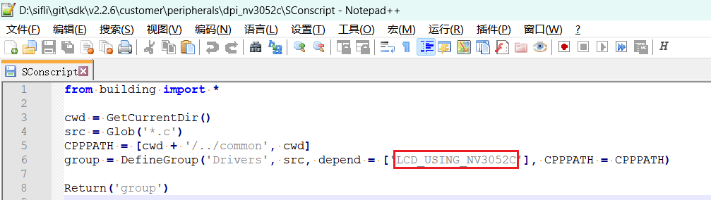<br>
### 2.3 Menuconfig Select NV3052C
After completing the above steps, enter the following command in the compilation window and select the newly added nv3052c screen<br>
> `menuconfig --board=em-lb566` (open the menuconfig window)
In this path `(Top) → Config LCD on board → Enable LCD on the board → Select LCD` select the newly added screen. If the DPI screen requires SPI initialization, select `lcd init using soft spi interface` and configure the three SPI IO pins. After saving and exiting, the screen driver in the `dpi_nv3052c` directory will be included in the compilation<br>
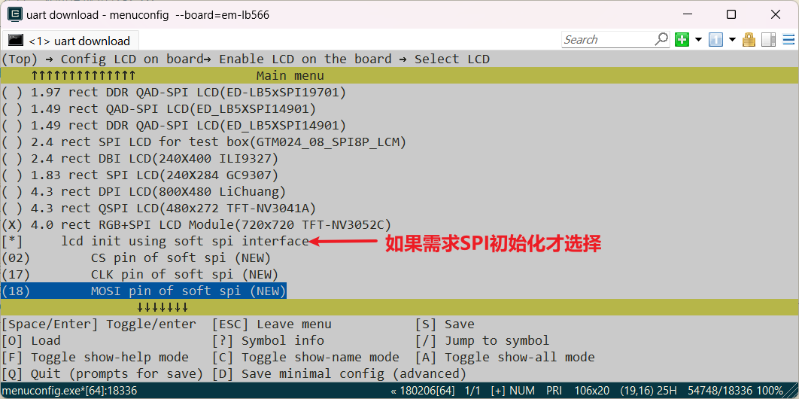<br>
## 3 Generate SourceInsight Project  
To facilitate viewing the code files included in the compilation, you can generate a list of files in the rt-driver project and import them into Source Insight. You can skip this section.
### 1 Generate File List
Run the command `scons --board=em-lb566 --target=si` to generate `si_filelist.txt`<br>
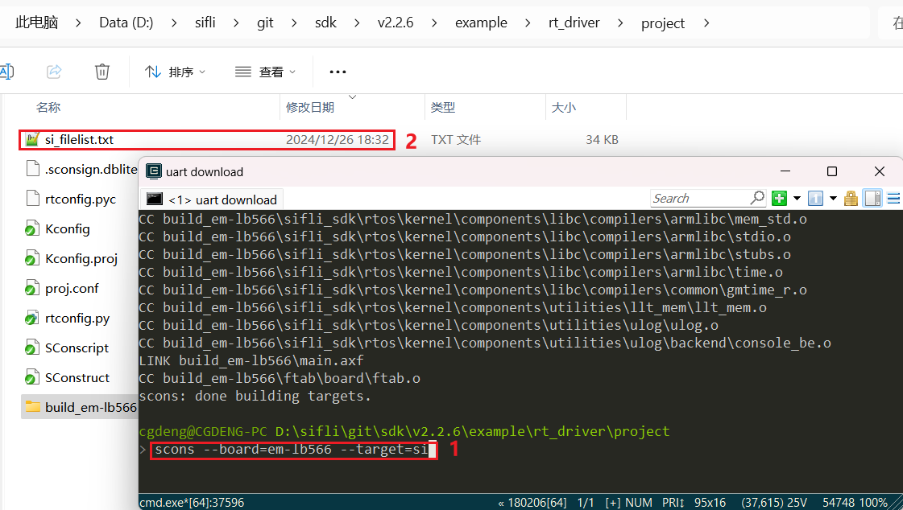<br>
### 2 Import File List
Open Source Insight and import `si_filelist.txt` into the project<br>  
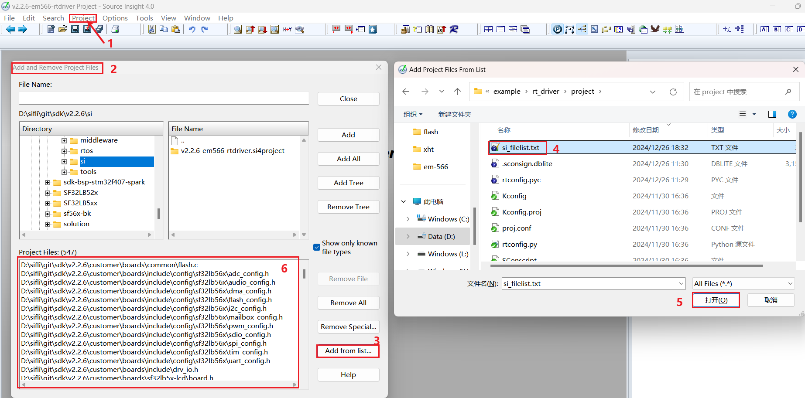<br>
### 3 Check if the Screen Driver is Effective
In the SI (Source Insight) project, check if the corresponding macros in `rtconfig.h` are generated and if `dpi_nv3052c.c` is included in the compilation  
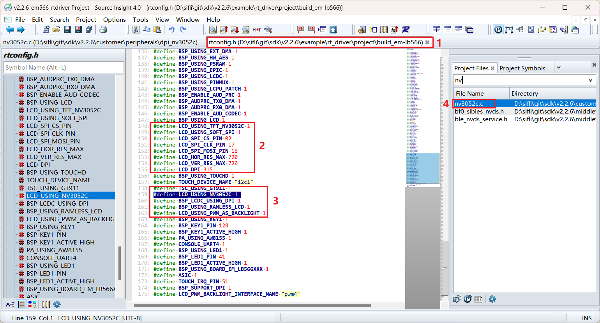<br>
## 4 Screen Hardware Connection
### 4.1 Ribbon Cable Connection
If you have a matching screen module, simply connect the ribbon cable to the socket<br>
### 4.2 Flywire Connection
If the new screen module has a different ribbon cable arrangement, you will need to design a ribbon cable adapter or use flywires for debugging.  
You can refer to the [SF32LB52-DevKit-LCD Adapter Guide](../../board/sf32lb52x/SF32LB52-DevKit-LCD-Adapter.md#qspi-lcd接口转接板) for designing the adapter board  
## 5 Screen Driver Configuration
### 5.1 Default IO Configuration
If you are using the default IO, you can skip this section
#### 5.1.1 IO Mode Setting
The LCD uses LCDC1 hardware to output waveforms, and must be configured to the corresponding FUNC mode,<br>
Refer to the hardware documentation [Download SF32LB56X_Pin_config](./assets/SF32_LB56_MOD_pinconfig_20240717.xlsx) for the functions of each IO<br>
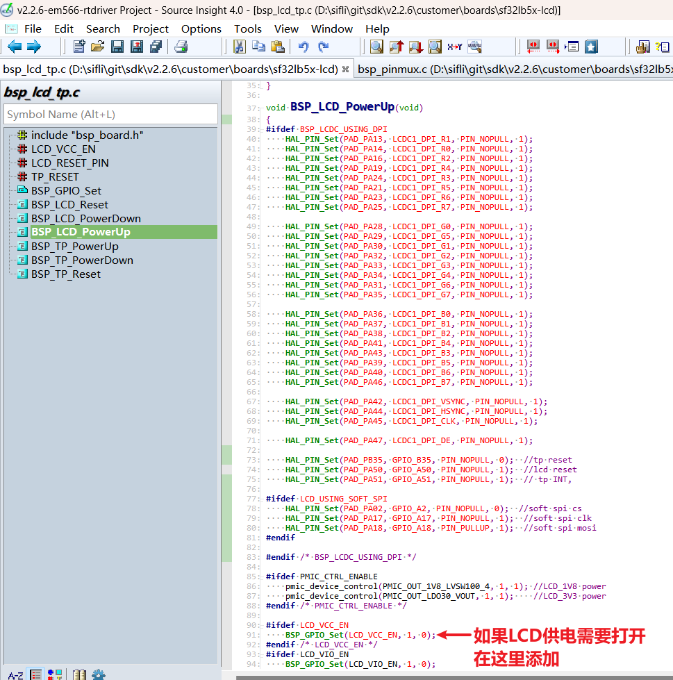<br>
The RESET pins for the LCD and TP are configured as GPIO mode by default. If the LCD power needs to be turned on separately, it should also be configured here.
```c
void BSP_LCD_PowerUp(void)
{
#ifdef BSP_LCDC_USING_DPI
    HAL_PIN_Set(PAD_PA13, LCDC1_DPI_R1, PIN_NOPULL, 1);
    HAL_PIN_Set(PAD_PA14, LCDC1_DPI_R0, PIN_NOPULL, 1);
    HAL_PIN_Set(PAD_PA16, LCDC1_DPI_R2, PIN_NOPULL, 1);
    HAL_PIN_Set(PAD_PA19, LCDC1_DPI_R4, PIN_NOPULL, 1);
    HAL_PIN_Set(PAD_PA24, LCDC1_DPI_R3, PIN_NOPULL, 1);
    HAL_PIN_Set(PAD_PA21, LCDC1_DPI_R5, PIN_NOPULL, 1);
    HAL_PIN_Set(PAD_PA23, LCDC1_DPI_R6, PIN_NOPULL, 1);
    HAL_PIN_Set(PAD_PA25, LCDC1_DPI_R7, PIN_NOPULL, 1);
```

HAL_PIN_Set(PAD_PA28, LCDC1_DPI_G0, PIN_NOPULL, 1);
    HAL_PIN_Set(PAD_PA29, LCDC1_DPI_G5, PIN_NOPULL, 1);
    HAL_PIN_Set(PAD_PA30, LCDC1_DPI_G1, PIN_NOPULL, 1);
    HAL_PIN_Set(PAD_PA32, LCDC1_DPI_G2, PIN_NOPULL, 1);
    HAL_PIN_Set(PAD_PA33, LCDC1_DPI_G3, PIN_NOPULL, 1);
    HAL_PIN_Set(PAD_PA34, LCDC1_DPI_G4, PIN_NOPULL, 1);
    HAL_PIN_Set(PAD_PA31, LCDC1_DPI_G6, PIN_NOPULL, 1);
    HAL_PIN_Set(PAD_PA35, LCDC1_DPI_G7, PIN_NOPULL, 1);

    HAL_PIN_Set(PAD_PA36, LCDC1_DPI_B0, PIN_NOPULL, 1);
    HAL_PIN_Set(PAD_PA37, LCDC1_DPI_B1, PIN_NOPULL, 1);
    HAL_PIN_Set(PAD_PA38, LCDC1_DPI_B2, PIN_NOPULL, 1);
    HAL_PIN_Set(PAD_PA41, LCDC1_DPI_B4, PIN_NOPULL, 1);
    HAL_PIN_Set(PAD_PA43, LCDC1_DPI_B3, PIN_NOPULL, 1);
    HAL_PIN_Set(PAD_PA39, LCDC1_DPI_B5, PIN_NOPULL, 1);
    HAL_PIN_Set(PAD_PA40, LCDC1_DPI_B6, PIN_NOPULL, 1);
    HAL_PIN_Set(PAD_PA46, LCDC1_DPI_B7, PIN_NOPULL, 1);

    HAL_PIN_Set(PAD_PA42, LCDC1_DPI_VSYNC, PIN_NOPULL, 1);
    HAL_PIN_Set(PAD_PA44, LCDC1_DPI_HSYNC, PIN_NOPULL, 1);
    HAL_PIN_Set(PAD_PA45, LCDC1_DPI_CLK, PIN_NOPULL, 1);

    HAL_PIN_Set(PAD_PA47, LCDC1_DPI_DE, PIN_NOPULL, 1);

    HAL_PIN_Set(PAD_PB35, GPIO_B35, PIN_NOPULL, 0);    // tp reset
    HAL_PIN_Set(PAD_PA50, GPIO_A50, PIN_NOPULL, 1);    // lcd reset
    HAL_PIN_Set(PAD_PA51, GPIO_A51, PIN_NOPULL, 1);    // tp INT,

#ifdef LCD_USING_SOFT_SPI
    HAL_PIN_Set(PAD_PA02, GPIO_A2, PIN_NOPULL, 0);     // soft spi cs
    HAL_PIN_Set(PAD_PA17, GPIO_A17, PIN_NOPULL, 1);    // soft spi clk
    HAL_PIN_Set(PAD_PA18, GPIO_A18, PIN_PULLUP, 1);    // soft spi mosi
#endif

#endif /* BSP_LCDC_USING_DPI */

#ifdef PMIC_CTRL_ENABLE
    pmic_device_control(PMIC_OUT_1V8_LVSW100_4, 1, 1); // LCD_1V8 power
    pmic_device_control(PMIC_OUT_LDO30_VOUT, 1, 1);    // LCD_3V3 power
#endif /* PMIC_CTRL_ENABLE */

```c
#ifdef LCD_VCC_EN
    BSP_GPIO_Set(LCD_VCC_EN, 1, 0);                    // If LCD power supply needs to be turned on, add it here
#endif /* LCD_VCC_EN */
#ifdef LCD_VIO_EN
    BSP_GPIO_Set(LCD_VIO_EN, 1, 0);
#endif
}
```
#### 5.1.2 IO Power-On/Power-Off Operations
Below is the LCD initialization process during power-on:
`rt_hw_lcd_ini->api_lcd_init->lcd_task->lcd_hw_open->BSP_LCD_PowerUp-find_right_driver->LCD_drv.LCD_Init->LCD_drv.LCD_ReadID->lcd_set_brightness->LCD_drv.LCD_DisplayOn`
It can be seen that `BSP_LCD_PowerUp` is executed before the screen driver initialization `LCD_drv.LCD_Init`.
Therefore, before initializing the LCD, ensure that `BSP_LCD_PowerUp` has already turned on the LCD power supply.
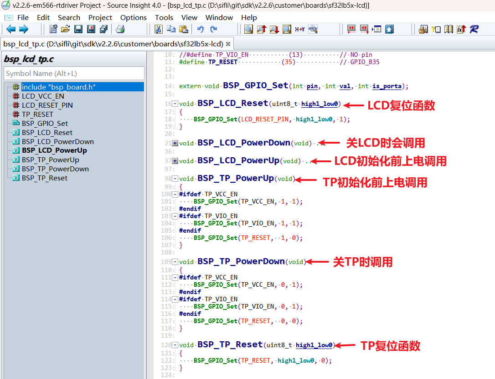
#### 5.1.3 Backlight PWM Configuration
The PWM software has a default configuration, which is set in the file `customer\boards\sf32lb5x-lcd\Kconfig.board`. This `Kconfig.board` configuration will generate the following three macros in `rtconfig.h` after compilation:
```c
// PWM4 requires GPTIM3 to be enabled. The correspondence between PWM and TIMER can be found in the PWM section of the FAQ or in the file `pwm_config.h`
#define LCD_PWM_BACKLIGHT_INTERFACE_NAME "pwm3" 
#define LCD_PWM_BACKLIGHT_CHANEL_NUM 4 // Channel 4
#define LCD_BACKLIGHT_CONTROL_PIN 119 // PB23: 96+23 
```
To use PWM4, GPTIM3 needs to be enabled, and Lcpu also needs to be enabled (otherwise, Lcpu might turn off GPTIM3). Additionally, ensure that the following macros in `rtconfig.h` are effective:
```c
#define BSP_USING_GPTIM3 1 // If using PWM3, enable it via menuconfig --board=em-lb566
#define RT_USING_PWM 1
#define BSP_USING_PWM 1
#define BSP_USING_PWM4 1 // If not, enable it via menuconfig --board=em-lb566
```
The correspondence between `pwm4` and `GPTIM3` (located in Lcpu) is defined in the file `pwm_config.h` as follows:
```c
#ifdef BSP_USING_PWM4
#define PWM4_CONFIG                             \
    {                                           \
       .tim_handle.Instance     = GPTIM3,         \
       .tim_handle.core         = PWM4_CORE,    \
       .name                    = "pwm4",       \
       .channel                 = 0             \
    }
#endif /* BSP_USING_PWM4 */
```
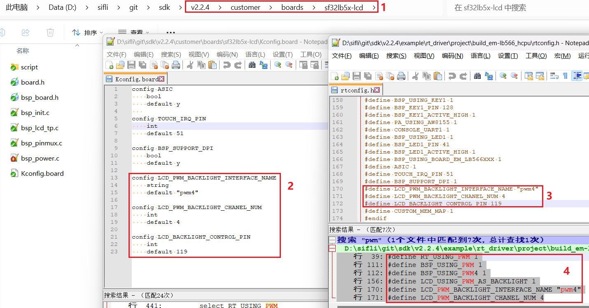
The default configuration for PB23 to output PWM waveforms from the `GPTIM3` device is as follows:
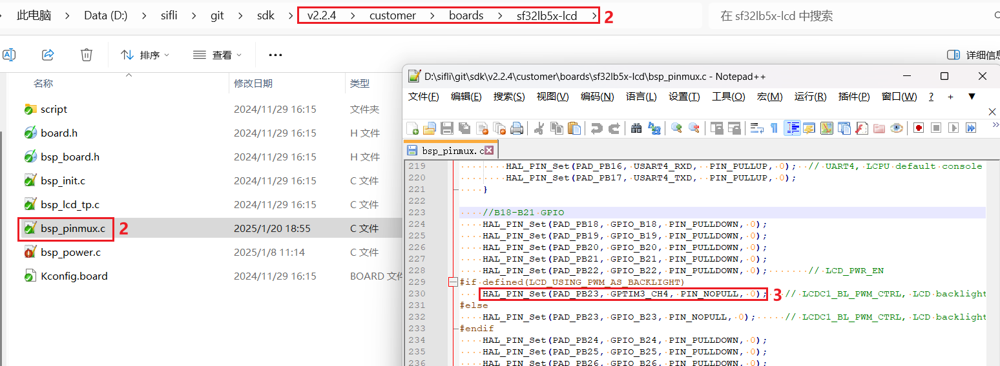
```c
HAL_PIN_Set(PAD_PB23, GPTIM3_CH4, PIN_NOPULL, 0);   // LCDC1_BL_PWM_CTRL, LCD backlight PWM
```
**Note:**
After configuring with the function `HAL_PIN_Set`, the correspondence between GPTIM3_CH4 and PB23 will be established, specifically in the register configuration `hwp_lpsys_cfg->GPTIM3_PINR`, as shown in the following figure:
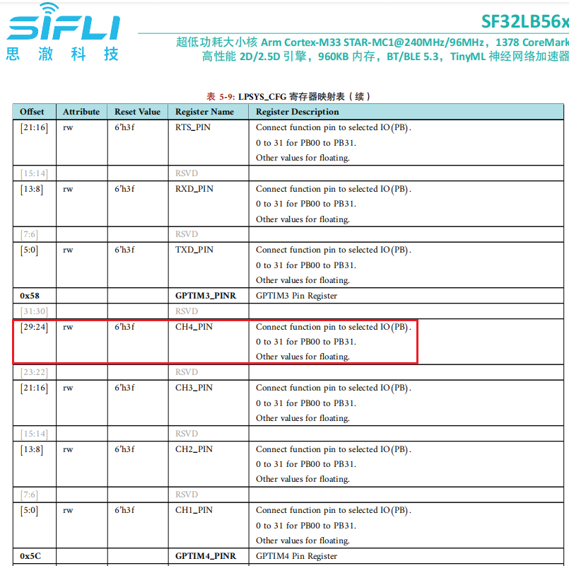
It can be configured to output CH1-CH4, and it must be PB00-PB31. Additionally, Hcpu uses Lcpu's TIMER resources, so Lcpu also needs to enable `#define BSP_USING_GPTIM3 1`, otherwise, in early SDK code `drv_common.c`, `RCC_MOD_GPTIM3` will be disabled, leading to no output from PWM4.
```c
#if !defined(BSP_USING_GPTIM3) && !defined(BSP_USING_PWM4)
    HAL_RCC_DisableModule(RCC_MOD_GPTIM3); // Disable the clock for GPTIM3
#endif /* !BSP_USING_GPTIM3 */
```
### 5.2 LCD Driver Reset Timing
In the `LCD_Init` function of `nv3052c.c`, the following delays are critical and should be carefully modified according to the initialization timing sequence of the screen driver IC:
```c
    BSP_LCD_Reset(1);
    rt_thread_delay(10);
    BSP_LCD_Reset(0);       // Reset LCD
    rt_thread_delay(5);
    BSP_LCD_Reset(1);
    rt_thread_delay(80);
```
### 5.3 LCD Driver Register Modifications
For DPI interface screens that do not require SPI initialization, the macro `LCD_USING_SOFT_SPI` does not need to be enabled. After the screen driver IC is powered on and reset, data can be sent to the RGB data lines. Some DPI screens require SPI interface for register initialization configuration parameters. The initialization register configuration for each screen driver IC is different and must be written to the screen driver IC according to the SPI timing sequence provided by the screen manufacturer. Pay special attention to the delay requirements after writing to registers 0x11 and 0x29.
```c
static void LCD_Init(LCDC_HandleTypeDef *hlcdc)
{
...
#ifdef LCD_USING_SOFT_SPI

    rt_kprintf("LCD_Init soft spi\n");

    lcd_spi_config();

    uint8_t i = 0;
    init_config *init = (init_config *)&lcd_init_cmds[0];
```

```c
for (i = 0; i < buf_size; i++)   // init LCD reg
{
    send_config(init->cmd, init->len, init->data);
    init++;
}
rt_thread_delay(60);
spi_io_comm_write(0x29);         // Display on
rt_thread_delay(60);
#endif
rt_kprintf("LCD_Init end\n");
}
```
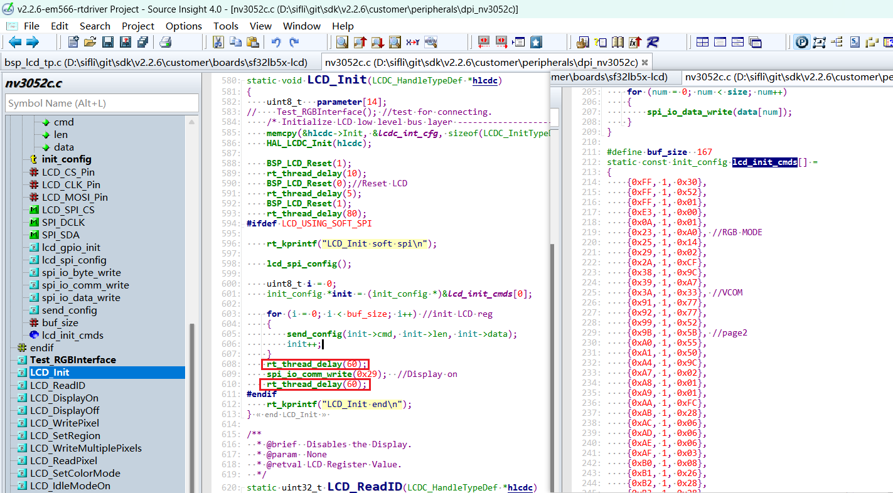<br>
### 5.4 Screen Driver Parameter Configuration
- .lcd_itf: Select `LCDC_INTF_DPI_AUX` to indicate DPI interface mode<br>
- .freq: Select `35 * 1000 * 1000`, indicating the DPI clk frequency is 35 MHz. This clock should be chosen based on the highest clock supported by the screen driver IC. The higher the clock, the shorter the time to send each frame, and the higher the frame rate.<br>
- .color_mode: Choose between `RGB565` and `RGB888` format<br>
```c
static LCDC_InitTypeDef lcdc_int_cfg =
{
    .lcd_itf = LCDC_INTF_DPI_AUX,
    .freq = 35 * 1000 * 1000,
    .color_mode = LCDC_PIXEL_FORMAT_RGB888,

    .cfg = {
        .dpi = {
            .PCLK_polarity = 0,
            .DE_polarity   = 0,
            .VS_polarity   = 1,
            .HS_polarity   = 1,
            .PCLK_force_on = 0,

            .VS_width      = 5,    // VLW
            .HS_width      = 2,    // HLW

            .VBP = 15,             // VBP
            .VAH = 720,
            .VFP = 16,             // VFP

            .HBP = 44,             // HBP
            .HAW = 720,
            .HFP = 44,             // HFP

            .interrupt_line_num = 1,
        },
    },
};
```
### 5.4 RGB Interface Flywire Test Function
If you are debugging with flywires, there are many RGB data lines, and incorrect wiring can lead to no display or abnormal display. You can use the following test function for the RGB interface, which outputs waveforms in the order of R0-R7, G0-G7, B0-B7. You can use a logic analyzer to capture the waveforms to check if the flywires are correct.<br>
```c
Test_RGBInterface(); // test for connecting.
```
## 6 Compilation and Download Results
### 6.1 Display Result Demonstration
As shown in the figure below, if the display is normal, it will show six images in sequence, with a 3-second timer loop.<br>
<br>
```