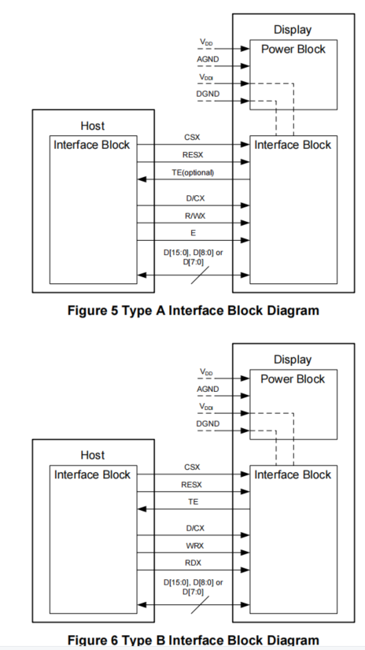
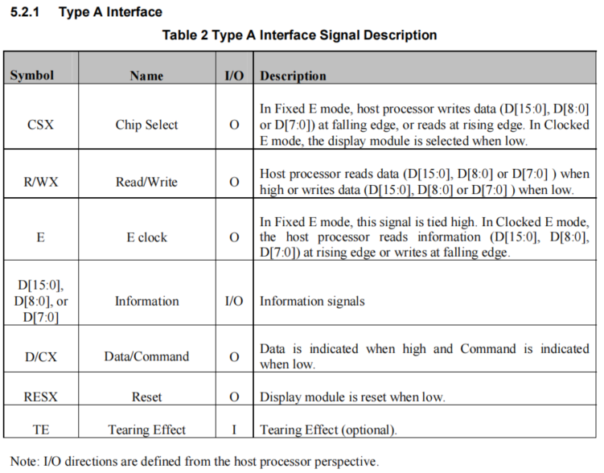
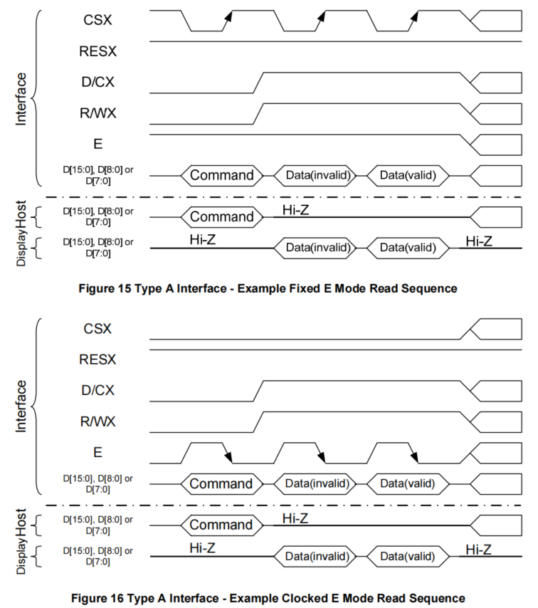
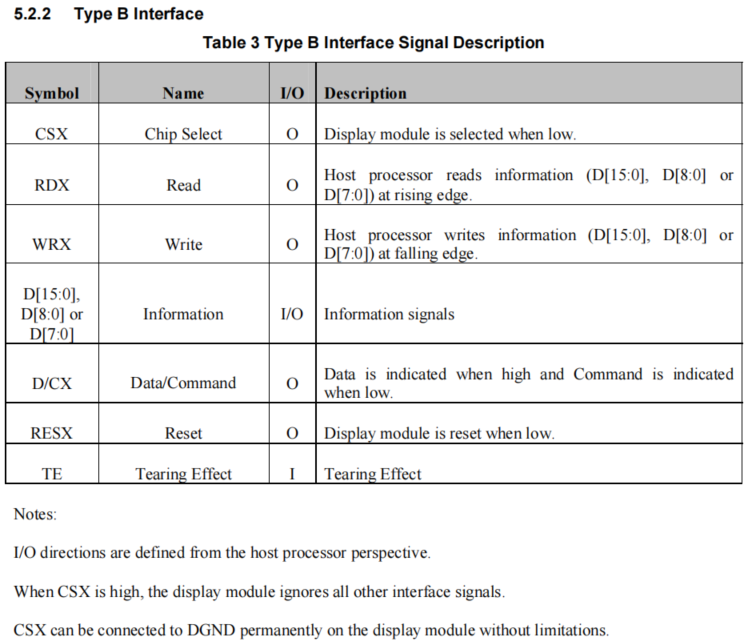

# DBI Screen Parameter Configuration
## Explanation of Screen Parameter Configuration

### **MCU/8080 Interface**
 * The MCU/8080 interface is also known as the DBI (Display Bus Interface) mode, which is divided into TYPE A and TYPE B. The following diagram shows the connection methods of the two different interfaces. The main difference is that TYPE A mode combines the read and write signals into a single R/WX signal and adds an E signal. TYPE A mode is further divided into Fixed E mode and Clocked E mode. In Fixed E mode, the E signal is fixed at a high level (1), and the sampling is controlled by the CS signal. In Clocked E mode, the sampling is controlled by the E signal. The current platform defaults to this mode.

  
* The following are the port descriptions for the two interfaces:
1. TYPE A



2. Differences between Fixed E and Clocked E in TYPE A mode



The configuration for DBI TYPE A mode is as follows:
```c
static const LCDC_InitTypeDef lcdc_int_cfg =
{
    .lcd_itf = LCDC_INTF_DBI_8BIT_A, /* DBI type A Clocked E mode */
    .color_mode = LCDC_PIXEL_FORMAT_RGB565,
};
```

3. TYPE B



The configuration for DBI TYPE B mode is as follows:
```c
static LCDC_InitTypeDef lcdc_int_cfg_dbi =
{
    .lcd_itf = LCDC_INTF_DBI_8BIT_B, /* DBI type B mode */
    .freq = 36000000,
    .color_mode = LCDC_PIXEL_FORMAT_RGB565,

    .cfg = {
        .dbi = {
            .RD_polarity = 0, /* RD polarity selection */
            .WR_polarity = 0, /* WR polarity selection */
            .RS_polarity = 0, /* RS polarity selection */
            .CS_polarity = 0, /* CS polarity selection */
#ifdef LCD_RM69330_VSYNC_ENABLE
            .syn_mode = HAL_LCDC_SYNC_VER,
#else
            .syn_mode = HAL_LCDC_SYNC_DISABLE,
#endif /* LCD_RM69330_VSYNC_ENABLE */
            .vsyn_polarity = 1, /* Vsync field sync signal, polarity selection (effective after TE is enabled) */
            //default_vbp=2, frame rate=82, delay=115us,
            //TODO: use us to define delay instead of cycle, delay_cycle=115*48
            .vsyn_delay_us = 0, /* Delay after the (Vsync) TE signal, before sending to the screen (effective after TE is enabled) */
            .hsyn_num = 0,  /* Number of clk pulses after the (Vsync) TE signal, delay for a few clk pulses before sending to the screen (effective after TE is enabled) */
        },
    },

};
```