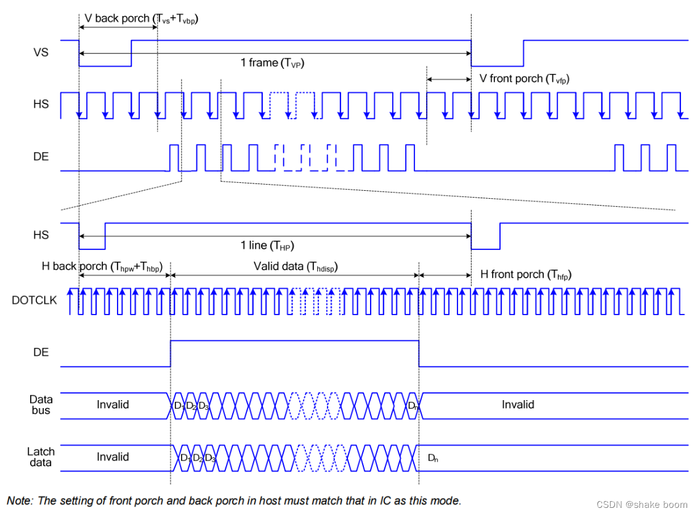
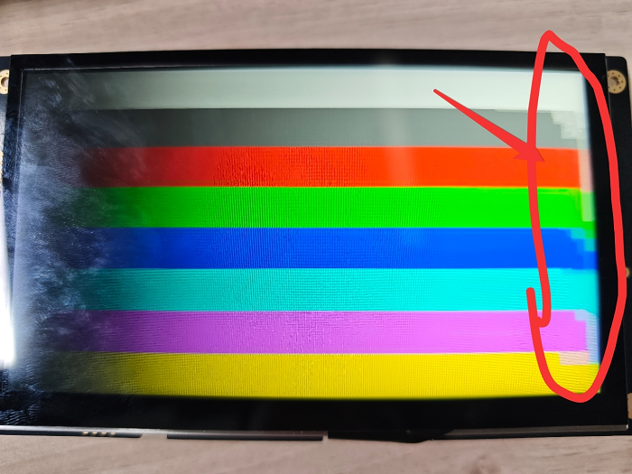

# DPI Screen Parameter Configuration

## Explanation of Screen Parameter Configuration
### **DPI/RGB Interface**
RGB LCD screens generally have two data synchronization methods: one is the frame and line synchronization mode (HV Mode), and the other is the data enable synchronization mode (DE Mode). When the frame and line synchronization mode is selected, the line synchronization signal (HSYNC) and the frame synchronization signal (VSYNC) are used as the data synchronization signals, and at this time, the data enable signal (DE) must be low.
When the DE synchronization mode is selected, the DE signal of the LCD is used as the valid data signal, as shown in the example diagram. The DE signal is only valid (high level) when both the frame valid display area and the line valid display area are scanned simultaneously. When the DE synchronization mode is selected, the line and frame synchronization signals VS and HS must be high.
Since most RGB LCD screens support DE mode, not all RGB LCD screens support HV mode, this chapter introduces driving the LCD screen using the DE synchronization method.

```c
static LCDC_InitTypeDef lcdc_int_cfg =
{
    .lcd_itf = AUTO_SELECTED_DPI_INTFACE,
/*
    The clock frequency of the DPI interface is selected as the frequency after the hcpu main frequency is divided. For example, if the hcpu main frequency is 240 MHz, the available frequencies can only be 40/48/60/80. If 62 MHz is set, it will actually be set to 60 MHz.
*/    
    .freq = 48 * 1000 * 1000,
/*
DPI interface output color format
1. LCDC_PIXEL_FORMAT_RGB565 for common RGB565 color
2. LCDC_PIXEL_FORMAT_RGB888 for common RGB888 color 
*/    
    .color_mode = LCDC_PIXEL_FORMAT_RGB888,

    .cfg = {
        .dpi = {
            .PCLK_polarity = 0, /* Select the polarity of the Pclk (pixel clock signal line) in the DPI waveform */
            .DE_polarity   = 0, /* Select the polarity of the DE (data enable signal) in the DPI waveform */
            .VS_polarity   = 1, /* Select the polarity of the VS (V sync frame synchronization signal) in the DPI waveform */
            .HS_polarity   = 1, /* Select the polarity of the HS (H sync line synchronization signal) in the DPI waveform */

            .VS_width      = 2,  /* Select the width of the VS (frame synchronization signal) duration, in units of (number of HS waveforms) */
            .HS_width      = 2, /* Select the width of the HS (line synchronization signal) duration, in units of (number of Pclk waveforms) */
            .VBP = 23,   /* VBP (V back porch frame display rear or rear shoulder) width, in units of (number of HS waveforms) */
            .VAH = 600, /* Select the vertical height of the screen, in units of (lines) */
            .VFP = 12,   /* VFP (V front porch frame display front or front shoulder) width, in units of (number of HS waveforms)*/

            .HBP = 160,  /* HBP (H back porch line display rear or rear shoulder) width, in units of (number of Pclk waveforms) */
            .HAW = 1024, /* Select the horizontal width of the screen, in units of (columns) */
            .HFP = 160,  /* HFP (H front porch line display front or front shoulder) width, in units of (number of Pclk waveforms) */

            .interrupt_line_num = 1,
        },
    },
};
```

According to the PCLK, DE, VS, HS polarity configuration, the corresponding waveform shown in the figure below can be output:

[Reference Article:](https://blog.csdn.net/weixin_50965981/article/details/134496428)https://blog.csdn.net/weixin_50965981/article/details/134496428
***

## Bandwidth Requirements
The screen refresh of the DPI screen requires stable read access to the RAM where the framebuffer is located. Therefore, it is best to ensure that this RAM is used only for screen refresh operations and not for other operations (such as frequently accessed global variables, thread stacks, or other buffers accessed by DMA), otherwise, it may cause display anomalies, including black lines and flickering on the right side of the screen.

Generally, the bandwidth of SRAM is sufficient and does not need to be specified separately, but the bandwidth of PSRAM may not be sufficient. Therefore, if the framebuffer is located in PSRAM, it is best to meet the conditions mentioned above.

As shown in the figure, this is the screen when the buffer is placed in PSRAM and the bandwidth is insufficient (the bandwidth is insufficient because the CPU is filling the next frame's framebuffer in PSRAM).


## Usage Restrictions of DPI_AUX Mode
If your screen width is ≤512 pixels, this mode will not be used, so you do not need to be concerned about this part.

If your screen width is ≤1024 pixels and you are using the 58x chip, you also do not need to be concerned about this part.

### What is DPI_AUX
The macro `AUTO_SELECTED_DPI_INTFACE` for the DPI screen interface will automatically select one of the following two modes based on the chip and screen width:

- **DPI Mode**<br>
  Native mode of the LCD controller, supporting a maximum screen width of 1024 for 58x and 512 for others.

- **DPI_AUX Mode**<br>
  Auxiliary mode for screens exceeding the native mode width of the LCD controller.

### Usage Restrictions
When using the DPI_AUX mode, the following usage restrictions apply:

#### 1. Automatic System Clock Frequency Scaling (BSP_PM_FREQ_SCALING) Must Not Be Enabled
Automatic frequency scaling can affect the operation of the hardware refresh mechanism. Frequency scaling can only be performed after the screen is turned off.
#### 2. The Framebuffer Must Be Full Screen and the Number of Lines Must Be Even
#### 3. The Following Arrays Must Be Placed in SRAM, but Not in the Retention-SRAM Segment

`ramless_code`, `sram_data0`, `sram_data1` in `drv_lcd.c`
* For 55x, avoid placing them in the range 0x00020000 ~ 0x00030000
* For 56x, avoid placing them in the range 0x20000000 ~ 0x20020000

:::{note}
After SDK 2.2.4, these arrays are automatically allocated from the system heap to a non-Retention-SRAM memory.
:::
#### 4. The Following Hardware Modules Must Be Occupied Throughout the Screen Refresh:

For 56x:
1. One channel of the general-purpose DMA (configurable, default DMA1-CH5)
2. EXTDMA
3. PTC module
4. BUSMONITOR
5. BTIM2

55x:
1. A channel of the standard DMA (configurable, default DMA1-CH8)
2. EXTDMA
3. PTC module
4. BUSMONITOR
5. BTIM1, BTIM2


```{caution}
1. For NAND systems, enable PSRAM_CACHE_WB to avoid conflicts with EXTDMA usage
2. Avoid using lvgl lv_scheme0 (LV_FRAME_BUF_SCHEME_0) to avoid conflicts with EXTDMA usage
3. Avoid using sifli_memcpy, sifli_memset to avoid conflicts with EXTDMA usage
4. In dma_config.h, configure the DMA channels based on the current usage of SPI, UART, I2C, I2S, etc., to avoid DMA channel conflicts
```