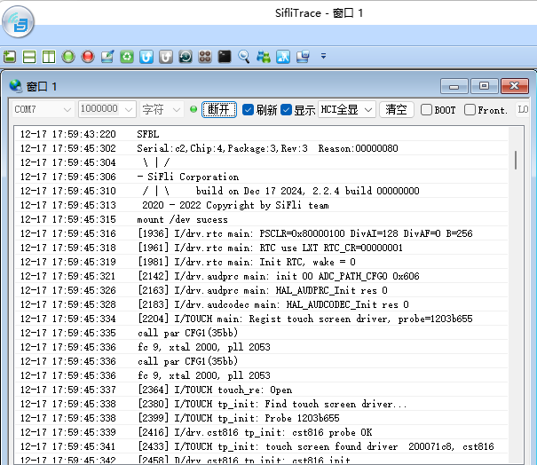
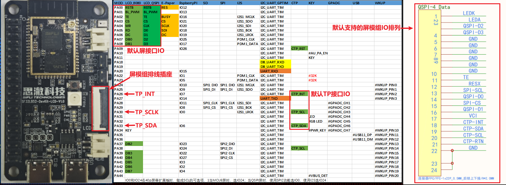
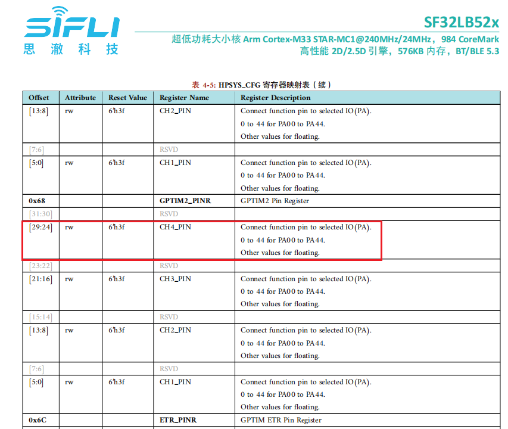
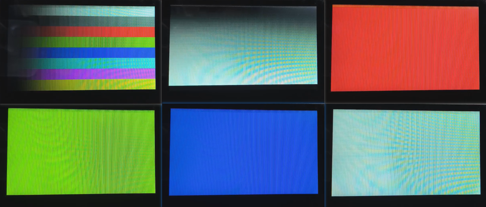

# SF32LB52x-DevKit-LCD Add SPI-LCD Example (External)
### 1 Confirm the rt-driver Project is Running Normally
It is recommended to use the rt-driver project for screen debugging. Before debugging, confirm that the rt-driver project can run normally and print logs.<br>
#### 1.1 Compilation
Enter the `example\rt_driver\project` directory, right-click and select `ComEmu_Here` to pop up the compilation command serial port, and execute the following commands in sequence:<br>
```
> D:\sifli\git\sdk\v2.2.4\set_env.bat   # Set the compilation environment path
> scons --board=sf32lb52-lcd_n16r8 -j8   # Compile the rt-driver project for the sf32lb52-lcd_n16r8 module
```
<br>
#### 1.2 Enter BOOT Mode
Confirm that the `sf32lb52-lcd_n16r8` module board is in `boot` mode for easy downloading, as shown in the following figure:<br>
<br>
#### 1.3 Download
```
> build_sf32lb52-lcd_n16r8\uart_download.bat

     Uart Download

please input the serial port num:7 # Then select the serial port number connected to the sf32lb52-lcd_n16r8 module for downloading
```
#### 1.4 Confirm Normal LOG
As shown in the following figure, uncheck the `BOOT` option to run the user program. After confirming that the board is running, you can proceed to the next step to add the new screen module.<br>

### 2 Add Screen Driver gc9107
#### 2.1 Create gc9107 Driver
1) Add the project and modify the Kconfig.proj file in the new screen driver folder `sdk-demo`<br>
Copy `SDK\example\rt_driver` (if you already have an external project, you can directly modify and add it in the project), and rename it to `multi_screen` outside the SDK. Modify the `Kconfig.proj` file in `project` to add the following content:<br>
```
#APP specific configuration.

comment "------------Project configuration-----------"  

if !BSP_USING_BUILT_LCD
    ···
endif
```
2) Modify the `proj.conf` file<br>
* Add `# CONFIG_BSP_USING_BUILTIN_LCD is not set` in `project\proj.conf` to use the external screen driver and disable the internal screen driver in the SDK.<br>
If you want to use the external screen driver for a specific board or the internal screen driver, you can create a new file in the project directory, for example, `sf32lb52-lcd_n16r8/proj.conf`, and add `# CONFIG_BSP_USING_BUILTIN_LCD is not set` or `CONFIG_BSP_USING_BUILTIN_LCD=y`.
3) Copy the driver<br>
The internal screen driver of the SDK is located in `sdk\customer\peripherals`. Copy another `spi` interface driver and place it in the newly created screen driver folder `sdk-demo`, and rename it to `qspi_gc9107`<br>
#### 2.2 Add gc9107_Multi_screen in Menuconfig
1) Modify Kconfig to generate the screen options in menuconfig<br>
Open `project\Kconfig.proj` with a text editor and add the options and resolution for the screen, as follows:<br>
<br>
```
# Menuconfig options
    choice
        prompt "Custom LCD driver"
        default LCD_USING_TFT_ZJY085_MULTI_SCREEN
		
        config LCD_USING_TFT_ZJY085_MULTI_SCREEN
            bool "0.85 rect SPI LCD(0.85TFT-SPI)--Multi_screen"   # Text displayed in menuconfig
            select LCD_USING_GC9107_MULTI_SCREEN   # Compilation dependency for files in the spi_gc9107 folder
            select BSP_LCDC_USING_SPI_DCX_1DATA    # Select SPI interface
	endchoice

    config LCD_HOR_RES_MAX  # Horizontal resolution of the screen
        int
        default 384 if LCD_USING_TFT_ZJY085_MULTI_SCREEN

    config LCD_VER_RES_MAX  # Vertical resolution of the screen
        int
        default 256 if LCD_USING_TFT_ZJY085_MULTI_SCREEN

    config LCD_DPI     # Pixel density, number of pixels per inch on the screen, default to 315 if unknown
        int
        default 214 if LCD_USING_TFT_ZJY085_MULTI_SCREEN
```
2) Add LCD_USING_GC9107_MULTI_SCREEN<br>
Open the file `project\Kconfig.proj` with a text editor and add the following:<br>
```
if !BSP_USING_BUILT_LCD

	config LCD_USING_GC9107_MULTI_SCREEN  # Add this configuration to enable selection in Kconfig
		bool
		default n
```

endif
```
<br>
3) Modify SConscript<br>
Open the file `gc9107_Multi_screen\SConscript` with a text editor and modify the macro `LCD_USING_GC9107_MULTI_SCREEN`, so that the *.c and *.h files in this directory can be included in the compilation.<br>
<br>
#### 2.3 Select gc9107_Multi_screen in Menuconfig
After completing the above steps, enter the following command in the compilation window and select the gc9107_Multi_screen display that was just added:<br>
 `menuconfig --board=sf32lb52-lcd_n16r8` (to open the menuconfig window)
In this path `(Top) →Custom LCD driver`, select the display that was just added, as shown below. Save and exit to include the spi_gc9107_Multi_screen directory's display driver in the compilation.<br>
<br>

### 3 Screen Hardware Connection
#### 3.1 Ribbon Cable Connection
If you have purchased a matching screen module, you can directly connect the ribbon cable to the socket as shown in the following figure<br>
<br>
#### 3.2 Flying Wire Connection
If the new screen module has an inconsistent ribbon cable arrangement, you will need to design a ribbon cable adapter or use flying wires for debugging.  
You can refer to the [SF32LB52-DevKit-LCD Adapter Board Guide](../../board/sf32lb52x/SF32LB52-DevKit-LCD-Adapter.md#sf32lb52-devkit-lcd转接板制作指南) for designing the adapter board.
### 4 Screen Driver Configuration
#### 4.1 Default IO Configuration
If you are using the default IO, you can skip this section.
##### 4.1.1 IO Mode Setting
The LCD uses LCDC1 hardware to output waveforms, and it needs to be configured to the corresponding FUNC mode,<br>
You can refer to the hardware documentation [Download SF32LB52X_Pin_config](./assets/EH-SF32LB52X_Pin_config_V1.3.0_20241114.xlsx) for the functions of each IO.<br>
<br>
The RESET pins for the LCD and TP are configured in GPIO mode by default.
```c
 HAL_PIN_Set(PAD_PA00, GPIO_A0,  PIN_NOPULL, 1);     // #LCD_RESETB
 HAL_PIN_Set(PAD_PA09, GPIO_A9,  PIN_NOPULL, 1);     // CTP_RESET
```
##### 4.1.2 IO Power-On Operations
The following is the power-on initialization sequence for the LCD:<br>
`rt_hw_lcd_ini->api_lcd_init->lcd_task->lcd_hw_open->BSP_LCD_PowerUp-find_right_driver->LCD_drv.LCD_Init->LCD_drv.LCD_ReadID->lcd_set_brightness->LCD_drv.LCD_DisplayOn`<br>
You can see that `BSP_LCD_PowerUp` is called before the screen driver initialization `LCD_drv.LCD_Init`.<br>
Therefore, ensure that the LCD power supply is turned on in `BSP_LCD_PowerUp` before initializing the LCD.<br>
<br>
##### 4.1.3 Backlight PWM Configuration
There is a default configuration in the PWM software, which is defined in the file `customer\boards\sf32lb52-lcd_n16r8\Kconfig.board`. This `Kconfig.board` configuration will generate the following three macros in `rtconfig.h` after compilation:
```c
// PWM3 requires GPTIM2 to be enabled. The relationship between PWM and TIMER can be found in the PWM section of the FAQ or in the file `pwm_config.h`
#define LCD_PWM_BACKLIGHT_INTERFACE_NAME "pwm3" // PWM device name
#define LCD_PWM_BACKLIGHT_CHANEL_NUM 4 // Channel 4
#define LCD_BACKLIGHT_CONTROL_PIN 1 // PA01
```
Using PWM3 requires GPTIM2 (located in Hcpu) to output. You need to ensure that the following macros in `rtconfig.h` are enabled:
```c
#define BSP_USING_GPTIM2 1 // If using PWM3, enable it in menuconfig --board=sf32lb52-lcd_n16r8
#define RT_USING_PWM 1
#define BSP_USING_PWM 1
#define BSP_USING_PWM3 1 // If not, enable it in menuconfig --board=sf32lb52-lcd_n16r8
```
The correspondence between `pwm3` and `GPTIM2` is defined in the file `pwm_config.h` as follows:
```c
#ifdef BSP_USING_PWM3
#define PWM3_CONFIG                             \
    {                                           \
       .tim_handle.Instance     = GPTIM2,         \
       .tim_handle.core         = PWM3_CORE,    \
       .name                    = "pwm3",       \
       .channel                 = 0             \
    }
#endif /* BSP_USING_PWM3 */
```
<br>
The software defaults to outputting the PWM waveform from PA01 via the `GPTIM2` device `pwm3`, as configured in the following:
<br>
```c
HAL_PIN_Set(PAD_PA01, GPTIM2_CH4, PIN_NOPULL, 1);   // LCDC1_BL_PWM_CTRL, LCD backlight PWM
```
**Note:**<br>
After configuring with the function `HAL_PIN_Set`, the correspondence between GPTIM2_CH4 and PA01 will be established, specifically in the register configuration `hwp_hpsys_cfg->GPTIM2_PINR`, as shown in the following figure:<br>
<br>
You can configure it to output on CH1-CH4, and it must be on PA00-PA44.
#### 4.2 Screen Driver Reset Timing
The following delays are critical and should be carefully adjusted according to the initialization timing of the screen driver IC.
```c
    BSP_LCD_Reset(0);// Reset LCD
    HAL_Delay_us(20);
    BSP_LCD_Reset(1);
```
#### 4.3 Screen Driver Register Modification
The initialization register configuration for each screen driver IC can vary significantly. You need to follow the register parameters provided by the screen manufacturer and write them to the screen driver IC in sequence according to their SPI timing, paying special attention to the delay requirements after writing to register 0x11.
```c
    LCD_WriteReg_More(hlcdc, 0x11, parameter, 1);
    LCD_DRIVER_DELAY_MS(120);
```

LCD_WriteReg_More(hlcdc, 0xFE, parameter, 0); // internal reg enable
    LCD_WriteReg_More(hlcdc, 0xEF, parameter, 0); // internal reg enable
```
#### 4.4 Screen Driver Parameter Configuration
- .lcd_itf ： Select LCDC_INTF_SPI_DCX_1DATA for SPI 1-line mode<br>
- .freq ： Select 48000000, indicating the SPI clock frequency is 48 MHz. This clock should be chosen based on the highest clock supported by the screen driver IC. The higher the clock, the shorter the time to send each frame, and the higher the frame rate.<br>
- .color_mode ： Choose between RGB565 and RGB888 format<br>
- .syn_mode ： Choose whether to enable the TE (Tear Effect) prevention function. If TE is enabled and the screen driver IC does not have a TE signal, it will not send data to the screen, causing a Timeout and system hang. It is recommended to disable TE during initial debugging.<br>
- .vsyn_polarity ： Choose the polarity of the TE signal<br>
- .vsyn_delay_us ： Choose the delay in microseconds after the TE waveform arrives before LCDC1 starts sending data to the screen driver IC<br>
- .readback_from_Dx ： Choose which signal line (D0-D3) the screen driver IC uses to output data when reading the Chipid via QSPI (refer to the screen driver IC manual)<br>
```c
static LCDC_InitTypeDef lcdc_int_cfg =
{
    .lcd_itf = LCDC_INTF_SPI_DCX_1DATA,
    .freq = 48000000,
    .color_mode = LCDC_PIXEL_FORMAT_RGB565,
    .cfg = {
        .spi = {

            .dummy_clock = 0,
            .syn_mode = HAL_LCDC_SYNC_DISABLE,
            .vsyn_polarity = 0,
            .vsyn_delay_us = 0,
            .hsyn_num = 0,
        },
    },

};
```
### 5 Compilation and Download Results
#### 5.1 Display Result Demonstration
As shown in the figure below, if the display is normal, it will show 6 images in sequence, with a 3-second loop.<br>
<br>