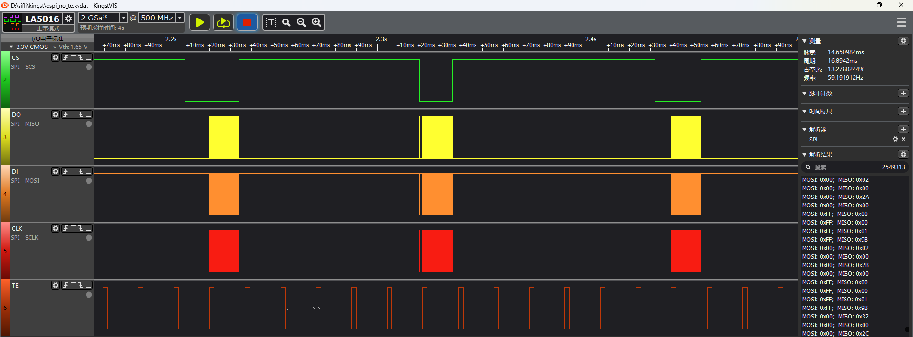
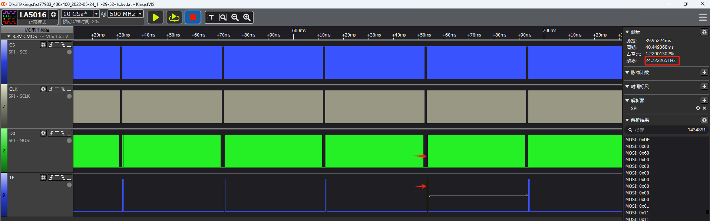

# SPI Screen Parameter Configuration

## Interface Description
In software, SPI interfaces are first categorized into two major types based on whether there is a physical D/CX line: `LCDC_INTF_SPI_DCX_xxx` and `LCDC_INTF_SPI_NODCX_xxx`. Then, they are further classified based on the number of data lines used during bulk data transfer (i.e., 0x2C/0x3C commands), which can be 1~4DATA. Finally, additional labels such as DDR and AUX are added based on whether DDR mode is used and whether PTC assistance is required.

Generally, 3-line SPI refers to interfaces without a physical D/CX line, while 4-line SPI has a physical D/CX line.

The D/CX line pinmux is usually LCDC_SPI_DIO1.

SPI interface command read and write operations are always in single-line mode, but during bulk data transfer (0x2C/0x3C commands), data can be transferred in parallel using 1~4 lines.

| Interface Name | Physical D/CX Line | Parallel Data Lines for 0x2C/0x3C Bulk Data Transfer | Other |
| ---- | ---- | ---- | ---- |
| LCDC_INTF_SPI_DCX_1DATA | Yes | 1 | - |
| LCDC_INTF_SPI_DCX_2DATA | Yes | 2 | - |
| LCDC_INTF_SPI_DCX_4DATA | Yes | 4 | - |
| LCDC_INTF_SPI_DCX_4DATA_AUX | Yes | 4 | Ramless screen |
| LCDC_INTF_SPI_DCX_DDR_4DATA | Yes | 4 | DDR mode |
| LCDC_INTF_SPI_NODCX_1DATA | No | 1 | - |
| LCDC_INTF_SPI_NODCX_2DATA | No | 1 | - |
| LCDC_INTF_SPI_NODCX_4DATA | No | 1 | - |

## Screen Parameter Configuration Explanation

### **4-line/3-line SPI Interface**
```c
static LCDC_InitTypeDef lcdc_int_cfg =
{
/*
    3-line SPI mode, 2 data lines for bulk data transfer
*/
    .lcd_itf = LCDC_INTF_SPI_NODCX_2DATA,
/* QSPI clock frequency selection, the frequency is the result of dividing the hcpu main frequency, for example, if the hcpu main frequency is 240MHz, the available frequencies are 40/48/60/80. If 62MHz is set, it will actually be set to 60MHz */
    .freq = 24000000,
    .color_mode = LCDC_PIXEL_FORMAT_RGB565,

    .cfg = {
        .spi = {
            .dummy_clock = 0, /* In QSPI read mode, the number of empty clock cycles between cmd and data, default is 0, no need to modify */
/* This option is to avoid image tearing (cause of tearing: when the screen reads RAM data, QSPI is also writing data to RAM) */
#ifdef LCD_ST7789P3_VSYNC_ENABLE				
            .syn_mode = HAL_LCDC_SYNC_VER,/* Enable checking the TE signal from the screen and synchronize data writing to RAM. Enabling this configuration will cause a system hang if the screen does not output a TE signal */
#else
			.syn_mode = HAL_LCDC_SYNC_DISABLE,/* Disable checking the TE signal from the screen. Use this configuration when debugging the screen driver and not considering tearing issues */
#endif
/*
This configuration is meaningful only when HAL_LCDC_SYNC_VER is selected. It is used to configure the polarity of the TE (Vsync) signal.
Set to 1 if TE is normally low and high when data can be written to RAM
*/
            .vsyn_polarity = 0,
            .vsyn_delay_us = 1000,/* This configuration is meaningful only when HAL_LCDC_SYNC_VER is selected. It is used to configure the delay in microseconds after the TE signal goes high before data is written to RAM */
            .hsyn_num = 0,/* This configuration is meaningful only when .syn_mode is set to HAL_LCDC_SYNC_VERHOR. It is used to configure the number of clock pulses after the TE signal goes high before data is written to RAM */
/*
1. During QSPI read operations, CMD is always output from D0, but the read data can be output from D0-D3 depending on the screen driver IC. This configuration is for compatibility with different screen driver ICs.
2. Can be set to 0-3. Refer to the screen driver IC datasheet to select the appropriate QSPI read signal from D0 - D3
*/            
            .readback_from_Dx = 0,
        },
    },
};
```
The following is a waveform diagram for 4-line TE not enabled, showing that the TE waveform is not aligned with the SPI CS falling edge.

### **Frame Rate Testing Method**
* Enable the HAL_LCDC_SYNC_VER configuration. The SPI timing is as shown in the following diagram, where the screen update is synchronized with TE.
- [LCD Display Abnormality Analysis — Tearing (tear effect)](https://blog.csdn.net/hexiaolong2009/article/details/79319512)
* In a UI with a very high frame rate, measure the frequency of the TE signal, which represents the screen refresh rate.

***
### **QSPI Interface**

```c
#ifdef LCDC_USE_DDR_QSPI
    #define QAD_SPI_ITF LCDC_INTF_SPI_DCX_DDR_4DATA
    #define QAD_SPI_ITF_FREQ   40000000
#else
    #define QAD_SPI_ITF LCDC_INTF_SPI_DCX_4DATA
    #define QAD_SPI_ITF_FREQ   48000000
#endif
static LCDC_InitTypeDef lcdc_int_cfg_spi =
{
 /*
 1. DDR (qspi's clk double-edge data transfer mode) select LCDC_INTF_SPI_DCX_DDR_4DATA
 2. SDR (qspi's clk single-edge data transfer mode) select LCDC_INTF_SPI_DCX_4DATA
 */   
    .lcd_itf = QAD_SPI_ITF, //LCDC_INTF_SPI_NODCX_1DATA,
/*
1. QSPI's clk frequency selection, the frequency is the frequency after dividing the hcpu main frequency, for example, if the hcpu main frequency is 240MHz, the available frequencies can only be 40/48/60/80. If 62MHz is set, it will actually be set to 60MHz.
2. The QSPI's clk frequency should not be set too high in DDR mode.
*/    
    .freq = QAD_SPI_ITF_FREQ,
/*
1. LCDC_PIXEL_FORMAT_RGB565 is the common RGB565 color format.
2. LCDC_PIXEL_FORMAT_RGB888 is the common RGB888 color format.
*/
#if LV_COLOR_DEPTH == 24
    .color_mode = LCDC_PIXEL_FORMAT_RGB888,
#else
    .color_mode = LCDC_PIXEL_FORMAT_RGB565,
#endif

    .cfg = {
        .spi = {
            .dummy_clock = 0, /* In QSPI read mode, configure the number of empty clk cycles between cmd and data, default is 0, no need to modify */
/* This option is to avoid image tearing (cause of tearing: when the screen reads RAM data, QSPI is also writing data to RAM) */
#ifdef LCD_FT2308_VSYNC_ENABLE
            .syn_mode = HAL_LCDC_SYNC_VER, /* Enable checking the TE signal sent by the screen and synchronize data writing to RAM. Enabling this configuration, if the screen does not output a TE signal, it will result in inability to write data to RAM, causing a system hang. */
#else
            .syn_mode = HAL_LCDC_SYNC_DISABLE, /* Disable checking the TE signal sent by the screen. This configuration is used during initial screen driver debugging when tearing is not a concern. */
#endif
/* This configuration is meaningful only when HAL_LCDC_SYNC_VER is selected, used to configure the polarity of the TE (Vsync) signal */
            .vsyn_polarity = 1, /* Configure 1, TE is normally low, and data can be written to RAM when TE is high */
            .vsyn_delay_us = 0, /* This configuration is meaningful only when HAL_LCDC_SYNC_VER is selected, used to configure the delay in us after the TE signal goes high before writing data to RAM */
            .hsyn_num = 0, /* This configuration is meaningful only when .syn_mode is set to HAL_LCDC_SYNC_VERHOR, used to configure the number of clk pulses after the TE signal goes high before writing data to RAM */
 /*
 1. During QSPI data read, CMD is always output from D0, but the read-back data, depending on the screen driver IC, can be output from D0-D3. This configuration is for compatibility with different screen driver ICs.
 2. Can be configured from 0-3, refer to the screen driver IC's datasheet to select the corresponding QSPI read signal from D0 - D3.
 */           
            .readback_from_Dx= 3,       /*!< 0 read back data from D0 (HW SPI support), 1 read back from D1 (Software SPI support).*/
#ifdef LCDC_USE_DDR_QSPI
            .flags = SPI_LCD_FLAG_DDR_DUMMY_CLOCK,/* This flag is for adapting to DDR screens, adding a few empty clocks after sending the framebuffer in DDR mode. */
#endif /* LCDC_USE_DDR_QSPI */
        },
    },

};
```