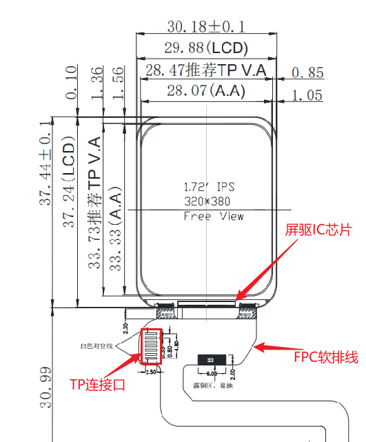
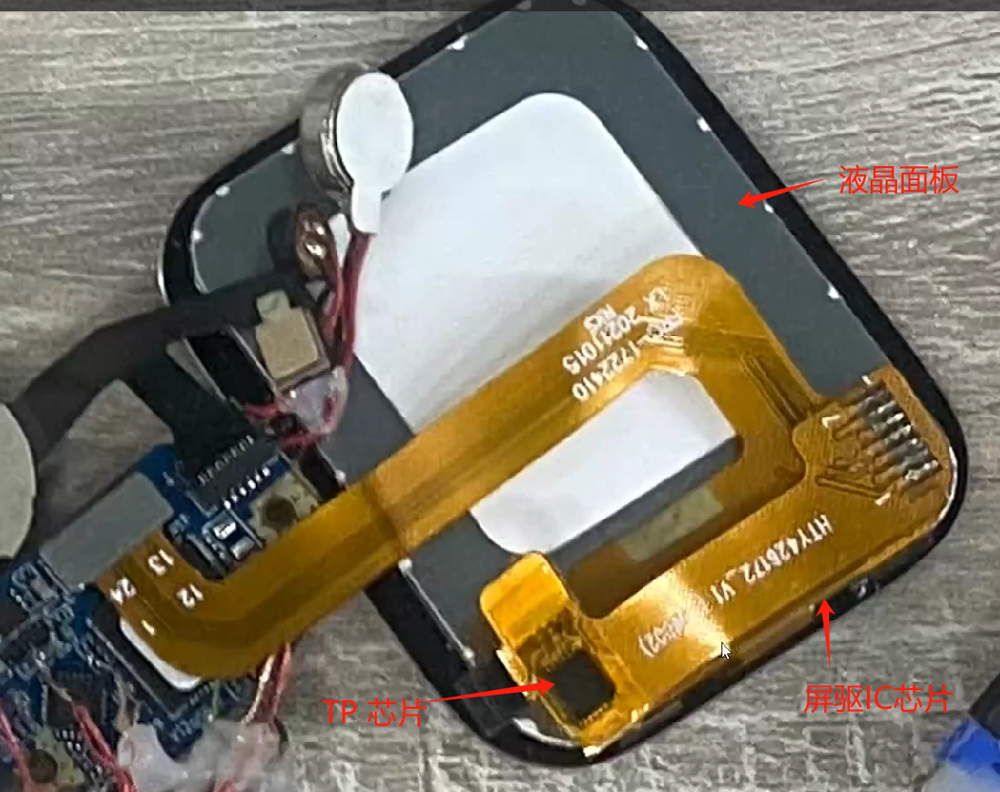

# Introduction to Screen Modules

## Composition of Screen Modules
A screen module typically includes a screen driver IC, an LCD panel, a backlight panel (AMOLED screens do not have this), FPC flexible cables, etc. For touch-enabled screens, there will also be a separate touch (TP) driver IC.

Accordingly, the debugging of a screen module will also involve the debugging of the screen driver chip's driver program, as well as the debugging of the backlight panel or power supply driver program, etc. Touch screens also require the debugging of the touch chip's driver program.

 

## Common Interfaces of Screen Driver Chips
Typically, a screen driver IC can support multiple interfaces. The specific interface used is selected on the screen module by configuring the pull-up or pull-down of the IM[2:0] signals on the screen driver IC's IO pins. Some screen driver ICs can also select the interface through internal registers. Refer to the screen module's documentation for specific details.
Common screen interfaces include the following categories:
1. [SPI](#spi_link)
2. [DPI/RGB](#dpi_link)
3. [MIPI-DSI](#dsi_link)
4. [MCU/8080](#8080_link)  


(spi_link)=
### SPI Interface  

The SPI interface is widely used in screen modules due to its low pin count and high bandwidth, making it suitable for both screen driver configuration and direct image data transmission. Especially in low-resolution scenarios, the SPI interface can achieve a high refresh rate.  
The method of configuring the screen driver via the SPI interface is similar to traditional SPI and will not be elaborated here. The following content primarily focuses on the SPI interface used for image data transmission (hereinafter referred to as the image SPI interface).\
\
\
**Classification of Image SPI Interfaces:**
**Image SPI interfaces are classified based on the transmission protocol into 3-wire SPI and 4-wire SPI.**  
- **3-wire SPI**  
    As the name suggests, it has three signal lines: Chip Select (CS), Clock (SCLK), and a bidirectional data line (SDIO). During transmission, a Data/Command identifier bit is sent first, followed by the data. As shown in the following figure:
    ```{figure} ../assets/spi_3wire_wr.bmp
    :alt: spi_3wire_wr
    :class: bg-primary
    :scale: 70 %
    
    ```
    In the figure, after CS is pulled low to select the device, SDO first sends the DCX signal to indicate whether the subsequent transmission is data or a command, and then the data is transmitted. Therefore, the actual effective bandwidth of 3-wire SPI is 8/9 of the theoretical bandwidth.

- **4-wire SPI**  
    Compared to 3-wire SPI, 4-wire SPI adds an additional DC signal line to identify the transmission of data and commands. The transmission process is shown in the following figure:
    ```{figure} ../assets/spi_4wire_wr.bmp
    :alt: spi_4wire_wr
    :class: bg-primary
    :scale: 70 %
    
    ```
    In the figure, the DCX signal remains stable during transmission to indicate whether the current transmission is data or a command. Because an additional DCX signal line is introduced, the actual effective bandwidth of 4-wire SPI is higher than that of 3-wire SPI and equals the theoretical bandwidth.

**Image SPI interfaces can also be classified based on the data line width. Common data line widths include 1-bit (single data line SPI), 2-bit (dual data line DSPI), and 4-bit (quad data line QSPI).**  

- **Single Data Line SPI**  
    Single data line SPI transmits 1-bit of data per clock cycle. The 3-wire SPI and 4-wire SPI mentioned earlier are both single data line SPIs, so they will not be elaborated further here.  
    <br/>
- **Dual Data Line DSPI**  
    Dual data line SPI transmits 2-bit of data per clock cycle, doubling the bandwidth compared to single data line SPI.  
    \
    The DSPI transmission corresponding to 3-wire SPI is shown in the following figure:
    ```{figure} ../assets/spi_3wiredl_wr.bmp
    :alt: spi_3wiredl_wr
    :class: bg-primary
    :scale: 70 %
    
    ```
    In the figure, similar to the 3-wire SPI protocol, a separate cycle is used to send the DCX identifier bit before each transmission, followed by the subsequent signal transmission. In the figure, each 8-bit transmission corresponds to one DCX identifier bit, so the actual bandwidth is 4/5 of the theoretical bandwidth. In actual use, many screen drivers support one DCX identifier bit for every 16-bit or 24-bit transmission to increase the bandwidth utilization to 8/9 and 12/13, respectively.  
    \
    The DSPI transmission corresponding to 4-wire SPI is shown in the following figure:
    ```{figure} ../assets/spi_4wiredl_wr.bmp
    :alt: spi_4wiredl_wr
    :class: bg-primary
    :scale: 70 %
    
    ```
    In the figure, the DSPI corresponding to 4-wire SPI does not have a separate DCX identifier bit. In actual screen driver chips, some chips enter data transmission mode through a single data line command, so the DCX identifier bit is not needed in subsequent transmissions. This maximizes the bandwidth utilization of DSPI, making the actual bandwidth of DSPI equal to the theoretical bandwidth. Compared to single data line 4-wire SPI, dual data line DSPI uses the same number of signals but achieves double the bandwidth.  
    <br/>

- **Quad Data Line QSPI**  
    Quad data line QSPI adds two additional signal lines for data transmission compared to dual data line DSPI.  
    \
    The QSPI transmission corresponding to 3-wire SPI is shown in the following figure:
    ```{figure} ../assets/spi_3wireql_wr.bmp
    :alt: spi_3wireql_wr
    :class: bg-primary
    :scale: 70 %
    
    ```
    In the figure, QSPI sends a DCX before each transmission, followed by the subsequent transmission. In the figure, each 8-bit transmission corresponds to one DCX identifier bit, so the actual bandwidth is 2/3 of the theoretical bandwidth. Actual screen driver chips support one DCX identifier bit for every 16-bit or 24-bit transmission, increasing the bandwidth utilization to 4/5 or 8/9, respectively.  
    \
    The QSPI transmission corresponding to 4-wire SPI is shown in the following figure:
    ```{figure} ../assets/spi_4wireql_wr.bmp
    :alt: spi_4wireql_wr
    :class: bg-primary
    :scale: 70 %
    
    ```
    In the figure, QSPI does not have a separate DCX identifier bit during data transmission, similar to DSPI, ensuring that the actual bandwidth reaches the theoretical bandwidth. Similarly, most screen driver chips enter data transmission mode through a single data line command, thus maximizing the bandwidth utilization of QSPI during data transmission.

\
The above is the most common SPI interface, which is divided into 3-wire and 4-wire modes in terms of protocol, and into single data line, dual data line, and quad data line in terms of data width. There are a total of 6 modes when combining these two aspects. Users need to refer to the actual screen driver documentation to determine the mode used in the actual scenario. For the SPI interface, the external screen driver generally requires a GRAM, so the requirements for the external screen driver are higher.
\
To further increase the bandwidth, some screen driver chips have recently started to support DDR mode data transmission. Compared to SDR mode, the bandwidth can be doubled.
\
<br/>
<br/>


(dpi_link)=
### DPI/RGB Interface

The DPI interface, also known as the RGB interface, generally consists of 16~24-bit data signals, as well as clock and control signals such as PCLK, HSYNC, VSYNC, and DE. The screen driver for the DPI interface usually does not have an internal GRAM, so the main controller needs to continuously send image data to refresh the screen content, which requires higher performance from the main controller.  
DPI signal interface diagram:  
```{figure} ../assets/image-54.png
:alt: dpi connection
:class: bg-primary
:scale: 99 %

```
The DPI interface signals need to meet the specific timing requirements of the DPI interface, which can be roughly referenced as shown in the following figure:  
```{figure} ../assets/image-59.png
:alt: dpi protocol
:class: bg-primary
:scale: 99 %

```
As shown in the figure, when configuring the DPI screen interface, users need to refer to the screen driver chip documentation to configure the various timing parameters in the figure. These parameters include: VS_WIDTH, HS_WIDTH, HBP, HFP, VBP, VFP, Vertical Display Area, Horizontal Display Area.
<br/>
<br/>


(dsi_link)=
### MIPI-DSI Interface
The MIPI-DSI interface, also known as the MIPI screen interface, consists of a pair of differential clock signal lines and 1/2/4 pairs of differential data signal lines. Because both the clock and data are differential signals, the MIPI interface has a higher rate and stronger interference resistance. It also generates less interference to the surrounding circuits, making it very suitable for high-integration scenarios, such as wearable devices.  
The MIPI-DSI interface typically has two operating modes: Command mode and Video mode. Command mode is suitable for screen driver chips with relatively low resolution and internal GRAM, and most SPI interface screens also fall into this category. Video mode is suitable for screen driver chips without GRAM, requiring continuous screen refresh, similar to the DPI interface. This mode also has higher requirements for the MCU main end.  
The following figure shows a single Data Lane DSI interface:  
```{figure} ../assets/image-56.png
:alt: dsi connection
:class: bg-primary
:scale: 99 %

```
<br/>
<br/>

(8080_link)=
### MCU/8080 Interface

The MCU/8080 interface has many other names. Because it originated from Intel's interface, it is also known as the Intel interface. Another commonly used name is the DBI interface, which comes from the DBI interface protocol in the MIPI standard. This interface consists of independent read and write control signals and 8/16 data lines.  
The following figure shows a typical MCU/8080 interface:  
```{figure} ../assets/image-57.png
:alt: dbi connection
:class: bg-primary
:scale: 99 %

```
The MCU/8080 interface in the figure consists of chip select signal CSX, write control WRX, read control RDX, Data/Command selection D/CX, and 8 data lines. Data is sent by toggling WRX during write operations, and data is read by toggling RDX during read operations. Its access method is similar to memory access.  
The advantages of the MCU/8080 interface include simple control and ease of implementation. However, as a parallel interface, it uses a large number of signals and has a relatively low rate. Additionally, the MCU/8080 interface requires the screen driver side to have a GRAM, which increases the cost of the screen driver.