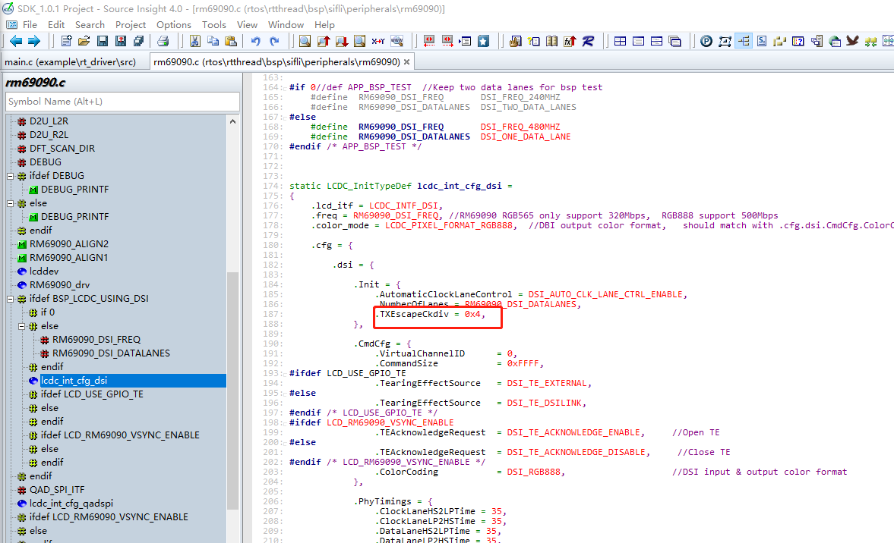
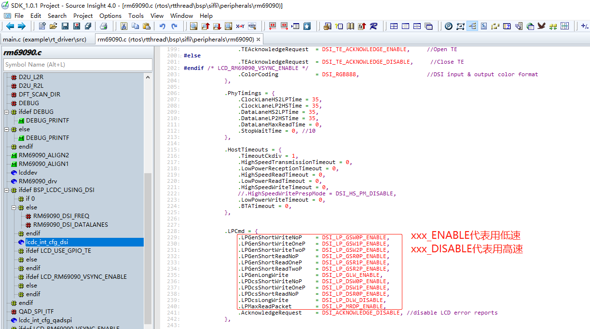
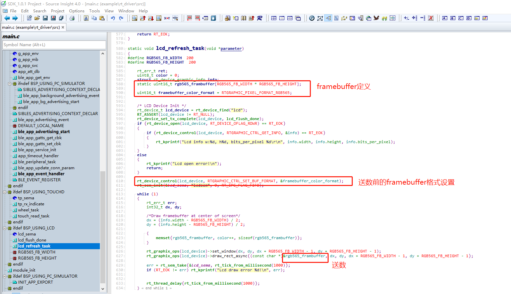
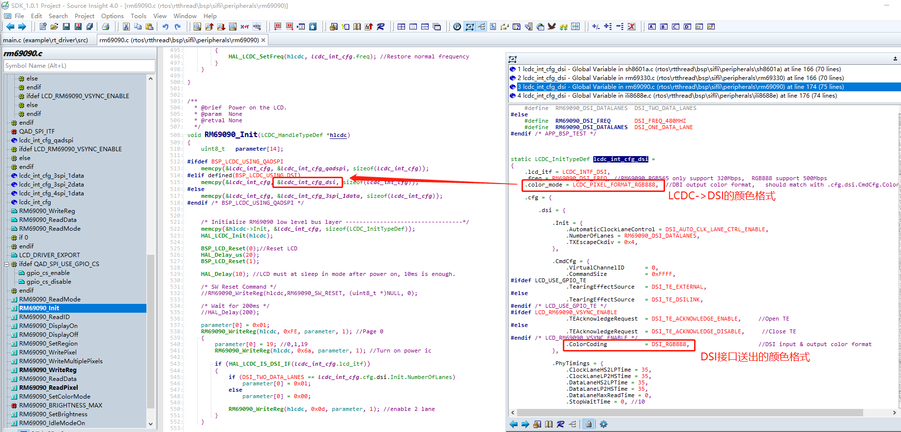
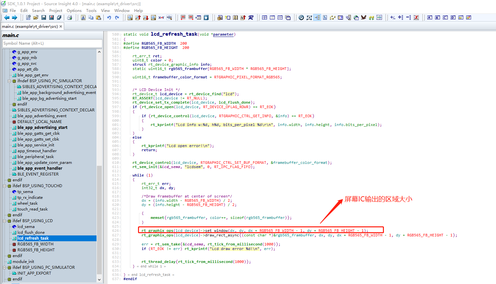
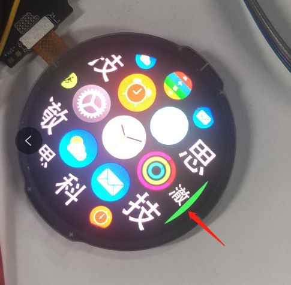
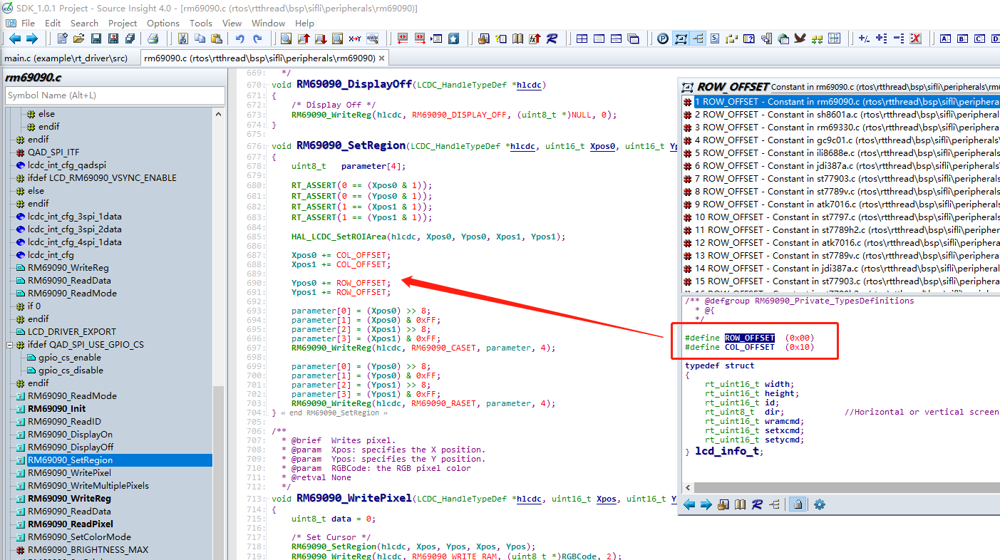
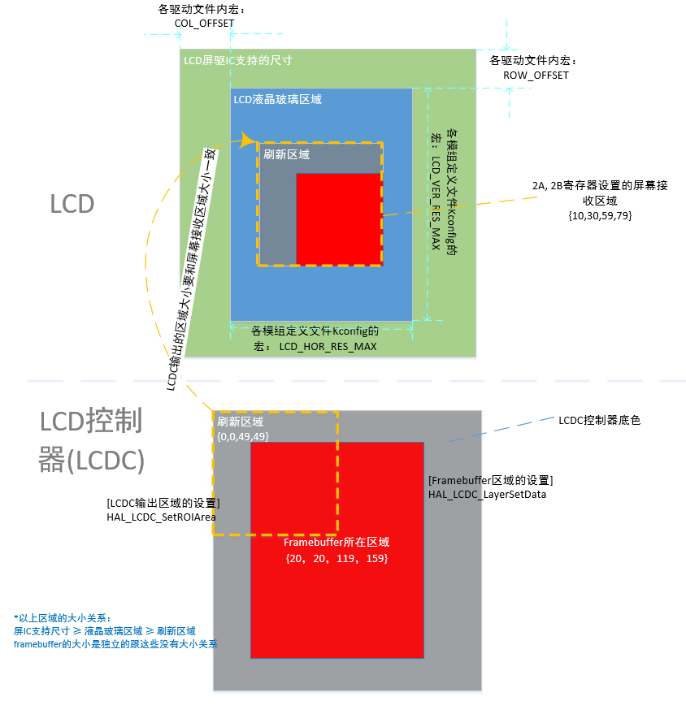
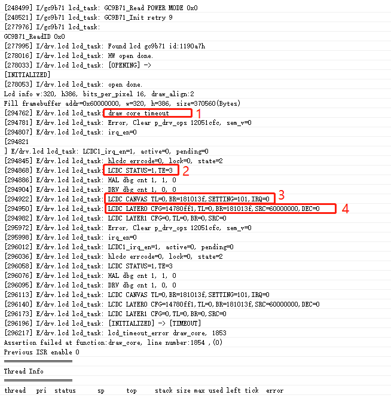

## FAQ

### Screen ID Read Failure
* Check if the power supply is correct
* Check if the IO voltage matches (our chip supports 1.8V IO, many LCDs are 3.3V)
* Check if the screen reset time is sufficient
* Try to reduce the interface frequency
* Check the timing

### DSI Screen Switches to Low-Speed Mode
1. Reduce the system clock to 48M
In `drv_io.c`, change `HAL_RCC_HCPU_ClockSelect(RCC_CLK_MOD_SYS, XXX);` where `XXX` is the system clock frequency, to `RCC_SYSCLK_HXT48` (crystal clock 48MHz)
This is to reduce the speed at which LCDC sends data to DSI

2. Adjust the DSI LP mode frequency to a range supported by the screen (usually 6~20Mbps)
The configuration below sets the LP mode frequency to 480MHz / 16 / 4 = 7.5Mbps (where 480MHz is the freq, 16 is a fixed value, and 4 is TXEscapeCkdiv)

3. Change all commands to be sent in LP mode (low-speed mode)

### Screen Does Not Light Up
* Check if the ID can be read
* First, disable TE to prevent the LCD controller from not sending data due to the absence of the TE signal
* Check if the data being sent is all black

### Screen Color Format Settings
Our LCD controller can convert different formats of framebuffer to the LCD output interface, ensuring that the framebuffer and LCD output configurations are correct

Example of framebuffer color format settings (RGB565 format framebuffer)

Example of LCD controller output color format (DSI output RGB888)

* The framebuffer is converted to RGB888 format data by the LCDC controller before being sent to the DSI link controller to output RGB888 data

### Screen Displays Garbled
* Check if the framebuffer color format and the color format sent by the LCD controller are correct (refer to the previous FAQ on "Screen Color Format Settings")
* Check if the output screen area from the IC matches the resolution of the LCD panel, refer to the section "Relative Position Relationship of Screen Driver IC, LCD Panel, Refresh Area, and Framebuffer"
    
* Check if data is being sent, and if the default GRAM data is being displayed (change the framebuffer and check if the screen changes)

### Screen Displays (Partially) Green Background
One example is shown in the following figure:

* Check if the offset for the area where the LCD accepts data is set correctly

* Check if the data being sent is correct

### System Hangs Due to Alignment Requirements and Screen Resolution Mismatch
Reason for the hang:
Some screens have a resolution like 320x385, but the alignment requirement is 2, meaning the resolution must be even (e.g., 320x386). The upper layer or driver automatically aligns to even numbers during screen refresh, causing the refresh area to exceed the resolution, leading to an assertion.

Solution approach:
Provide a screen that meets the alignment requirements, and only modify the driver code.

Solution:
* When defining the screen resolution in Kconfig, configure it according to the aligned resolution, creating a virtual screen that meets the alignment requirements.
    * The corresponding macros in Kconfig are `LCD_HOR_RES_MAX` and `LCD_VER_RES_MAX`
    * For example, in the case above, configure it to 320x386
* In the `xxxx_SetRegion` function of the LCD driver, check if the parameters being passed exceed the actual resolution, and consult the screen manufacturer on how to handle it.
    * Some screens directly clip the area, for example, in the example above, check `Ypos1` and change it to 385 if it exceeds 385
    * Some screens can be directly refreshed without overwriting the first row.

### Upper Layer Graphics Library Unchanged, Only Screen Changed
For this issue, refer to the solution for "System Hangs Due to Alignment Requirements and Screen Resolution Mismatch," and only perform clipping in the driver layer, providing a screen that meets the requirements to the upper layer.

(lcd-lcdc-coordinates-relationship)=
### Relative Position Relationship of Screen Driver IC, LCD Panel, Refresh Area, and Framebuffer

### System Hangs
As shown in the figure below, a common screen refresh timeout hang occurs because the TE signal from the screen is not received, leading to a timeout hang. The timeout duration is defined in `MAX_LCD_DRAW_TIME`, which defaults to 500ms.

| Number in the Image | Register Meaning Explanation |
| ---- | ---- |
| 1 | "draw core timeout" -- indicates that the screen refresh did not wait for the TE signal, resulting in a timeout hang |
| 2 | `STATUS=1` indicates that the LCDC controller is always busy (e.g., waiting for the TE signal), `TE=3` only needs to check bit0, bit0 being 1 indicates that the LCDC needs to wait for the TE signal before refreshing, 0 indicates no need to wait for the TE signal. The log prints the value of the TE register twice, which can be used to observe if the TE signal has arrived during this period. |
| 3 | `CANVAS`'s `TL` and `BR` are the coordinates of the refresh area, `TL`'s high 16 bits are `y0`, low 16 bits are `x0`; `BR`'s high 16 bits are `y1`, low 16 bits are `x1`; forming the refresh area `{x0,y0,x1,y1}` |
| 4 | `LAYER0`'s `TL` and `BR` are the coordinates of the framebuffer area, in the same format as `CANVAS`'s `TL` and `BR`; `SRC` is the data address of the framebuffer |

Solution:
1. If the hang occurs immediately upon startup, it is likely a screen driver issue. Check the screen power-on, reset, and initialization code.
2. If the hang occurs during wake-up from sleep, it may be due to insufficient reset time or an incorrect screen shutdown procedure during sleep.
3. If the hang occurs suddenly during screen refresh, it may be due to an unstable screen driver (e.g., mismatched IO levels, too high speed), or static electricity causing the screen driver IC to hang.