# Screen Module Framework Introduction
## Introduction

Sicher's display framework is based on the [rt_device framework](https://www.rt-thread.org/document/site/#/rt-thread-version/rt-thread-standard/programming-manual/device/device?id=%e8%ae%bf%e9%97%ae-io-%e8%ae%be%e5%a4%87), and has the following features:
- The same screen driver, TP driver, and backlight driver can be reused across different development boards.
- The same development board can select different screen modules through menuconfig.
- It supports multiple screen drivers and TP drivers simultaneously, distinguishing them by ID.

<br/>
<br/>
This design indeed improves reusability, but it also brings about the issue of dispersed configuration for screen module drivers:

- The power-on/off, reset interfaces, pinmux settings, and PWM for backlight are all associated with the development board (similar to the BIOS of a screen driver module).
- The screen driver, TP driver, and backlight driver must be implemented based on the macro definitions and IO interfaces provided above.
- The implemented screen driver, TP driver, and backlight driver are eventually integrated into a menuconfig menu for the development board to select.
<br/>
<br/>
<br/>
<br/>

## Screen Section
### Screen Framework Diagram
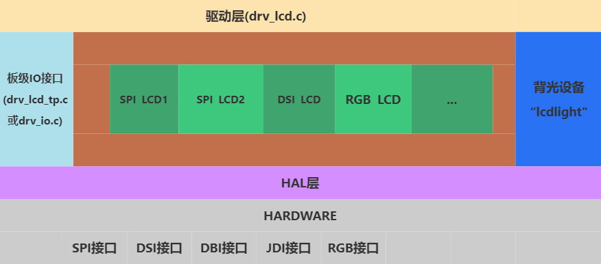

**Explanation of items in the diagram:**
- Driver layer (drv_lcd.c) --- Implements an rt_device named "lcd" for upper-layer screen operations.
- The specific driver code in the middle green part (main code for adding screen drivers by customers)
- Board-level IO interface file (bsp_lcd_tp.c, or drv_io.c) --- Provides a unified power-on, power-off, and reset interface for the screen driver.
- Backlight device "lcdlight" --- Provides a unified backlight control interface for the screen driver.
- HAL layer (bf0_hal_lcdc.c) --- Provides basic unified parameter configuration, LCD register read/write, and other interfaces for the screen driver.

<br/>
<br/>
<br/>
<br/>

(lcd-driver-register)=
### Registering Screen Driver to the System
Sicher's screen driver framework supports registering multiple screen drivers to the system simultaneously. This is achieved by generating a variable with a special section name using the macro `LCD_DRIVER_EXPORT2`, which links them together.

In nv3051f1.c, the screen driver's callback functions are registered to the system using `LCD_DRIVER_EXPORT2`. For detailed explanations of each function, please refer to [Screen Driver Callback Functions](./屏驱回调函数.md):
```
static const LCD_DrvOpsDef LCD_drv =
{
	LCD_Init,    			  //【Required】Screen driver initialization function (including reset, initialization procedures, etc.)
	LCD_ReadID,    			  //【Required】Screen presence detection function
	LCD_DisplayOn,   		  //【Required】Screen on
	LCD_DisplayOff,  		  //【Required】Screen off
	LCD_SetRegion,    		  //【Required】Set the area for screen data reception (2A, 2B area)
	LCD_WritePixel,   		  // Optional, Write a pixel to the screen
	LCD_WriteMultiplePixels,  //【Required】Write multiple pixels to the screen
	LCD_ReadPixel,    		  // Optional, Read a pixel data from the screen, return the RGB value
	LCD_SetColorMode,    	  // Optional, Switch the color format output to the screen
	LCD_SetBrightness,   	  // Optional, Set the screen brightness
	LCD_IdleModeOn,    		  // Optional, Enter standby display mode (low-power mode)
	LCD_IdleModeOff,   		  // Optional, Exit standby display mode (low-power mode)
	LCD_Rotate,  			  // Optional, Rotate the screen by a certain angle
	LCD_TimeoutDbg, 		  // Optional, Screen self-check after batch data transfer timeout
	LCD_TimeoutReset,  		  // Optional, Screen reset after batch data transfer timeout
	LCD_ESDCheck,  		      // Optional, Periodic ESD detection for the screen
};

LCD_DRIVER_EXPORT2(nv3051f1, LCD_ID, &lcdc_int_cfg, &LCD_drv,2);
```
<br/>
<br/>
<br/>
<br/>

(lcd-driver-detect-method)=
### Screen Presence Detection
When the system registers multiple screen drivers, how to determine which screen driver to use to drive the current screen requires screen presence detection. The method is to first call the [LCD_Init](lcd-cb-func-lcd-init) function of each screen driver to initialize it, then call the [LCD_ReadID](lcd-cb-func-lcd-readid) function. If the value returned by [LCD_ReadID](lcd-cb-func-lcd-readid) matches the LCD_ID value, it is considered that the screen is present, and the corresponding screen driver is used. Otherwise, continue to call the [LCD_Init](lcd-cb-func-lcd-init) and [LCD_ReadID](lcd-cb-func-lcd-readid) functions of the next screen driver.
- _[LCD_Init](lcd-cb-func-lcd-init) and [LCD_ReadID](lcd-cb-func-lcd-readid) are the callback functions registered by each [screen driver](lcd-driver-register)_
- _LCD_ID is a parameter passed through LCD_DRIVER_EXPORT2_
- You can directly return LCD_ID if you force the use of this screen driver. This is applicable when there is only one screen driver or the screen does not support reading the ID.

(lcd-ic-pixel-alignment)=
### Pixel Alignment for Screen Refresh
Some screen drivers have pixel alignment requirements for the refresh area. Sicher's screen driver framework supports setting pixel alignment (if the row and column alignment requirements are different, the larger value is used. For example, if a screen requires 2-pixel alignment for rows and 4-pixel alignment for columns, 4 is used).

The pixel alignment requirement for the screen driver IC's update area is generally described in the 0x2A (start and end columns) and 0x2B (start and end rows) registers. For example, the IC in the following diagram requires 2-pixel alignment for both rows and columns:

```{figure} assets/LCD_IC_pixel_alignment.png
:scale: 30 %
```

<br/>
<br/>
<br/>
<br/>

## Touch Section
### Touch (TP) Framework Diagram
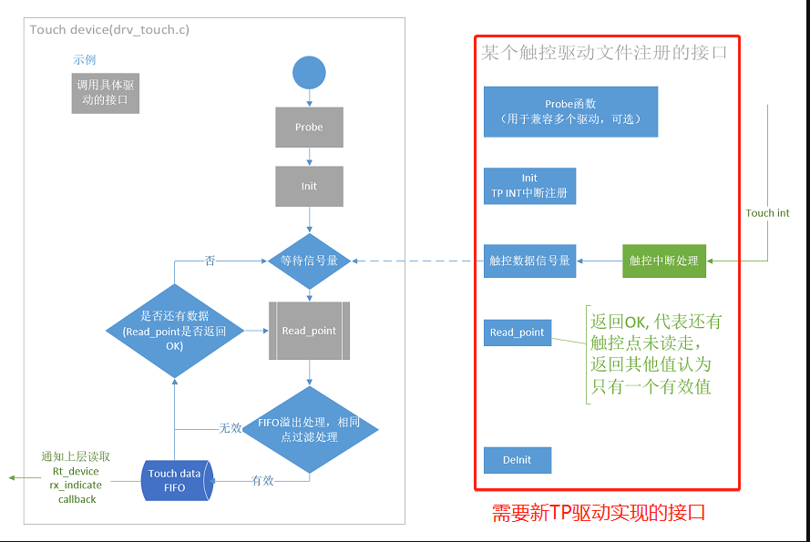

<br/>
<br/>
<br/>
<br/>

### TP Driver Registration Interface
In gt911.c, the initialization function `rt_tp_device_init` is registered using `INIT_COMPONENT_EXPORT`. Inside `rt_tp_device_init`, the TP driver is registered to the system using the function `rt_touch_drivers_register`.

```c
static struct touch_drivers driver;
```

```c
static struct touch_ops ops =
{
    read_point, // TP data read callback function
    init,       // TP initialization callback function
    deinit      // TP deinitialization callback function
};


static int rt_tp_device_init(void)
{

    driver.probe = probe;  // TP presence detection callback function
    driver.ops = &ops;
    driver.user_data = RT_NULL;
    driver.isr_sem = rt_sem_create("gt911", 0, RT_IPC_FLAG_FIFO); // TP data read semaphore

    rt_touch_drivers_register(&driver);  // Register to the system TP driver framework
    return 0;

}
INIT_COMPONENT_EXPORT(rt_tp_device_init); // Register initialization function
```


## Backlight Section
Non-self-emitting screens generally require backlighting. Currently, backlight drivers for screens are implemented in various ways to create an "lcdlight" rt_device, which is then uniformly used in the screen driver's callback function [LCD_SetBrightness](lcd-cb-func-LCD-SetBrightness).

Currently, two modes are supported:
- Direct PWM backlighting, where the chip directly outputs a PWM waveform to drive the backlight
- External backlight driver, where a GPIO controls an external backlight driver chip to output a PWM waveform to drive the backlight


### Direct PWM Backlighting
This device is registered as an "lcdlight" rt_device in drv_lcd.c, see the rt_hw_lcd_backlight_init function.

The default PWM frequency used is 1KHz.

It uses two macros `LCD_PWM_BACKLIGHT_INTERFACE_NAME` and `LCD_PWM_BACKLIGHT_CHANEL_NUM`, which specify the PWM device name and channel number, respectively. These two macros are typically defined in [Kconfig.board](lcd_driver_folder_strcuture).

Note: The PWM rt_device specified by `LCD_PWM_BACKLIGHT_INTERFACE_NAME` needs to be enabled in menuconfig. For example, if "pwm2" is specified, you need to select:
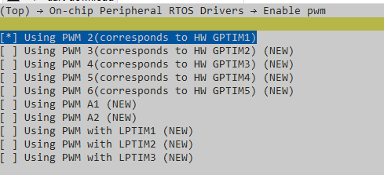

This type of backlighting can be used by selecting the macro [LCD_USING_PWM_AS_BACKLIGHT](lcd_menuconfig_select_backlight_type) in the screen module.

### External Backlight Driver
For example, in aw9364.c, the "lcdlight" rt_device is registered in the sif_aw9364_init function.

The macro `LCD_BACKLIGHT_CONTROL_PIN` is used to specify which GPIO controls the aw9364. This macro is also defined in [Kconfig.board](lcd_driver_folder_strcuture).


This type of backlighting can be used by selecting the macro [BL_USING_AW9364](lcd_menuconfig_select_backlight_type) in the screen module.


<!--


----

## General Settings for LCD&TP Projects
Typically, one hardware PCB corresponds to one project, and one project can support multiple LCD&TP modules. These modules use the same hardware interfaces, so we place the LCD&TP configurations that are independent of specific modules here.

These general configurations provide board-level IO APIs and macro definitions for all LCD&TP drivers:

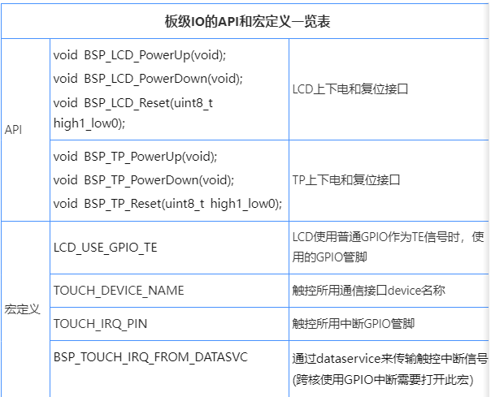

Here, we use the ec-lb555xxx series EVB as an example

SDKrelease\drivers\boards\ec-lb555xxx\drv_io.c provides board-level API interfaces
SDKrelease\drivers\boards\ec-lb555xxx\pinmux.c provides board-level pinmux definitions

### General Settings for the Screen
1. Power On

For versions before SDK1.0.4, power on occurs simultaneously with the IO power on during startup or wake-up from sleep.

For SDK1.0.4 and later versions, power on is handled internally by the LCD device.

2. Power Off

3. Reset

4. PINMUX

5. Board Configuration for the Screen's TE

The screen's TE (Tear Effect) signal needs to be connected through hardware signals. There are three types of interfaces:
1. For screens with a DSI interface, the TE signal can be routed through the DSI bus, requiring no additional wires.
2. For interfaces like SPI/8080, the TE pin can be set to the TE function via pinmux.
3. If the first two options are not supported by the hardware, any GPIO can be used as the TE signal. This method relies on GPIO ISR interrupts, which have slightly lower real-time performance.

The working mechanisms of the above TE methods:
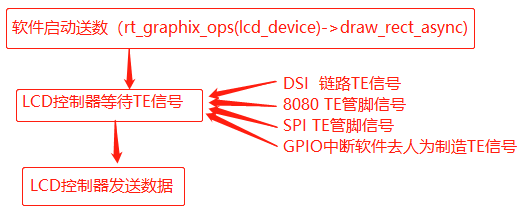
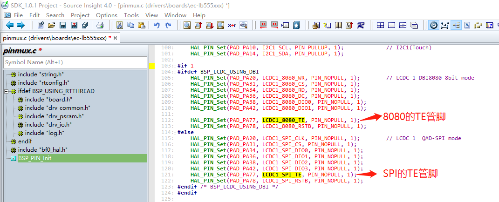
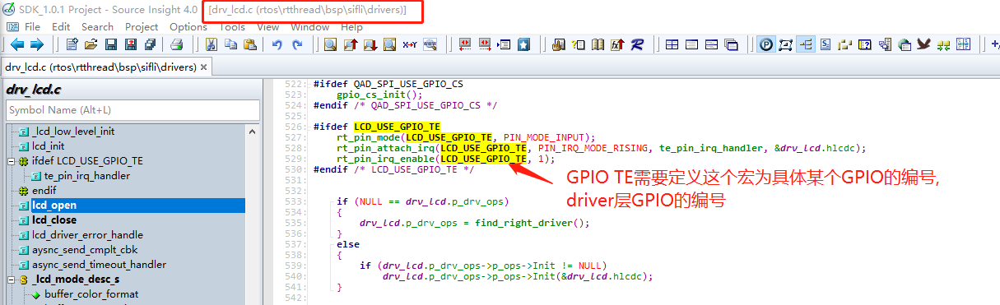


### General Settings for Touch
#### 1. TOUCH_DEVICE_NAME

The communication interface rt-device name for the touch screen, which can be an I2C or SPI interface. The specific communication interface is called internally in the driver.
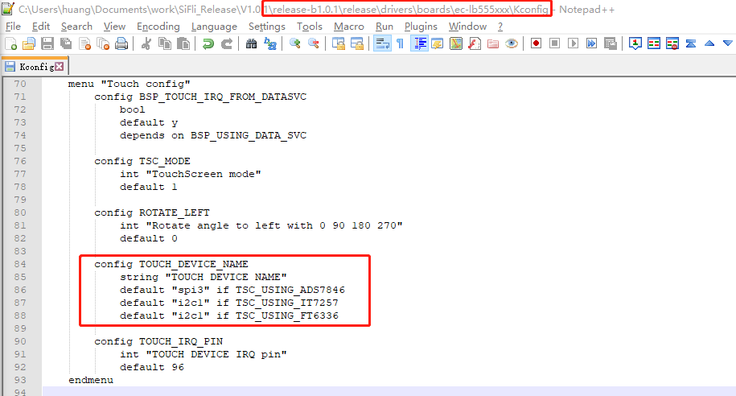

#### 2. Power On

For versions before SDK1.0.4, power on occurs simultaneously with the IO power on during startup or wake-up from sleep.
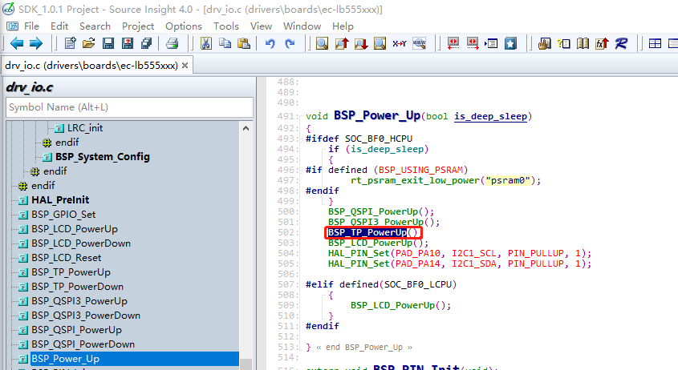

For SDK1.0.4 and later versions, power on is handled internally by the Touch device.
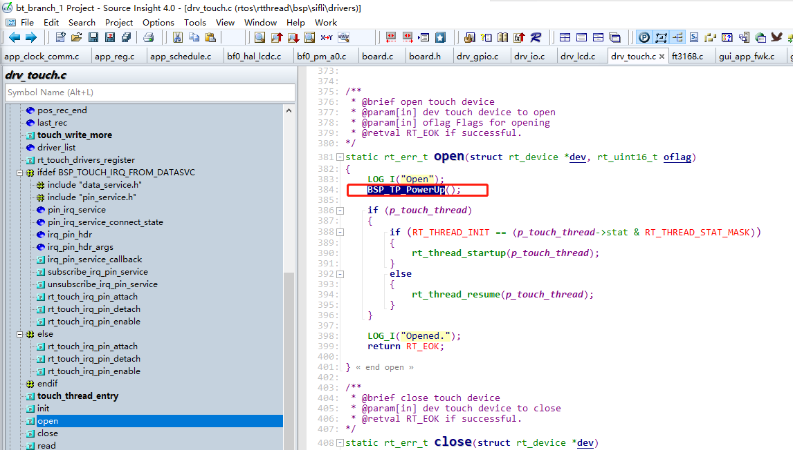

#### 3. Power Off

For versions before SDK1.0.4, power off occurs simultaneously with the IO power off during shutdown or sleep.
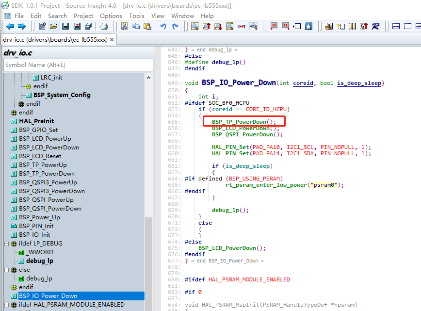

For SDK1.0.4 and later versions, power off is handled internally by the Touch device.
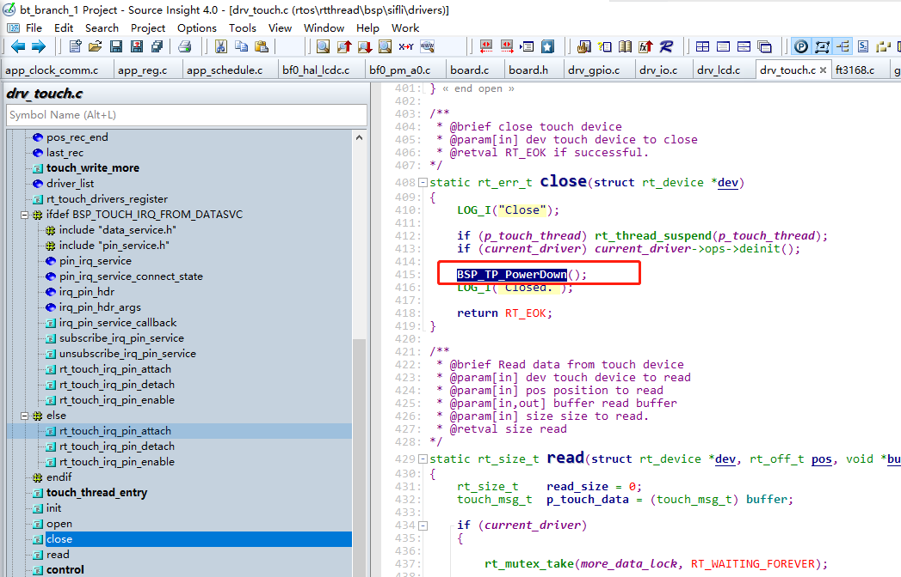

#### 4. Reset

For versions before SDK1.0.4, many did not call the reset interface. For later versions, if the touch screen requires a reset, it can be added at the beginning of the probe and init functions in the driver.
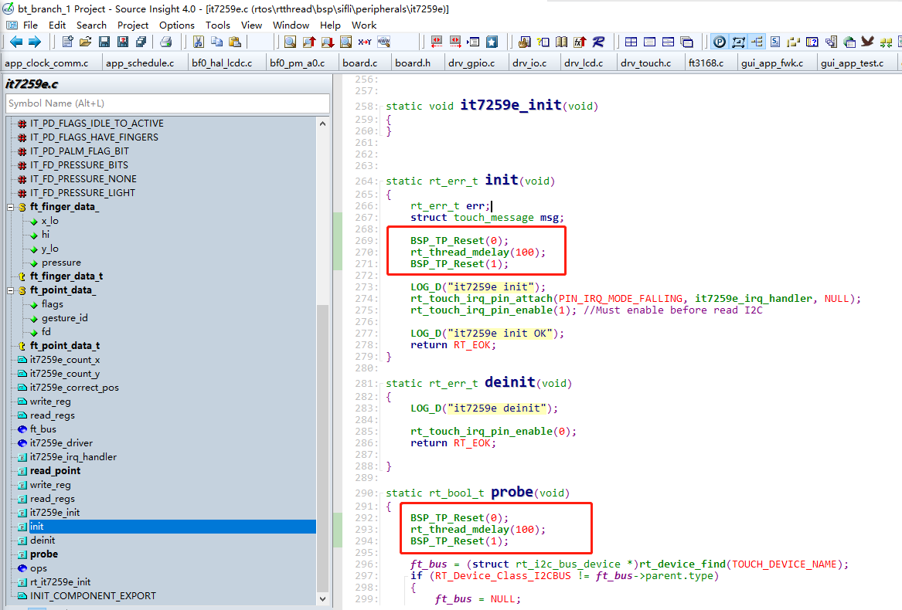

#### 5. Interrupt

TOUCH_IRQ_PIN - The GPIO pin used for the touch interrupt
BSP_TOUCH_IRQ_FROM_DATASVC - If the touch interrupt GPIO is used across cores, this macro needs to be enabled.
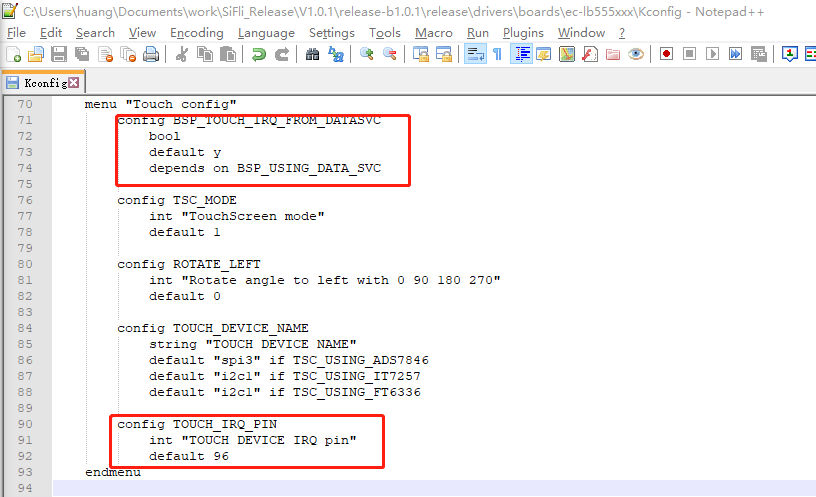


### Debug Project Selection
```

The `SDKrelease\example\rt_driver` project is specifically designed for debugging the `rt_driver` device. It includes an example to display a color-changing rectangular area on the LCD:
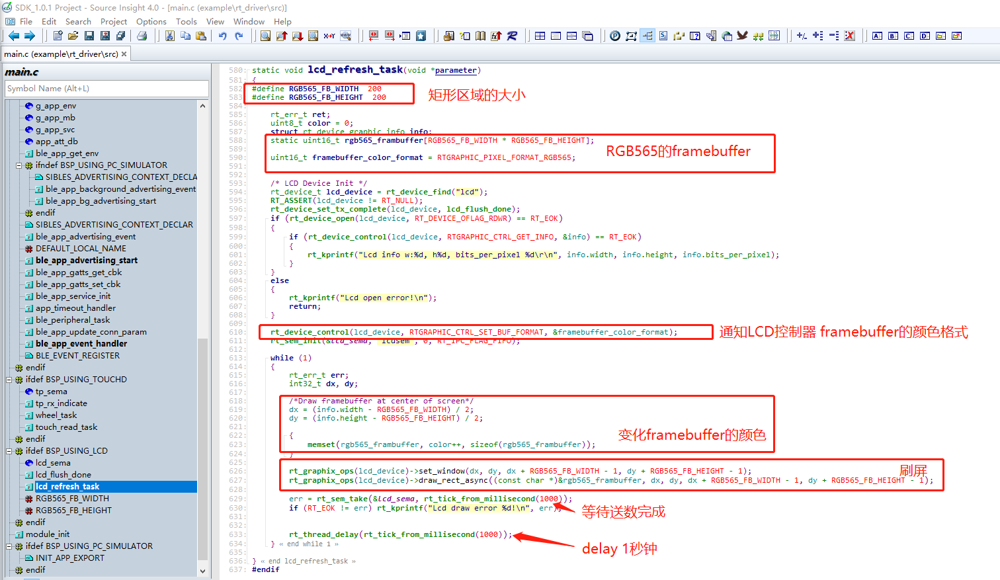

Additionally, it adds a thread to read and print touch input:

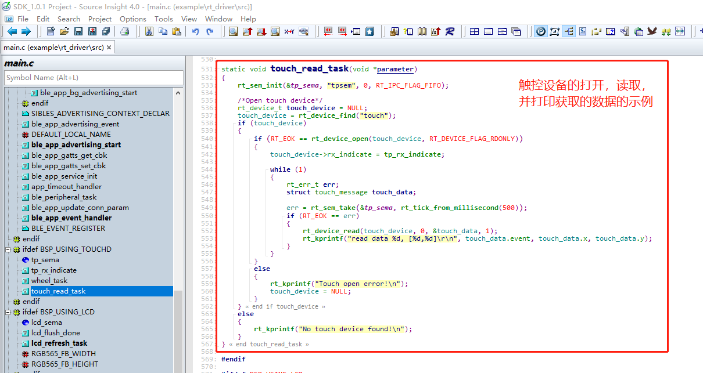

In the current example, we have selected the `ec-lb555` project:
`SDKrelease\example\rt_driver\project\ec-lb555`
After compiling and flashing the project, the screen will refresh and touch data will be read upon startup.

*We recommend that customers, after the screen is lit, replace the framebuffer with a full-screen image and check again to ensure there are no issues such as offset, color format, or exceeding the LCD glass boundaries.

Example of displaying an image:
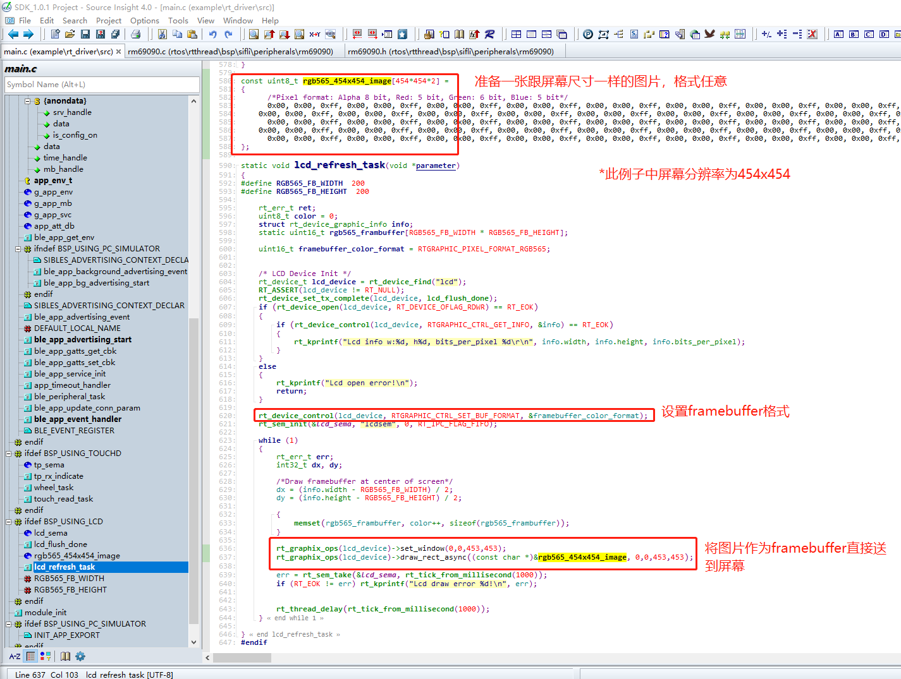

-->