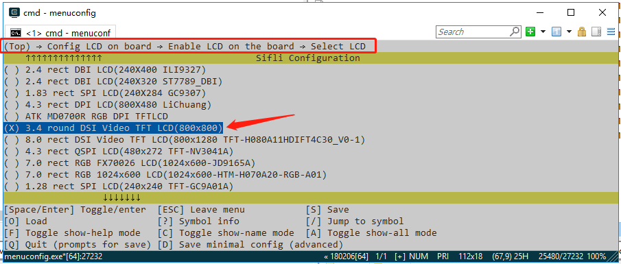

# Built-in

The screen module's menuconfig option is a comprehensive menu option that combines the screen driver IC, backlight IC, and touch IC. It specifies which screen IC, touch IC, and type of backlight are used by this module, as well as the resolution, DPI, and shape of the module's LCD glass. After adding it, you can [use this new menuconfig menu option in your project](add_lcd_menuconfig).

The process is divided into the following steps:
1. Add driver macro definitions
2. Open the Kconfig_lcd file
3. Add screen module options
4. Configure the resolution and DPI of the screen module's LCD
5. Use the new screen (by selecting it through Menuconfig)

## 1 Add Driver Macro Definitions
### Add driver IC macro definitions in the Kconfig file
Open the SDK\customer\peripherals\Kconfig file, which contains many config options similar to LCD_USING_XXX. Add a new config at the end:
```
config LCD_USING_NV3051F1
    bool
    default n
```
Note: If there is already a screen driver IC with the same name, it means you only need to modify the existing driver's initialization code.
### Add driver IC macro definitions in the Kconfig file

Open the SDK\customer\peripherals\Kconfig file and find the definitions for other backlights, such as the `BL_USING_AW9364` config. Add a new config at the end (for example, if the IC name is NW9527):
```
config BL_USING_NW9527
    def_bool n
```
### Add driver IC macro definitions in the Kconfig file
Open the SDK\customer\peripherals\Kconfig file, which contains many config options similar to TSC_USING_XXX. Add a new config at the end:
```
config TSC_USING_GT911
    bool
    default n
```

## 2 Open the SDK\customer\boards\Kconfig_lcd file
## 3 Add Screen Module Options
- The macro for a new screen module generally follows the form `LCD_USING_AAA_BBB_CCC`, where AAA is the module manufacturer, BBB is the module model, and CCC is the module serial number or production date, etc. This information is provided in the screen module information from the module manufacturer.
- The name of the screen module should include the size, interface type, module manufacturer, module serial number, resolution, etc.
```
        config LCD_USING_TFT_AH034A01ZJINV4C30            <<<<<< new screen module macro, must not conflict with others
            bool "3.4 round DSI Video TFT LCD(800x800)"   <<<<<< screen module name, displayed in menuconfig
            select TSC_USING_GT911 if BSP_USING_TOUCHD    <<<<<<< macro for the touch IC used by the module
            select LCD_USING_NV3051F1                     <<<<<< macro for the screen driver IC used by the module
            select BL_USING_AW9364                        <<<<<< optional, select backlight driver, see Note 3
            select BSP_USING_ROUND_TYPE_LCD               <<<<<< optional, recommended for round screens, can be removed for square screens
            select BSP_LCDC_USING_DSI_VIDEO               <<<<<< see Note 1
            depends on BSP_SUPPORT_DSI_VIDEO              <<<<<< optional, see Note 2
```

**Note 1**: 
Specify the interface type used by the screen. The supported options are:
| Macro | Screen Driver Interface Type |
| :---- | :----|
| BSP_LCDC_USING_SPI_NODCX_1DATA | 3SPI 1DATA (represents 3-wire SPI, using 1 data line, and so on) |
| BSP_LCDC_USING_SPI_NODCX_2DATA | 3SPI 2DATA  |
| BSP_LCDC_USING_SPI_DCX_1DATA   | 4SPI 1DATA  |
| BSP_LCDC_USING_SPI_DCX_2DATA   | 4SPI 2DATA  |
| BSP_LCDC_USING_QADSPI          | 4SPI 4DATA, currently a commonly used QSPI interface  |
| BSP_LCDC_USING_DDR_QADSPI      | 4SPI 4DATA DDR (based on the QSPI interface, using dual-edge communication)  |
| BSP_LCDC_USING_DBI             |  DBI |
| BSP_LCDC_USING_DSI             |  DSI Command |
| BSP_LCDC_USING_DSI_VIDEO       |  DSI Video |
| BSP_LCDC_USING_DPI             |  DPI (RGB) |
| BSP_LCDC_USING_JDI_PARALLEL    |  JDI Parallel |
| BSP_LCDC_USING_EPD_8BIT        |  8BIT (e-ink screen)  |

**Note 2**: 
Optional, based on whether the current development board supports this type of interface, to determine whether to display this menuconfig option.
The supported options are as follows (other interfaces are supported by default and do not need to be set):
| Macro | Screen Driver Interface Type |
| :---- | :----|
| BSP_SUPPORT_DSI             |  DSI Command |
| BSP_SUPPORT_DSI_VIDEO       |  DSI Video |
| BSP_SUPPORT_DPI             |  DPI (RGB) |

(lcd_menuconfig_select_backlight_type)=
**Note 3**: 
Optional, the backlight driver is only for screen modules with a backlight. For AMOLED screens that do not require a backlight, this can be left unset.
The supported options are as follows:
| Macro | Screen Driver Interface Type |
| :---- | :----|
| BL_USING_AW9364             |  Use AW9364 backlight chip |
| LCD_USING_PWM_AS_BACKLIGHT  |  Directly use the chip's PWM to drive the backlight |

## 4 Configuring the Resolution and DPI of the LCD Module
- The resolution is usually easy to find in the module's manual.
- The DPI (Dots Per Inch, sometimes called PPI - Pixels Per Inch) value may need to be calculated based on the physical size and resolution of the screen. However, this value does not affect the screen's ability to turn on; it is generally used at the UI layer.
```py
    config LCD_HOR_RES_MAX
        int
        default 368 if LCD_USING_ED_LB55DSI17801
        default 368 if LCD_USING_ED_LB55DSI17801_QADSPI
        ...
        default 800 if LCD_USING_TFT_AH034A01ZJINV4C30  <<<<<< New item, the number represents the horizontal resolution is 800

    config LCD_VER_RES_MAX
        int
        default 448 if LCD_USING_ED_LB55DSI17801
        default 448 if LCD_USING_ED_LB55DSI17801_QADSPI
        ...
        default 800 if LCD_USING_TFT_AH034A01ZJINV4C30   <<<<<< New item, the number represents the vertical resolution is 800

    config LCD_DPI
        int
        default 315 if LCD_USING_ED_LB55DSI17801
        default 315 if LCD_USING_ED_LB55DSI17801_QADSPI
        ...
        default 235 if LCD_USING_TFT_AH034A01ZJINV4C30  <<<<<< New item, the number represents the DPI value is 235

```

<br>
<br>
<br>

(add_lcd_menuconfig)=
## 4 Using a New Screen (via Menuconfig Selection)
After completing the final step of adding the screen module, you can select the screen module through the menuconfig option on all boards that support the screen interface.

As shown in the figure, this is the option added previously:

<br>
<br>
<br>