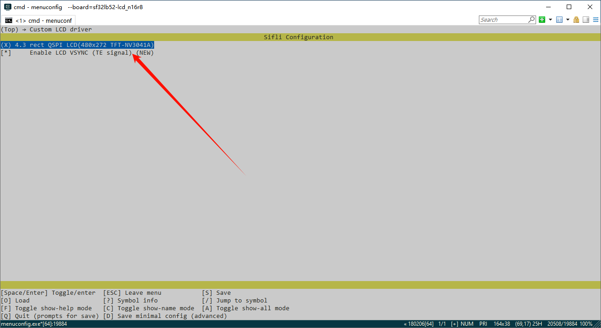

# External

The menuconfig option for the screen module is a comprehensive menu option that combines the screen driver IC, backlight IC, and touch IC. It specifies which screen IC, touch IC, and type of backlight are used by this module, as well as the resolution, DPI, and shape of the LCD glass. After adding it, you can [use this new menuconfig option in your project](add_lcd_menuconfig_1).

The process is divided into the following steps:
1. Create a new screen driver folder and Kconfig.proj
2. Add screen module options
3. Configure the resolution and DPI of the LCD module
4. Use the new screen (select through Menuconfig)

## 1 Add Screen Driver File Macro Definitions
### 1. `Kconfig.proj` Framework
* Add the following content to the created folder, copy `SDK\example\rt_driver` and modify the name to the screen driver name (if there is already an external project, you can directly modify and add in the project)
* Create a new `Kconfig.proj` framework in the `project` as follows:
```c
#APP specific configuration.

config CUSTOM_MEM_MAP
    bool
    select custom mem map
    default y
comment "------------Project configuration-----------"  

if !BSP_USING_BUILT_LCD
    

endif
```
* Add `# CONFIG_BSP_USING_BUILTIN_LCD is not set` in `project\proj.conf` to use the external screen driver and disable the internal screen driver in the SDK.<br>
If you want to use the external screen driver for a specific board or use the internal screen driver, you need to create a new file in the project directory, for example, `sf32lb52-lcd_n16r8/proj.conf`, and add `# CONFIG_BSP_USING_BUILTIN_LCD is not set` or `CONFIG_BSP_USING_BUILTIN_LCD=y`.

### 2. Add Screen Driver IC Macro Definitions in Kconfig File
First, open the `SDK\customer\peripherals\Kconfig` file, which contains many `LCD_USING_XXX` configs. Copy one and add a new config in `project\Kconfig.proj`:
```c
if !BSP_USING_BUILT_LCD

config LCD_USING_NV3051F1
    bool
    default n

endif
```

### 3. Add Touch Panel Driver IC Macro Definitions in Kconfig File
First, open the `SDK\customer\peripherals\Kconfig` file, which contains many `TSC_USING_XXX` configs. Add a new config in `project\Kconfig.proj`:
```c
if !BSP_USING_BUILT_LCD

config TSC_USING_GT911
    bool
    default n

endif
```

### 4. Add Backlight Driver IC Macro Definitions in Kconfig File
First, open the `SDK\customer\peripherals\Kconfig` file and find other backlight definitions, such as the `BL_USING_AW9364` config. Add a new config in `project\Kconfig.proj` (for example, the IC name is NW9527):
```c
if !BSP_USING_BUILT_LCD

config BL_USING_NW9527
    def_bool n

endif
```
<br>
<br>

**Note**: If there is already a screen driver IC with the same name, you must modify it to a different name and avoid using the same name as the internal SDK.
<br>
<br>

## 2 Add Screen Module Options
- The general form of the macro for a new screen module is `LCD_USING_AAA_BBB_CCC`, where AAA is the manufacturer of the module, BBB is the model of the module, and CCC is the serial number or production date, etc. This information is provided in the screen module information from the module manufacturer.
- The name of the screen module should include the size, interface type, module manufacturer, module serial number, resolution, etc.
```
if !BSP_USING_BUILT_LCD
    choice
        prompt "Custom LCD driver"
        default LCD_USING_TFT_AH034A01ZJINV4C30

        config LCD_USING_TFT_AH034A01ZJINV4C30            <<<<<< new screen module macro, must not conflict with others
            bool "3.4 round DSI Video TFT LCD(800x800)"   <<<<<< screen module name, displayed in menuconfig
            select TSC_USING_GT911 if BSP_USING_TOUCHD    <<<<<<< macro for the touch panel IC used by the module
            select LCD_USING_NV3051F1                     <<<<<< macro for the screen driver IC used by the module
            select BL_USING_AW9364                        <<<<<< optional, select backlight driver, see note 3
            select BSP_USING_ROUND_TYPE_LCD               <<<<<< optional, recommended for round screens, can be removed for square screens
            select BSP_LCDC_USING_DSI_VIDEO               <<<<<< see note 1
            depends on BSP_SUPPORT_DSI_VIDEO              <<<<<< optional, see note 2

    endchoice
endif
```

**Note 1**: 
Specify the interface type used by the screen. The supported options are:
| Macro Definition | Screen Driver Interface Type |
| :---- | :----|
| BSP_LCDC_USING_SPI_NODCX_1DATA | 3SPI 1DATA (represents 3-wire SPI, using 1 data line, same below) |
| BSP_LCDC_USING_SPI_NODCX_2DATA | 3SPI 2DATA  |
| BSP_LCDC_USING_SPI_DCX_1DATA   | 4SPI 1DATA  |
| BSP_LCDC_USING_SPI_DCX_2DATA   | 4SPI 2DATA  |
| BSP_LCDC_USING_QADSPI          | 4SPI 4DATA, currently the more commonly used QSPI interface  |
| BSP_LCDC_USING_DDR_QADSPI      | 4SPI 4DATA DDR (based on the QSPI interface, using dual-edge communication)  |
| BSP_LCDC_USING_DBI             |  DBI |
| BSP_LCDC_USING_DSI             |  DSI Command |
| BSP_LCDC_USING_DSI_VIDEO       |  DSI Video |
| BSP_LCDC_USING_DPI             |  DPI(RGB) |
| BSP_LCDC_USING_JDI_PARALLEL    |  JDI Parallel |
| BSP_LCDC_USING_EPD_8BIT        |  8BIT (e-ink screen)  |

**Note 2**: 
Optional, determine whether to display the menuconfig option based on whether the current development board supports the interface type.
The supported options are as follows (other interfaces are supported by default and do not need to be set):
| Macro Definition | Screen Driver Interface Type |
| :---- | :----|
| BSP_SUPPORT_DSI             |  DSI Command |
| BSP_SUPPORT_DSI_VIDEO       |  DSI Video |
| BSP_SUPPORT_DPI             |  DPI(RGB) |

(lcd_menuconfig_select_backlight_type)=
**Note 3**: 
Optional, the backlight driver is only for screen modules with a backlight. If the screen, such as an AMOLED screen, does not require a backlight, it can be left unset.
The supported options are as follows:
| Macro Definition | Screen Driver Interface Type |
| :---- | :----|
| BL_USING_AW9364             |  Use AW9364 backlight chip |
| LCD_USING_PWM_AS_BACKLIGHT  |  Directly use the chip's PWM to drive the backlight |


## 3 Configure the Resolution and DPI of the LCD Module
- The resolution is usually easy to find in the module manual.
- The DPI (Dots Per Inch, sometimes called PPI - Pixels Per Inch) value may need to be calculated based on the physical size and resolution of the screen. However, this value does not affect the screen's ability to turn on; it is generally used at the UI layer.
```
if !BSP_USING_BUILT_LCD
    config LCD_HOR_RES_MAX
        int
	    default 800 if LCD_USING_TFT_AH034A01ZJINV4C30  <<<<<< New item, the number before represents the horizontal resolution of 800

    config LCD_VER_RES_MAX
        int
        default 800 if LCD_USING_TFT_AH034A01ZJINV4C30   <<<<<< New item, the number before represents the vertical resolution of 800

    config LCD_DPI
        int
        default 235 if LCD_USING_TFT_AH034A01ZJINV4C30  <<<<<< New item, the number before represents the DPI value of 235
endif
```

<br>
<br>
<br>

(add_lcd_menuconfig_1)=
## 4 Use a New Screen (Select via Menuconfig)
After completing the final step of adding the screen module, you can select the screen module via the menuconfig option on all boards that support the screen interface.

As shown in the figure, this is the option added previously:


<br>
<br>
<br>