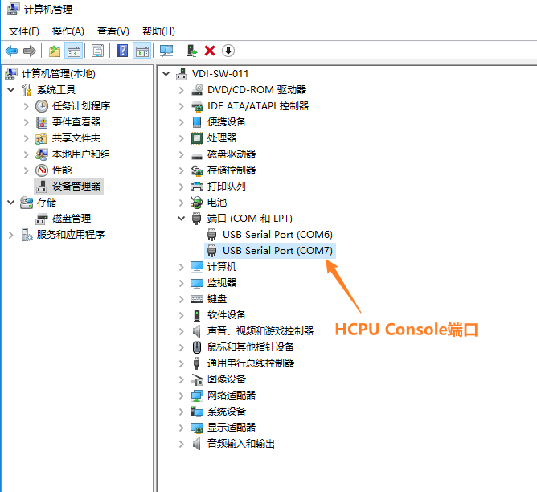
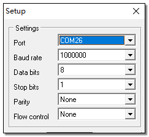

# BLE 测试准备

## 测试说明

使用 BLE 例程可以测试典型的 ADV 和连接场景功耗，系统上电后例程自动开启 ADV 发送，使用手机的 LightBlue软件发现并连接设备，通过 HCPU 的 console 发送命令修改 ADV 发送间隔和连接周期，发送的命令都要以回车换行符结尾。

PC 与调试板使用 USB Type-C 线连接后会枚举出两个串口，其中 HCPU 使用第二个串口作为 console 端口，如
下图所示。



串口设置参见下图：波特率均设置为 1000000。



为便于控制测试条件，使用 PA24 引脚作为 HCPU 的唤醒 PIN。当唤醒 PIN 为低电平时 HCPU 无法进入低功耗模式，此时可以通过 console 给 HCPU 发送命令修改参数，当 PA24 悬空或者接高电平（即 3.3V 电压，下文如未特别说明，高电平均指 3.3V 电压）时，HCPU 进入低功耗模式，LCPU 则周期性的进出低功耗模式，此时 console 无法使用。

测试例程 LCPU 的主频为 24MHz，HCPU 的低功耗模式为 Deepsleep，LCPU 的低功耗模式为 Standby。

HCPU 支持如下命令修改 BLE ADV 和连接周期，同时还可使用 btskey 命令操作菜单修改 BT 的配置。
* ble_config adv interval_in_ms: 其中interval_in_ms是毫秒为单位的 ADV 间隔；
例如：发送命令ble_config adv 100，可将 ADV 周期改为 100ms
* ble_config conn interval_in_ms: 其中interval_in_ms是毫秒为单位的连接周期；
例如：在连接之后发送ble_config conn 100，可将连接周期改为 100ms

## 例程编译与烧写

### 编译

如果使用已编译好的 image 文件，可以直接跳到烧录部分进行烧录开始测试。

进入example\pm\bt\project\hcpu目录，执行
```
scons --board=sf32lb52-core_n16r16 -j8
```
编译生成HCPU的image文件(不需要单独编译LCPU 的工程，编译 HCPU 时会自动编译 LCPU 并打包 LCPU 的 bin 到 HCPU 的镜像中)，编译生成的 image 文件保存在 build 目录下。


### 烧写镜像

在命令行编译的目录下执行
```
build_sf32lb52-core_n16r16_hcpu\uart_download.bat
```
烧写 build 目录下编译生成的镜像文件。

### 改变发射功率

工程默认配置的发射功率是0dbm，可以使用`ble_tx_pwr_save x`命令修改发射功率，x是需要修改的发射功率大小，例如改变发射功率为10dbm：`ble_tx_pwr_save 10` 。改完后会自动重启生效。

## 设备初始化

第一次使用开发板板测试蓝牙需要在上电后执行以下初始化命令 (烧写文件系统镜像后蓝牙地址会丢失，也需要重新配置)，命令在 HCPU 的 console 中执行，唤醒 PIN 需接低电平避免 HPSYS 进入低功耗模式，否则 HCPU 无法处理命令
*  nvds reset_all 1
*  nvds update addr 6 <蓝牙地址>

例如 nvds update addr 6 1234567890C8，注意蓝牙地址分类需要保持一定的格式，建议 C8 不要改动，其他的用户可以自行改变，命令执行完成后按 Reset 键重启设备
