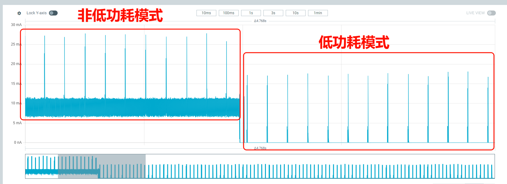
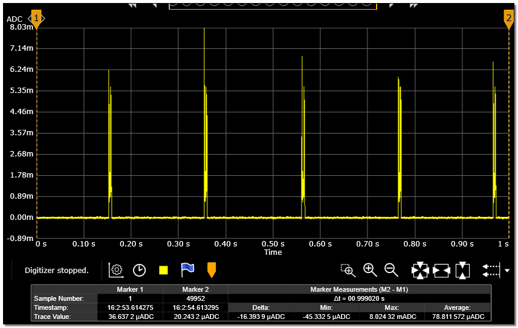

# BLE 测试方法

## ADV 场景

* 注意：测试ADV场景时最好在屏蔽箱或者屏蔽房进行测试，否则有其他设备干扰会导致测试结果偏高

1. * 打开串口调试工具，连接 HCPU 的 console 串口，连接测量设备与被测模块
2. * 唤醒 PIN 接低电平，按底板的 Reset 键复位，启动成功后出现如图[下图](adv_log)的 log

```{image} assert/image5.png
:name: adv_log
```

3. * 启动后默认的 ADV 周期为 200ms，由于 Inquiry Scan 和 Page Scan 也会自动打开，为测试 BLE 的功耗，需要使用 btskey 命令关闭 Scan，关闭命令参考经典蓝牙的Scan部分。例如，先发送 btskey s 命令，如果显示当前位于主菜单，就可以依次发送以下三个命令关闭 Page Scan 和 Inquiry Scan。发送完 btskey0，可以再发送 btskey 4 查询 Scan 的状态。
```
(a) btskey 1
(b) btskey 7
(c) btskey 0
```
4. * 将唤醒 PIN 接高电平，系统进入低功耗模式，电流值如下图明显的下降，测量 200ms 间隔时的电流，低功耗模式下的电流波形见ADV=200ms 的电流波形图，记 10 秒的平均电流为 C1, 两个峰之间的电流记为睡眠电流 C2，ADV 的增量电流 C=C1-C2

<div align="center"><strong>进入低功耗模式电流变化</strong></div>


<div align="center"><strong>ADV=200ms 的电流波形</strong></div>

5. * 将唤醒 PIN 接低电平，系统退出低功耗模式，在 console 里发送命令ble_config adv 500，将 ADV 间隔改为 500ms
6. * 将唤醒 PIN 接高电平，系统再次进入低功耗模式，测量 500ms 间隔时的电流

重复步骤 5 和 6，测量 ADV 间隔为 1000ms 的电流。

## 连接场景

1. * 打开串口调试工具，连接 HCPU 的 console 串口，连接测量设备与被测模块
2. * 唤醒 PIN 接低电平，按底板的 Reset 键复位，启动成功后出现如下图的 log。类似ADV章节量 ADV 电流，也需要关闭 BT Scan

```{figure} assert/image8.png
:width: 50%
:align: center
```

3. * 在手机上打开如下图的 LightBlue 软件，在 Scan 列表找到名为 SIFLI_APP 的设备，点击 CONNECT 连接设备

```{figure} assert/image9.png
:width: 40%
:align: center
```

4. * 连接成功后 BLE 进入连接状态，默认的连接周期为 15ms

5. * 将唤醒 PIN 接高电平，系统进入低功耗模式，测量 15ms 间隔时的电流

6. * 将唤醒 PIN 接低电平，系统退出低功耗模式，在 console 里发送命令ble_config conn 50，将连接周期改为 50ms，确认 console 出现如下图打印，其中Updated connection interval：40表示 1.25ms 单位的连接间隔，40×1.25=50ms，如果未出现打印，则表示参数更新失败，需要再次发送命令，同时观察电流波形确认间隔是否更新成功

```{figure} assert/image10.png
:width: 70%
:align: center
```

7. * 将唤醒 PIN 接高电平，系统再次进入低功耗模式，测量 50ms 周期时的电流，与 ADV 电流类似，测量 10秒的平均电流 C1，两个峰之间的电流记为睡眠电流 C2，连接状态的增量电流即为 C=C1-C2

重复步骤 6 和 7，可以测量连接周期为 200ms、500ms 和 1000ms 时的电流。
