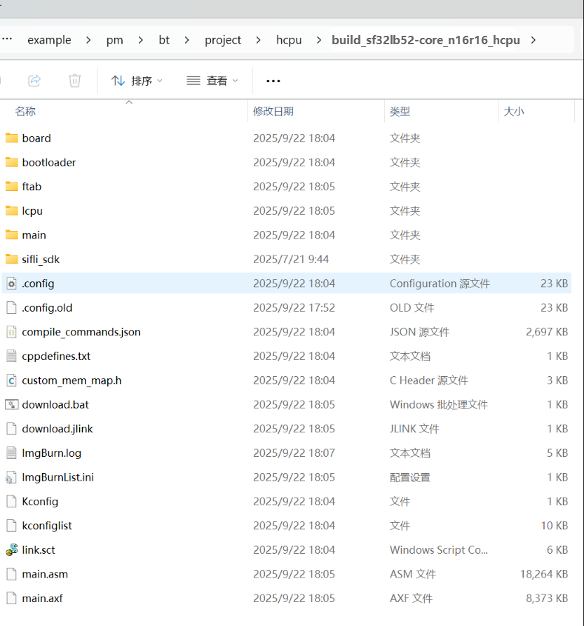

# 经典蓝牙测试准备

## 测试说明

使用 BT 例程可以测试 Scan 和 Sniff 模式的功耗，系统上电后测试例程自动开启 Scan 和 ADV，使用手机连接蓝牙设备，在 HCPU 的 console 里可以发送命令修改配置，发送的命令都需以回车换行结尾。

PC与调试板使用 USB Type-C线连接后会枚举出两个串口，其中 HCPU使用第二个串口作为 console端口，如下图所示。


串口设置参见下图，波特率均设置为 1000000。


为便于控制测试条件，使用 PA24作为 HCPU的唤醒 PIN。当唤醒 PIN为低电平时 HCPU无法进入低功耗模式，此时可以通过 console给 HCPU发送命令修改参数，当 PA24悬空或者接高电平（即 3.3V电压，下文如未特别说明，高电平均指 3.3V电压）时，HCPU进入低功耗模式，LCPU则周期性的进出低功耗模式，此时 console无法使用。

测试例程 LCPU的主频为 24MHz，HCPU的低功耗模式为 Deepsleep，LCPU的低功耗模式为 Standby。HCPU使用 btskey命令操作菜单修改配置。

## 例程编译与烧录

### 编译

进入example\pm\bt\project\hcpu目录，执行
```
scons --board=sf32lb52-core_n16r16 -j8
```
编译生成HCPU的image文件，编译生成的 image文件保存在 build目录下。




### 烧写镜像

在命令行编译的目录下执行
```
build_sf32lb52-core_n16r16_hcpu\uart_download.bat
```
烧写 build目录下编译生成的镜像文件。

### 改变发射功率

工程默认配置的发射功率是0dbm，可以使用`ble_tx_pwr_save x`命令修改发射功率，x是需要修改的发射功率大小，例如改变发射功率为10dbm：`ble_tx_pwr_save 10` 。改完后会自动重启生效。

## 设备初始化

第一次使用开发板测试蓝牙需要在上电后执行以下初始化命令，命令在 HCPU的 console中执行，唤醒 PIN需接低电平避免 HPSYS进入低功耗模式，否则 HCPU无法处理命令
1. nvds reset_all 1
2. nvds update addr 6 <蓝牙地址>

例如 nvds update addr 6 1234567890C8，注意蓝牙地址分类需要保持一定的格式，建议 C8不要改动，其他的用户可以自行改变，命令执行完成后按 Reset键重启设备
