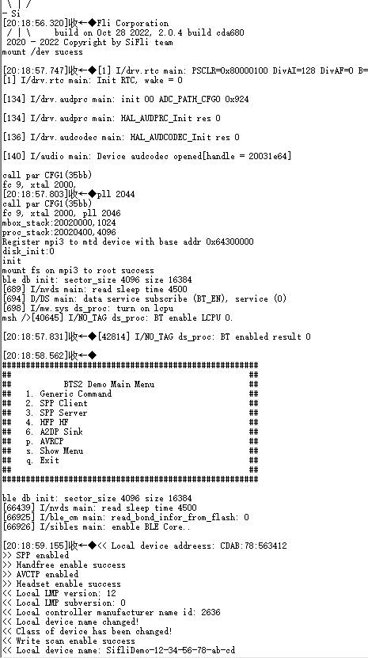
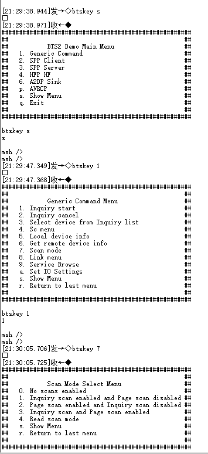

# 经典蓝牙测试方法

## Scan 模式

1. * 打开串口调试工具，连接 HCPU的 console串口，连接测量设备与被测模块
2. * 唤醒 PIN接低电平，复位开发板，启动成功后出现如下图的 log


3. * 启动后 ADV、Inquiry Scan和 Page Scan都会打开，为测试 Scan的功耗，需先关闭 ADV，关闭命令为
```
diss adv_stop
```
4. * 开机后默认处于 BTS主菜单，通过发送 btskey命令可以配置打开或关闭 Scan。发送btskey s命令显示当前菜单，再按菜单提示发送命令进入子菜单。比如，在主菜单下，依次发送如下三个命令可以打开 Page Scan并关闭 Inquiry Scan
```
(a) btskey 1
(b) btskey 7
(c) btskey 2
```



5. * 发送 BTS命令配置设备只发送 Inquiry Scan或者 Page Scan，唤醒 PIN接高电平，系统进入低功耗模式，测量 1分钟的平均电流，记为 Scan的平均电流 C1，同时再测量两个峰之间的底电流，记为睡眠电流 C2，Scan的增量电流即为 C=C1-C2。测试程序的 Page Scan周期为 1.28秒，Inquiry Scan周期为 2.56秒，所以Inquiry Scan的增量电流为 Page Scan的一半。

6. * 唤醒 PIN 接低电平，发送 BTS 命令配置设备同时发送 Inquiry Scan 和 Page Scan，再把唤醒 PIN 接高电平，系统进入低功耗模式，测量测试的平均电流，记为 Both Scan 的电流

## Sniff 模式

1. * 参考Scan章节的步骤复位开发板并关闭 ADV
2. * 手机连接开发板对应的蓝牙设备，点击后弹出配对窗口，点确认后配对成功，蓝牙设备进入已配对设备列表，并显示已连接状态,如下图：
::::{grid} 1 1 2 2
:gutter: 2

:::{grid-item}
```{figure} assert/image7.png
:width: 60%
:align: center

```
:::

:::{grid-item}
```{figure} assert/image8.png
:width: 60%
:align: center

```
:::

::::

3. * 连接完成后，等待一会儿，console 窗口会打印 »Sniff mode，表示设备已进入 Sniff 模式
4. * 发送 btskey 命令关闭 Scan，具体步骤如下：
```
(a) btskey s: 查看当前菜单
(b) 如果是 HFP HP Menu，则发送
(c) btskey r：返回上一级菜单 BTS2 Demo Main Menu，再顺序发送以下命令
(d) btskey 1: 选择 Generic Command
(e) btskey 7: 选择 Scan mode
(f) btskey 0: 关闭 scan
```
5. * 与 Scan 电流的测量方法类似，Sniff 模式的增量电流可以由 10 秒的平均电流与两个峰之间的睡眠电流相减得到
