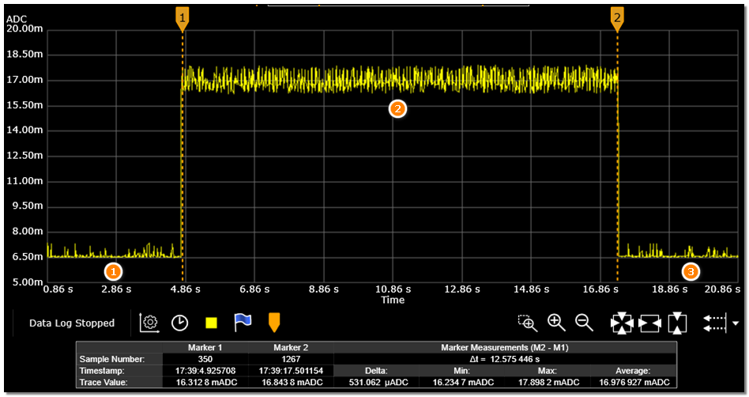
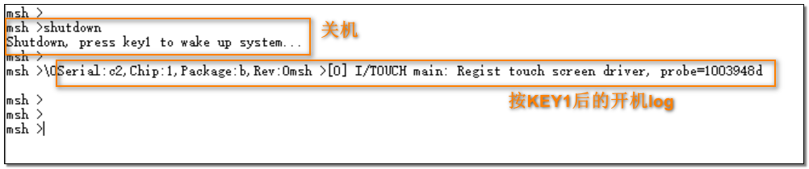
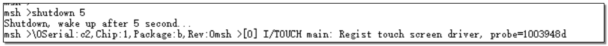

# 处理器性能测试方法

## CoreMark 测试

### HPSYS

1. * 打开串口调试工具，连接 HCPU 的 console 串口，连接测量设备与被测模块
2. * 复位，启动成功后在 HCPU 的 console 中出现如下图的 log

```{figure} assert/image4.png
:width: 60%
:align: center
```
3. * 发送命令run_coremark 192得到平均电流C1，发送run_coremark 168得到平均电流C2，得到192MHz和168MHz的增量电流 C=(C1-C2)/(192-168)
4. * 发送命令run_coremark 144得到平均电流C1，发送run_coremark 120得到平均电流C2，得到144MHz和120MHz的增量电流 C=(C1-C2)/(144-120)
5. * 发送命令run_coremark 48得到平均电流C1，发送run_coremark 24得到平均电流C2，得到48MHz的增量电流 C=(C1-C2)/(48-24)
6. * 发送命令run_coremark 24得到平均电流C1，发送run_coremark 12得到平均电流C2，得到24MHz和12MHz的增量电流 C=(C1-C2)/(24-12)
* 注意：24MHz有两种档位：D0和D1. 默认是使用D0档位跑24Mhz。如果需要测量D1档位，可以在命令后面带个参数1表示用D1档跑24M：`run_coremark 24 1`
7. * 如下图所示，阶段 1 是 HCPU 跑在 192MHz 主频时 WFI 模式下的电流波形，开始执行 CoreMark后进入阶段 2，电流上升并保持至测试结束，阶段 3 为回到 WFI 模式的电流波形


48MHz/24MHz/12MHz 等频率下 coremark 执行时间会很长，不必等待测试完成，测量得到电流值后可以复位测试下一项。

## While Loop 测试

### HPSYS

1. * 打开串口调试工具，连接 HCPU 的 console 串口，连接测量设备与被测模块
2. * 复位，启动成功后在 HCPU 的 console 中出现如下图的 log
```{figure} assert/image4.png
:align: center
```
3. * 发送命令run_while_loop 192，指示 HCPU 在 192MHz 频率下执行 while loop 测试，测量此时的平均电流C1，如下图HCPU While Loop 测试电流图所示，阶段 1 是 HCPU 跑在 192MHz 主频时 WFI 模式下的电流波形，开始执行 while loop 后进入阶段 2，电流上升并保持至测试结束，阶段 3 为回到 WFI 模式的电流波形。console 中显示 HCPU 的频率和 while loop 的持续时间，如图HCPU While Loop Log图所示

```{figure} assert/image5.png
:align: center

HCPU While Loop 测试电流图
```

```{figure} assert/image6.png
:align: center

HCPU While Loop Log 图
```

4. * 发送命令run_while_loop 168，指示 HCPU 在 168MHz 下执行 while loop 测试，测量此时的平均电流 C2，由此得到每 MHz 的电流增量为C=(C1-C2)/(192-168)

5. * 执行run_while_loop 144和run_while_loop 120，测量 144MHz 和 120MHz 的平均电流，得到 144MHz的增量电流 C=(C1-C2)/(144-120)
6. * 执行run_while_loop 48和run_while_loop 24，测量 48MHz 和 24MHz 的平均电流，得到 48MHz 的增量电流 C=(C1-C2)/(48-24)
7. * 执行run_while_loop 24和run_while_loop 12，测量 24MHz 和 12MHz 的平均电流，得到 24MHz 的增量电流 C=(C1-C2)/(24-12)

## 关机模式

1. * 打开串口调试工具，连接 HCPU 的 console 串口
2. * 复位，启动成功后在 HCPU 的 console 中出现如下图的 log

3. * 发送命令shutdown，指示系统关机，关机后只能被 KEY1 按键唤醒，由于关机电流比较小，建议使用万用
表测量
4. * 按 KEY1 键唤醒系统，console 中再次出现开机阶段的 log，但不会出现版本号的 log
5. * 发送命令shutdown 5，如下图指示系统关机并在 5 秒后会自动开机，为了便于测量，可以将等待时间延长

