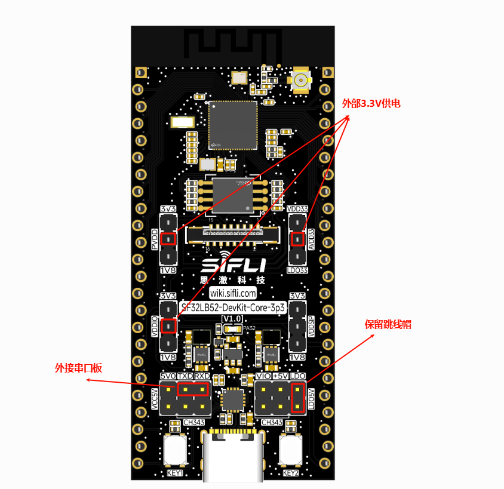
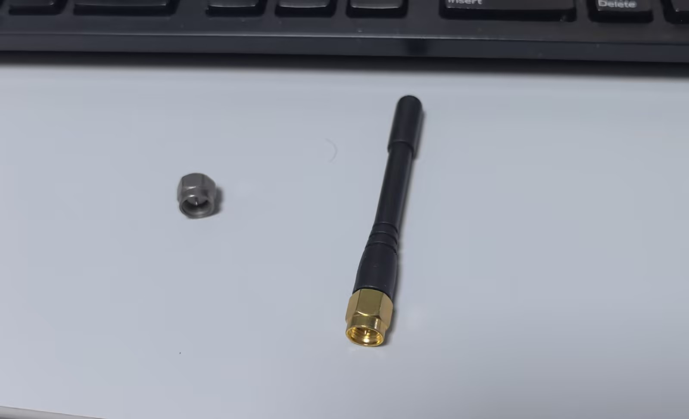
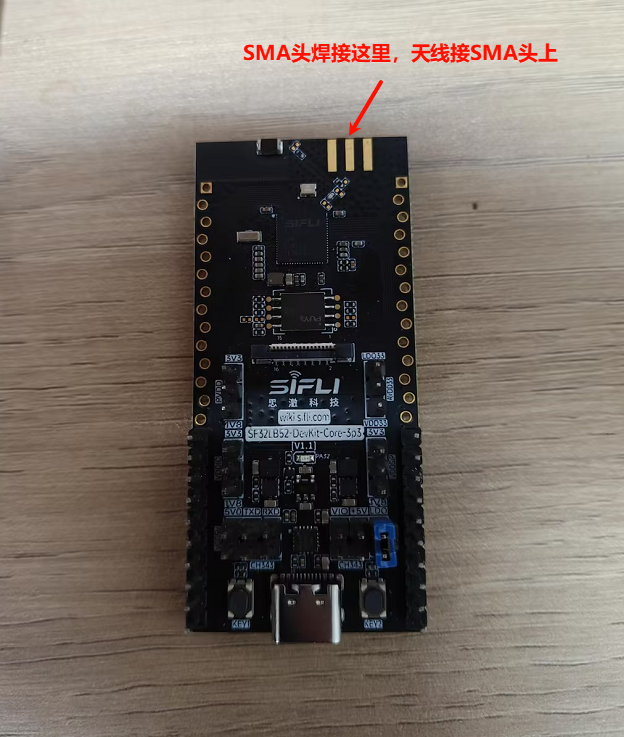
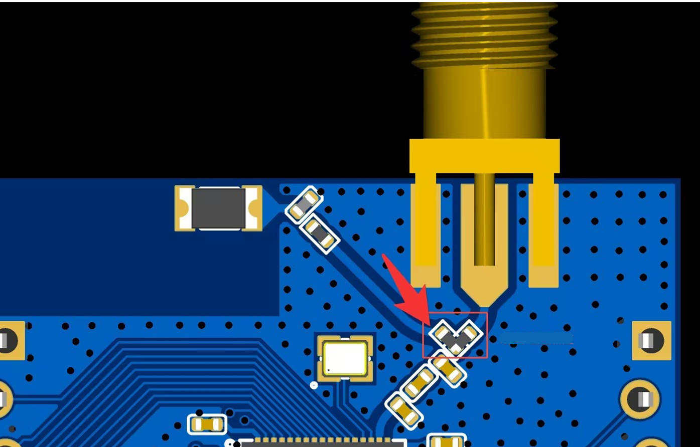

# 测试环境配置

准确的功耗测试需要标准化的环境配置。本节介绍测试所需的硬件、软件和测量方法。

## 相关硬件

* SF32LB52-DevKit-Core-3p3(板载芯片型号 SF32LB52BU56/SF32LB52JUD6)，使用方法参考[SF32LB52-DevKit-Core-3p3开发板使用指南](https://wiki.sifli.com/board/sf32lb52x/SF32LB52-DevKit-Core-3p3.html)
* Agilent 66319D直流电源
* Keysight 34465A 数字电流计
* 串口板
* 安卓手机，安装 LightBlue App（com.punchthrough.lightblueexplorer_LightBlue_1.9.3.apk，可从 GooglePlay 应用商店下载）或者安装 BLE调试助手 (从安卓自带的应用商店即可下载)。

## 相关软件

<!-- * SiFli SDK v2.1.2 或以上版本（SDK 安装与使用方法参考"SDK 快速入门"） -->
* BLE 和 BT 功耗测试例程：example\pm\bt\src
* CoreMark 功耗测试例程：example\pm\coremark\src

## 功耗测量方法

使用功耗测试仪器同时对PVDD，AVDD33,VDDIO进行3.3V供电，供电的针脚如图框出，其余跳线帽全部去除，保留LDO5V的跳线帽，TXD与RXD外接串口板用来输入命令

开发板上默认使用板载天线进行射频信号收发，也可自行选择更换为外接天线。

### 更换外接天线方法

1. 需要的硬件：SMA头+天线（或50欧姆负载），规格为：50欧姆的射频负载或是50欧姆的RF天线。

2. 先将天线以及SMA头按照如下图所示进行焊接

3. 随后将如图挑选电阻方向更换为指向外接天线，默认是指向板载天线的

