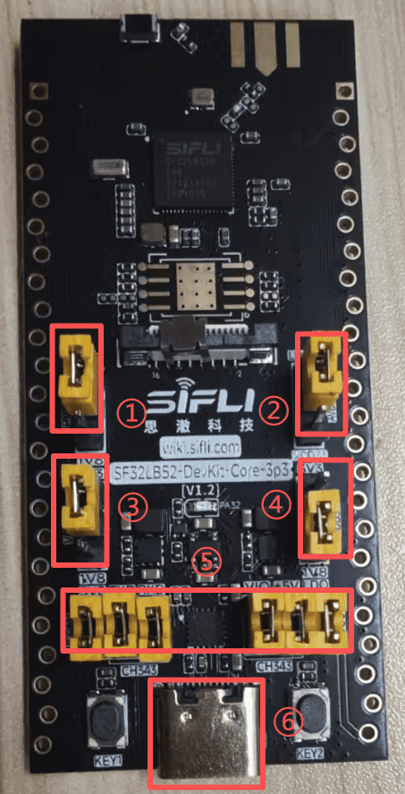
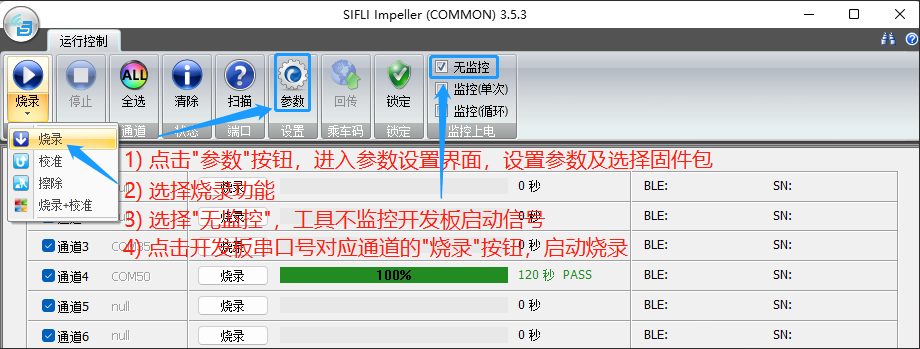
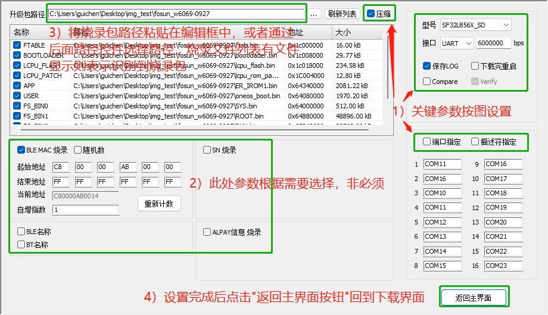
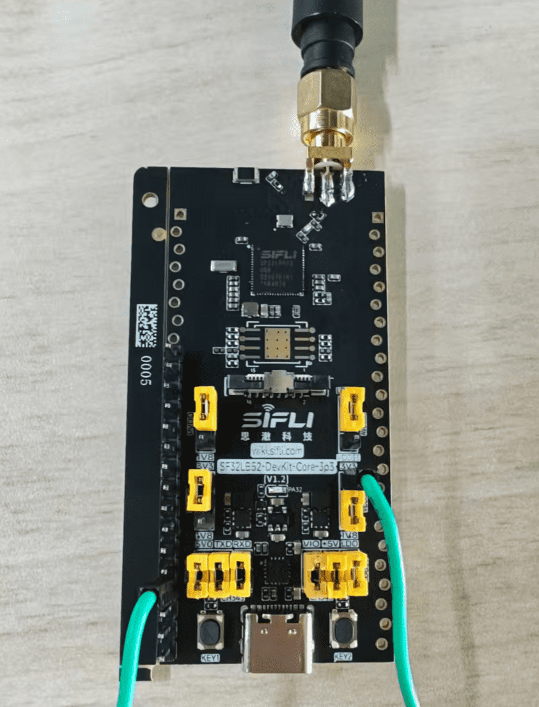
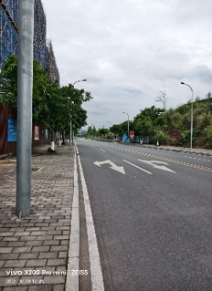

# 思澈52平台拉距测试

## 一、软硬件平台

硬件平台：[sf32lb52-core_n4](https://wiki.sifli.com/board/sf32lb52x/SF32LB52-DevKit-Core-3p3.html#pcb)

软件基于SiFli-SDK：[SDK release/v2.4 分支](https://docs.sifli.com/projects/sdk/latest/sf32lb52x/index.html)

## 二、固件获取方式

源代码获取：[ble_range_test](https://github.com/OpenSiFli/sifli-sdk-demo/tree/main/ble_range_test)

固件获取：[ble_range_test_sf32lb52-core_n4_v5.2](https://downloads.sifli.com/52ble_range_test_latest/400m_sf32lb52-core_n4_v5.2.zip)


## 三、固件烧录

### 1. 烧录工具（Impeller）

工具获取： [Impeller工具包][Impeller]

烧录工具使用说明：[Impeller使用说明][Impeller使用说明]

### 2. 烧录说明

硬件环境：PC+硬件开发板+Type-C USB线；

软件环境：Windows系统+Impeller工具+固件包；

### 3. 烧录步骤

设备工作及烧录前需进行如下跳线：



1） ①、②、③跳线帽短接3v3，④跳线帽短接1v8

2） ⑤处天线帽需全部短接

3） ⑥处连接Type-C USB线到PC上用于烧录固件

4） 使用Impeller工具开始烧录



上图中步骤1）的参数设置页面具体设置如下图：



5）下载成功后，即可继续下面的测试流程进行配置，然后重新上电正常启动；

## 四、拉距测试

两块Core开发板烧录同一固件，用户仅需在上电前进行跳线配置。

即可完成对两块板子进行【模式与功率选择】，然后可进行拉距测试。

### 1.天线选择

Core板支持两种天线选择，板载陶瓷天线和外接天线。


1）①为板载陶瓷天线，②为外接天线预留焊盘，③为0欧电阻

2）当③的0欧电阻默认上图焊接时，使用的是板载陶瓷天线

3）当③的0欧电阻如下图焊接时，使用的是焊接的外接天线


4） 注意：中间焊盘为信号（RF），左右两边为GND

### 2.跳线配置

#### 模式选择：

1.两块测试板分为发射板和接收板，两板下载相同固件

2.根据PA27的电平，选择开发板在测试中的角色，启动前通过跳线配置PA27电平

```{important}

1. PA27默认未低电平，设备默认未发射模式。
2. 可通过板载LED显示状态辨别设备当前模式：TX LED双脉冲 / RX LED单脉冲

```

```{table}
:name: 模式选择

|	PA27状态          	   |   设备模式  |
|:-----------------------|:-----------|
| 低电平    | TX(发射端,主动扫描连接)  
| 高电平    | RX(接收端,广播等待连接)

```

19db 蓝牙接收模式（左） 蓝牙发射模式（右）


#### 功率选择：

1、设备未进行功率选择配置时，默认为19db发射功率。

2、当需要选择其他发射功率时需要断开设备电源，进行跳线配置，上电重启后设备加载配置好的发射功率。

```{table}
:name: 功率选择

|	拉高的引脚           	   |   发射功率（dBm）  |
|:-----------------------|:-----------|
| PA26    | 10     
| PA25    | 13
| PA24    | 16

```

```{important}

1. 优先级 PA26 > PA25 > PA24(同时拉高时取优先级高者)。
2. 两块板子需选择同一档功率进行测试。

```

#### 16db功率选择示例：

发射端：

- 跳线接PA24



接收端：

- 跳线接PA27、PA24


### 3.LED状态（PA32）

可以根据LED状态板子的模式以及板子连接状态。


```{table}
:name:  LED 状态

|	状态        	   | TX板  | RX板 |
|:----------------|:-----------|:-----------|
| 未连接（搜索中）  | 双闪 | 单闪 |
| 已连接      | 常量 | 常量 | 

```

### 4.连接与重连行为

#### 初次连接

- RX 以名称 SIFLI_RANGE 广播，无需操作。
- TX 上电即开始扫描。匹配到 RX 后，TX将自动连接。

#### 自动重连

- 任一方断开 → RX 自动重新广播，TX 自动重新扫描。
- 多对板同场时，TX 总是连 RSSI 最强的 RX(2 秒窗口内累计选择)。

### 5.日志解析（模式确认）

启动后约 2-3 秒内会打印:

```
[xxxx] I/range_io main: Range test boot: role=RX(recv), tx_power=19dBm
```

该行确认当前角色与已加载的功率档位。

BLE 协议栈初始化后会打印:

```
[xxxx] I/range_io mbox: Override BT TX power -> 19dBm
```

该行确认功率已经下发到 BLE 控制器


## 五、测试及参考数据

```{important}

测试数据仅供参考，实际拉距测试在不同环境下测试结果不同。

```

测试方式：

- 两人分别手持TX、RX板子，错开人体，反方向步行。观察板子LED灯，常亮为连接，闪烁为断连，断连后记录间隔距离

测试条件及结果：

- 硬件版本：SF32LB52-DevKit-Core
- 固件版本：400m_sf32lb52-core_n4_v3
- 天线增益：3DBI
- 室外空旷环境，直线无杂物遮挡的马路人行道

测试环境1：


```{table}
:name: 拉距测试环境1

| 环境1 | 19dBm | 16dBm | 13dBm | 10dBm |
|:----- |:-----|:------|:-------|:--- --|
| 第一次测试 | 606m | 576m | 210m | 186m |
| 第二次测试 | 561m | 563m | 530m | 496m |  
| 第三次测试 | 576m | 518m | 392m | 452m |

```

测试环境2：

 

 
```{table}
:name: 拉距测试环境2

| 环境1 | 19dBm | 16dBm | 13dBm | 10dBm |
|:----- |:-----|:------|:-------|:--- --|
| 第一次测试 | 452m | 417m | 409m | 363m |
| 第二次测试 | 449m | 417m | 460m | 375m |  
| 第三次测试 | 460m | 447m | 392m | 422m |

```

[Impeller]: https://downloads.sifli.com/tools/Impeller/Impeller_latest.7z
[Impeller使用说明]: https://wiki.sifli.com/tools/%E7%83%A7%E5%BD%95%E5%B7%A5%E5%85%B7.html

